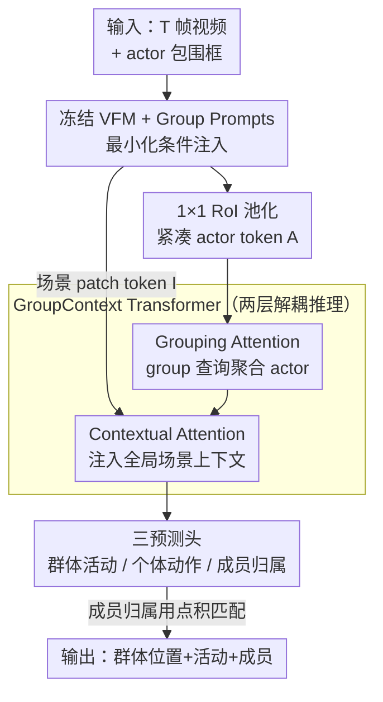

# Structured Relational Reasoning for Group Activity Assessment

**会议**: CVPR 2026  
**arXiv**: [2508.07996](https://arxiv.org/abs/2508.07996)  
**代码**: 待确认  
**领域**: 视频理解 / 人体理解 / 群体活动检测  
**关键词**: 群体活动检测, 视觉基础模型, PEFT, 关系推理, DINOv2

## 一句话总结
本文提出 ProGraD，在**冻结的视觉基础模型（VFM）**之上接一个仅约 10M 参数的两层 GroupContext Transformer 做"演员–群体"关系解码，先证明把现有群体活动检测（GAD）流水线的 CNN backbone 直接换成 DINOv2 反而掉点（真正瓶颈是解码器而非特征），再用可学习 group prompts 做最小化条件注入，在 Café 上把 Group mAP@1.0 / @0.5 分别提了 6.2 / 8.2 个点，且训练参数不到此前方法的一半。

## 研究背景与动机

**领域现状**：群体活动检测（Group Activity Detection, GAD）要在视频里同时回答"谁在动、和谁一组、群体在哪、群体在干什么"——既要做多群体的定位与成员划分，又要分类每个群体的集体行为（排队、点单、自拍、打架等）。主流做法分两类：早期用图神经网络 + 谱聚类建模 actor 关系，但聚类算法非任务专用、推理慢；近期 transformer 方法（HGC、Practical GAD）用 Deformable DETR 或可学习 group token 统一定位与推理，但 backbone 全量微调、解码器深而复杂，可训练参数动辄 20M+。

**现有痛点**：视觉基础模型（VFM，如 DINOv2）特征泛化能力强，按理应该直接受益。但作者发现一个反直觉现象——**把 Practical GAD 里的 ResNet-18 直接换成冻结的 DINOv2，Group mAP@1.0 反而从 10.85 掉到 9.46**。连接入了视觉–语言大模型的方法也只拿到边际提升。也就是说，特征质量并不是限制 GAD 的因素。

**核心矛盾**：现有 GAD 解码器是**为 CNN 特征量身设计**的，和 VFM 的 token 表征不匹配；同时这些解码器表达力过强（expressive probe），会"脑补"出 backbone 里其实没编码的信号，反而扭曲而非利用 VFM 的表征能力。真正的瓶颈是**缺少与冻结 VFM 对齐的、显式建模 actor–group 关系的解码机制**。

**本文目标**：在不动 backbone 的前提下（冻结 VFM + 轻量 PEFT），设计一个**轻量、结构化、与 VFM 特征对齐**的关系解码器，单次前向就联合输出群体位置、成员归属与活动类别。

**核心 idea**：把推理负担从 backbone 移到一个专门的**两层 GroupContext Transformer** 上——它显式地把"actor 聚成 group"与"注入全局场景上下文"两件事**解耦成两层 attention**；backbone 只用极少量可学习 group prompts 做最小化条件注入，引导冻结特征关注社交相关区域。

## 方法详解

### 整体框架

ProGraD 是一个"冻结 backbone + 轻量关系解码器"的三段式架构。输入是 $T$ 帧视频和每帧的 actor 包围框（假设检测已给定），输出是每个群体的位置、活动标签、成员归属，以及每个 actor 的个体动作。整体数据流是：**冻结 VFM 提特征（叠加 group prompts 做条件注入）→ RoI 池化得到紧凑 actor token → GroupContext Transformer 做两阶段关系推理 → 三个轻量预测头出结果**。整套可训练参数仅约 10M（group prompts + 两层 decoder + 预测头），backbone 全程冻结。

记每帧经 VFM 得到 patch token $I_t\in\mathbb{R}^{H_fW_f\times D}$，按帧堆叠为 $\mathbf{I}\in\mathbb{R}^{H_fW_f\times T\times D}$；用 RoI Align 抽出 actor token $\mathbf{A}\in\mathbb{R}^{M\times T\times D}$（$M$ 个 actor）；再引入 $K$ 个可学习 group prompt $\mathbf{G}_{prompt}\in\mathbb{R}^{K\times D}$ 作为任务查询。GCT 内部先让 group token 聚合 actor（Grouping Attention），再让 actor 与 group 一起吸收场景上下文（Contextual Attention）。

### 关键设计

**1. 诊断式定位：瓶颈是"解码器–表征对齐"，不是特征质量**

这是全文的支点，也是后续设计的动机来源。作者做了一个干净的对照实验：把 Practical GAD 解码器前的 ResNet-18 换成冻结 DINOv2，其余不变——Group mAP@1.0 不升反降（10.85 → 9.46）。结合 probing classifier 的已有分析（表达力过强的探针会学到 backbone 里并不存在的信号），作者得出结论：**为 CNN 设计的复杂解码器与 VFM token 表征不匹配，会扭曲而非利用其表征能力**。因此正确方向不是堆更强的 backbone 或更深的解码器，而是设计一个**与冻结 VFM 对齐、只做必要关系推理**的轻量解码器。这个判断直接决定了 ProGraD"冻结 backbone + 极简条件 + 专用关系解码"的整体取舍。

**2. Group Prompts 最小化条件注入：用一组可学习提示唤醒 VFM 的社交语义**

VFM 在以物体为中心的数据上预训练，对"互动的人、群体的空间排布"这类社交配置并不敏感。作者不用表达力强的探针（避免上一点的陷阱），而是引入 $K$ 个可学习 group prompt 注入到冻结 backbone 的每个 block（跨 $T$ 帧共享），作为最小化条件机制，把推理负担留给后面的 decoder。关键的一条设计原则是**one-prompt-per-group**：$K$ 直接固定为数据集中标注的最大群体数（Café 上为 7，含 singleton），而非当成超参去搜。这样既鼓励每个 prompt 解耦地对应一个群体、提升覆盖，又避免 prompt 过多引入冗余与过拟合（消融见 Table 5）。注意 group prompt 在这里身兼两职：在 backbone 里做条件注入，又在 GCT 里被复制成 $\mathbf{G}_{init}\in\mathbb{R}^{K\times T\times D}$ 充当群体查询。actor token 则用 **1×1 RoI 池化**（而非此前方法的 $5\times5$ 展平网格）在最后一层抽取，每个 actor 一个紧凑 embedding，保留空间精度又不引入冗余，让下游推理更轻。

**3. GroupContext Transformer：把"聚类成群"与"上下文增强"解耦成两层 attention**

GCT 是核心解码器，只有两层，却显式拆分了两类截然不同的推理。**Grouping Attention Layer** 让群体查询 $\mathbf{G}_{init}$ 作为 query 去 cross-attend 全部 actor token（$\mathbf{A}$ 作 key/value），把可能在空间或时间上分散的 actor 聚合进群体表征：

$$\mathbf{G}_{grp}=\mathrm{LN}\big(\mathbf{G}_{init}+\mathrm{FFN}(\mathrm{Attn}(\mathbf{G}_{init},\mathbf{A},\mathbf{A}))\big)$$

这一步回答"谁和谁是一组"。**Contextual Attention Layer** 再把更新后的群体 token 与 actor token 拼成 $Z=[\mathbf{A};\mathbf{G}_{grp}]\in\mathbb{R}^{(M+K)\times T\times D}$，让它们一起去 attend 场景级 patch token $\mathbf{I}$，注入空间布局、背景物体、互动区域等全局线索：

$$[\mathbf{A}_{ctx};\mathbf{G}_{ctx}]=\mathrm{LN}\big(Z+\mathrm{FFN}(\mathrm{Attn}(Z,\mathbf{I},\mathbf{I}))\big)$$

这一步回答"这个群体在干什么"。attention 时把时间维 $T$ 并入 token 维做联合时空注意。两层的分工是互补的：消融显示去掉 Grouping 层主要伤成员划分（mAP@1.0 17.03→14.08），去掉 Contextual 层伤得更狠（→10.97），因为活动识别离不开全局上下文。增强后的 $\mathbf{A}_{ctx}$、$\mathbf{G}_{ctx}$ 送入三个轻量 FFN 预测头：群体活动头、个体动作头、成员头（把 actor/group token 投到共享空间、用点积算亲和度，每个 actor 归到得分最高的群体）。

### 损失函数 / 训练策略

沿用 Practical GAD 的多任务损失，四项相加：个体动作分类 $\mathcal{L}_{\mathrm{ind}}$、群体活动分类 $\mathcal{L}_{\mathrm{group}}$、经匈牙利匹配的成员预测 $\mathcal{L}_{\mathrm{mem}}$、以及受 InfoNCE 启发、约束同组 actor 一致性的对比损失 $\mathcal{L}_{\mathrm{con}}$：

$$\mathcal{L}=\mathcal{L}_{\mathrm{ind}}+\sum_i\mathcal{L}_{\mathrm{group}}+\lambda_m\sum_i\mathcal{L}_{\mathrm{mem}}+\lambda_c\mathcal{L}_{\mathrm{con}}$$

backbone 用 DINOv2-Base（ViT-B/14）冻结，仅训练 group prompts + 两层 GCT + 预测头，端到端 30 epoch、AdamW、batch 32；Café 采样 $T=5$ 帧、Social-CAD 用 $T=1$（帧级标注无需时序聚合）。超参 $\lambda_m=5.0$、$\lambda_c=2.0$、温度 $\tau=0.2$。

## 实验关键数据

### 主实验

Café（多并发社交群体，6 类活动）split-by-place 下，ProGraD（Decoder + Prompts）全面 SOTA，且可训练参数（10.74M）不到 Practical GAD（22.77M）的一半：

| 方法 | Backbone | 全量FT | Group mAP@1.0 | Group mAP@0.5 | Outlier mIoU | 参数(M) |
|------|----------|--------|---------------|---------------|--------------|---------|
| Practical GAD | ResNet-18 | ✓ | 10.85 | 30.90 | 63.84 | 22.77 |
| VLCMTN | SAM | ✗ | 11.58 | 30.98 | 65.48 | ~24 |
| ProGraD (Decoder Only) | DINOv2(冻结) | ✗ | 13.02 | 32.68 | 65.44 | 10.68 |
| ProGraD (Decoder+Adapter) | DINOv2(冻结) | ✗ | 16.18 | 33.40 | 66.94 | 11.87 |
| **ProGraD (Decoder+Prompts)** | DINOv2(冻结) | ✗ | **17.03** | **39.11** | **67.89** | 10.74 |

相对 Practical GAD，Group mAP@1.0 +6.2、mAP@0.5 +8.2（摘要按相对口径称 6.5% / 8.2%）。值得注意的是**连不加任何 PEFT 条件的 Decoder Only（13.02）就已超过所有现有方法**，说明 GCT 本身就是个强解码器。Social-CAD（多为 singleton 的稀疏交互）上同样 SOTA：

| 方法 | Backbone | Social Acc. | Memb. Acc. | 参数(M) |
|------|----------|-------------|-----------|---------|
| Joint | I3D | 69.00 | 83.00 | ~17 |
| Practical GAD | ResNet-18 | 69.20 | - | 22.77 |
| **ProGraD** | DINOv2 | **70.00** | **88.33** | 10.74 |

### 消融实验

| 配置 | Group mAP@1.0 | Group mAP@0.5 | Outlier mIoU | 说明 |
|------|---------------|---------------|--------------|------|
| Full ProGraD | 17.03 | 39.11 | 67.89 | 完整模型 |
| w/o Grouping Attention | 14.08 | 38.35 | 64.56 | 去掉聚类层，成员划分变差 |
| w/o Contextual Attention | 10.97 | 30.20 | 61.83 | 去掉上下文层，掉得更狠 |

group token 数量消融（K 应匹配数据集群体数）：

| group token 数 K | mAP@1.0 | mAP@0.5 | mIoU |
|---|---|---|---|
| 4 | 12.81 | 35.30 | 64.95 |
| **7 (Ours)** | **17.03** | **39.11** | **67.89** |
| 12 | 14.47 | 33.52 | 66.56 |
| 16 | 12.09 | 34.78 | 64.71 |

### 关键发现
- **Backbone 替换实验是全文的"反例锚点"**：Practical GAD 把 ResNet-18 换成 DINOv2 后 mAP@1.0 从 10.85 掉到 9.46，而 ProGraD 在冻结 / 全量两种模式下都能吃满 DINOv2（全量 FT 进一步到 20.42），证明增益来自结构化解码而非 backbone 规模。
- **两层 attention 分工互补**：去掉 Contextual 层比去掉 Grouping 层掉得更多（10.97 vs 14.08），说明活动识别比单纯成员划分更依赖全局上下文。
- **K 要对齐数据集结构**：K=7（数据集最大群体数）最优，过少（4）覆盖不足，过多（12/16）冗余过拟合——这是个有原则的设计选择而非超参搜索。
- **类别不均衡是主要短板**：在 Studying（75.5 vs 64.1）、Fighting（56.7 vs 28.5）等视觉显著类上大幅领先，但在低频的 Queueing / Ordering 上掉点。
- **可解释性副产物**：prompt 引导的 backbone 注意力明显从背景物体收敛到"人、群体、互动区域"（桌子、共享空间），且跨帧时序稳定。

## 亮点与洞察
- **"先证伪再立论"的叙事很有说服力**：直接换 VFM 反而掉点这个反直觉结果，把矛头从"特征不够好"精准转向"解码器没对齐"，比单纯报 SOTA 更有洞见，也让后续极简设计显得顺理成章。
- **把复杂推理拆成两层 attention 的解耦**很优雅：Grouping（谁和谁一组）与 Contextual（这组在干嘛）职责清晰、消融可分离验证，是可迁移到其他"集合 → 关系 → 上下文"任务的范式。
- **one-prompt-per-group 把超参变成结构先验**：K 不当超参搜，而是绑定数据集群体数，既省调参又自带可解释性（每个 prompt 对应一个群体槽位），这个思路可用于其它"槽位数已知"的结构化预测。
- **参数效率亮眼**：~10M 可训练参数（不到此前一半）就 SOTA，且 Decoder Only 无条件版本已超所有 baseline，说明真正的杠杆在解码器结构而非条件注入。

## 局限与展望
- 作者承认：**假设 actor 检测是 ground-truth 给定的**，没做联合检测+分组，落地需补这一环。
- **K 固定**为数据集最大群体数，缺乏对群体数变化的弹性，作者建议自适应 group token 分配。
- 虽参数高效，但**推理仍要过一遍完整冻结 DINOv2**，计算开销没省，可探索特征复用 / 自适应 token 选择。
- 自己观察：低频类（Queueing/Ordering）掉点明显，类别不均衡未专门处理；遮挡、镜面反射等视觉歧义场景会把 outlier 误并入邻近群体——鲁棒性仍有空间。
- 评测只在 Café / Social-CAD 两个 GAD benchmark，泛化到更大规模、更复杂社交场景（如 JRDB-act 全量）的表现待验证。

## 相关工作与启发
- **vs Practical GAD**: 都用可学习 group token 在 embedding 空间匹配 actor，但 Practical GAD 全量微调 CNN + 复杂解码器（22.77M）；本文冻结 VFM + 两层轻量 GCT（10.74M），并指出其解码器与 VFM 不匹配会掉点，优势是参数减半且性能更高。
- **vs HGC**: HGC 用 Deformable DETR 在 2D 坐标空间按空间邻近匹配 actor 到群体中心；本文在语义/embedding 空间推理，能识别"空间近但意图不同"的 outlier，群体边界更干净（intent-driven 而非 proximity-driven）。
- **vs VLCMTN**: VLCMTN 借 SAM + 视觉–语言文本知识增强，在 split-by-view 的 mAP@1.0 更高（19.67）；但其解码器仍沿用 Practical GAD 风格、参数更多（~24M）。本文用更简单解码器、不到一半参数拿到可比性能，且在 mAP@0.5 / Outlier mIoU 上领先。
- **vs PromptGAR**: 都用 prompt，但 PromptGAR 把框/关键点/区域统一成 point prompt、只处理"人工选定单群体"的简单 GAR 设置；本文用可学习 soft prompt 做 backbone 条件，由 GCT 在多并发群体间做关系推理，任务更难。

## 评分
- 新颖性: ⭐⭐⭐⭐ "naive 换 VFM 反而掉点"的诊断 + 两层解耦解码器，视角新但组件多为已有积木的巧妙组合
- 实验充分度: ⭐⭐⭐⭐ 两 benchmark + backbone 对照 + 组件/K 消融 + 丰富注意力可视化，唯类别不均衡与跨视角短板未深挖
- 写作质量: ⭐⭐⭐⭐⭐ "先证伪再立论"的叙事清晰，图表与可解释性分析到位
- 价值: ⭐⭐⭐⭐ 给"如何把冻结 VFM 用于结构化关系任务"提供了可复用范式，参数高效、可解释，落地仍受限于需 GT 检测框

## 评分
- 新颖性: 待评
- 实验充分度: 待评
- 写作质量: 待评
- 价值: 待评

<!-- RELATED:START -->

## 相关论文

- [\[CVPR 2026\] VRR-QA: Visual Relational Reasoning in Videos Beyond Explicit Cues](vrr-qa_visual_relational_reasoning_in_videos_beyond_explicit_cues.md)
- [\[CVPR 2026\] SRL-CLIP: Efficient CLIP Video Adaptation via Structured Semantic Role Labels](srl-clip_efficient_clip_video_adaptation_via_structured_semantic_role_labels.md)
- [\[CVPR 2026\] Pioneering Perceptual Video Fluency Assessment: A Novel Task with Benchmark Dataset and Baseline](pioneering_perceptual_video_fluency_assessment_a_novel_task_with_benchmark_datas.md)
- [\[ACL 2026\] VISTA: Verification In Sequential Turn-based Assessment](../../ACL2026/video_understanding/vista_verification_in_sequential_turn-based_assessment.md)
- [\[CVPR 2026\] Towards Sparse Video Understanding and Reasoning](towards_sparse_video_understanding_and_reasoning.md)

<!-- RELATED:END -->
