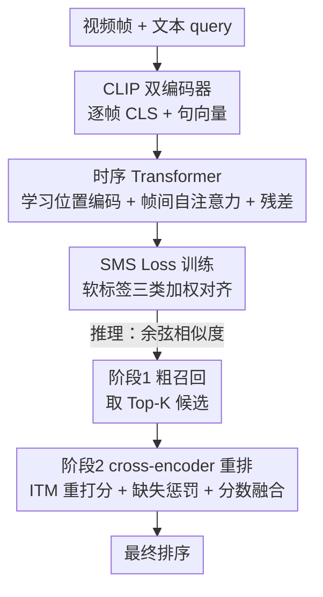

# TempRet: Temporal Enhancement and Two-Stage Reranking for CVPR 2026 EPIC-KITCHENS-100 Multi-Instance Retrieval Challenge

**会议**: CVPR 2026  
**arXiv**: [2605.24470](https://arxiv.org/abs/2605.24470)  
**代码**: 无  
**领域**: 视频理解 / 视频文本检索  
**关键词**: 视频文本检索, 第一人称视频, 时序建模, 软标签, 两阶段重排

## 一句话总结
针对 CVPR 2026 EPIC-KITCHENS-100 多实例检索（MIR）挑战赛，本文在冻结的 CLIP 双编码器之上叠一个轻量时序 Transformer 补回帧间顺序信息、用对称多相似度损失（SMS Loss）适配软标签监督、并在推理时加一道 cross-encoder 重排，最终在排行榜上拿到 67.97% 平均 mAP 和 82.92% 平均 nDCG。

## 研究背景与动机
**领域现状**：视频文本检索这几年靠大规模视觉语言预训练（尤其是 CLIP）进步很快，主流做法是把视频按帧独立编码、再做帧级特征池化，套用图文检索那一套双编码器对齐范式。

**现有痛点**：这套范式继承了图文检索的一个隐含假设——视觉语义可以逐帧捕获。但第一人称厨房视频里，动作是跨帧展开的：一只手伸向杯子、抓起、再放到别处，和另一段"几乎相同物体"的视频，区别只在于操作的**时序顺序与意图**。CLIP 逐帧编码强在物体和场景语义，却把帧间顺序、动作进程、因果关系全丢了。

**核心矛盾**：想补时序，有两条死路。一是直接改视觉骨干、上联合时空注意力——计算量暴涨，还会扰动让 CLIP 之所以好用的预训练空间表示；二是简单时序池化——保住了骨干，却把视频当成无序观测集合，等于没建模时间。需要一个折中：**保留预训练图文对齐，又补够能区分动作的时序推理**。

**额外难点**：MIR 挑战赛给的不是 0/1 硬标签，而是**软标签相关性矩阵**——好几段片段可能共享同样的物体、场景、动作动词，只是与 query 的匹配程度有梯度差异。这要求模型不仅能分正负，还得排出"相关程度"的次序。

**核心 idea**：冻住 CLIP 当高效特征提取器，只在**视频侧**叠一个轻量时序 Transformer 补回顺序；训练用 SMS Loss 显式利用软标签的梯度监督；推理时先双编码器粗召回、再用 cross-encoder 对 Top-K 候选做细粒度重排。各模块分工清晰，从粗到细。

## 方法详解

### 整体框架
TempRet 是一条"由粗到细"的视频文本检索流水线，要解决的是"如何在不破坏 CLIP 预训练对齐的前提下，给第一人称视频补足时序判别力、并榨干软标签监督"。整体怎么转：视频帧经 CLIP 图像编码器逐帧编码 → 时序 Transformer 把这串帧级特征建模成有时间感的片段表示 → 文本侧由 CLIP 文本编码器编码 query → 训练阶段用 SMS Loss 在共享空间里按软相关度对齐 → 推理阶段先用双编码器余弦相似度粗召回 Top-K，再用 cross-encoder + ITM 头对候选对重打分，最后把归一化的 ITM 分数和原始检索分数融合得到终排序。

整条管线里只有视频侧编码器是冻结的预训练件，时序 Transformer、SMS Loss、cross-encoder 重排是三个本文真正发力的贡献节点。

### 关键设计

**1. 视频侧时序 Transformer：在不动 CLIP 的前提下补回"动作进程"**

原始 CLIP ViT 逐帧独立处理图像，没有任何机制建模帧间时序，这对第一人称检索是致命短板——很多 query 描述的是动作而非静态场景。本文不去改 ViT，而是在帧级 CLS token 序列之上单独叠一个时序 Transformer。具体地，每帧先取 CLS token 经视觉投影映射到共享维度 $D=512$，得到帧序列 $\mathbf{X}=[\mathbf{v}_1,\dots,\mathbf{v}_T]\in\mathbb{R}^{T\times D}$；进入 Transformer 前先加**可学习位置编码**，把时间顺序显式注入，防止自注意力把帧序列当无序集合。序列过 $L$ 层标准 Transformer，每层先做带残差的多头自注意力 $\mathbf{H}^{(l)}=\mathbf{H}^{(l-1)}+\text{MHA}(\text{LN}(\mathbf{H}^{(l-1)}))$，再过一个 4× 扩展、GELU 激活的前馈块 $\mathbf{H}^{(l)}=\mathbf{H}^{(l)}+\text{MLP}(\text{LN}(\mathbf{H}^{(l)}))$，让每帧能 attend 到片段内所有其它帧，捕捉动作起始、物体操作、手物交互这类时序依赖。

关键在于**残差聚合**：Transformer 输出与原帧特征相加 $\tilde{\mathbf{X}}=\text{Transformer}(\mathbf{X})+\mathbf{X}$，再做掩码均值池化得到片段向量 $\tilde{\mathbf{v}}=\frac{\sum_t m_t\tilde{\mathbf{x}}_t}{\sum_t m_t}$（$m_t\in\{0,1\}$ 标记帧是否有效）。这条残差路保证时序模块是"补充"而非"替换"CLIP 的帧级语义。选独立轻量 Transformer 而非改 ViT 有三点好处：保住预训练空间表示、参数高效（只在压缩的帧嵌入序列上学时序而非所有 patch token）、推理时可灵活变片段长度而无需重训骨干。消融显示这一模块是涨点主力。

**2. 对称多相似度损失（SMS Loss）：让优化目标对齐软标签的"梯度相关性"**

MIR 的相关性是分级的——一个候选即便不是精确配对项，也可能语义上很接近 query。标准的最大间隔排序损失只会粗暴分正负，浪费了软标签信息。SMS Loss 在它基础上引入由相关性矩阵 $\mathbf{R}$ 导出的样本对权重 $w_{ij}$，对每个对 $(i,j)$ 按权重分三类处理：

$$\mathcal{L}_{ij}=\begin{cases}\text{ReLU}(w_{ij}\cdot m-\Delta_{ij}) & w_{ij}>\epsilon \\ \text{ReLU}(|w_{ij}\cdot m-\Delta_{ij}|-\tau) & |w_{ij}|\le\epsilon \\ \text{ReLU}(-(w_{ij}\cdot m-\Delta_{ij})) & w_{ij}<-\epsilon\end{cases}$$

其中 $\Delta_{ij}=s_{ii}-s_{ij}$ 是正对分数与负对分数之差，$m=0.2$ 是间隔超参，$\tau=0.1$ 是中性对阈值。三类的含义：高相关对（$w_{ij}>\epsilon$）被鼓励拉近、明显无关对（$w_{ij}<-\epsilon$）被推远、中性或弱相关对（$|w_{ij}|\le\epsilon$）则用一个带阈值 $\tau$ 的对称项谨慎处理、不硬推也不硬拉。这种三分法对 EPIC-KITCHENS 尤其重要——大量片段共享同一厨房环境和物体词汇，只在动作意图或时序上有别，简单二分会把这些"差一点"的对当噪声错误优化。

**3. 两阶段重排：用 cross-encoder 只对"靠谱候选"做细粒度核验**

双编码器算初始相似度高效，但两个模态各编各的，捕捉不到细粒度的跨模态 token 级交互；而对全量视频-query 对都跑 cross-encoder 又太贵。本文的折中是：**粗召回 + 仅对 Top-K 精排**。阶段一用余弦相似度算初始矩阵 $\mathbf{S}_{\text{init}}\in\mathbb{R}^{N_q\times N_v}$，每个 query 取分数 Top-K 候选——注意此时候选集已经反映了视频侧的时序结构（建立在前述时序增强表示之上）。阶段二把每个 query 和其候选的嵌入拼接 $\mathbf{o}_{ij}=\text{CrossEncoder}([\mathbf{v}_j;\mathbf{q}_i])$，过一个二分类 ITM 头输出匹配概率 $s_{ij}^{\text{ITM}}=\text{softmax}(\text{ITM}(\mathbf{o}_{ij}))_1$，建模视频与文本的 token 级交互。

两个工程细节让重排不破坏整体排序：**缺失惩罚**——不在 Top-K 的位置用该行最小 ITM 分填充 $s_{ij}^{\text{ITM}}\leftarrow\min_k s_{ik}^{\text{ITM}}$，保证非候选拿到该 query 视角下的最低分、不会因为缺失 ITM 值而占便宜；**分数融合**——终分 $\mathbf{S}_{\text{final}}=\mathbf{S}_{\text{ITM}}^{\text{norm}}+\alpha\cdot\mathbf{S}_{\text{init}}^{\text{norm}}$（$\alpha=0.002$），归一化 ITM 分提供细粒度成对证据、初始相似度残差项保住双编码器的全局语义信号。这样终排序锚在高效检索空间上，又能纠正视觉/语义相近候选间的局部排序错误。

### 损失函数 / 训练策略
训练目标即上述 SMS Loss（$m=0.2$，$\tau=0.1$）。视觉骨干用 ViT-L/14、输入 224×224；时序 Transformer 为 $L=4$ 层、$D=512$、8 头。优化器 AdamW，学习率 $1.8\times10^{-5}$，batch size 64，余弦学习率调度。关键技巧是**差分学习率**：新引入的时序层用 2× 学习率，让它快速适配，同时把预训练视觉/文本编码器维持在低学习率上保持稳定。重排阶段 $K=1000$、$\alpha=0.002$。

## 实验关键数据

### 主实验
官方排行榜上，TempRet 在两个汇总指标上均拿到列出队伍里的最优平均成绩，T2V 方向涨幅最明显：

| 方法 | mAP-Avg | mAP-T2V | mAP-V2T | nDCG-Avg | nDCG-T2V | nDCG-V2T |
|------|---------|---------|---------|----------|----------|----------|
| Privacy | 66.21 | 60.71 | 71.70 | 78.59 | 76.75 | 80.43 |
| Enid | 66.78 | 61.75 | 71.81 | 82.08 | 80.25 | 83.91 |
| **TempRet** | **67.97** | **65.03** | 70.91 | **82.92** | **81.41** | **84.42** |

评测指标：mAP 衡量相关项是否被排在检索列表前面，对高置信匹配的精度敏感；nDCG 进一步考虑分级相关性，对低排名做折扣、奖励把高相关视频/字幕排在前面——因为基准给的是软相关矩阵，nDCG 更能反映预测排序是否尊重"不同程度的语义匹配"。

### 消融实验
从完整 TempRet 出发，逐个去掉重排、时序 Transformer 或两者（同一评测协议，报告 T2V 与 V2T 的平均 mAP / nDCG）：

| 配置 | Avg mAP | Avg nDCG | 说明 |
|------|---------|----------|------|
| TempRet（完整） | 67.97 | 82.92 | 完整模型 |
| w/o Reranking | 66.21 | 81.10 | 去掉重排，mAP 掉 1.76 |
| w/o Temporal Transformer | 55.61 | 68.42 | 去掉时序，mAP 掉 12.36 |
| w/o Temporal & Reranking | 56.61 | 67.40 | 两者都去 |

### 关键发现
- **时序建模是涨点绝对主力**：去掉时序 Transformer，平均 mAP 从 67.97% 暴跌到 55.61%（-12.36）、nDCG 从 82.92% 跌到 68.42%（-14.50）。这直接证明仅靠帧级 CLIP 特征不足以应对 MIR——没有显式时序信息，模型只能依赖静态帧语义，无法可靠区分动作进程、操作顺序、短时序转换。
- **重排是稳定但较小的增益**：去掉重排平均 mAP 掉 1.76、nDCG 掉 1.82。幅度小于时序模块是符合预期的——重排只在双编码器已产出 Top-K 候选集之后才作用；但它的一致提升说明候选级重打分确实改善细粒度判别，尤其对 nDCG（把高相关候选顶到列表最前面，比广泛召回相关片段更重要）。
- 有意思的一点：去掉两者（56.61% mAP）反而略高于只去时序（55.61%），说明在没有时序增强表示时，单独的重排反而可能引入轻微噪声——重排的价值依赖于一个足够好的视频侧表示作为前提。

## 亮点与洞察
- **"冻骨干 + 外挂时序模块"是个高性价比折中**：不碰 CLIP 的预训练空间表示，只在帧级 CLS token 上叠 4 层 Transformer，既保住图文对齐又补回时序，还顺带获得推理时变长片段的灵活性——这套思路可直接迁到任何想给图像预训练模型补时序的视频任务。
- **残差聚合的设计很关键**：时序 Transformer 输出与原帧特征相加而非替换，把"补充时序"和"保留语义"显式解耦，避免新模块在训练初期破坏预训练特征。
- **软标签三分法损失值得借鉴**：把样本对按相关性权重分成正/负/中性三类、对中性对用带阈值的对称项谨慎处理，是处理"梯度相关性"监督的实用模板，适用于任何提供软标签的检索/匹配任务。
- **缺失惩罚 + 分数残差融合**这两个工程细节，让"只对 Top-K 精排"不至于破坏全局排序，是把重排稳妥接进检索系统的可复用 trick。

## 局限与展望
- **这是一份挑战赛技术报告**，三大组件（CLIP 双编码器、SMS Loss、cross-encoder 重排）都源自已有工作，本文的贡献在于针对 EPIC-KITCHENS MIR 把它们组装、调参并验证有效，方法新颖性有限。
- **只在 EK-100 MIR 单一基准上验证**，没有跨数据集泛化实验，时序 Transformer 与重排的增益在非厨房、非第一人称场景能否复现是未知数。
- **V2T 方向未夺冠**：TempRet 的 mAP-V2T（70.91）反而低于 Enid（71.81），涨点主要集中在 T2V 方向，说明该设计对"以文搜视频"更友好，视频侧时序增强对"以视频搜文"的帮助不对称，原文未深入分析这一现象。
- 重排阶段 $K=1000$、$\alpha=0.002$ 等超参偏经验设定，缺少敏感性分析；缺失惩罚用"行内最小 ITM 分"填充也较启发式，是否最优未验证。

## 相关工作与启发
- **vs 联合时空注意力（改 ViT 骨干）**：他们把时序注意力直接塞进视觉骨干，计算量大且扰动预训练空间表示；本文用外挂轻量时序 Transformer，保住骨干、参数高效、推理可变长，是更克制的折中。
- **vs 简单时序池化**：池化保住骨干但把视频当无序集合、丢掉顺序；本文用带可学习位置编码的自注意力显式建模帧序，能区分动作进程与操作顺序。
- **vs 标准对比/最大间隔排序损失**：标准损失只分正负，浪费 MIR 的软标签；SMS Loss 用三分加权显式利用分级相关性，更契合"很多片段差一点"的第一人称检索场景。
- **vs 纯双编码器检索**：双编码器高效但两模态独立、缺细粒度交互；本文加一道 cross-encoder ITM 重排，在效率（仅 Top-K）与精度（token 级交互）间取得平衡。

## 评分
- 新颖性: ⭐⭐⭐ 三大组件均来自已有工作，贡献在于针对挑战赛的有效组装与调优，而非方法原创
- 实验充分度: ⭐⭐⭐ 排行榜结果 + 干净的消融，但仅单一基准、缺超参敏感性与跨域验证
- 写作质量: ⭐⭐⭐⭐ 作为技术报告条理清晰，方法与图表对应良好，公式完整
- 价值: ⭐⭐⭐⭐ "冻骨干补时序 + 软标签三分损失 + Top-K 重排"这套组合拳对实战视频检索很有参考价值

<!-- RELATED:START -->

## 相关论文

- [\[CVPR 2026\] EgoAdapt: A Multi-Scene Egocentric Adaptation Method for CVPR 2026 HD-EPIC VQA Challenge](egoadapt_a_multi-scene_egocentric_adaptation_method_for_cvpr_2026_hd-epic_vqa_ch.md)
- [\[CVPR 2026\] EgoAction: Egocentric Action Composition with Reliability-Aware Temporal Fusion for the EPIC-KITCHENS Action Detection Challenge at CVPR 2026](egoaction_egocentric_action_composition_with_reliability-aware_temporal_fusion_f.md)
- [\[CVPR 2026\] FlexHook: Rethinking Two-Stage Referring-by-Tracking in RMOT](rethinking_two-stage_referring-by-tracking_in_referring_multi-object_tracking_ma.md)
- [\[CVPR 2026\] Two-Pass Zero-Shot Temporal-Spatial Grounding of Rare Traffic Events in Surveillance Video](two-pass_zero-shot_temporal-spatial_grounding_of_rare_traffic_events_in_surveill.md)
- [\[CVPR 2026\] Drift-Resilient Temporal Priors for Visual Tracking](drift-resilient_temporal_priors_for_visual_tracking.md)

<!-- RELATED:END -->
