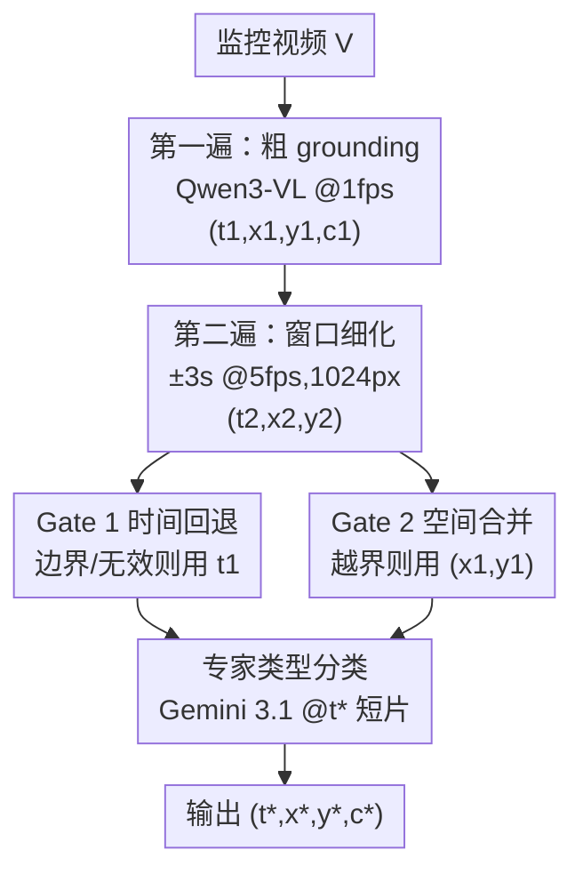

# Two-Pass Zero-Shot Temporal-Spatial Grounding of Rare Traffic Events in Surveillance Video

**会议**: CVPR 2026  
**arXiv**: [2605.01512](https://arxiv.org/abs/2605.01512)  
**代码**: 无  
**领域**: 视频理解 / 视频时空 grounding  
**关键词**: 零样本 grounding, 冻结 VLM, 由粗到细, 交通事故检测, 置信度门控

## 一句话总结
针对"禁止在真实事故视频上训练"的稀有事件场景，本文用两个**冻结**的视觉语言模型搭了一条无需微调的两遍式（粗→细）流水线，配两个确定性置信度门控来判断细化结果是否可信，并把"打类型"这个子任务专门交给第二个 VLM，在 ACCIDENT@CVPR 2026（2027 段真实 CCTV）上把联合时空+类型分数 $\mathrm{ACC}^S$ 做到 0.539，比基准论文最优 oracle 高 0.127、比最强单 VLM 高 0.143，全程只花约 $20 的 API。

## 研究背景与动机
**领域现状**：交通事故视频检测有十多年积累，主流是监督式 CCTV 分类（CADP、TAD）、行车记录仪上的无监督异常检测（DoTA）、带时空注意力的事故预判（DSTA、CCD），几乎都**依赖大量带标注的事故视频**做训练。

**现有痛点**：事故是罕见且涉隐私/责任的安全关键事件，难以拿到足量标注，很多场景**法律上就禁止**在真实事故视频上训练。ACCIDENT@CVPR 2026 基准把这个约束写死：开发集给 2211 段 CARLA 合成视频，测试集是 2027 段真实 CCTV，但**禁止在真实事故视频上训练**。每段视频要同时定位三件事——撞击**时刻 $t$**、撞击**位置 $(x,y)$**、**碰撞类型 $c$**，最终用三个子分数的**调和平均** $\mathrm{ACC}^S$ 打分。

**核心矛盾**：调和平均会狠狠惩罚短板组件——任何一个子任务拉胯，整体就崩。官方 Kaggle 公开 baseline（光流 0.251、bbox 动力学 0.270）甚至打不过 naive 基线（0.289）；最强单 VLM（Molmo-7B，0.396）空间分很高（$S=0.596$）但类型分极差（$C=0.271$）。问题的根在两处：① 单次前向看整段视频，**粗时间覆盖**和**细时间分辨率**只能二选一；② 任何单个 VLM 通常只在三个子任务的**一个子集**上强。

**本文目标**：在不微调、只用冻结 VLM 的前提下，同时把时间、空间、类型三件事都做好。

**切入角度**：作者观察到现代 VLM（Qwen3-VL-Plus、Gemini 3）**原生就带时空 grounding**——能对齐文本时间戳、输出 $[0,1000]^2$ 网格坐标、吃长上下文视频窗口。只是 naive 零样本用法没发挥出来。

**核心 idea**：用"由粗到细的两遍分解"只在高显著邻域做细化，再用"专家分工"把类型分类甩给在该轴上更强的第二个 VLM——两招同时解掉上面两个矛盾，全程零微调。

## 方法详解

### 整体框架
给定一段时长 $D$ 秒的交通监控视频 $V$，目标是预测 $(t^*, x^*, y^*, c^*)$。整条流水线由三段串起来：**第一遍（粗 grounding）**用 Qwen3-VL-Plus 以 1 fps 扫全片，吐出一个粗四元组 $(t_1, x_1, y_1, c_1)$；**第二遍（细化）**只在 $t_1$ 附近 $\pm 3$s 的窗口内以 5 fps、1024px 重采样，刷新时间和位置到 $(t_2, x_2, y_2)$；中间夹两个**确定性门控**——时间回退门和空间合并门——决定到底采用粗估计还是细估计；最后**专家分类**用 Gemini 3.1 Flash-Lite 在以 $t^*$ 为中心的 5s 短片上重新打类型 $c^*$。所有模型都冻结、零样本调用，API 失败时（实测约 17% 视频）回退到 YOLO26x + ByteTrack + 物理规则的并行管线。

### 关键设计

**1. 由粗到细两遍分解：把"覆盖广"和"看得细"拆到两遍各管一头**

单次前向看整段视频时，采样率高了就覆盖不全、覆盖全了就看不细，这正是稀有瞬时事件最难的地方。本文把它拆成两遍：第一遍以 1 fps、长边 720px、$\le 30$ 帧扫全片（ACCIDENT 中位时长 26.8s），每帧前面贴一个 `[Frame at t.ts]` 文本标签把像素网格绑定到绝对秒——这是一个轻量锚点，Qwen3-VL 直接读，不需要训练好的 time-to-token 模块。1 fps 采样 + 整数秒输出 + 逐帧文本标签三者结合，把"产出连续时间戳"变成了"指认某一帧"。第二遍只在 $W=[\max(0, t_1-3), \min(D, t_1+3)]$ 内以 5 fps、1024px 重采样，问 0.1s 精度的细时刻和一个新坐标点，**只细化第一遍锁定的高显著邻域**，从而同时拿到广覆盖和高分辨率。

**2. 两个确定性置信度门控：让第二遍只在"靠谱时"才覆盖第一遍**

细化不是无脑覆写——第二遍的 prompt 明确允许在窗口内看不到碰撞时返回 $t_2 = -1$，把第二遍变成一个**置信度门控的细化器**而非盲目覆盖。时间回退门（Gate 1）用边界容差 $\tau=0.3$s：当 $t_2 < 0$、或 $t_2$ 贴近窗口任一边界（$|t_2 - W_{\min}| < \tau$ 或 $|t_2 - W_{\max}| < \tau$）时，判定为模型在"犹豫式 hedging"，回退到更鲁棒的第一遍 $t_1$，否则取 $t_2$。空间合并门（Gate 2）用边距 $m=10$：只有当第二遍坐标两个轴都落在 $[10, 990]$（即 $m \le \tilde{x}_2 \le 1000-m$ 且 $m \le \tilde{y}_2 \le 1000-m$）时才采用 $(\tilde{x}_2/1000, \tilde{y}_2/1000)$，**任一轴被边缘钳住**就回退到第一遍坐标。两个门相互独立，正是它们让"两遍"能稳定超过任一单遍。

**3. 专家角色分工：把短板子任务甩给在该轴上更强的第二个 VLM**

Qwen3-VL 在 1681 段第一遍有效视频上的类型准确率只有 0.462（含 17% 物理回退的全测试集 $C=0.474$），明显低于它的空间分——这正是调和平均最怕的短板。于是把"打类型"整个换给 Gemini 3.1 Flash-Lite：以 $t^*$ 为中心取 $[t^*-3, t^*+2]$ 的 5s 短片，并围绕**第一遍中心** $(x_1, y_1)$ 以 $2.5\times$ 框做空间裁剪（用第一遍中心而非合并后的 $(x^*, y^*)$，因为第一遍给的粗区域对类型分类更稳），喂给一个闭世界 prompt（枚举 5 类、禁止弃权）。这一拆把全测试集类型准确率从 0.474 抬到 0.591（相对 +25%），代价只是每段多一次 API 调用。

### 损失函数 / 训练策略
全程**无训练、无微调**，只调用冻结 VLM，因此没有损失函数。关键超参全部在测试标签发布前冻结：窗口 $\Delta=3$s、时间容差 $\tau=0.3$s、空间边距 $m=10$、第一遍 1 fps/720px、第二遍 5 fps/1024px、类型短片 5s/$2.5\times$ 裁剪。碰撞类型空间 $\mathcal{C}=\{$head-on, rear-end, t-bone, sideswipe, single$\}$；坐标在 $[0,1000]^2$ 网格上由 VLM 输出后除以 1000 再合并/评测。Prompt 采用**闭世界框架**（预先声明视频中必有事故，抑制模型拒答）——这与 ACCIDENT 基准"每段都含事故"一致，开放世界部署需配人类把关。

## 实验关键数据

### 主实验
在 ACCIDENT 2027 段真实 CCTV 上，官方评测器 $\sigma_t=1$。$T,S,C$ 为数据集级均值，$\mathrm{ACC}^S$ 为逐视频调和平均再取均值；人类天花板 0.843。

| 方法 | $T$ | $S$ | $C$ | $\mathrm{ACC}^S$ |
|------|-----|-----|-----|-----|
| 光流 baseline [11] | — | — | — | .251 |
| BBox 动力学+光流 [11] | — | — | — | .270 |
| Naive baseline [14] | .30 | .25 | .34 | .289 |
| Molmo-7B [4] | .48 | **.60** | .27 | .396 |
| Best-of-baselines oracle [14] | .48 | **.60** | .49 | .412 |
| Gemini 3.1 单遍（本文消融） | .44 | .49 | .49 | .473 |
| Qwen3-VL 第一遍（本文消融） | .46 | .51 | .47 | .480 |
| **Ours (full)** | **.50** | .54 | **.59** | **.539** |
| Human [14] | .98 | 1.0 | .92 | .843 |

本文 $\mathrm{ACC}^S=0.539$（CI $[0.525, 0.553]$）比 best-of-baselines oracle 高 +0.127、比 Molmo-7B 高 +0.143。$T=0.497$ 超过 Molmo，$S=0.538$ 略逊 Molmo 的 0.596，$C=0.591$ 是所有方法最高。同样 1 fps 输入下 Gemini 单遍仅 0.473，低于 Qwen 第一遍 0.480；配对 bootstrap 显示完整流水线比 Gemini 单遍高 $\Delta=+0.066$（$p<0.001$）。在 1681 段第一遍有效视频上 $\mathrm{ACC}^S=0.554$，346 段回退视频得 0.457，证实增益来自 VLM 主路而非物理回退。

### 消融实验
逐组件拆解（$\sigma_t \in \{1,2\}$ 看时间，$\mathrm{ACC}^S$ 在 $\sigma_t=1$）：

| 配置 | $T_{\sigma1}$ | $S$ | $C$ | $\mathrm{ACC}^S$ | 说明 |
|------|------|------|------|------|------|
| 仅第一遍（Qwen 打类型） | 0.463 | 0.506 | 0.474 | 0.480 | 起点 |
| + Gemini 专家类型 | 0.463 | 0.506 | 0.590 | 0.514 | 类型 +0.12，单步最大跳 |
| + 第二遍时间细化 | **0.497** | 0.506 | 0.591 | 0.528 | $T(\sigma_t{=}1)$ +0.034 |
| + 第二遍空间合并 | 0.497 | **0.538** | 0.591 | **0.539** | $S$ +7% |

相对仅第一遍，累计增益 $+0.059$ $\mathrm{ACC}^S$。

### 关键发现
- **专家类型分工贡献最大**：把 Qwen 的类型头换成 Gemini 单步就让 $C$ 从 0.474 跳到 0.590，是单组件最大增益——印证"任何单 VLM 只在部分子任务强"的假设。
- **时间存在系统性"晚偏"**：第一遍预测时刻相对 GT 均值 $+1.55$s、中位 $+0.37$s，模型倾向选**碰撞后残骸帧**而非接触瞬间；且时间 MAE 随视频长度增长（$\le 10$s 片 0.94s → $\ge 20$s 片 >4s），提示需要运动自适应采样。
- **最难的两类会塌缩**：79% 的 head-on 被叫成 t-bone、39% 的 sideswipe 被叫成 rear-end，仅靠类型这两类 $\mathrm{ACC}^S$ 跌到 ~0.12（而 $T,S$ 健康），作者归因于高俯角 CCTV 的单目深度歧义和网络数据标注偏置。
- **物理-VLM 互补**：YOLO+物理（6.63s MAE）与 Qwen 第一遍（3.20s）的 oracle 组合可达 2.13s MAE（$-33.5\%$），说明下一步杠杆是物理-VLM 融合而非堆规模。

## 亮点与洞察
- **把"产出时间戳"重构成"指认某一帧"**：1 fps 采样 + 整数秒输出 + 逐帧 `[Frame at t.ts]` 文本标签三件套，让冻结 VLM 不靠任何 time-to-token 训练就能做时间定位——这个轻量锚点思路可迁移到任何需要时间 grounding 的视频任务。
- **门控用"边界/边缘"当不确定性代理**：不需要置信度分数，直接把"细化结果贴近窗口边界或坐标被边缘钳住"判为模型在 hedging 并回退——一种纯确定性、零额外成本的不确定性检测。
- **专家分工是面向调和平均度量的直接对策**：当评测是调和平均、最怕短板时，与其追求一个全能模型，不如诊断出最弱子任务再换一个专精模型补上，性价比极高（一次额外 API 调用换 +25% 相对类型增益）。
- **全程约 $20、每段 ~$0.01**：证明在严格禁训练的稀有事件场景，精心编排的冻结 VLM 流水线能显著超过训练式 baseline 和单次 VLM prompting。

## 局限与展望
- **时间晚偏未解决**：模型系统性偏向碰撞后帧，作者提出运动自适应采样但本文未实现。
- **类型在视觉歧义类上崩**：head-on↔t-bone、sideswipe↔rear-end 的混淆源于高俯角单目深度歧义，换模型也只是缓解。
- **依赖闭世界假设**：prompt 预设"每段必有事故"以抑制拒答，开放世界部署需要额外的人类把关门，泛化到"判断有无事故"的场景需重新设计。
- **17% 视频走物理回退**：API 失败率不低，回退路径（0.457）明显弱于 VLM 主路（0.554），稳定性受第三方 API 可用性制约。
- **改进方向**：作者明确指出下一步是**运动自适应采样 + 物理-VLM 融合**（oracle 已证明可降到 2.13s MAE），而非继续堆模型规模。

## 相关工作与启发
- **vs 监督式事故检测（CADP/TAD/DoTA/DSTA）**: 它们几乎都在标注事故视频上训练，本文在禁训练约束下用冻结 VLM 零样本完成联合时空+类型 grounding。
- **vs ReVisionLLM [9]**: 二者都是由粗到细的递归 grounding（针对长视频），但 ReVisionLLM 的层级是靠**分层训练**实现的，本文的两遍分解完全无训练、靠 prompt 和门控实现。
- **vs LAVAD [23]**: LAVAD 是首个全免训练的视频异常检测，但依赖逐帧 VLM caption + LLM 后聚合，**丢失了空间 grounding**；本文用 VLM 原生时空 grounding 直接保住 $T+S+C$ 三件事。
- **vs Molmo/单 VLM baseline [4]**: 单 VLM 强于空间但弱于类型，本文用专家分工补短板，把整体调和平均从 0.396 抬到 0.539。
- **vs 并发工作 Thakur & Talele [16]**: 它用帧差峰值定时间、Farneback 光流质心定空间、CLIP 相似度定类型，模块化但仅 0.252；本文用 VLM 原生能力 + 门控显著领先。

## 评分
- 新颖性: ⭐⭐⭐⭐ 无训练编排冻结 VLM 解稀有事件 grounding，两遍分解 + 确定性门控 + 专家分工的组合实用且针对度量短板，但单点技术多为已有能力的精巧装配。
- 实验充分度: ⭐⭐⭐⭐ 主表 + 逐组件消融 + 系统性失败诊断（时间偏置/长度退化/类型混淆/物理-VLM oracle）齐全，含 bootstrap CI 与显著性检验。
- 写作质量: ⭐⭐⭐⭐ 动机—矛盾—对策链条清晰，公式与算法伪代码完整，门控逻辑交代到位。
- 价值: ⭐⭐⭐⭐ 在"禁训练 + 隐私敏感"的真实安全关键场景给出低成本可落地方案，对调和平均度量补短板的思路有迁移价值。

<!-- RELATED:START -->

## 相关论文

- [\[CVPR 2026\] Metadata-Aware Multi-Prompt Reasoning for Zero-Shot Accident Understanding](metadata-aware_multi-prompt_reasoning_for_zero-shot_accident_understanding.md)
- [\[CVPR 2026\] No Need For Real Anomaly: MLLM Empowered Zero-Shot Video Anomaly Detection](no_need_for_real_anomaly_mllm_empowered_zero-shot_video_anomaly_detection.md)
- [\[CVPR 2026\] SkeletonContext: Skeleton-side Context Prompt Learning for Zero-Shot Skeleton-based Action Recognition](skeletoncontext_skeleton-side_context_prompt_learning_for_zero-shot_skeleton-bas.md)
- [\[ACL 2026\] ArrowGEV: Grounding Events in Video via Learning the Arrow of Time](../../ACL2026/video_understanding/arrowgev_grounding_events_in_video_via_learning_the_arrow_of_time.md)
- [\[CVPR 2026\] CVA: Context-aware Video-text Alignment for Video Temporal Grounding](cva_context-aware_video-text_alignment_for_video_temporal_grounding.md)

<!-- RELATED:END -->
