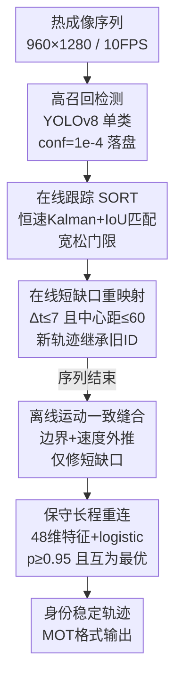

# Understanding Identity Continuity in Thermal Video through Scene-Level Consistency

**会议**: CVPR 2026 (PBVS Workshop)  
**arXiv**: [2606.01694](https://arxiv.org/abs/2606.01694)  
**代码**: https://heejaeee.github.io/pbvs26_tmot/ (项目页)  
**领域**: 视频理解 / 多目标跟踪  
**关键词**: 热成像、行人 MOT、轨迹重连、身份恢复、场景级一致性

## 一句话总结
本文不造新跟踪器，而是在 YOLOv8+SORT 这条轻量基线之外加一个模块化的"身份修复后端"（在线短缺口重映射 + 离线保守长程重连），通过受控消融证明：热成像行人 MOT 的身份连续性主要来自**保守的长程轨迹重连（IDF1 82.25→84.93）而非提升在线跟踪器复杂度**，且空间一致性是恢复碎片化轨迹最关键的线索。

## 研究背景与动机

**领域现状**：现代多目标跟踪（MOT）以 tracking-by-detection 为主流——先逐帧检测，再用 SORT/ByteTrack/BoT-SORT/OC-SORT 这类关联器维持时序身份一致性。为了在遮挡和检测噪声下稳住身份，这些方法不断堆叠更强的关联策略、运动模型、外观/分割等辅助线索。

**现有痛点**：热成像（infrared）的行人跟踪天然"信息贫瘠"——目标边界弱、外观区分度低、局部结构高度模糊。这导致两个具体问题：(1) 外观特征几乎没有判别力，遮挡后很难重认身份；(2) 拥挤场景、漏检、突变运动频繁把一条轨迹打成碎片、引发身份切换（ID switch）。而能在 RGB 上 work 的强方法又往往依赖重型 re-ID 模块或复杂运动模型，部署成本高，对实时热成像系统不友好。

**核心矛盾**：在低信息热成像里，"靠堆架构复杂度换身份稳定性"这条路性价比很低——外观线索本身就弱，re-ID 学不到有效特征，反而是短时运动和空间连续性相对可靠。问题的根本不在帧间局部关联做得不够花哨，而在于**碎片化是一个跨帧、跨场景的全局现象**。

**本文目标**：不追求 SOTA 跟踪精度，而是回答一个分析性问题——在热成像里，到底是哪种时空线索"足以"解释身份恢复？把身份连续性从"局部数据关联问题"重新框定为"场景级时空一致性"现象。

**切入角度**：作者假设身份连续性是从"跨帧一致的空间-时间结构"中**涌现**出来的全局属性，而不是架构复杂度的副产品。于是用一条刻意简单的基线（高召回检测器 + 轻量在线跟踪器），把所有"修复能力"剥离成可单独开关的后处理模块，逐个做受控消融，看谁真正起作用。

**核心 idea**：用"保守、高精度的离线轨迹重连"代替"更复杂的在线跟踪器"来恢复热成像中的碎片化身份，并通过可复现的消融框架证明长程重连（而非短缺口缝合）才是主导因素。

## 方法详解

### 整体框架
整个系统可以读成三段非对称结构：**一个高召回的热成像检测器 + 一个轻量在线运动跟踪器 + 一个两阶段身份修复后端**。检测器负责最大化候选覆盖，在线跟踪器负责短期时序连续，后处理后端负责在漏检/短遮挡/中途碎裂下恢复长程身份一致。输入是 960×1280、10 FPS 的 PBVS 热成像行人序列，输出是 MOT 格式的、身份稳定的轨迹。

具体地：先用 YOLOv8（单类 person）以极低置信阈值（$10^{-4}$）跑高召回检测，结果落盘成逐帧 YOLO 文本文件（这样可以不重跑全流程就做检测器/跟踪器消融）；再把检测按 $s_i^t\ge 0.5$ 收紧后喂给 SORT 做在线关联（恒速 Kalman + 基于 IoU 的匈牙利匹配，且关联策略刻意宽松：丢失帧容忍 40、IoU 门限低至 0.001）。SORT 之后接三个修复阶段——**在线短缺口重映射**紧跟每次 SORT 更新做即时纠正；序列结束后再跑两个离线阶段：**运动一致的短程缝合**与**保守的长程重连**。其中长程重连是经验增益的主力，短程缝合只是辅助。

### 关键设计

**1. 在线短缺口重映射：在 SORT 更新后立刻修补瞬时断裂**

热成像里检测器经常因为局部温度模糊、部分截断、低信噪比而短暂中断，导致一条轨迹被切成两段并分配新 ID。作者不把所有纠正都推到序列末尾，而是在**每次 SORT 更新之后**立即跑一个在线重映射模块：维护一段"最近丢失的输出身份"的记忆，如果一个新生原始轨迹 $u$ 在 $\Delta t \le 7$ 帧内出现、且与最近丢失轨迹 $v$ 的中心距离满足 $\|c_u-c_v\|_2 \le 60$ 像素，就让新轨迹**继承旧身份**而不是发新 ID。10 FPS 下 7 帧≈0.7 秒，对应"合理的短暂遮挡"，阈值刻意压小以避免激进的身份传播。消融显示这一步把原始跟踪器 IDF1 从 80.98 抬到 82.25（即关掉它会掉 1.27 pp），但它只解决短期连续，长程增益仍归离线阶段。

**2. 离线运动一致缝合：用"非法消失/出现"+ 运动外推修短缺口碎片**

第一个离线阶段专门盯"短的非法消失-重现事件"：一条轨迹在**远离图像边界**的地方结束，就是一次不合理的消失；在远离边界处开始，就是不合理的出现。对一对旧轨迹 $a$ 和新轨迹 $b$（时间缺口 $\Delta t = t_b^{\text{start}}-t_a^{\text{end}}$），用 3 点时间窗估计端点速度并外推前一条轨迹的位置 $\tilde c_a = c_a^{\text{end}} + v_a\Delta t$。只有同时满足以下四条才合并：两端点都落在 60 像素边界带之外、$1\le\Delta t\le 30$、预测位移 $\|\tilde c_a - c_b^{\text{start}}\|_2 \le 80$ 像素、以及（当速度 $\ge 0.25$ px/frame 信息足够时）两速度向量夹角 $\le 45^\circ$ 且速率比 $\le 3.0$。这套阈值编码的是"保守的运动学合理性"——只修又短又运动学一致的碎片。值得注意的是，消融里它**单独跑几乎没有可测增益**（stitch-only 的 IDF1 仍是 82.25），说明本数据集的主导碎片模式不是短缺口运动不连续。

**3. 保守长程重连：固定 logistic 打分 + 互为最优约束，做高精度长程关联（增益主力）**

第二个离线阶段才是真正贡献身份增益的地方，针对**长程碎裂**。对每个候选"前驱-后继"轨迹对，构造一个 48 维特征向量，编码时间缺口、欧氏与轴向位移、轨迹长度、框尺寸比、边界距离、边缘指示、全局速度一致性，以及在 $\{2,3,5,10,20\}$ 多个时间窗上的外推误差。候选先过硬门限（缺口 $\le 60$ 帧、端点距 $\le 120$ 像素、两轨迹各至少 2 个观测、前驱不能终止在 25 像素边界附近），再用固定权重 $w$ 算重连概率 $p=\sigma(w^\top z)$（$z$ 为归一化特征，$\sigma$ 为 sigmoid）。**关键是只在 $p\ge 0.95$ 且该候选对旧、新两条轨迹互为最优时才接受合并**——这个"互为最优（mutual-best）"约束让重连保持高精度，避免早期错误级联放大。这里 $w$ 全程固定、只当一个轻量打分函数用，没有在线学习。正是这一阶段把 IDF1 从 82.25 抬到 84.93（+2.68 pp），而 MOTA 几乎不变，是全文核心结论的来源。

### 损失函数 / 训练策略
本文没有端到端训练目标。检测器直接采用 [20] 发布的 YOLOv8 单类行人权重；长程重连的 logistic 权重 $w$ 在评测中固定不变，仅作为手工特征上的打分函数使用。整套修复后端是确定性的几何/运动学规则 + 一个固定打分器，无需训练即可应用，这也是其"轻量、可复现、可解释"的来源。

## 实验关键数据

数据集为 PBVS Thermal Pedestrian MOT（TP-MOT），FLIR ADK 热传感器在 5 个城市路口拍摄，30 序列共 9,000 帧、960×1280、10 FPS、单类行人标注。受控消融用固定的 6 序列本地验证集（Seq2/17/22/47/54/66），整体性能则报官方评测服务器结果。

### 主实验
所有方法在**统一检测设置、且都不加本文修复后端**下的上下文对比（Table 2，注意这是 contextual 而非严格受控对比，因为修复后端只加在 SORT 上）：

| 方法 | MOTA ↑ | MOTP ↓ | IDF1 ↑ |
|------|--------|--------|--------|
| ByteTrack | 91.73 | 13.67 | 76.59 |
| BoT-SORT | 91.74 | 13.68 | 76.05 |
| BoostTrack | 86.54 | 15.55 | 75.45 |
| DiffMOT | 86.30 | 16.11 | 78.12 |
| OC-SORT | 90.71 | **12.36** | 56.85 |
| SAM3 | 90.03 | 21.04 | 60.73 |
| **SORT（基线）** | **98.44** | 12.63 | **82.25** |

有意思的是，在这个热成像设置下，SORT 这条最简单的基线反而在 MOTA 和 IDF1 上都最强——更复杂的跟踪器（OC-SORT、SAM3）身份一致性反而更差。这恰好支撑了"堆复杂度未必有用"的动机，也促使作者转去做受控消融。

### 消融实验
身份修复后端的组件消融（本地验证集，固定检测器与评测脚本，Table 3）：

| 配置 | MOTA ↑ | IDF1 ↑ | ΔIDF1 vs. raw (pp) |
|------|--------|--------|---------------------|
| Raw SORT 基线 | 98.44 | 82.25 | 0.00 |
| 仅缝合 (Stitch only) | 98.46 | 82.25 | 0.00 |
| 仅重连 (Relink only) | 98.54 | **84.93** | **+2.68** |
| 完整 (stitch+relink) | 98.54 | 84.93 | +2.68 |
| Full w/o 运动线索 | 98.55 | 83.86 | +1.60 |
| Full w/o 边界线索 | 98.54 | 84.54 | +2.29 |
| Full w/o 时间线索 | 98.53 | 84.13 | +1.88 |
| **Full w/o 空间线索** | 98.52 | **80.50** | **−1.76** |
| 关掉在线重映射 (raw) | 98.40 | 80.98 | −1.27 |
| 关在线+离线完整 | 98.55 | 84.94 | +2.69 |

### 关键发现
- **长程重连是绝对主力**：仅重连就拿满 +2.68 pp，而仅缝合在本验证集**零增益**——说明本数据集的主导碎片模式是"长程关联失败"而非"短缺口运动不连续"，身份恢复靠的是长程场景一致推理而非局部时序连续。
- **空间一致性是最关键的线索**：去掉空间线索 IDF1 反而掉到 80.50（−1.76 pp，比 raw 还低）。作者解释：空间邻近是一个**硬几何约束**，在打分之前就先排除掉不合理关联；在热成像里行人剪影几乎可互换，这种粗粒度空间过滤反而是最可靠的身份证据，而运动方向/速度因行人走停（stop-and-go）更嘈杂。
- **在线重映射是辅助**：关掉它 raw 跟踪器掉 1.27 pp，但接上完整离线流程后又恢复到 84.94，证明最终增益仍由离线重连主导。
- **阈值鲁棒、不靠"魔法数字"**：把缝合/重连的主要阈值在远比默认更松/更紧的范围扫一遍（Table 4），IDF1 多数仅变动 <0.5 pp（如重连分数阈 0.90–0.975 仅变 0.27、缝合最大缺口 10–60 完全不变）；只有明显过保守/过平滑的配置（如很大的缝合速度窗、很大的重连边界 margin）才有可见退化。

## 亮点与洞察
- **"分析论文"而非"架构论文"的定位很清醒**：作者明确说目标不是刷 SOTA，而是用可复现的消融框架隔离出"哪种时空线索足以解释身份恢复"，把热成像身份连续性重新框定为场景级一致性问题——这种把问题讲清楚的工作在以堆 trick 为主的 MOT 领域很稀缺。
- **"互为最优 + 高阈值(p≥0.95)"换来高精度重连**：用 mutual-best 约束防止错误级联，是离线 tracklet 关联里很实用、可迁移的 trick——比单向贪心合并稳得多，可直接搬到任意 tracklet stitching 后端。
- **最反直觉的一点**：更复杂的跟踪器（OC-SORT/SAM3）在低信息热成像里 IDF1 反而暴跌（56.85/60.73 vs SORT 82.25），印证"信息越贫瘠，越该靠简单可靠的几何约束而非花哨建模"。
- **空间 > 运动 > 时间 > 边界的线索排序**可直接指导其他低可见度场景（夜视、雾天）的关联器设计：优先做硬空间过滤。

## 局限与展望
- **作者承认**：所有受控消融只在单一热成像基准的一个 split 上做，线索的重要性排序未必能迁移到别的传感器、帧率或人群密度。
- **缺少与学习式 tracklet 关联的同台对比**：综述里引了 Translink、AFLink 等轻量离线关联方法，但没在同一热成像数据集上和本文的手工 logistic 重连直接 PK，因此"增益是否特定于手工设计"尚不清楚。
- **修复只加在 SORT 上**：Table 2 的横向比较是 contextual 而非严格受控（别的跟踪器都没加修复后端），所以不能直接断言 SORT+修复 > 其他跟踪器；把同样的后端接到 ByteTrack/BoT-SORT 是可行的但超出本文范围。
- **logistic 权重靠手工固定**：$w$ 全程不训练，48 维特征的权重怎么定的文中未细说，可能存在调参空间未被充分探索。

## 相关工作与启发
- **vs SORT/ByteTrack/BoT-SORT/OC-SORT**：这些都在强化"在线数据关联"（二次匹配、运动补偿、观测中心更新）。本文反其道——保持 SORT 不动，把功夫全花在离线 tracklet 级修复上，证明在热成像里后者性价比更高。
- **vs Translink / AFLink / MambaMOT（tracklet stitching）**：Translink 用 CNN+时序注意力编码外观、AFLink 只用时空、MambaMOT 用学习的运动特征做轨迹关联。本文同属 tracklet 重连思路，但刻意只用**手工几何/运动特征 + 固定 logistic 打分**，强调轻量、可解释、可复现，并把重点放在"分析哪种线索起作用"而非提出更重的关联网络。
- **启发**：在外观线索失效的模态（热成像、雷达、低照度）里，"高召回检测 + 简单在线跟踪 + 保守高精度离线重连"可能是比端到端重型跟踪器更稳的范式；身份连续性应被当作全局场景一致性来约束，而不只是逐帧关联。

## 评分
- 新颖性: ⭐⭐⭐ 不提新架构，但"把身份连续性重框为场景级一致性 + 受控隔离主导线索"的分析视角有价值
- 实验充分度: ⭐⭐⭐⭐ 组件消融 + 线索消融 + 大范围阈值敏感性都做了，但只在单一基准单一 split、且缺与学习式重连的同台对比
- 写作质量: ⭐⭐⭐⭐ 动机清晰、结论自洽，把"为什么简单方法更好"讲得很透
- 价值: ⭐⭐⭐⭐ 给热成像/低可见度 MOT 提供了可复现的轻量基线与"空间>运动"的实用结论，工程可直接借鉴

<!-- RELATED:START -->

## 相关论文

- [\[CVPR 2026\] Understanding Temporal Logic Consistency in Video-Language Models through Cross-Modal Attention Discriminability](understanding_temporal_logic_consistency_in_video-language_models_through_cross-.md)
- [\[CVPR 2026\] Seeing the Scene Matters: Revealing Forgetting in Video Understanding Models with a Scene-Aware Long-Video Benchmark](seeing_the_scene_matters_revealing_forgetting_in_video_understanding_models_with.md)
- [\[CVPR 2026\] One Identity, Many Roles: Multimodal Entity Coreference for Enhanced Video Situation Recognition](one_identity_many_roles_multimodal_entity_coreference_for_enhanced_video_situati.md)
- [\[CVPR 2026\] Scene-Centric Unsupervised Video Panoptic Segmentation](scene-centric_unsupervised_video_panoptic_segmentation.md)
- [\[CVPR 2026\] Report of the 5th PVUW Challenge: Towards More Diverse Modalities in Pixel-Level Understanding](report_of_the_5th_pvuw_challenge_towards_more_diverse_modalities_in_pixel-level_.md)

<!-- RELATED:END -->
