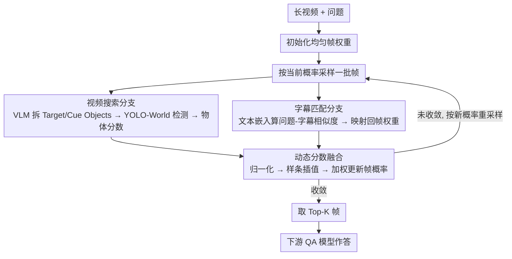

# VSI: Visual-Subtitle Integration for Keyframe Selection to Enhance Long Video Understanding

**会议**: CVPR 2026  
**arXiv**: [2508.06869](https://arxiv.org/abs/2508.06869)  
**代码**: [https://github.com/Jacksonha7/Visual-Subtitle-Integration.git](https://github.com/Jacksonha7/Visual-Subtitle-Integration.git)  
**领域**: 视频理解  
**关键词**: 长视频理解, 关键帧检索, 多模态融合, 视频问答, 字幕匹配

## 一句话总结
VSI 提出双分支协作检索框架（视频搜索 + 字幕匹配），通过融合视觉和文本信息实现精确的关键帧定位，在文本相关任务中将搜索准确率从29.48提升至45.00，是首个跨模态关键帧检索方法。

## 研究背景与动机
1. **领域现状**：多模态大语言模型在视觉-语言任务中表现优异，但处理长视频时受限于输入上下文长度和高计算成本，稀疏帧采样成为必要的预处理步骤。
2. **现有痛点**：（i）现有关键帧搜索算法仅能有效提升视觉强子任务的性能，对文本强子任务改进甚微；（ii）现有方法仅依赖视觉单模态检索，缺乏文本模态的针对性引导，导致关键帧过度聚焦于视觉密集区域而偏离核心语义。
3. **核心矛盾**：VideoQA任务本质上是多模态的（视觉+文本），但现有关键帧检索仅利用视觉模态，存在模态信息利用不充分的问题。
4. **本文目标**：设计多模态关键帧检索框架，使其在文本相关任务上也能有效工作，同时保持视觉任务的性能。
5. **切入角度**：将视频字幕作为互补的文本线索，通过双分支设计融合视觉和文本信息。
6. **核心idea**：视频搜索分支处理视觉特征+目标检测，字幕匹配分支处理语义相似度计算，两者通过动态融合策略更新帧级采样概率。

## 方法详解

### 整体框架
长视频动辄上千帧，多模态大模型只吃得下其中几帧，所以必须先把"最该看的几帧"挑出来。VSI 的做法是让两条互补的分支同时给每一帧打分，再迭代地把采样概率推向真正相关的区域。给定视频和问题后，框架先把每帧权重初始化为均匀分布，然后进入多轮迭代：视频搜索分支用目标检测从"画面里有没有该看的东西"角度打分，字幕匹配分支用语义相似度从"对话/旁白里有没有提到答案"角度打分，两路分数经样条插值平滑后融合，更新帧级相关概率。下一轮就按新概率重新采样、再打分，分布逐步收缩到语义密集的片段。迭代收敛后取概率最高的 K 帧交给下游 QA 模型。

### 关键设计

**1. 视频搜索分支：从"画面里有没有该看的物体"定位关键帧**

纯视觉特征相似度容易被画面里抢眼但无关的内容带偏，忽略了问题真正问的是什么。视频搜索分支改用目标检测来锚定语义意图：先让 VLM 读一遍问题，拆出两类目标——直接相关的 Target Objects（问题明确指向的物体）和提供间接上下文的 Cue Objects（不是答案本身、但常和答案共现的线索物）。再用轻量的 YOLO-World 检测器扫采样帧，把每帧检到的物体与目标集求交，取交集里置信度乘以权重的最大值作为该帧的物体分数：

$$S_{\text{obj}}(t) = \max_{o \in \mathcal{O}_t \cap \mathcal{T}}(s_o \cdot w_o)$$

其中 $\mathcal{O}_t$ 是第 $t$ 帧检到的物体集合，$\mathcal{T}$ 是目标集，$s_o$、$w_o$ 分别是检测置信度和该目标的重要性权重。Cue Objects 的引入是这条分支耐用的关键——当 Target Object 一时没出现在画面里，线索物仍能把概率引到正确的时间窗附近，避免漏检。

**2. 字幕匹配分支：把答案藏在对话里的那部分捞回来**

很多 VideoQA 的答案根本不在画面里，而藏在台词、旁白或讲解中，纯视觉搜索再准也够不着这类信息。字幕匹配分支专门补这一模态：用对比学习训练的文本嵌入模型，计算问题与每段视频字幕的语义相似度，再把高相似度字幕对应的时间段映射回帧权重。这样"提到答案的那几秒"即使画面平淡，也能拿到高分。它和视频搜索分支恰好互补——一个看画面、一个听内容，正是这条分支让框架在文本强相关任务上从 29.48 跳到 45.00。

**3. 动态分数融合：用样条插值把两路分数平滑地拧成一个概率分布**

两条分支各打各的分，若直接相加，时间轴上会出现孤立的尖峰和断崖，采样容易抖。动态融合先把两路帧级分数各自归一化，再沿时间维做样条插值，把离散的逐帧打分平滑成连续曲线，最后加权融合、更新帧采样概率分布。平滑的好处是：相关片段的邻帧也会被适度抬高，下一轮迭代采样能更稳地命中整个语义片段，而不是单帧。多轮迭代下来，概率质量逐步从均匀分布收拢到真正含答案的几个区域。

### 一个完整示例

以一段长视频问答"主持人介绍的那道菜用了什么酱料"为例。初始时全部帧权重均匀，框架先按均匀概率采样一批帧。视频搜索分支让 VLM 拆出 Target Objects = {酱料瓶、菜盘}，Cue Objects = {灶台、主持人}，YOLO-World 扫帧后发现含"菜盘+灶台"的几帧拿到较高 $S_{\text{obj}}$，概率开始向烹饪段集中；但"酱料"这个答案其实是主持人口播的，画面里酱料瓶一闪而过，单看视觉容易错过。与此同时字幕匹配分支算出问题与字幕"……我们这次特意选了泰式甜辣酱……"的相似度极高，把那几秒的帧权重显著抬高。两路分数经样条插值平滑融合后，含口播的时间窗概率被双重加强。第二轮按新分布重新采样、再打分，概率进一步收缩；收敛后取 Top-K 帧，恰好覆盖了主持人说出酱料名的那几帧，下游 QA 模型据此答对——这正是单一视觉分支会漏、双分支协同才能命中的典型案例。

### 损失函数 / 训练策略
即插即用的免训练方法，无需额外训练。视频搜索的检测器、字幕匹配的文本编码器都可按需替换。

## 实验关键数据

### 主实验

| 数据集/设置 | 指标 | VSI | Uniform Sampling | VSLS | 提升 |
|------------|------|-----|-----------------|------|------|
| LongVideoBench (8帧) | 搜索准确率 | 73.89% | baseline | 次优 | 显著 |
| LongVideoBench 文本任务 (8帧) | Acc | 45.00 | - | 29.48 | +15.52 |
| GPT-4o Long split | Score | 69.57 | 53.76 | - | +15.81 |

### 消融实验

| 配置 | 关键指标 | 说明 |
|------|---------|------|
| Full VSI | 最优 | 双分支完整模型 |
| 仅Video Search | 视觉任务好，文本任务差 | 缺少文本信息 |
| 仅Subtitle Match | 文本任务好，视觉任务差 | 缺少视觉信息 |
| w/o 动态融合 | 下降 | 简单拼接效果不如样条融合 |

### 关键发现
- 在文本相关任务上的提升最为显著（29.48→45.00），证明了字幕匹配分支的价值。
- VSI对不同下游模型（GPT-4o、LLaVA-Video-7B、Qwen2.5-VL-7B）都有一致提升。
- 即使在视觉为主的任务上，双分支融合也优于单独的视觉搜索。

## 亮点与洞察
- **首次将关键帧检索从单模态扩展到多模态**，开辟了新的研究方向。
- **即插即用设计**使得搜索模型和编码模型可灵活替换，通用性强。
- Cue Objects的概念巧妙——提供上下文线索而非直接答案，增加了检索的鲁棒性。

## 局限与展望
- 字幕匹配依赖字幕的可用性和质量，对无字幕视频不适用。
- 多轮迭代的计算开销随视频长度增加。
- 未来可探索更精细的视觉-文本交互机制。

## 相关工作与启发
- **vs TStar**: TStar仅使用视觉目标检测，本文增加了字幕匹配分支，在文本任务上显著更优。
- **vs VSLS**: VSLS建模帧间关系但仍是纯视觉方法，本文引入文本模态实现了跨模态优势。

## 评分
- 新颖性: ⭐⭐⭐⭐ 多模态关键帧检索是新方向，但技术手段相对直接
- 实验充分度: ⭐⭐⭐⭐ 多数据集多模型验证充分
- 写作质量: ⭐⭐⭐⭐ 问题定义清晰，实验分析到位
- 价值: ⭐⭐⭐⭐ 实用价值高，即插即用设计便于落地

<!-- RELATED:START -->

## 相关论文

- [\[CVPR 2026\] DIvide, then Ground: Adapting Frame Selection to Query Types for Long-Form Video Understanding](divide_then_ground_adapting_frame_selection_to_query_types_for_long-form_video_u.md)
- [\[CVPR 2026\] Wavelet-based Frame Selection by Detecting Semantic Boundary for Long Video Understanding](wavelet-based_frame_selection_by_detecting_semantic_boundary_for_long_video_unde.md)
- [\[CVPR 2026\] HERBench: A Benchmark for Multi-Evidence Integration in Video Question Answering](herbench_a_benchmark_for_multi-evidence_integration_in_video_question_answering.md)
- [\[CVPR 2026\] Question-guided Visual Compression with Memory Feedback for Long-Term Video Understanding](question-guided_visual_compression_with_memory_feedback_for_long-term_video_unde.md)
- [\[AAAI 2026\] APVR: Hour-Level Long Video Understanding with Adaptive Pivot Visual Information Retrieval](../../AAAI2026/video_understanding/apvr_hour-level_long_video_understanding_with_adaptive_pivot.md)

<!-- RELATED:END -->
