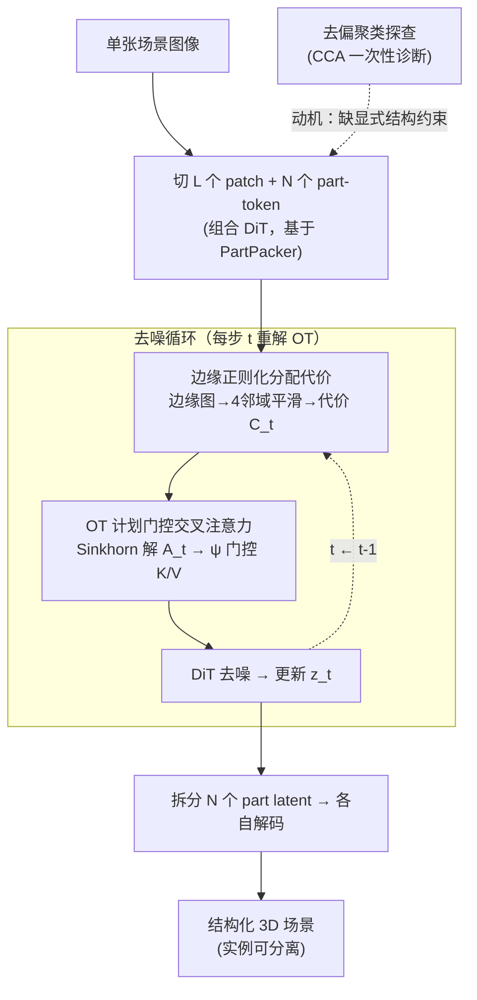

# SceneTransporter: Optimal Transport-Guided Compositional Latent Diffusion for Single-Image Structured 3D Scene Generation

**会议**: ICLR 2026  
**arXiv**: [2602.22785](https://arxiv.org/abs/2602.22785)  
**代码**: [项目页面](https://2019epwl.github.io/SceneTransporter/)  
**领域**: 3D视觉/结构化场景生成  
**关键词**: 结构化3D场景, 最优传输, 组合扩散, 实例分离, 交叉注意力门控

## 一句话总结

SceneTransporter 通过在组合 3D latent 扩散模型的去噪循环中引入熵最优传输（OT）框架，将 open-world 结构化 3D 场景生成重新建模为全局关联分配问题：OT 计划门控交叉注意力实现排他性的 patch-to-part 路由（防止特征纠缠），边缘正则化的分配代价鼓励在图像边缘处分离不同实例，在 74 张多样化 open-world 场景图像上实现了 SOTA 的实例级一致性和几何保真度。

## 研究背景与动机

**领域现状**：高质量 3D 场景生成是沉浸式技术和具身 AI 的基石。然而，绝大多数场景生成器输出的是不可分割的整体 mesh（monolithic mesh），无法直接用于下游任务——材质分配、物理仿真、资产检索、精细编辑等都需要场景具有显式的实例级 object-context 分离。

**现有痛点**：

1. **"分而治之"方案脆弱**：先分割输入图像→分别生成 3D→拼装场景。这种流水线强依赖 2D 分割质量，遮挡处理差，且 2D 分割的微小错误会演变为严重的 3D 几何瑕疵
2. **端到端组合生成在 open-world 失败**：PartPacker、PartCrafter 等方法在对象级部件生成上效果好，但推广到复杂 open-world 场景时暴露两大病理：
    - **结构性错分（Structural Mispartition）**：语义实例无法形成不相交的部分，一个物体的几何被分散到多个 part-token
    - **几何冗余（Geometric Redundancy）**：多个 latent 竞争描述同一空间区域，导致重叠
3. **根本原因**：无约束的软注意力机制无法建立全局一致的 patch-to-part 分配

**核心矛盾**：部件级生成器的特征中隐含着正确的实例分组信息（去偏聚类可以恢复），但模型本身缺乏将这些信息显式化的结构约束。

**本文方案**：引入最优传输框架提供显式的全局分配约束——OT 的一对一约束防止特征纠缠，覆盖预算约束防止 part-token 信息饥饿，边缘正则化防止跨边界泄漏。

## 方法详解

### 整体框架

SceneTransporter 把"结构化场景生成"重新理解为一个全局分配问题：让图像里的每块 patch 信息明确归属到某个 3D part，从而避免不同物体的特征互相纠缠。它建立在现有组合 3D 生成器（PartPacker 的 rectified-flow DiT）之上——把条件图切成 $L$ 个 patch、维护 $N$ 个 part-level token。在每个去噪步骤 $t$，先用图像边缘把 part-patch 亲和度正则化成一个代价矩阵 $\mathbf{C}_t$，再据此求解一个熵最优传输（OT）问题得到传输计划 $\mathbf{A}_t$，用这个计划去门控交叉注意力、把每个 part 的视野限制到专属于它的那部分图像证据，从而驱动这一步去噪；如此循环到 $t=0$ 后再把各 part latent 拆开分别解码成 3D。整套机制无需训练，是套在预训练生成器上的推理时即插即用模块。至于"为什么非加这层 OT 约束不可"，则来自一个**一次性的去偏聚类诊断**（设计 1）——它不参与每步推理，只用来证明病根、给出设计动机。

### 关键设计

**1. 去偏聚类探查：先证明问题出在哪里，再动手设计**

PartPacker 这类部件级生成器在 open-world 场景上有两种典型病理——结构性错分（一个物体的几何被摊到多个 part-token）和几何冗余（多个 latent 抢同一块空间），但有趣的是把所有 part 并起来又能大致还原整个场景。作者由此设计了一个诊断实验定位病根：直接对原始 part-token 做聚类无法得到稳定的实例分组，但若先用典型相关分析（CCA）找出各 part-level latent 集合间的共享成分，把 token 投影到该共享子空间的正交补空间以隔离出 object-specific 变异，再对残差 token 聚类，分组就能可靠成功。这个鲜明对比说明：正确的实例分组信息其实**隐含**在特征里，模型只是**没有把这些关联显式建立**起来——所以缺的不是表征能力，而是一个外部的结构约束。下面两个运行时模块就是来补这个约束的，所以它们没出现在上图的去噪循环里、只用虚线连到框架表示"提供动机"。

**2. 边缘正则化分配代价：靠图像边缘在物体接触处划清界线**

要给 OT 一个能区分不同实例的代价矩阵 $\mathbf{C}_t$，难点在于：杂乱场景里接触边界附近的 patch 往往同时和多个 part 兼容，信息会跨物体泄漏。作者把图像边缘先验注入代价来堵这个口子：先提取边缘图 $\mathbf{E}$ 并下采样到 patch 网格，再在 4-邻域图上算边缘感知耦合权重 $w_{j\ell} = \exp(-\gamma_{\text{edge}} \max\{\mathbf{E}_\downarrow(j), \mathbf{E}_\downarrow(\ell)\})$——同处低边缘区的相邻 patch 权重高、信息互相传播，跨越高边缘处则权重低、被阻断。用它对 part-patch 余弦相似度 $S_{i,j}$ 做一步边缘感知平滑得到 $\widehat{S}_{i,j}$，再做逐 patch 的对比归一化以加剧 part 间竞争，最终代价取 $\mathbf{C}_t(i,j) = \frac{1}{2}(1 - \widetilde{S}_{i,j})$。这样不需要任何实例掩码监督，仅凭图像本身的边缘就能让代价矩阵在物体相接处天然偏向分离，是后一步 OT 求解的输入。

**3. OT 计划门控交叉注意力：用一对一传输约束防止特征纠缠**

拿到代价矩阵 $\mathbf{C}_t$ 后，针对软注意力会让多个 part 抢同一块 patch 的问题，作者在每个去噪步 $t$ 求解 $N$ 个 3D part 与 $L$ 个图像 patch 之间的熵 OT，得到传输计划 $\mathbf{A}_t = \arg\min_{\mathbf{A} \ge 0} \langle \mathbf{C}_t, \mathbf{A} \rangle + \varepsilon_t \mathcal{H}(\mathbf{A})$，约束为 $\mathbf{A}\mathbf{1} = \boldsymbol{\mu},\; \mathbf{A}^\top\mathbf{1} = \boldsymbol{\nu}$。其中行边缘 $\boldsymbol{\mu}$ 是 part 容量预算，保证没有 part 被"饿死"；列边缘 $\boldsymbol{\nu} = \frac{1}{L}\mathbf{1}_L$ 让每个 patch 贡献等量信息；求解用 stabilized log-domain Sinkhorn 迭代。拿到计划后并不是直接替换注意力权重，而是先把 $\mathbf{A}_t$ 行归一化成每个 part 的 patch 权重 $\boldsymbol{\omega}_i$，再经一个有界、保恒等的门控函数 $\psi_{\lambda_t, \varepsilon_g}(w) = \varepsilon_g + (1-\varepsilon_g) w^{\lambda_t}$ 去调制交叉注意力的 Key 和 Value：$\lambda_t$ 控制门控强度（取 $0$ 时退化回标准注意力），$\varepsilon_g$ 设一个最低透过率避免把通道完全掐死。门控之后每个 part 看到的是专属于自己的那份图像记忆，路由因此具有排他性，结构性错分和几何冗余都被抑制；被压制的路由既贡献不了大 logit 也贡献不了大特征值，泄漏极低。

## 实验结果

### 主实验：74 张 Open-World 场景上的定量评估

| 方法 | 需要 Mask | ULIP↑ | ULIP-2↑ | Uni3D↑ | IoU_max↓ | IoU_mean↓ | 推理时间(s) |
|------|:---:|:---:|:---:|:---:|:---:|:---:|:---:|
| MIDI | ✓ | 0.1397 | 0.2763 | 0.2518 | 0.0458 | 0.1642 | 149.68 |
| PartCrafter | ✗ | 0.1177 | 0.3096 | 0.2635 | **0.0042** | **0.0539** | 157.97 |
| PartPacker | ✗ | 0.1417 | 0.3083 | 0.2887 | 0.0319 | 0.2142 | 47.41 |
| **Ours** | ✗ | **0.1466** | **0.3220** | **0.3021** | 0.0101 | 0.0926 | 54.99 |

SceneTransporter 在三个几何保真度指标上均取得最优（ULIP=0.1466, ULIP-2=0.3220, Uni3D=0.3021），部件解纠缠指标排名第二（PartCrafter 因丢弃背景/地面而IoU最低，但牺牲了场景完整性）。推理时间仅比 PartPacker 慢 7.6 秒（54.99 vs 47.41），远快于 MIDI（149.68s）和 PartCrafter（157.97s）。

### 用户研究：30 人主观评测

| 方法 | 几何质量↑ | 布局一致性↑ | 分割合理性↑ |
|------|:---:|:---:|:---:|
| MIDI | 2.61 | 1.82 | 2.29 |
| PartCrafter | 2.44 | 1.63 | 2.17 |
| PartPacker | 2.81 | 2.95 | 1.97 |
| **Ours** | **3.09** | **3.34** | **3.22** |

采用强制排名制（1-4 分，越高越好），SceneTransporter 在所有三个维度上获得最高偏好，特别是在分割合理性上（3.22 vs PartPacker 1.97）优势巨大。

### 消融实验

**OT 计划门控 vs 标准注意力**：标准交叉注意力产生噪声和混沌的注意力图，patch-to-part 映射混乱→几何损坏。OT 门控后 A_attn 和 B_attn 清晰分离（如地面 vs 建筑），Hard affinity 图显示不重叠的区域分配→干净的部件几何。

**OT 计划随去噪演化**：传输计划在约 $t \approx 540/600$ 步后快速稳定——粗粒度语义路由在早期确定并保持，后期仅做局部细节微调。这解释了为什么最终部件呈现出高度一致的实例级组织。

**边缘正则化的效果**：在物体接触区域（沙发与角落边桌、木桩与围栏），加入边缘正则化可清晰分离相邻但语义不同的物体，而无边缘正则化版本在这些区域出现混合部件和模糊边界。

## 论文评价

### 优点

1. **诊断驱动的方法论**：先用去偏聚类探查定量揭示问题根源，再针对性设计解决方案——方法论上非常扎实
2. **数学优雅**：将结构化 3D 生成重新建模为最优传输问题，约束的含义清晰（排他性、覆盖性、边缘感知），且全部操作可微、无需训练
3. **即插即用**：作为推理时机制应用于预训练生成器，仅增加约 7.6 秒推理时间，实用性强
4. **评估全面**：定量指标 + 30 人用户研究 + 丰富的消融分析 + 去噪过程可视化

### 不足

1. 仅在 74 张图像上测试，样本规模偏小，统计可靠性受限
2. PartCrafter 在 IoU 指标上更优是因丢弃背景，对比不完全公平，缺少在相同完整性要求下的控制对比
3. 边缘检测依赖 Canny/Sobel 等低级特征，在纹理丰富的复杂场景中可能产生过多虚假边缘，影响 OT 分配质量

### 评分

⭐⭐⭐⭐⭐ — 理论深度与实践效果俱佳的工作。从诊断到方案的完整链路、最优传输与扩散模型的精巧结合、以及训练-free 的即插即用设计，使其成为结构化 3D 生成领域的标杆性方法。

<!-- RELATED:START -->

## 相关论文

- [\[ICLR 2026\] One2Scene: Geometric Consistent Explorable 3D Scene Generation from a Single Image](one2scene_geometric_consistent_explorable_3d_scene_generation_from_a_single_imag.md)
- [\[CVPR 2026\] Pano3DComposer: Feed-Forward Compositional 3D Scene Generation from Single Panoramic Image](../../CVPR2026/3d_vision/pano3dcomposer_feed-forward_compositional_3d_scene_generation_from_single_panora.md)
- [\[ICML 2026\] AvAtar: Learning to Align via Active Optimal Transport](../../ICML2026/3d_vision/avatar_learning_to_align_via_active_optimal_transport.md)
- [\[ICML 2026\] Streaming Sliced Optimal Transport](../../ICML2026/3d_vision/streaming_sliced_optimal_transport.md)
- [\[ICCV 2025\] Sat2City: 3D City Generation from A Single Satellite Image with Cascaded Latent Diffusion](../../ICCV2025/3d_vision/sat2city_3d_city_generation_from_a_single_satellite_image_with_cascaded_latent_d.md)

<!-- RELATED:END -->
