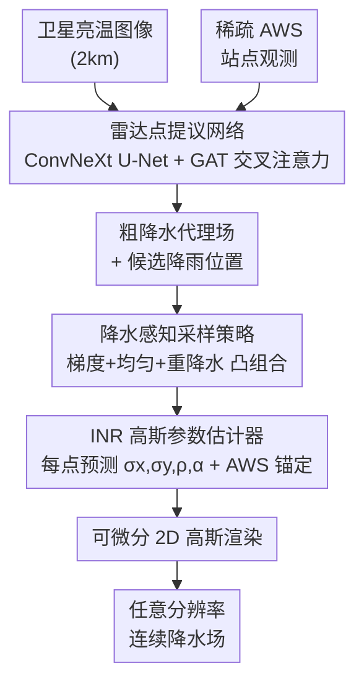

# Station2Radar: Query-Conditioned Gaussian Splatting for Precipitation Field

**会议**: ICLR 2026  
**arXiv**: [2603.00418](https://arxiv.org/abs/2603.00418)  
**代码**: 无  
**领域**: 3D视觉 / 气象遥感  
**关键词**: 高斯溅射, 降水场重建, 隐式神经表示, 卫星-站点融合, 分辨率无关渲染

## 一句话总结
提出 Query-Conditioned Gaussian Splatting (QCGS)，首次将 2D 高斯溅射引入降水场生成任务，融合卫星图像与自动气象站稀疏观测，实现无雷达条件下分辨率灵活的降水场重建，RMSE 较传统网格化产品提升超 50%。

## 研究背景与动机

**领域现状**：降水预报依赖异构数据源——天气雷达精度高但地理覆盖有限、维护成本高；气象站提供准确的点测量但极为稀疏；卫星提供高分辨率广域覆盖但无法直接反演降雨量。目前大多数深度学习降水预报方法（如 ConvLSTM、扩散模型）均以雷达作为主要输入。

**现有痛点**：雷达网络在全球大部分地区（尤其是发展中国家）不可用，导致以雷达为中心的方法适用范围有限。传统无雷达方案主要采用经典插值方法（Barnes、Kriging），通过固定高斯权重将站点观测扩展到网格上，但这些方法严重模糊降水边界、对站点密度高度敏感。卫星直接估计方法（如 Sat2Radar）存在系统偏差，且输出固定分辨率。

**核心矛盾**：降水场的精确重建需要同时具备：(1) 地面真值的锚定精度（仅站点具备），(2) 空间连续覆盖（仅卫星具备），(3) 分辨率灵活性（现有方法均不具备）。这三者在已有框架中无法统一。

**本文目标** 如何在不依赖雷达的条件下，融合卫星图像和稀疏气象站观测，生成高分辨率、结构清晰的连续降水场？

**切入角度**：作者观察到经典高斯权重插值在数学形式上等价于 Gaussian Splatting 的特例——传统插值使用固定各向同性核，而 GS 允许可学习的各向异性核、自适应振幅和分辨率无关渲染。这一观察将气象学的经典方法与计算机视觉的新技术桥接起来。

**核心 idea**：将 2D 高斯溅射与隐式神经表示结合，以卫星特征为条件预测自适应高斯参数，仅在降水支撑区域选择性渲染，实现高效、分辨率灵活的降水场生成。

## 方法详解

### 整体框架
QCGS 是一个三阶段 pipeline：输入为卫星亮温图像（2km 分辨率）和稀疏 AWS 站点观测，输出为任意分辨率的连续降水场。(1) 雷达点提议网络融合卫星和 AWS 信息，生成粗降水代理场并识别降雨支撑位置；(2) 降水感知采样策略从代理场中选取查询点；(3) 基于 INR 的高斯参数估计器为每个查询点预测高斯溅射参数，最终通过可微分 2D 高斯渲染生成降水场。训练分两阶段——先训练点提议网络，再在固定提议上训练高斯渲染模块。

### 关键设计

**1. 雷达点提议网络：用一张粗降水代理场圈出"哪里在下雨"**

整条 pipeline 的第一步要解决的问题是：卫星看得广但只间接关联降雨，AWS 站点精确却稀疏，怎么把两者拼成一张能指出降雨位置的粗图。作者让卫星亮温图像走 ConvNeXt U-Net 编解码器提取空间密集特征，同时用一个图注意力网络（GAT，3 层 8 头）从不规则、带缺失值和异常值的 AWS 观测里提炼鲁棒表示 $z^t$，再把这份站点表示通过交叉注意力注入 U-Net 解码器。网络输出一张粗降水场 $\hat{R}^t$ 和一批候选降雨位置，供后续采样使用。GAT 的好处是天然能处理站点的不规则分布和噪声，交叉注意力则完成跨模态对齐——卫星管"哪里有空间结构"，站点管"哪里真有雨、雨多大"。消融实验里加入 AWS 融合后 CSI 从 0.62 提升到 0.73，说明这一步是整套方法贡献最大的来源。

**2. 降水感知采样策略：把高斯核只撒在该撒的地方**

标准 GS 会渲染整个图像平面，但降水场里绝大部分区域根本没雨，对它们逐点放高斯核是浪费。QCGS 改成只在粗代理场标出的降雨区域采查询点，并把采样概率写成三项的凸组合：梯度项 $G$ 拉高降水边界附近的采样密度让边界更锐利，均匀项 $U$ 保证整体覆盖不漏，重降水项 $H$ 用带温度的 softmax 优先采强降水区。三项混合权重取 0.3/0.4/0.3，再叠一层非极大值抑制去掉冗余采样点。这一设计的出发点是轻雨很少成灾、强降水才是高影响事件，所以把计算预算倾斜到强降水和边界上更划算。消融里三项组合的 CSI（0.76）高于仅均匀采样（0.68）以及任意单项/两项组合，印证了这个偏置确实有效。

**3. INR-based 高斯参数估计器：每个查询点配一颗可学习、可锚定的各向异性高斯**

传统 GS 是逐图像优化参数，换个场景就得重训、无法泛化；这一模块改用条件化的隐式神经表示来摆脱这一限制。它以卫星的中间特征为条件，通过交叉注意力为每个查询点预测一组高斯参数 $\{\sigma_x, \sigma_y, \rho, \alpha\}$——前三个定义各向异性协方差矩阵（相比经典插值的固定各向同性核能贴合降水的方向性结构），$\alpha$ 控制振幅。INR 网络是一个 5 层 MLP（隐层 128，正弦位置编码），因为参数预测建立在卫星条件特征上，模型能跨区域、跨季节泛化。关键的一笔是地面真值锚定：在有非零降水的 AWS 站点，直接把该点的 $\alpha$ 设为站点观测值，相当于在已知点打入一个硬约束，从而避免纯卫星驱动方法（如 Sat2Radar）常见的系统偏差。预测出的高斯核最终经可微分 2D 渲染合成出任意分辨率的连续降水场。

### 损失函数 / 训练策略
总损失为重建误差加正则化：$\mathcal{L} = \text{MSE}(\tilde{R}^t, R^t) + \lambda_\sigma \sum_n (\sigma_x^{(n)} + \sigma_y^{(n)}) + \lambda_\alpha \sum_n \alpha^{(n)}$。协方差和振幅的正则项（$\lambda_\sigma = 10^{-3}$, $\lambda_\alpha = 10^{-4}$）防止高斯核过度扩展导致过度平滑。训练使用 Adam 优化器（lr $10^{-4}$, cosine schedule），batch size 16，100 epochs，8×H200 GPU。

## 实验关键数据

### 主实验

| 方法 | 类型 | 分辨率 | RMSE↓ | CSI↑ | FSS↑ | CC↑ |
|------|------|--------|-------|------|------|-----|
| Pix2PixHD | 深度学习 | 0.5km | 2.45 | 0.59 | 0.71 | 0.55 |
| NPM | 深度学习 | 0.5km | 1.95 | 0.59 | 0.78 | 0.68 |
| BBDM | 深度学习 | 0.5km | 1.68 | 0.64 | 0.84 | 0.75 |
| Kriging | 经典插值 | 2.0km | 2.43 | 0.50 | 0.69 | 0.45 |
| **QCGS** | **本文** | **0.5km** | **1.23** | **0.74** | **0.91** | **0.90** |
| **QCGS** | **本文** | **2.0km** | **1.00** | **0.76** | **0.96** | **0.93** |

在与全球业务产品的对比中，QCGS 在日累积降水上也大幅领先：RMSE 6.68 vs IMERG 14.08 / MSWEP 12.44，CC 0.95 vs 最高 0.78。

### 消融实验

| 配置 | CSI↑ | 说明 |
|------|------|------|
| U-Net (ConvNeXt) only | 0.62 | 纯卫星基线 |
| + AWS fusion | 0.73 | 站点融合贡献 +0.11 |
| + AWS fusion + GS (完整) | 0.76 | GS 渲染再提升 +0.03 |
| 仅均匀采样 | 0.68 | 缺少边界和强降水关注 |
| 三项混合采样 | 0.76 | 最优组合 |
| K=1000 点 | 0.69 | 点数不足 |
| K=6000 点 | 0.76 | 最佳性价比 |
| K=9000 点 | 0.77 | 边际收益递减 |

### 关键发现
- AWS 融合是最大贡献因子（CSI +0.11），证明稀疏但精确的地面观测对降水场重建至关重要
- 高斯溅射提供的分辨率灵活性使 2km 训练的模型在 0.5km 评估时仍优于在 0.5km 训练的深度学习基线
- 功率谱密度分析显示 QCGS 在各空间尺度上最接近雷达谱，而业务产品在高波数处丢失方差

## 亮点与洞察
- 经典气象插值与 Gaussian Splatting 的等价性观察非常巧妙——传统高斯权重插值是 GS 的固定各向同性特例，这一联系使 3DGS 社区的技术自然迁移到气象领域
- 选择性渲染设计优雅：只在降水区域放置高斯核，避免对占比极大的非降水区域做无用计算，实现了效率和精度的双赢
- AWS 锚定策略简单有效——在站点处直接设置振幅为观测值，相当于硬约束，确保生成场在已知点完全准确

## 局限与展望
- 依赖 AWS 站点数据——在站网稀疏的地区（如非洲、海洋）适用性受限，未来可探索纯卫星模式的退化方案
- 实验仅限韩国区域（480×480 网格），全球尺度扩展是开放挑战
- 点提议网络和高斯渲染模块分两阶段训练，端到端联合训练可能带来进一步提升
- 仅处理降水场"生成"，未涉及时序预报；结合时序外推可构建完整的无雷达降水预报系统

## 相关工作与启发
- **vs Sat2Radar (NPM)**：NPM 纯卫星驱动，固定分辨率输出；QCGS 多源融合 + 分辨率灵活，RMSE 降低 37%
- **vs 经典插值 (Kriging)**：Kriging 使用固定核、各向同性，QCGS 学习自适应各向异性核，CSI 从 0.50 提升到 0.76
- **vs 2D GS 图像方法 (GaussianImage)**：图像 GS 逐图优化无法泛化，QCGS 通过条件化 INR 实现跨场景泛化
- 这种将新兴 CV 技术（GS/INR）迁移到科学领域的范式值得关注，类似方法可应用于温度场、风场等其他地球物理变量

## 评分
- 新颖性: ⭐⭐⭐⭐ 首次将 2D GS 引入降水场生成，经典插值-GS 等价性的观察有创意
- 实验充分度: ⭐⭐⭐⭐ 跨尺度对比全面（快照/小时/日），消融扎实，含功率谱分析
- 写作质量: ⭐⭐⭐⭐ 动机推导清晰，数学符号统一，图表质量高
- 价值: ⭐⭐⭐⭐ 打开了无雷达降水监测的新范式，但区域限制降低了直接影响力

<!-- RELATED:START -->

## 相关论文

- [\[ICLR 2026\] Augmented Radiance Field: A General Framework for Enhanced Gaussian Splatting](augmented_radiance_field_a_general_framework_for_enhanced_gaussian_splatting.md)
- [\[CVPR 2025\] Geometry Field Splatting with Gaussian Surfels](../../CVPR2025/3d_vision/geometry_field_splatting_with_gaussian_surfels.md)
- [\[ICLR 2026\] LiTo: Surface Light Field Tokenization](lito_surface_light_field_tokenization.md)
- [\[ICLR 2026\] Stylos: Multi-View 3D Stylization with Single-Forward Gaussian Splatting](stylos_multi-view_3d_stylization_with_single-forward_gaussian_splatting.md)
- [\[CVPR 2026\] Text–Image Conditioned 3D Generation](../../CVPR2026/3d_vision/text-image_conditioned_3d_generation.md)

<!-- RELATED:END -->
