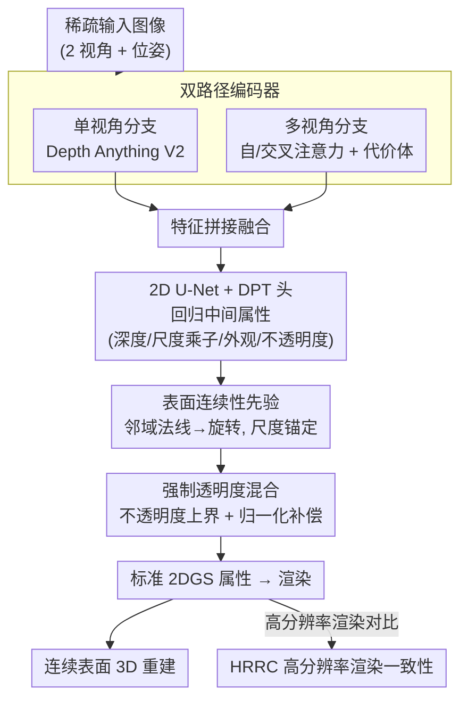

# SurfSplat: Conquering Feedforward 2D Gaussian Splatting with Surface Continuity Priors

**会议**: ICLR 2026  
**arXiv**: [2602.02000](https://arxiv.org/abs/2602.02000)  
**代码**: [https://hebing-sjtu.github.io/SurfSplat-website/](https://hebing-sjtu.github.io/SurfSplat-website/)  
**领域**: 3D视觉  
**关键词**: 2D高斯溅射, 前馈3D重建, 表面连续性, 高分辨率渲染一致性, 稀疏视角

## 一句话总结

SurfSplat 提出基于2DGS的前馈3D重建框架，通过表面连续性先验将高斯的旋转和尺度与邻域位置绑定、以及强制透明度混合策略解决颜色偏差，并引入HRRC指标揭示高分辨率下的重建质量差异。

## 研究背景与动机

现有前馈3DGS方法在标准分辨率下的NVS指标看似出色，但存在一个被忽视的严重问题：

**退化的3D场景**：重建结果实际是离散的、颜色偏差的点云而非连续表面，近距离或偏轴视角下暴露严重伪影（空洞、颜色偏差、表面断裂）

**各向异性利用不足**：可学习的高斯体难以仅通过梯度监督解耦几何和纹理，导致高斯退化为近球形

**评估指标失效**：标准PSNR/SSIM/LPIPS在原始分辨率下无法捕获几何不准确性，掩盖了真实的重建质量

作者观察到：**直接训练2DGS比3DGS更具挑战**——2D高斯的面片特性使得微小几何扰动造成渲染输出的大幅偏差，在有限监督下问题加剧。

## 方法详解

### 整体框架

SurfSplat 要解决的是前馈 2DGS 在稀疏视角下表面退化、颜色偏差的问题。重建主干是一条前馈流水线：稀疏图像先经双路径编码器（单视角分支走 Depth Anything V2 提供单目先验、多视角分支走自/交叉注意力并构建代价体）分别提取特征再拼接融合，接着送进 2D U-Net 加 DPT 头回归出深度、尺度乘子、外观分量、不透明度等中间属性；不同于把高斯参数各自独立回归，它最终在「高斯处理器」里用**表面连续性先验**和**强制透明度混合**把这些中间量转换成几何一致的标准 2DGS 属性，再渲染出连续表面。除重建主干外，作者还针对"标准 PSNR 看不出几何缺陷"的评估盲区，提出 **HRRC 高分辨率渲染一致性**指标，在重建结果上单独做高分辨率渲染对比。

### 关键设计

**1. 表面连续性先验：让高斯的姿态从邻域几何推导，而非独立回归**

直接监督下的高斯容易退化成近球形、彼此断裂的点云，根源在于旋转和尺度若各自独立预测，缺乏空间约束。SurfSplat 的出发点是一个朴素假设——真实场景中的可见几何主要由平滑连续的表面构成，图像中相邻的像素往往对应空间相邻的表面元，于是高斯的姿态应当由它在 3D 中的位置和邻域共同决定。具体而言，对像素 $(h,w)$ 的 3D 位置 $\mathbf{p}_0$ 及其邻域，用 Sobel 滤波器算出两个切向量 $\mathbf{t}_1, \mathbf{t}_2$，叉积得到局部法线 $\mathbf{n}$，再用 Rodrigues 公式把默认朝向旋到该法线方向：$\mathbf{R} = \mathbf{I} + [\mathbf{v}]_\times + \frac{1-c}{\|\mathbf{v}\|^2}[\mathbf{v}]_\times^2$，其中 $\mathbf{v} = \mathbf{n}_0 \times \mathbf{n}$、$c = \mathbf{n}_0^\top \mathbf{n}$。尺度同样锚定在几何上：先按图像空间的邻域距离粗估 $\bar{\sigma}_u, \bar{\sigma}_v$，网络只在 $[1/3, 3]$ 范围内预测尺度乘子 $\hat{\sigma}_u, \hat{\sigma}_v$ 做局部微调，最终 $\sigma_u = \bar{\sigma}_u \hat{\sigma}_u$，而 2DGS 沿深度轴的尺度 $\sigma_w$ 直接固定为零。这样一来，旋转和尺度都从预测的 3D 位置推导出来，相邻高斯天然对齐成连续表面，几何与纹理也得以解耦。

**2. 强制透明度混合：避免模型靠少数高不透明度高斯偷懒**

表面连续性先验会带来一个副作用——模型倾向于学出高不透明度的高斯，使得被遮挡的高斯在 alpha 混合里贡献微乎其微，梯度传不进去，也就学不到深层 3D 结构。为此 SurfSplat 用一个上界 $\tau_{\text{opa}} < 1$（取 0.6）裁剪不透明度，强制所有高斯都参与渲染；同时把 RGB 颜色初始化到球谐基的 DC 分量，并在渲染输出上做透明度归一化补偿，即当 $\alpha \geq \tau_\alpha$ 时取 $C = C/\alpha$，以抵消上界裁剪带来的整体偏暗。三者配合，既保住了多层表面的表现力，又消除了颜色偏差。

**3. HRRC 高分辨率渲染一致性指标：让标准 PSNR 掩盖的几何缺陷显形**

标准 PSNR/SSIM/LPIPS 在原始分辨率下对几何不准并不敏感，退化的点云照样能刷出漂亮的数字。SurfSplat 提出在 $2\times$ 和 $4\times$ 分辨率下渲染重建场景，再与双三次上采样的 GT 对比：$\text{HRRC}_{\text{metric}} = \text{metric}(\hat{I}^{HR}, \hat{I}^{GT\uparrow})$。一旦放大，稀疏性留下的空洞、退化的高斯形状、表面的不连续都会被放大暴露，从而把真正恢复了 3D 几何的模型与仅仅记住了稀疏训练视角的模型区分开来。

### 损失函数 / 训练策略

训练目标是各监督视角上 MSE 与 LPIPS 的加权和：

$$L_{\text{gs}} = \sum_{m=1}^M \left(\text{MSE}(I_{\text{render}}^m, I_{\text{gt}}^m) + \lambda \cdot \text{LPIPS}(I_{\text{render}}^m, I_{\text{gt}}^m)\right)$$

其中 $\lambda = 0.05$，在 256×256 分辨率下训练；Depth Anything V2 骨干用较小学习率 $2 \times 10^{-6}$ 微调，其余层用 $2 \times 10^{-4}$。

## 实验关键数据

### 主实验

| 方法 | RE10K 256 PSNR↑ | RE10K 512 PSNR↑ | RE10K 1024 PSNR↑ | RE10K Avg PSNR↑ |
|------|------|------|------|------|
| DepthSplat | **27.504** | 20.031 | 16.385 | 21.307 |
| MVSplat | 26.359 | 20.408 | 17.966 | 21.578 |
| Ours-L | 27.537 | **26.331** | **24.897** | **26.255** |

### 消融实验

| 配置 | 标准PSNR | HRRC 2× PSNR | HRRC 4× PSNR | 说明 |
|------|---------|---------|---------|------|
| 3DGS基线 (DepthSplat) | 27.504 | 20.031 | 16.385 | HRRC严重退化 |
| 2DGS (SurfSplat-L) | 27.537 | 26.331 | 24.897 | HRRC保持稳定 |
| w/o 表面先验 | 降低 | 大幅降低 | 大幅降低 | 表面不连续 |
| w/o 强制混合 | 降低 | 降低 | 降低 | 颜色偏差 |

### 关键发现

- **HRRC揭示真相**：DepthSplat在标准分辨率(27.5)表现最佳，但1024分辨率猛降到16.4；SurfSplat从27.5仅降到24.9，证明真正重建了3D结构
- MVSplat、TranSplat在HRRC下同样大幅退化（1024下仅18左右），说明3DGS前馈方法普遍存在表面退化问题
- 跨数据集（DL3DV、ScanNet）评估验证了泛化能力
- pixelSplat（多高斯/像素）在HRRC上反而较好（24.9），因为冗余高斯部分弥补了表面空洞

## 亮点与洞察

1. **问题揭示价值高**：指出了前馈3DGS领域被广泛忽视的表面退化问题，HRRC指标具有推广意义
2. **几何驱动属性预测**：用Sobel滤波+Rodrigues公式从位置推导旋转这一设计简洁优雅，物理直觉清晰
3. **2DGS在前馈场景的首次成功**：证明2DGS（面片）比3DGS（椭球）在前馈重建中更适合，提供更强的各向异性和几何精度
4. **强制混合的巧妙设计**：通过限制不透明度上界解决局部最优问题，保证多层表现力

## 局限与展望

- 在标准分辨率下仅勉强超过DepthSplat，优势主要体现在HRRC
- 每像素单高斯的设定，对复杂场景的覆盖可能不够
- HRRC指标依赖双三次上采样GT，并非真正的高分辨率GT
- 仅评估静态场景，动态场景扩展是未来方向

## 相关工作与启发

- Huang et al. (2024) 提出2DGS用于逐场景优化，SurfSplat首次将其引入前馈框架
- DepthSplat (Xu et al., 2024b) 的深度交互设计被部分继承，但SurfSplat用表面先验替代了独立属性回归
- HRRC指标的设计思路可推广到其他3D生成任务的评估

## 评分

- 新颖性: ⭐⭐⭐⭐ 表面连续性先验和HRRC指标有新意，但组件设计属于成熟技术的组合应用
- 实验充分度: ⭐⭐⭐⭐⭐ 三个数据集、HRRC多分辨率、多骨干变体、跨数据集评估，非常全面
- 写作质量: ⭐⭐⭐⭐ 问题定义清晰，可视化对比有说服力，数学推导完整
- 价值: ⭐⭐⭐⭐ HRRC指标和表面退化问题的揭示对社区有重要参考价值

<!-- RELATED:START -->

## 相关论文

- [\[CVPR 2026\] 3D Gaussian Splatting with Self-Constrained Priors for High Fidelity Surface Reconstruction](../../CVPR2026/3d_vision/3d_gaussian_splatting_with_self-constrained_priors_for_high_fidelity_surface_rec.md)
- [\[AAAI 2026\] MeshSplat: Generalizable Sparse-View Surface Reconstruction via Gaussian Splatting](../../AAAI2026/3d_vision/meshsplat_generalizable_sparse-view_surface_reconstruction_via_gaussian_splattin.md)
- [\[AAAI 2026\] SparseSurf: Sparse-View 3D Gaussian Splatting for Surface Reconstruction](../../AAAI2026/3d_vision/sparsesurf_sparse-view_3d_gaussian_splatting_for_surface_reconstruction.md)
- [\[ICCV 2025\] SurfaceSplat: Connecting Surface Reconstruction and Gaussian Splatting](../../ICCV2025/3d_vision/surfacesplat_connecting_surface_reconstruction_and_gaussian_splatting.md)
- [\[ICLR 2026\] UFO-4D: Unposed Feedforward 4D Reconstruction from Two Images](ufo-4d_unposed_feedforward_4d_reconstruction_from_two_images.md)

<!-- RELATED:END -->
