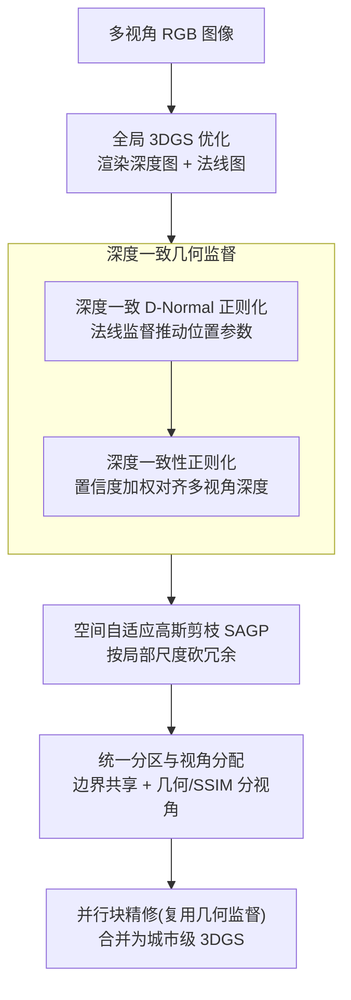

# UrbanGS: A Scalable and Efficient Architecture for Geometrically Accurate Large-Scene Reconstruction

- **会议**: ICLR 2026
- **arXiv**: [2602.02089](https://arxiv.org/abs/2602.02089)
- **代码**: 未公开
- **领域**: 3D 视觉 / 大规模场景重建
- **关键词**: 3D Gaussian Splatting, Large-Scale Reconstruction, Depth-Normal Regularization, Gaussian Pruning, Urban Scene

## 一句话总结

提出 UrbanGS，一个面向城市级场景的可扩展 3DGS 重建框架，通过深度一致的 D-Normal 正则化、空间自适应高斯剪枝和统一分区策略，同时提升几何精度、渲染质量和内存效率。

## 研究背景与动机

3DGS 在有限场景中表现优异，但扩展到大规模城市环境面临三大挑战：

**几何一致性差**：仅监督渲染法线只能更新旋转参数，无法更新位置参数，导致表面重建不精确

**内存效率低**：均匀区域（天空、远处建筑立面）生成大量冗余高斯基元

**计算可扩展性差**：分区方案引入边界不连续性，无关视角的处理浪费计算资源

## 方法详解

### 整体框架

UrbanGS 面向城市级 3DGS 重建，要同时解决几何不准、内存爆炸、难以扩展三件事。它的主线是一条「全局粗训练 → 剪枝 → 分区并行精修 → 合并」的流水线：先在多视角 RGB 上训练全局 3DGS，并用深度一致的几何监督——D-Normal 正则化让法线约束推动位置参数收敛，再叠加置信度加权的多视角深度对齐——把几何同时拉准、拉自洽；接着用空间自适应剪枝 SAGP 砍掉均匀区域的冗余高斯得到紧凑模型；最后用统一的分区与视角分配把整座城市切成边界连续、各自只训练相关视角的子块，并行精修后合并成完整场景。四个模块共享同一套渲染深度，使几何约束、压缩判据和分区边界都建立在一致的深度场之上。

### 关键设计

**1. 深度一致 D-Normal 正则化：让法线监督也能更新位置**

直接用伪法线 $N$ 监督渲染法线 $\hat{N}$ 的老办法，梯度只能流到旋转参数 $R$，位置参数 $u$ 拿不到有效更新，表面因此始终对不准。UrbanGS 改从渲染深度图反投影出的 3D 坐标 $d$ 出发，用其水平、垂直方向梯度的叉积现算出一张「深度法线」$\bar{N}_d(n,p) = \frac{\nabla_v d(n,p) \times \nabla_h d(n,p)}{|\nabla_v d \times \nabla_h d|}$，再以 $\mathcal{L}_{dn} = \|\bar{N}_d - N\|_1 + (1 - \bar{N}_d \cdot N)$ 把它拉向伪法线。由于 $\bar{N}_d$ 是深度的函数、而深度又由高斯位置决定，这条损失等于把法线约束传导回了位置参数，位置和旋转得以同时收敛，表面精度随之提升。

**2. 深度一致性正则化：用置信度加权对齐多视角深度**

几何要在多视角间自洽，还得让各视角预测的深度彼此对齐。UrbanGS 用逆深度损失 $\mathcal{L}_{id}(u,v) = |\hat{D}^{-1}(u,v) - D_{ext}^{-1}(u,v)|$ 把渲染深度对齐到外部估计器（DepthAnything-v2）的深度，但外部深度并非处处可信，于是再乘一个几何感知置信度 $w_d = \exp\left(\frac{\cos\phi - 1}{0.01}\right) \cdot \exp\left(-\frac{\epsilon_d}{0.1}\right)$ 加权——其中 $\cos\phi$ 衡量深度梯度的一致程度、$\epsilon_d$ 衡量归一化逆深度偏差，两项越糟权重衰减越狠，从而压住不靠谱深度对优化的干扰。所有项汇成总损失 $\mathcal{L}_{total} = \mathcal{L}_{RGB} + \lambda_1 \mathcal{L}_n + \lambda_2 \mathcal{L}_{dn} + \lambda_3 (w_d \cdot \mathcal{L}_{id})$，把颜色、法线、D-Normal 与置信度加权深度统一进同一目标。

**3. 空间自适应高斯剪枝 SAGP：按局部尺度砍冗余而非一刀切**

天空、远处立面这类均匀区域会堆出大量冗余高斯，但全局阈值剪枝又会误删精细结构。SAGP 先把场景切成体素，体素特征长度随全局高斯密度自适应 $\ell = \lambda \left(\frac{\mathcal{V}_{scene}}{\mathcal{N}}\right)^{1/3}$，让密集区切得细、稀疏区切得粗。对每个高斯，它综合三因素打分 $S_i = \phi_i \cdot \tau_i \cdot w_{v,i}$：$\phi_i$ 是归一化射线相交频率（看得见且常被观测），$\tau_i$ 是 Sigmoid 映射的不透明度，$w_{v,i}$ 则是用亚线性变换 $w_{v,i} = \left(\min\left(\frac{v_i}{\vartheta_{local}^{(t)}}, 1\right)\right)^{\kappa}$ 算出的体积权重，取 $\kappa=0.5$（平方根）抑制过大基元、同时放大精细结构的重要性。只有可见性、观测频率与几何尺度三者皆达标的高斯才会被保留，于是冗余被砍、细节被留。

**4. 统一分区与视角分配：先剪后切、边界共享**

直接分块会在子块边界引入几何不连续，无关视角又白白浪费算力。UrbanGS 在 CityGS 基础上改进：先用 SAGP 把全局粗糙 3DGS 剪一遍，减少冗余高斯吸引无关视角；再切子块时让相邻块共享边界处的高斯基元，避免几何断裂；最后按几何与 SSIM 为每个子块分配相机视角，使每块只训练真正相关的视角。剪枝、分区与视角分配因此咬合成一条可扩展的流水线。

## 实验

### 数据集

- **Mill19**：Building, Rubble（航拍场景）
- **UrbanScene3D**：Residence, Sci-Art（城市场景）

### 主要结果（渲染质量）

| 方法 | Building PSNR | Rubble PSNR | Residence PSNR | Sci-Art PSNR |
|------|--------------|-------------|----------------|-------------|
| 3DGS | 22.53 | 25.51 | 22.36 | 24.13 |
| CityGS-v2 | - | - | - | - |
| VCR-GauS | - | - | - | - |
| **UrbanGS** | **最优** | **最优** | **最优** | **最优** |

UrbanGS 在所有数据集上的 SSIM、PSNR、LPIPS 均达到 SOTA 或接近 SOTA。

### 几何精度

通过渲染深度图的定性对比：
- UrbanGS 的物体表面更平滑
- CityGS-v2 和 VCR-GauS 在远处建筑和复杂区域出现失真

### 内存效率

SAGP 剪枝实现显著模型压缩（具体压缩比见消融），同时保持渲染质量。VCR-GauS 在 A5000 GPU 上因 OOM 失败，UrbanGS 可正常运行。

### 消融实验

| 消融 | 效果 |
|------|------|
| w/o D-Normal 正则化 | 位置参数无法有效更新，表面粗糙 |
| w/o 深度一致性 | 多视角深度不对齐 |
| w/o 置信度加权 | 不靠谱深度预测干扰优化 |
| w/o SAGP | 高斯数量爆炸，内存不足 |
| 全局 vs 自适应剪枝 | 自适应保留更多细节 |

## 亮点

1. **D-Normal 正则化**巧妙解决了法线监督无法更新位置参数的问题
2. **深度+法线双重监督**的理论动机充分，有数学证明
3. **SAGP** 是首个专为城市级 3DGS 设计的剪枝框架
4. **系统性方案**：几何精度 + 内存效率 + 可扩展性三者兼顾
5. 在 A5000 等消费级 GPU 上实现大规模场景重建

## 局限性

1. 依赖外部深度估计器（DepthAnything-v2）和法线估计器的质量
2. SAGP 的超参数（$\lambda, t, \kappa$）需调整
3. 分区策略主要继承 CityGS，创新有限
4. 仅在航拍/城市场景评估，室内大场景未验证
5. 逆深度损失对近处物体可能过度平滑

## 相关工作

- **大规模 3DGS**：VastGaussian (Lin et al., 2024) 分块但有边界不一致；CityGaussian (Liu et al., 2024a) 需耗时后处理；CityGS-v2 (Liu et al., 2024b) 用 2DGS 但降低渲染质量
- **几何优化**：2DGS (Huang et al., 2024a), VCR-GauS (Chen et al., 2024b) 引入深度/法线正则化但未充分更新位置
- **高斯剪枝**：Fan et al. (2023) 基于全局指标的简单剪枝在大场景中过度简化

## 评分

- **创新性**: ⭐⭐⭐⭐ — D-Normal 正则化和 SAGP 均为有针对性的贡献
- **实用性**: ⭐⭐⭐⭐⭐ — 直接解决城市级重建的实际痛点
- **清晰度**: ⭐⭐⭐⭐ — 方法描述系统，理论分析充分
- **意义**: ⭐⭐⭐⭐ — 为大规模 3DGS 提供了完整解决方案

<!-- RELATED:START -->

## 相关论文

- [\[ICCV 2025\] S3R-GS: Streamlining the Pipeline for Large-Scale Street Scene Reconstruction](../../ICCV2025/3d_vision/s3r-gs_streamlining_the_pipeline_for_large-scale_street_scene_reconstruction.md)
- [\[ICLR 2026\] UFO-4D: Unposed Feedforward 4D Reconstruction from Two Images](ufo-4d_unposed_feedforward_4d_reconstruction_from_two_images.md)
- [\[CVPR 2026\] TeHOR: Text-Guided 3D Human and Object Reconstruction with Textures](../../CVPR2026/3d_vision/tehor_text-guided_3d_human_and_object_reconstruction_with_textures.md)
- [\[ICLR 2026\] Reducing Class-Wise Performance Disparity via Margin Regularization](reducing_class-wise_performance_disparity_via_margin_regularization.md)
- [\[ICLR 2026\] Topology-Preserved Auto-regressive Mesh Generation in the Manner of Weaving Silk](topology-preserved_auto-regressive_mesh_generation_in_the_manner_of_weaving_silk.md)

<!-- RELATED:END -->
