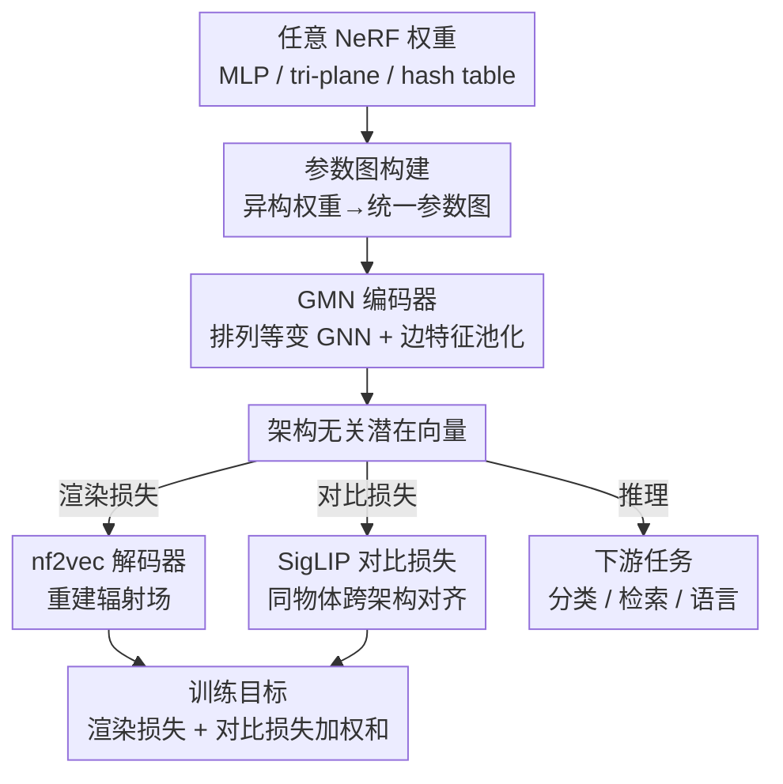

# Weight Space Representation Learning on Diverse NeRF Architectures

**会议**: ICLR 2026  
**arXiv**: [2502.09623](https://arxiv.org/abs/2502.09623)  
**代码**: 有（论文提供链接）  
**领域**: 3D 视觉 / NeRF  
**关键词**: NeRF, weight space, graph meta-network, contrastive learning, architecture-agnostic

## 一句话总结
提出首个能处理多种 NeRF 架构（MLP/tri-plane/hash table）权重的表示学习框架，通过 Graph Meta-Network 编码器 + SigLIP 对比损失构建架构无关的潜在空间，在 13 种 NeRF 架构上实现分类、检索和语言任务，并能泛化到训练时未见的架构。

## 研究背景与动机

**领域现状**：NeRF 将 3D 信息编码到网络权重中，nf2vec 和 Cardace 等方法通过处理 NeRF 权重进行下游任务（分类、检索），但限定于单一 NeRF 架构（仅 MLP 或仅 tri-plane）。

**现有痛点**：NeRF 架构多样化快速发展（MLP→tri-plane→hash table），每种新架构都需要重新设计处理框架，限制了实用性。

**核心矛盾**：不同 NeRF 架构的权重结构差异巨大（MLP 权重矩阵 vs 平面特征 vs hash table），如何构建统一的表示空间？

**本文目标** 设计架构无关的 NeRF 权重处理框架，使同一物体的不同 NeRF 表示被映射到相近的潜在向量。

**切入角度**：利用 Graph Meta-Network 将任意 NeRF 转为参数图（parameter graph），然后用 GNN 处理。

**核心 idea**：用 SigLIP 对比损失对齐同一物体不同架构 NeRF 的 embedding，使 GMN 编码器产生架构无关的潜在空间。

## 方法详解

### 整体框架

本文要解决的问题是：同一个 3D 物体可以被存成 MLP、tri-plane、hash table 等多种 NeRF，它们的权重结构天差地别，过去的权重处理方法（nf2vec、Cardace）只能吃一种架构。作者的思路是把"读权重"这件事统一成"读图"——不管哪种 NeRF，先转成一张参数图（parameter graph），再用一个对图天然等变的网络去编码。整体流程是：任意 NeRF 权重 → 参数图 → Graph Meta-Network（GMN）编码器 → 架构无关的潜在向量；这个向量一边送进 nf2vec 解码器重建辐射场（保证它真的装下了物体内容），一边参与对比对齐（保证不同架构的同一物体落在一起）。训练阶段同时优化渲染损失 $\mathcal{L}_R$ 和 SigLIP 对比损失 $\mathcal{L}_C$，推理时直接拿编码器输出的向量做分类、检索和语言任务。

### 关键设计

**1. 参数图构建：把异构 NeRF 权重翻译成统一的图语言**

不同架构的权重根本无法直接对齐——MLP 是一摞权重矩阵，tri-plane 是若干平面特征，hash table 则是一张查找表，要让同一个编码器同时处理它们，必须先找到一种共同的中间表示。作者选择参数图：MLP 沿用标准参数图，把神经元当节点、权重当边特征；tri-plane 沿用 Lim 等人的空间参数网格表示。真正的新贡献在 hash table——它最流行也最难表示，因为直接建模底层体素网格会带来立方级（$O(n^3)$）的复杂度。作者的做法是为每个 table entry 和每个特征维度各建一个节点，把 entry-feature 对应的存储值作为连接它们的边特征，从而完全绕开显式的体素网格，让图的规模只随 table 大小线性增长，保住了 hash table 本身的内存效率优势。

**2. GMN 编码器：用排列等变的 GNN 吃下任意图结构**

有了统一的图表示，还需要一个不挑图结构的编码器。作者用标准的消息传递 GNN：节点和边特征通过邻域聚合反复更新，最后对所有边特征做平均池化得到一个固定长度的 embedding。选 GNN 的关键原因是它对节点排列天然等变——NeRF 权重里神经元的编号本就没有内在顺序，等变性正好消除了这种无关的排列自由度；更重要的是，只要能转成图，无论 MLP、tri-plane 还是 hash table，同一个 GMN 都能处理，这是"架构无关"得以成立的结构基础。

**3. SigLIP 对比损失：强行把同物体的不同架构拉到一起**

只靠渲染损失会出问题：编码器虽然学到了"内容"，但潜在空间会按架构聚类——同一把椅子的 MLP 版和 hash 版反而被分到两个簇里（实验的 t-SNE 印证了这点）。这是因为渲染损失只要求向量能重建出物体，并不要求跨架构对齐。作者引入 SigLIP 对比损失显式施加"同物体不同架构应当相近"的约束：

$$\mathcal{L}_C = -\frac{1}{|\mathcal{B}|} \sum_{j,k} \ln \frac{1}{1+e^{-\ell_{jk}(t \mathbf{u}_j \cdot \mathbf{v}_k + b)}}$$

其中 $\mathbf{u}_j$、$\mathbf{v}_k$ 是一个 batch 内两个 NeRF 的 embedding，$\ell_{jk}=1$ 表示二者是同一物体的不同表示、$-1$ 表示不同物体，$t$、$b$ 是可学习的温度与偏置。它本质上是逐对的 sigmoid 二分类，把同物体对的点积拉高、异物体对的点积压低，从而打破架构壁垒，让潜在空间按物体内容而非按架构组织。

### 损失函数 / 训练策略

最终目标是渲染损失与对比损失的加权和：$\mathcal{L}_{R+C} = \mathcal{L}_R + \lambda \mathcal{L}_C$，其中 $\lambda = 2 \times 10^{-2}$。两项缺一不可——渲染损失保证向量真的承载了物体内容，对比损失保证跨架构对齐，消融实验显示只有二者组合才同时拿到最高分类准确率和最优跨架构检索。

## 实验关键数据

### 主实验（多架构分类准确率）

| 设置 | 训练架构 | 测试架构 | 准确率 |
|------|---------|---------|--------|
| 单架构 MLP | MLP | MLP | ~82% |
| 单架构 TRI | TRI | TRI | ~84% |
| 单架构 HASH | HASH | HASH | ~83% |
| 多架构 ALL ($\mathcal{L}_{R+C}$) | MLP+TRI+HASH | MLP+TRI+HASH | ~83% |
| 多架构→未见架构 | MLP+TRI+HASH | 10种未见变体 | ~78% |

### 消融实验

| 损失 | 多架构分类 | 跨架构检索 | 说明 |
|------|-----------|-----------|------|
| $\mathcal{L}_R$ only | 架构内聚类 | 极低 | 不同架构形成独立簇 |
| $\mathcal{L}_C$ only | ~79% | 高 | 缺乏渲染约束 |
| $\mathcal{L}_{R+C}$ | ~83% | 最高 | 最优组合 |

### 关键发现
- **仅渲染损失导致架构聚类**：t-SNE 可视化清楚显示不同架构的 NeRF 即使表示同一物体也被分到不同簇
- **对比损失是关键**：添加 SigLIP 后潜在空间按物体类别组织而非按架构
- **泛化到未见架构**：在 10 种未见超参架构上保持 ~78% 准确率
- **首次处理 hash table NeRF**：验证了参数图表示的通用性

## 亮点与洞察
- **参数图对 hash table 的设计很精巧**：避免立方级复杂度，保持 hash table 本身的内存效率
- **对比损失打破架构壁垒的洞察深刻**：渲染损失只学"内容"但会混入"架构"信息，SigLIP 显式约束"同物体不同架构应相近"
- **对 NeRF 数据格式标准化有推动意义**：如果不同架构的 NeRF 可以统一检索，那么 NeRF 可能成为 3D 数据的通用存储格式

## 局限与展望
- 仅在 ShapeNet 合成数据上验证，真实场景的 NeRF 更复杂
- 三种架构族之间的跨族泛化未充分测试（如 MLP 训练→HASH 测试）
- hash table 的参数图不保留空间邻接关系
- 未涉及 3DGS 这一重要新表示

## 相关工作与启发
- **vs nf2vec**: 只能处理固定 MLP，本文扩展到任意架构
- **vs Cardace et al.**: 只能处理 tri-plane，本文统一三族
- 对元学习（meta-network）在 3D 领域的应用有开创意义

## 评分
- 新颖性: ⭐⭐⭐⭐⭐ 首个架构无关的 NeRF 权重处理框架
- 实验充分度: ⭐⭐⭐⭐ 13 种架构覆盖广泛，但仅 ShapeNet 数据
- 写作质量: ⭐⭐⭐⭐ 方法清晰，消融充分
- 价值: ⭐⭐⭐⭐ 对 NeRF 统一处理有重要推动

<!-- RELATED:START -->

## 相关论文

- [\[ICLR 2026\] Learning Unified Representation of 3D Gaussian Splatting](learning_unified_representation_of_3d_gaussian_splatting.md)
- [\[AAAI 2026\] Point-SRA: Self-Representation Alignment for 3D Representation Learning](../../AAAI2026/3d_vision/point-sra_self-representation_alignment_for_3d_representation_learning.md)
- [\[CVPR 2025\] EigenGS: Representation from Eigenspace to Gaussian Image Space](../../CVPR2025/3d_vision/eigengs_representation_from_eigenspace_to_gaussian_image_space.md)
- [\[AAAI 2026\] Split-Layer: Enhancing Implicit Neural Representation by Maximizing the Dimensionality of Feature Space](../../AAAI2026/3d_vision/split-layer_enhancing_implicit_neural_representation_by_maximizing_the_dimension.md)
- [\[CVPR 2026\] Node-RF: Learning Generalized Continuous Space-Time Scene Dynamics with Neural ODE-based NeRFs](../../CVPR2026/3d_vision/node-rf_learning_generalized_continuous_space-time_scene_dynamics_with_neural_od.md)

<!-- RELATED:END -->
