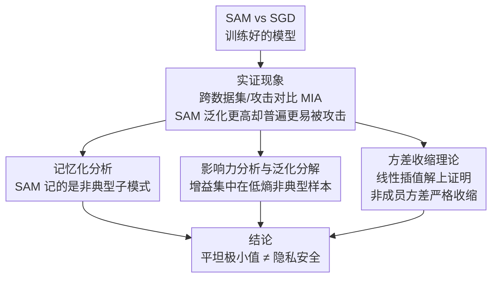

# Membership Privacy Risks of Sharpness Aware Minimization

**会议**: ICLR 2026  
**arXiv**: [2310.00488](https://arxiv.org/abs/2310.00488)  
**代码**: 无  
**领域**: AI安全/隐私  
**关键词**: Sharpness-Aware Minimization, 成员推断攻击, 隐私泄露, 记忆化, 方差收缩

## 一句话总结

本文首次系统性地揭示了 SAM（Sharpness-Aware Minimization）训练的模型虽然泛化性能更好，但反而比 SGD 更容易遭受成员推断攻击（MIA），并从记忆化行为和方差收缩两个角度给出了理论和实验解释。

## 研究背景与动机

**领域现状**：SAM 通过寻找更平坦的损失极小值来提升深度学习模型的泛化性能，已成为广泛使用的优化技术。直觉上，泛化更好的模型应该更少依赖对训练数据的记忆，因此隐私风险应该更低。

**现有痛点**：Yeom et al. 曾形式化证明 MIA 优势的上界由泛化误差给出，这暗示更好的泛化应降低 MIA 风险。然而，实际中泛化与隐私之间的关系远比这个上界复杂，存在 utility-privacy tradeoff 的先例。

**核心矛盾**：SAM 通过更好地捕获非典型子模式（atypical subclass patterns）来提升泛化，但这种"结构化记忆"同时使得训练样本在模型输出中留下了更强的痕迹，反而增大了隐私泄露。

**本文目标**：(1) 系统验证 SAM 是否确实增加 MIA 风险；(2) 从记忆化和影响力分数角度解释根因；(3) 从理论上证明 SAM 的方差收缩效应如何放大 MIA 优势。

**切入角度**：作者观察到 SAM 模型的输出置信度方差更小——SGD 有更多极端自信的预测（包括对非成员样本），这些超过阈值的非成员反而让攻击者"犯错"。SAM 压缩了方差，使成员和非成员的置信度分布更容易区分。

**核心 idea**：平坦极小值 ≠ 隐私安全。SAM 的锐度惩罚抑制了主要特征的过度放大，迫使模型分散依赖到多样的子类特征上，这虽提升泛化但降低了输出方差，从而放大了成员推断信号。

## 方法详解

### 整体框架

本文不提出新方法，而是要回答一个反直觉的问题：为什么泛化更好的 SAM 模型反而更容易被成员推断攻击（MIA）。整篇分析先用实验把现象坐实——在多个数据集、多种攻击下系统对比 SAM 与 SGD 的 MIA 脆弱性，确认 SAM 泛化更高却普遍更不安全；随后从三条线索逼近根因：用**记忆化分析**看 SAM 到底记住了什么、用**影响力分析与泛化分解**看 SAM 的泛化增益落在哪些样本上、用**方差收缩理论**在线性模型上给出几何层面的必然性；最终落到"平坦极小值 ≠ 隐私安全"这一结论。前两条是实证刻画，第三条把现象证成 SAM 几何的内在属性。

### 关键设计

围绕"SAM 为什么更不安全"，作者从记忆化、影响力、方差三条线索层层逼近根因，前两条用实证刻画 SAM 的记忆模式，第三条在线性模型上给出几何必然性。

**1. 记忆化分析：SAM 的记忆到底记了什么**

直觉上"泛化好=记得少=更安全"，但要验证这一点必须先量化每个优化器到底记住了哪些样本。作者用 Leave-One-Out 定义的记忆化分数 $mem(\mathcal{A},\mathcal{D},i)$——即抽掉第 $i$ 个训练样本前后模型对它预测置信度的变化——来对比 SAM 和 SGD。结果是 SAM 的记忆化分数并没有更低，而是分布更集中在中等区间（约 0.6–0.85），而不是堆在高端。这说明 SAM 记的不是纯噪声样本，而是"非典型但仍可泛化"的子模式：这种结构化记忆选择性地聚焦在代表性不足的子群体上，所以高记忆化在这里并不等于过拟合噪声，反而是泛化的来源之一——也正是这部分记忆把训练样本的痕迹更牢地刻进了输出。

**2. 影响力分析与泛化分解：SAM 的增益从哪来**

为了说明 SAM 的泛化提升究竟落在哪些测试样本上，作者引入一个基于影响力得分熵的度量 $\mathcal{I}_{ent}$，并据此把测试集切成 5 个桶：低熵桶里的测试点严重依赖少量高记忆训练样本（非典型样本），高熵桶则是依赖广泛、靠普遍特征就能分对的典型样本。分桶比较后发现，SAM 相对 SGD 的增益几乎全部集中在低熵桶，高熵桶上两者几乎打平。这把"SAM 泛化更好"这件事讲细了：它不是所有样本一起变好，而是专门在那些"必须靠记忆化才能分类"的非典型样本上拉开差距——而恰恰是这些样本，让训练成员在模型输出中更容易被认出来，泛化增益和隐私风险在同一批样本上同源。

**3. 方差收缩理论：在线性模型上证明 SAM 必然更危险**

前两点是实证观察，这一点给出严格证明。作者在线性模型的完美插值设定下，把不同优化器写成最小 $G$-范数插值解：SGD 对应度量 $G_0 = I_d$，SAM 对应 $G_\eta = I + \eta\Sigma$（$\Sigma$ 为数据曲率，$\eta$ 为锐度惩罚强度），即 SAM 沿高曲率方向施加了额外的惩罚。在此框架下可以证明非成员输出方差严格收缩：

$$\sigma_{G_\eta}^2 < \sigma_{G_0}^2$$

由于插值条件下训练样本的置信度被钉死不变，成员一侧的分布几乎不动，而非成员一侧的方差被压低，两个分布的重叠就变小、更容易用一个阈值切开——这正好对应实验里观察到的"SGD 有更多极端自信的非成员预测、SAM 把方差压平"。于是方差收缩被证明为 SAM 几何的内在属性，而非训练偶然，MIA 优势的放大也就有了根因。

### 损失函数 / 训练策略

本文是分析性工作，不涉及新训练策略。分析中使用标准的 SAM 目标：$\min_w \max_{\epsilon \in B(\rho)} L_S(w+\epsilon)$。

## 实验关键数据

### 主实验

| 数据集 | 攻击方法 | SGD 攻击准确率 | SAM 攻击准确率 | SGD 测试准确率 | SAM 测试准确率 |
|--------|----------|---------------|---------------|---------------|---------------|
| CIFAR-100 | Confidence | 77.19% | 79.10% | 80.30% | 81.60% |
| CIFAR-10 | M-entropy | 59.51% | 61.70% | 96.00% | 96.72% |
| EyePacs | Confidence | 73.40% | 77.07% | 73.67% | 75.41% |
| CIFAR-100 | RMIA (AUC) | 90.4% | 91.6% | 67.7% | 69.1% |
| CIFAR-10 | LiRA (TPR@0.1) | 8.8% | 12.5% | 92.3% | 93.1% |

### 消融实验

| 分析维度 | 关键发现 |
|---------|---------|
| 记忆化密度分布 | SAM 在低端密度更低，中间范围更均匀分布 |
| 泛化分解 (桶1 vs 桶5) | SAM 在非典型桶 (桶1) 增益最大，典型桶 (桶5) 几乎无差异 |
| 其他锐度感知优化器 | GSAM、LookSAM 等也展现类似的隐私风险增加模式 |
| 不同模型架构 | ResNet 和 VGG 上都一致复现该现象 |

### 关键发现

- SAM 在所有 5 个数据集、所有攻击方法上都比 SGD 更容易被 MIA 攻击，尽管测试准确率始终更高
- SAM 的记忆化增益集中在"中等记忆化"区间（0.6-0.85），而非高端（噪声记忆），证实了结构化记忆假说
- 在 CIFAR-10 上，SAM 的 LiRA TPR@0.1%FPR 从 8.8% 跳到 12.5%，提升 42%——这在严格低误报率下尤为危险

## 亮点与洞察

- **反直觉发现的系统化验证**：打破了"平坦极小值=好隐私"的朴素假设，用多数据集、多攻击方法、多架构的全面实验令人信服。这个发现对 SAM 的实际部署有重要警示意义
- **方差收缩的理论解释极为精炼**：将问题归结为最小 $G$-范数插值解的几何差异，证明链条清晰——锐度惩罚→高曲率方向压制→非成员方差缩小→MIA 优势增大
- **结构化记忆的概念**可迁移到其他分析中：不同优化器/正则化方法的记忆化并非同质，区分"有益记忆化"和"噪声记忆化"的框架对其他隐私研究有参考价值

## 局限与展望

- 理论分析限于线性模型的完美插值设定，向非线性深层网络的推广尚未验证
- 未提出缓解 SAM 隐私风险的具体方案（如差分隐私+SAM 的组合策略）
- 记忆化和影响力分数的计算依赖大量 LOO 训练，实验成本极高，限制了在更大规模模型上的验证
- 未探讨 SAM 变体（如自适应 SAM、mSAM）是否能缓解该问题

## 相关工作与启发

- **vs Yeom et al. (2018)**: 他们证明 MIA 优势 ≤ 泛化误差，本文用实证打破了这一直觉上限
- **vs Feldman (2020)**: 本文基于 Feldman 的记忆化框架，但首次对比了不同优化器的记忆化模式差异
- **vs Tan et al. (2022)**: 他们分析参数规模和岭回归对隐私的影响，本文引入曲率对齐的几何模型来建模 SAM

## 评分

- 新颖性: ⭐⭐⭐⭐⭐ 首次揭示 SAM 的隐私风险悖论，发现重要且反直觉
- 实验充分度: ⭐⭐⭐⭐⭐ 5个数据集、多种攻击、多架构消融，加上理论验证
- 写作质量: ⭐⭐⭐⭐ 从实验到分析到理论的递进逻辑清晰，部分符号较多
- 价值: ⭐⭐⭐⭐ 对部署 SAM 的实际系统有直接警示意义，但缺少缓解方案稍显遗憾

<!-- RELATED:START -->

## 相关论文

- [\[AAAI 2026\] Transferable Backdoor Attacks for Code Models via Sharpness-Aware Adversarial Perturbation](../../AAAI2026/ai_safety/transferable_backdoor_attacks_for_code_models_via_sharpness-aware_adversarial_pe.md)
- [\[ECCV 2024\] Unveiling Privacy Risks in Stochastic Neural Networks Training: Effective Image Reconstruction from Gradients](../../ECCV2024/ai_safety/unveiling_privacy_risks_in_stochastic_neural_networks_training_effective_image_r.md)
- [\[AAAI 2026\] Privacy Auditing of Multi-Domain Graph Pre-Trained Model under Membership Inference Attack](../../AAAI2026/ai_safety/privacy_auditing_of_multi-domain_graph_pre-trained_model_under_membership_infere.md)
- [\[NeurIPS 2025\] Unifying Re-Identification, Attribute Inference, and Data Reconstruction Risks in Differential Privacy](../../NeurIPS2025/ai_safety/unifying_re-identification_attribute_inference_and_data_reconstruction_risks_in_.md)
- [\[CVPR 2026\] A Unified Perspective on Adversarial Membership Manipulation in Vision Models](../../CVPR2026/ai_safety/a_unified_perspective_on_adversarial_membership_manipulation_in_vision_models.md)

<!-- RELATED:END -->
