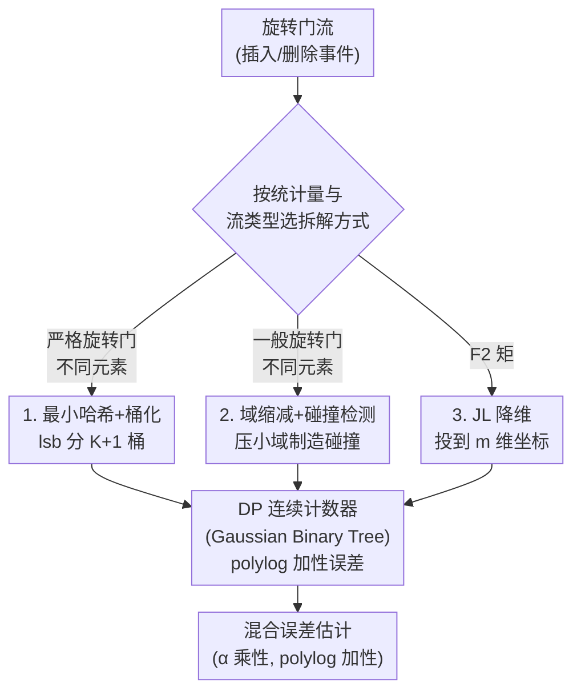

# Skirting Additive Error Barriers for Private Turnstile Streams

**会议**: ICLR 2026  
**arXiv**: [2602.10360](https://arxiv.org/abs/2602.10360)  
**代码**: 无  
**领域**: 差分隐私 / 流算法  
**关键词**: differential privacy, continual release, turnstile stream, distinct elements, F2 moment

## 一句话总结

证明差分隐私旋转门流中的多项式纯加性误差下界（不同元素计数 $\Omega(T^{1/4})$、$F_2$ 矩 $\Omega(T)$）可以通过引入乘性误差来绕过——对不同元素计数实现 $(\text{polylog}(T), \text{polylog}(T))$ 混合误差，对 $F_2$ 矩实现 $(1+\eta, \text{polylog}(T))$ 混合误差，且两者仅需 polylogarithmic 空间。

## 研究背景与动机

**领域现状**：差分隐私连续发布 (continual release) 是隐私数据处理的核心模型——数据以流的形式逐个到达，算法需要在每个时间步私密地发布底层统计量。旋转门模型 (turnstile stream) 允许元素被插入和删除，比仅插入流困难得多。两个基础流统计问题——不同元素计数 (distinct elements) 和 $F_2$ 矩估计——是流算法领域的经典核心问题。

**现有痛点**：在旋转门流的隐私连续发布设置下，即使不考虑空间限制，这两个问题的已知上下界之间存在多项式级gap。不同元素计数的最佳纯加性误差上界为 $\tilde{O}(T^{1/3})$，下界为 $\Omega(T^{1/4})$，关闭这个gap是一个困难的开放问题。$F_2$ 矩更糟糕——仅从灵敏度考虑，任何纯加性误差算法必须承受 $\Omega(T)$ 的误差。这些多项式级的不可避免误差严重限制了实际应用。

**核心矛盾**：这些下界看似不可突破，但仔细分析下界构造实例可以发现——下界成立时，真实统计量的值本身远大于加性误差。即 $\Omega(T^{1/4})$ 的下界发生在不同元素数远超 $T^{1/4}$ 的场景，这意味着下界对于获取常数乘性近似并不构成障碍。

**切入角度**：引入 $(\alpha, \beta)$ 混合误差模型——允许同时存在乘性误差 $\alpha$ 和加性误差 $\beta$。当真实值 $Y_t \gg \beta$ 时，输出本质上是 $\alpha$ 倍乘性近似；当 $Y_t$ 很小（低于噪声底）时接受较大的相对误差。这种放松在非隐私的亚线性空间流算法中是自然的（乘性误差本就不可避免），因此在隐私设置中同样有意义。

**核心 idea**：多项式纯加性误差可以被 polylogarithmic 加性误差替代，代价是引入一些乘性误差。

## 方法详解

### 整体框架

论文要解决的是同一个工程难题在两个经典统计量上的不同实例：在允许插入和删除的旋转门流上，私密地、连续地估计不同元素数 (distinct elements) 和 $F_2$ 矩，而又不被多项式级的纯加性误差下界卡住。它的统一思路是把差分隐私**连续计数** (DP continual counting) 当成一块可靠的积木——这块积木只承受 $O(\log^{1.5}(T))$ 级别的 polylogarithmic 加性误差——然后用流算法里的三种经典技术（最小哈希、域缩减、Johnson-Lindenstrauss 降维）把"难统计量"小心地拆解成若干个"易计数"的子问题。只要每个子问题都能交给一个连续计数器，整体就继承了计数器的小加性误差，多项式误差自然被绕开，代价是拆解过程引入一点乘性误差。

支撑这块积木的隐私机制是 zero-concentrated differential privacy (zCDP) 下的 Gaussian Binary Tree Mechanism：连续计数器用二叉树结构聚合前缀和并注入高斯噪声，$\rho$-zCDP 经 zCDP-to-DP 转换即可保证 $(\varepsilon, \delta)$-DP（当 $\rho = O(\varepsilon^2/\log(1/\delta))$），其组合性质比标准 DP 更紧凑，这也是三个算法能层层归约而隐私预算不爆的前提。下面三个设计分别对应三种拆解方式：MinHash 桶化处理严格旋转门下的不同元素计数，域缩减处理一般旋转门下的不同元素计数，JL 降维处理 $F_2$ 矩——三者把各自的"难统计量"拆成若干子问题后，统一喂给同一块连续计数器原语。

### 关键设计

**1. 最小哈希 + 桶化计数：把高灵敏的"最小哈希值"换成一堆低灵敏的计数器（Theorem 3.1，严格旋转门流）**

经典的最小哈希估计器用 $1/(\min h)$ 估不同元素数，但它在隐私设置里行不通——最小哈希值会因单次插入/删除事件而频繁跳变，灵敏度太高，加噪后估计被毁掉。这里的做法是绕开"取最小值"：选哈希函数 $h: [n] \to [n]$，按其最低有效非零位 $\texttt{lsb}(h(a))$ 把元素分进 $K+1$ 个桶，$\texttt{lsb}=k$ 的概率为 $2^{-(k+1)}$，于是桶 $k$ 里期望的不同元素数随 $2^{-(k+1)} \cdot D_t$ 几何递减。每个桶各挂一个 DP 连续计数器 $C[k]$，得到加性误差 $\tau = O(\log^{1.5}(T)/\sqrt{\rho})$ 的估计 $\hat{f}_t[k]$。非隐私版找最大的非空桶 $\ell$ 报告 $\hat{D}=2^\ell$；隐私版改成找最大的、计数超过噪声阈值 $\tau$ 的桶。关键的乘性误差恰恰从这里来：当一个桶的计数偏高时，无法区分它是"有 $\tau$ 个频率为 1 的元素"还是"有单个高频元素"，这种歧义引入了 $O(\tau)$ 的乘性误差。最终误差为 $(O(\log^2(T)/\sqrt{\rho}), O(\log^2(T)/\sqrt{\rho}))$，空间 $O(\log n \cdot \log^2(T))$。代价是它只适用于严格旋转门流（频率始终非负）。

**2. 域缩减 + 碰撞检测：放宽到一般旋转门流，并打通到常数乘性因子的归约路径（Theorem 4.1 / 4.2，一般旋转门流）**

MinHash 的 lsb 分桶依赖频率非负，一旦允许负频率就失效。域缩减换了一种制造结构的方式：用哈希把域 $[n]$ 压到一个足够小的域，让大量元素在小域里发生碰撞，再对缩减后的每个桶挂连续计数器，用缩减域里被占用的规模反推不同元素数。这条路对一般旋转门流（允许频率为负）成立，但精度差不少——误差为 $(O(\log^{10}(T)/\rho^2), O(\log^{10}(T)/\rho^2))$。它真正的价值在配套的归约 Theorem 4.2：任何能在域大小 $n$ 上做到次线性纯加性误差 $n^{0.99}$ 的算法，都能被改造成 $(1+\eta)$ 乘性、$\text{polylog}(T)$ 加性的算法。这把"改进乘性因子到常数级"这个目标，转化成了"找一个 $n^{0.99}$ 纯加性误差算法"的具体问题，既可用来改上界，也可反过来用作证明纯加性误差 $o(n)$ 下界的工具。

**3. JL 降维：把 $\Omega(T)$ 灵敏度的 $F_2$ 压成低维里的小灵敏度计数（Theorem 5.1）**

$F_2$ 矩的麻烦在于灵敏度本身就是 $\Omega(T)$：单次事件可能让频率向量的 $\ell_2$ 范数平方变动达 $T$ 级别，所以任何纯加性误差算法都逃不掉 $\Omega(T)$。这里用 Johnson-Lindenstrauss 降维把 $n$ 维频率向量 $x_t \in \mathbb{R}^n$ 投到 $m$ 维（$m = O(\log(T)/\eta^2)$），靠 JL 保范性保证 $(1-\eta)\|x_t\|_2^2 \leq \|Ax_t\|_2^2 \leq (1+\eta)\|x_t\|_2^2$，再对降维后的每个坐标挂连续计数器，取各坐标平方和作 $F_2$ 估计。投影矩阵选 Rademacher 随机矩阵（元素 $\pm 1/\sqrt{m}$）的妙处在于：每个流更新只触及一个域元素 $a_i$，于是它对降维后每个坐标的增量恰好是 $\pm s_i/\sqrt{m}$，可以直接喂给计数器。降维在这里身兼两职——它既保住了 $\ell_2$ 范数（保证 $(1+\eta)$ 乘性近似），又把每个坐标的灵敏度从 $\Omega(T)$ 降到 $O(1/\sqrt{m})$，让小加性误差的连续计数器重新管用。总误差为 $(1+\eta, O(\text{polylog}(T)/(\varepsilon^2\eta^3)))$，空间 $O(\text{polylog}(T)/\eta^2)$，同时把 Epasto et al. 在仅插入流上的 $O(\log^7(T))$ 加性误差量化改进到 $O(\log^4(T))$，并推广到旋转门流。

## 实验关键数据

### 不同元素计数理论结果对比

| 来源 | 误差 $(\alpha, \beta)$ | 空间 | 隐私级别 | 备注 |
|------|----------------------|------|---------|------|
| Jain et al. '23 上界 | $(1, \tilde{O}(T^{1/3}))$ | $O(T)$ | Item-level | 基于重计算技术 |
| Jain et al. '23 下界 | $(1, \Omega(T^{1/4}))$ | — | Event-level | 纯加性下界 |
| Epasto et al. '23 | $(1+\eta, O_\eta(\log^2 T))$ | polylog$(T)$ | Event-level | **仅插入流** |
| **MinHash (Thm 3.1)** | $(O(\log^2 T), O(\log^2 T))$ | $O(\log^3 T)$ | Event-level | **严格旋转门** |
| **Domain Red. (Thm 4.1)** | $(O(\log^{10} T), O(\log^{10} T))$ | poly$(T)$ | Event-level | **一般旋转门** |

核心结论：将纯加性误差从 $\Omega(T^{1/4})$（多项式级）降至 $\text{polylog}(T)$（多项对数级），代价是引入 $\text{polylog}(T)$ 乘性误差。当真实不同元素数超过 $\tilde{O}(T^{1/3})$ 时，本文结果严格优于此前最佳上界。

### $F_2$ 矩估计理论结果对比

| 来源 | 误差 $(\alpha, \beta)$ | 空间 | 备注 |
|------|----------------------|------|------|
| 灵敏度下界 | $(1, \Omega(T))$ | — | 纯加性不可避免 |
| Epasto et al. '23 | $(1+\eta, \tilde{O}_\eta(\log^7 T))$ | $O_\eta(\log^2 T)$ | **仅插入流** |
| **Theorem 5.1** | $(1+\eta, \tilde{O}_\eta(\log^4 T))$ | $O_\eta(\log^2 T)$ | **一般旋转门** |

将加性误差从 $\Omega(T)$ 降至 $\text{polylog}(T)$，代价仅为 $1+\eta$ 的乘性因子。相比 Epasto et al.，加性误差从 $\log^7(T)$ 改进到 $\log^4(T)$，且从仅插入流推广到旋转门流。

### 关键发现

- **下界构造的"盲点"**：$\Omega(T^{1/4})$ 加性下界的构造实例中，真实不同元素数远大于 $T^{1/4}$，因此对乘性近似不构成障碍——这是整篇论文的核心观察。
- **MinHash 的乘性误差来源明确**：$O(\tau)$ 倍乘性误差来自无法区分"多个低频元素"和"单个高频元素"落入同一桶的情况。这指明了改进乘性因子到常数级别的技术瓶颈。
- **Theorem 4.2 的规约意义**：证明了纯加性误差 $n^{0.99}$ 的算法可转换为 $(1+\eta)$ 乘性 + polylog 加性算法——既可用于改进上界，也可用于证明纯加性误差 $o(n)$ 的下界。

## 亮点与洞察

- **"绕过"而非"突破"下界的思路转换**：不是试图在下界框架内改进加性误差，而是切换到混合误差模型使下界不再适用——这种思路在差分隐私领域越来越常见 (Aamand et al., Ghazi et al.)，本文在流算法中系统展示了其威力。
- **连续计数作为通用原语的设计模式**：三个算法都将复杂的流统计问题归约为多个连续计数实例，利用 Binary Tree Mechanism 的 $O(\log^{1.5}(T))$ 加性误差保证。这种"先归约到计数、再用计数器的小误差"的模式可能适用于更多私密流问题。
- **JL 降维在隐私流中的优雅应用**：$F_2$ 矩的 $\Omega(T)$ 灵敏度在原空间中不可避免，但 JL 降维后每个坐标的灵敏度变为 $O(1/\sqrt{m})$，使得连续计数器可以有效工作——降维同时降低了灵敏度。

## 局限与展望

- **乘性因子未达常数级**：MinHash 的乘性误差为 $O(\log^2 T)$，距离实际应用需要的 $(1+\eta)$ 常数乘性还有显著差距。论文指出瓶颈在于高频元素导致的桶计数歧义，解决这一问题是主要开放问题。
- **仅考虑 event-level 隐私**：并发工作 (Aryanfard et al.) 证明在 item-level 隐私下，乘性和加性误差的乘积 $\alpha\beta$ 必须为 $T^{1/3}$ 量级——因此本文结果不能推广到更强的 item-level 设置。
- **Domain Reduction 算法空间不优**：Theorem 4.1 使用 poly$(T)$ 空间，相比 MinHash 的 polylog 空间差很多，且误差指数 ($\log^{10}$) 也更大。
- **未提供实验验证**：作为纯理论工作，没有在实际数据流上验证算法的实际性能表现。

## 相关工作与启发

- **vs Jain et al. (NeurIPS '23)**: 证明了 $\Omega(T^{1/4})$ 纯加性下界。本文核心贡献是展示这一下界可以通过混合误差绕过，而非在纯加性误差框架内改进。
- **vs Epasto et al. (2023)**: 在仅插入流上实现 $(1+\eta, O(\log^2 T))$ 误差。本文将类似结果推广到困难得多的旋转门流，对 $F_2$ 更从 $\log^7$ 改进到 $\log^4$。
- **vs Cummings et al. (2025)**: 使用乘性误差获得 polylog 空间，但加性误差仍为多项式级 $T^{1/3}$。本文首次实现加性和乘性同时为 polylog。
- **并发工作 (Aryanfard et al., Andersson et al., Epasto et al.)**: 分别研究了混合误差的图问题扩展、常数因子改进和空间下界，与本文互补而非重叠。

## 评分

- 新颖性: ⭐⭐⭐⭐ "绕过"下界的思路切换有洞见，MinHash 和 JL 降维在隐私流中的组合应用巧妙
- 实验充分度: ⭐⭐ 纯理论工作无实验，但理论结果全面覆盖了不同元素和 $F_2$ 两大问题
- 写作质量: ⭐⭐⭐⭐ 问题动机清晰，结果对比表组织良好，开放问题讨论有深度
- 价值: ⭐⭐⭐⭐ 推进了隐私流算法的理论边界，混合误差框架对更多问题有启发

<!-- RELATED:START -->

## 相关论文

- [\[ICML 2025\] Breaking the n^{1.5} Additive Error Barrier for Private and Efficient Graph Sparsification](../../ICML2025/ai_safety/breaking_the_n15_additive_error_barrier_for_private_and_efficient_graph_sparsifi.md)
- [\[ICLR 2026\] Back to Square Roots: An Optimal Bound on the Matrix Factorization Error for Multi-Epoch Differentially Private SGD](back_to_square_roots_an_optimal_bound_on_the_matrix_factorization_error_for_mult.md)
- [\[ICML 2026\] LAPRAS: Learning-Augmented PRivate Answering for Linear Query Streams](../../ICML2026/ai_safety/lapras_learning-augmented_private_answering_for_linear_query_streams.md)
- [\[NeurIPS 2025\] Private Continual Counting of Unbounded Streams](../../NeurIPS2025/ai_safety/private_continual_counting_of_unbounded_streams.md)
- [\[ICLR 2026\] Dataless Weight Disentanglement in Task Arithmetic via Kronecker-Factored Approximate Curvature](dataless_weight_disentanglement_in_task_arithmetic_via_kronecker-factored_approx.md)

<!-- RELATED:END -->
