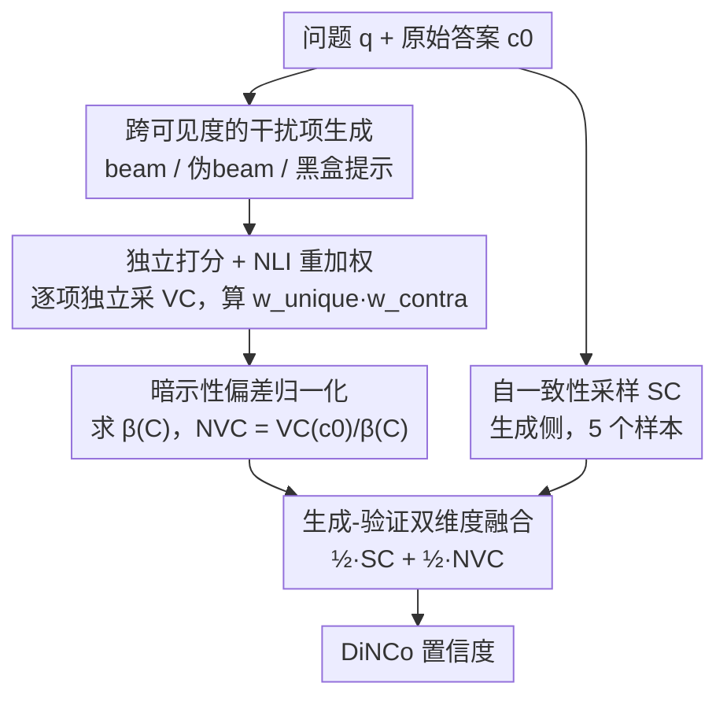

# Calibrating Verbalized Confidence with Self-Generated Distractors

**会议**: ICLR 2026  
**arXiv**: [2509.25532](https://arxiv.org/abs/2509.25532)  
**代码**: [victorwang37/dinco](https://github.com/victorwang37/dinco)  
**领域**: AIGC检测  
**关键词**: 置信度校准, 语言化概率, 干扰项生成, NLI 重加权, 生成-验证一致性

## 一句话总结

提出 DiNCo 方法，通过让 LLM **独立**评估自动生成的干扰选项（合理但错误的替代答案）来暴露其"暗示性偏差"，用干扰项上的总置信度进行归一化，并融合生成一致性与验证一致性两个互补维度，在短文本 QA 和长文本生成任务上显著改善置信度校准。

## 研究背景与动机

**领域现状**：LLM 可以通过"语言化置信度"（verbalized confidence）直接输出其对答案的确信程度——要么让模型自报数值（如"80%"），要么通过 $P(\text{True})$ 方式计算。这种单次调用方式比多次采样高效得多，但校准质量堪忧。

**现有痛点**：
- **过度自信**：语言化置信度存在系统性过高问题，模型在错误答案上也常报出 0.8+ 的置信度
- **置信度饱和**：分数集中在少数区间（如 0.9-1.0），使得无论如何设置阈值，都无法有效区分正确与错误答案
- **跨难度不可比**：简单问题的错误答案和困难问题的正确答案可能获得相同分数

**核心观察**：作者提出"暗示性"（suggestibility）假说——当 LLM 对某个主题知之甚少时，**将 claim 放入上下文本身就会拉高模型对该 claim 的置信度**。实验验证表明，错误回答的问题其总置信度 $\beta(C)$ 显著高于正确回答的问题，证实了模型在认知不确定时更容易"来者不拒"。

## 方法详解

### 整体框架

DiNCo（Distractor-Normalized Coherence）要解决的是 LLM 语言化置信度系统性虚高、且分数饱和在 0.9–1.0 区间、无论怎么设阈值都分不开对错的问题。它的出发点是一个被忽视的现象——**暗示性偏差**：当模型对某主题知之甚少时，光是把一个 claim 放进上下文让它评估，就会把置信度抬高，于是错答也能拿到 0.8+。DiNCo 的破解思路是"以毒攻毒"：既然任何放进上下文的 claim 都会被同等抬高，那就主动为原始答案造一批以假乱真的**干扰项**（合理但错误的替代答案），让模型逐个**独立**打分，再用这批干扰项上的总置信度，把原始答案里那份虚高的成分除掉。

整条流水线接收"问题 $q$ + 原始答案 $c_0$"：先在任意模型权限下凑齐一组高概率干扰项，对每个干扰项独立采集语言化置信度，用一个轻量 NLI 模型对它们去重纠偏后求和得到偏差因子 $\beta(C)$，把 $c_0$ 的置信度除以 $\beta(C)$ 得到归一化验证置信度（NVC）；最后再和一路独立的自一致性采样（SC）等权融合，输出最终置信度。全程零训练，只额外挂一个 184M 的 NLI 模型。

### 关键设计

**1. 跨可见度的干扰项生成：在任何模型权限下都凑齐高概率替代答案**

归一化要靠一组生成概率高、彼此互斥的替代 claim 撑起分母，目标是在 $|C| \leq K$ 的预算内最大化 $\sum_{c \in C} f^{\text{VC}}(c)$，尽量覆盖模型"觉得可能"的答案。生成方式随模型可见度自适应：开源模型 logit 可用时用 beam search 批量产出高概率且不重复的答案（比独立采样省，因为独立采样会反复抽到同几个高概率序列）；只暴露 top-token 概率的 API 模型走"伪 beam search"近似；纯黑盒模型则直接提示模型列一串候选答案，不碰任何概率访问。对长文本生成，先按 FactScore 把段落拆成原子 claim，再为每个 claim 单独造干扰项，从而把校准粒度下沉到 claim 级。这套分层策略让方法在开源到闭源全谱系上都能落地。

**2. 独立打分 + NLI 重加权：既防止模型作弊，又修掉干扰项不互斥带来的偏差**

这一步的前提是对每个干扰项**单独**询问置信度，而不是把所有候选一次性摆出来联合提问——联合提问时模型可以靠简单算术让各项加起来正好归一，反而把真实的不一致掩盖掉，这正是 K-VC 这类联合方法失效的原因。但独立采集来的干扰项无法保证两两严格互斥：有的彼此重复，有的其实和原答案并不冲突，直接相加会污染分母。作者用 DeBERTa-v3-base 的 NLI 模型给每个干扰项算两个连续权重来软性纠偏：唯一性权重 $w_{\text{unique}}(c) = \frac{1}{\sum_{c' \in C} P(\text{entail} \mid c', c)}$ 把被别的 claim 蕴含的重复项降权，避免同一答案被重复计数；矛盾性权重 $w_{\text{contra}}(c) = \frac{P(\text{contra} \mid c_0, c) + P(\text{contra} \mid c, c_0)}{2}$ 把那些与原答案并不矛盾、本不该算作替代答案的项降权。消融实验显示去掉这一步，NVC 的 ECE 会从 0.171 退化到 0.358——这层去重正是归一化质量的命门。

**3. 暗示性偏差归一化：把虚高的置信度拆成"真实置信度 × 偏差因子"再除掉**

有了干扰项和权重，偏差就能被量化出来。作者把语言化置信度写成潜在真实置信度乘以一个暗示性偏差标量 $f^{\text{VC}}(c) = \beta(c) \cdot f^{\text{lat}}(c)$，其中 $\beta(c)$ 度量"把 claim $c$ 塞进上下文"本身带来的抬升。直接估 $\beta(c)$ 没有抓手，但作者做了一个关键假设：对一组逻辑相关、互斥的 claim 集合 $C$（原始答案及其替代答案），偏差近似相等 $\beta(c) \approx \beta(C)$；再叠加潜在置信度满足概率归一化 $\sum_{c \in C} f^{\text{lat}}(c) = 1$，偏差因子就能直接读出来——它等于这组 claim 上语言化置信度的加权总和。代入上一步的两个权重，即

$$\beta(C) = \max\!\left(1,\; f^{\text{VC}}(c_0) + \sum_{c \in C} f^{\text{VC}}(c) \cdot w_{\text{unique}}(c) \cdot w_{\text{contra}}(c)\right),$$

原始答案的归一化置信度 $f^{\text{NVC}}(c_0) = f^{\text{VC}}(c_0) / \beta(C)$。取 $\max(1, \cdot)$ 是防止 claim 集合不完备时分母过小、反把分数放大过头。这一步让"虚高"从定性吐槽变成可计算的修正量。

**4. 生成-验证双维度融合：补上生成器与验证器的系统性分歧**

作者观察到 beam search 选出的最高概率答案，和验证阶段置信度最高的答案，只在 59.2% 的问题上一致，说明"模型怎么生成"和"模型怎么判断"是两路系统性不同的信号，单看一路必有盲区。DiNCo 把两者等权融合 $f^{\text{DiNCo}}(c) = \frac{1}{2} f^{\text{SC}}(c) + \frac{1}{2} f^{\text{NVC}}(c)$，其中 $f^{\text{SC}}$ 是多次采样的自一致性（生成侧）估计，$f^{\text{NVC}}$ 是上面归一化后的验证侧置信度。在推理预算 $K=10$ 时，5 个样本喂给 SC、5 个干扰项喂给 NVC，两半预算各管一个维度，互补叠加而非单纯堆采样。

## 实验结果

### 短文本 QA 结果

| 方法 | TriviaQA ECE ↓ | TriviaQA AUC ↑ | SimpleQA ECE ↓ | SimpleQA AUC ↑ |
|------|:-:|:-:|:-:|:-:|
| VC | 0.240 | 0.817 | 0.547 | 0.644 |
| K-VC | 0.341 | 0.604 | 0.338 | 0.632 |
| MSP | 0.149 | 0.819 | 0.263 | 0.800 |
| SC | 0.236 | 0.785 | 0.220 | 0.750 |
| NVC | 0.171 | 0.853 | 0.164 | 0.729 |
| **DiNCo** | **0.097** | **0.879** | **0.089** | **0.786** |

> 以上 TriviaQA 结果为 Qwen3-8B，SimpleQA 结果为 GPT-4.1。DiNCo 在 ECE 上平均优于最佳 baseline（MSP）0.077（TriviaQA）和 0.092（SimpleQA）。

### 长文本生成结果（FactScore）

| 方法 | Qwen3-8B ECE ↓ | Qwen3-8B Pearson $r$ ↑ | Gemma-3-4B ECE ↓ | Gemma-3-4B Pearson $r$ ↑ |
|------|:-:|:-:|:-:|:-:|
| VC | 0.433 | 0.073 | 0.527 | -0.081 |
| SC | 0.162 | 0.468 | 0.197 | 0.629 |
| NVC | 0.191 | 0.444 | 0.123 | 0.695 |
| **DiNCo** | **0.076** | **0.518** | **0.172** | **0.724** |

> DiNCo 的 passage-level Pearson/Spearman 相关系数平均优于 SC 0.072/0.074。

### 饱和度与扩展性分析

- **饱和度**：DiNCo 的 $\Delta_0 = 0.998$（几乎所有样本对置信度不同），而 VC 仅 0.670，SC@100 仅 0.832
- **扩展 SC 无法弥补差距**：SC 从 10 扩到 100 个样本（FLOP 增加 7.6 倍于 DiNCo），ECE 改善微乎其微，无法追平 DiNCo
- **NLI 消融**：移除 NLI 重加权后 NVC 的 ECE 从 0.171 恶化到 0.358，证实 NLI 权重的关键作用

## 论文评价

**优点** ⭐⭐⭐⭐
- 从"暗示性偏差"角度分析过度自信，理论动机清晰且有实验验证
- 方法对开源/闭源模型均适用，且从短文本 QA 无缝迁移到长文本生成
- 仅需轻量 NLI 模型（184M 参数，<1% 总 FLOP），零资源、无训练
- 饱和度分析指标 $\Delta_\epsilon$ 的提出量化了此前仅定性讨论的问题

**不足** ⭐⭐⭐
- 干扰项质量依赖模型自身生成能力，对小模型效果可能受限
- 假设偏差 $\beta$ 在逻辑相关 claim 间近似相等，对语义距离较远的 claim 可能不成立
- 长文本场景需要额外的 claim 分解步骤，增加了流水线复杂度
- 与最近的 post-hoc calibration 方法（如温度缩放）在有标注数据场景下的对比缺失

## 相关工作与对比

| 方法类型 | 代表工作 | 与 DiNCo 的区别 |
|---------|---------|---------------|
| 语言化置信度 | P(True), Verbalized Numerical | 单次评估，受暗示性偏差影响，置信度饱和 |
| 联合多候选提示 | Top-K-VC, CaCoST | 联合呈现候选允许模型通过算术满足归一化，掩盖不一致 |
| 自一致性 | SC, SC-VC | 仅利用生成一致性，忽略验证维度 |
| 序列概率 | MSP | 依赖标准答案形式，无法扩展到长文本 |
| **DiNCo** | 本文 | 独立评估干扰项 + NLI 重加权 + 生成/验证双维度融合 |

## 总结与展望

DiNCo 从 LLM "暗示性偏差" 这一被忽视的角度出发，通过自动生成干扰项并独立评估置信度来估计和校正偏差，再融合生成与验证两个互补的一致性维度。方法在零资源设定下以极低额外开销（相比 SC 仅多 32% FLOP）实现了跨任务、跨模型的校准改善。未来方向包括：用更小模型生成干扰项以进一步降低成本、将方法扩展到多轮对话和代理决策场景、以及探索与 post-hoc 校准方法的结合。

<!-- RELATED:START -->

## 相关论文

- [\[ACL 2026\] REFLEX: Self-Refining Explainable Fact-Checking via Verdict-Anchored Style Control](../../ACL2026/aigc_detection/reflex_self-refining_explainable_fact-checking_via_verdict-anchored_style_contro.md)
- [\[NeurIPS 2025\] QiMeng-NeuComBack: Self-Evolving Translation from IR to Assembly Code](../../NeurIPS2025/aigc_detection/qimeng-neucomback_self-evolving_translation_from_ir_to_assembly_code.md)
- [\[ICLR 2026\] Death of the Novel(ty): Beyond n-Gram Novelty as a Metric for Textual Creativity](death_of_the_novelty_beyond_n-gram_novelty_as_a_metric_for_textual_creativity.md)
- [\[ICLR 2026\] DMAP: A Distribution Map for Text](dmap_a_distribution_map_for_text.md)
- [\[ICLR 2026\] PoliCon: Evaluating LLMs on Achieving Diverse Political Consensus Objectives](policon_evaluating_llms_on_achieving_diverse_political_consensus_objectives.md)

<!-- RELATED:END -->
