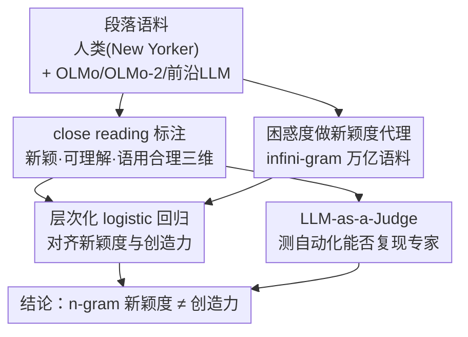

# Death of the Novel(ty): Beyond n-Gram Novelty as a Metric for Textual Creativity

**会议**: ICLR 2026  
**arXiv**: [2509.22641](https://arxiv.org/abs/2509.22641)  
**代码**: [github.com/asaakyan/ngram-creativity](https://github.com/asaakyan/ngram-creativity)  
**领域**: AIGC检测  
**关键词**: textual creativity, n-gram novelty, LLM evaluation, close reading, pragmaticality

## 一句话总结

通过 26 位专业作家对 8618 条表达的 close reading 标注，揭示 n-gram 新颖度不足以衡量文本创造力——约 91% 的高 n-gram 新颖表达并不被认为具有创造性，且开源 LLM 中高 n-gram 新颖度与低语用合理性负相关。

## 研究背景与动机

**n-gram 新颖度被广泛用于创造力评估**：近年 infini-gram 等工具使在万亿 token 级语料上计算 n-gram 新颖度成为可能，Creativity Index 等指标大量依赖 n-gram 新颖度来度量文本创造力。

**心理学中创造力的标准定义要求双重属性**：创造力 = 新颖性（novelty）+ 合宜性（appropriateness）。仅有 n-gram 新颖度不足以捕获创造力的完整定义。

**合宜性的两个子维度**：文章将"合宜性"分解为"可理解性"（sensicality，表达本身是否语义通顺）和"语用合理性"（pragmaticality，表达在上下文中是否合理自然）。

**LLM 写作辅助的普及带来创造力担忧**：研究表明 LLM 辅助写作可能导致集体创造力下降、同质化、AI slop 泛滥等问题。

**现有评估手段的局限**：自动化 n-gram 指标过于粗糙，专家人工评估难以规模化，LLM-as-a-Judge 能否替代专家判断尚不清楚。

**核心研究问题**：n-gram 新颖度与人类专家判断的创造力之间的真实关系是什么？LLM 能否复现专家的 close reading 创造力判断？

## 方法详解

### 整体框架

这篇文章不提新模型，而是搭一套实证流水线来回答一个看似已被默认的问题："n-gram 新颖度到底等不等于创造力？"整条流水线从一批人类与 LLM 写的段落出发：先让专业作家对每条表达做 **close reading 标注**，把心理学里"新颖 + 合宜"的创造力定义拆成三个可标注维度并产出"地面真值"；同一批文本另走一路，用 infini-gram 在万亿语料上算出每条表达的困惑度，作为 **n-gram 新颖度代理**；两套信号汇到 **层次化 logistic 回归** 里对齐，量化"新颖度究竟在多大程度上预测了人判定的创造力"；最后单开一路 **LLM-as-a-Judge**，检验自动化模型能否复现作家的细粒度判断、能否替代昂贵的专家标注。

### 关键设计

**1. close reading 标注：把创造力拆成可独立标注的三个维度**

创造力在心理学里被定义为"新颖性 + 合宜性"，但"合宜性"此前从未被操作化，自动指标只盯着新颖性这一半。文章把每条表达拆成三项可独立标注的判断——可理解性（sensicality，语义是否通顺）、语用合理性（pragmaticality，在上下文里是否自然）、感知新颖度（perceived novelty），并把"同时满足三者"定义为创造性。语料是 50 篇约 400 词的 New Yorker 人类段落，加上 OLMo (7B)、OLMo-2 (32B) 各 25 篇（用人类文本的摘要做提示生成），再补 GPT-5、Claude 4.1 各 5 篇做探索。26 位顶尖 MFA 项目的专业作家以每批 10 篇、每篇 3 人的方式标注，并自由高亮他们认为有创造性的表达。这种细粒度专家标注正是后面所有分析的"地面真值"，也使新颖度（$\kappa_{free}=0.78$）和语用合理性（$\kappa_{free}=0.72$）的判断达到了较高一致性。

**2. 用困惑度做 n-gram 新颖度代理**

要把"n-gram 有多新"量化，文章借 infini-gram 的 ∞-probability 在万亿级语料上计算每条表达的困惑度（perplexity），困惑度越高代表这串词组合在训练语料里越罕见、即 n-gram 越新颖。参考语料分别取 OLMo / OLMo-2 各自的训练集（2.6T / 4.2T tokens），保证"新颖度"是相对模型见过的文本而言、而非凭空定义。这样就把抽象的 n-gram 新颖度落成一个可与人类标注做回归的连续变量，让"自动指标"和"专家判断"能放进同一个模型里直接较量。

**3. 层次化 logistic 回归对齐两套信号**

有了"创造力标注"和"困惑度"两套信号，直接做普通回归会出问题：同一标注者、同一主题段落内部的判断高度相关，普通回归会把这种相关噪声误当成效应。文章因此改用多层 logistic 回归（GLMM），让随机截距项分别吸收标注者间差异和段落主题差异。目标变量是二元的"是否创造性"，预测变量为 log 标准化困惑度、生成来源（human / OLMo / OLMo-2）及二者的交互项——交互项正是用来检验"困惑度对创造力的作用是否因来源而异"。后面"开源 LLM 新颖度与语用合理性负相关、人类却无此效应"这条关键结论，就是从这个交互项里读出来的。

**4. LLM-as-a-Judge：测自动化能否替代昂贵的专家标注**

专家 close reading 准确但贵且难规模化，于是文章单开一路检验 LLM 能否替代。任务被定义为"给定段落、抽取出感知新颖或非语用合理的表达"，用 F1 评分，匹配阈值设为归一化 indel 相似度 $\geq 90\%$。被测模型既包括零样本/少样本的 GPT-5、Claude 4.1/4.5、Gemini 2.5 Pro/3 Pro，也包括微调过的 OLMo2 7B、Qwen3 8B、Llama-3.1 8B 以及 GPT-4.1、Gemini 2.5 Pro。最后再用 Style Mimic 和 LMArena 数据集做出分布验证，看 LLM-as-a-Judge 给的新颖度评分能否对齐专家和众包的偏好，从而判断它是否比只看 n-gram 的 Creativity Index 更可靠。

## 实验关键数据

### 主实验

| 指标 | 数值 |
|------|------|
| 总标注表达数 | 8,618 条（2,783 个独特表达） |
| 感知新颖表达 | 589 个独特表达 |
| 非语用合理表达 | 722 个独特表达 |
| 创造性高亮 | 241 个新表达 |
| 标注者间一致性 κ_free（新颖度） | 0.78 (sd=0.11) |
| 标注者间一致性 κ_free（语用合理性） | 0.72 (sd=0.12) |

**核心发现**：n-gram 困惑度与创造力显著正相关（OR ≈ 1.96/SD, p < 0.001），但约 91% 的最高四分位 n-gram 新颖表达（n=3928）并未被判为创造性；约 25% 的创造性表达困惑度低于均值。

### 消融实验

**各生成来源的创造力对比（EMM contrasts vs Human）**：

| 模型 | Odds Ratio | 95% CI | p 值 |
|------|-----------|--------|------|
| Claude 4.1 | 0.521 | [0.289, 0.939] | 0.024 |
| GPT-5 | 0.511 | [0.279, 0.938] | 0.024 |
| OLMo | 0.500 | [0.370, 0.676] | <0.001 |
| OLMo-2 | 0.588 | [0.439, 0.788] | <0.001 |

所有 LLM 的表达被判为创造性的概率都显著低于人类。

**LLM-as-a-Judge 表现**：
- 新颖表达识别 F1：推理模型 ≈ 41.3（少样本 GPT-5），随机基线 9.6
- 非语用合理表达识别 F1：推理模型 ≈ 13.5，随机基线 2.3
- 非语用合理检测远难于新颖检测

### 关键发现

1. **开源 LLM 中 n-gram 新颖度与语用合理性负相关**：OLMo β=-0.17 (p=0.027), OLMo-2 β=-0.48 (p<0.001)；人类写作无此效应 (β=0.01, p=0.92)
2. **AI 检测器得分不预测创造力**：Pangram AI 检测器的似然度与表达创造力/语用合理性无显著关联
3. **写作质量奖励模型可预测创造力**：reward model 得分与创造力 (OR=1.30, p<0.001) 和语用合理性 (OR≈1.33, p<0.001) 均显著正相关
4. **LLM-J 新颖度评分优于 Creativity Index**：在 Style Mimic 数据上，LLM-J 新颖度 (β=0.63, p=0.014) 比 Creativity Index (β=0.51, p=0.038) 更能预测专家偏好

## 亮点与洞察

- **将心理学创造力定义操作化**：将创造力分解为 sensicality + pragmaticality + perceived novelty 三个可标注的维度，为自动化评估奠定基础
- **反直觉发现颠覆 n-gram 新颖度的"权威性"**：91% 的高 n-gram 新颖表达不被认为有创造力，这对依赖 n-gram 指标的所有后续工作都是重要警示
- **LLM 写作的"新颖度-语用合理性"权衡**：LLM 越试图生成新颖文本越可能产生不合语境的表达，而人类写作不存在这种权衡
- **close reading 标注范式本身的价值**：为文本创造力研究提供了表达级细粒度标注数据集

## 局限与展望

- 前沿闭源模型（GPT-5/Claude 4.1）的探索性研究规模较小（仅各 5 篇），统计效力不足
- 仅聚焦小说领域，其他文体（诗歌、科技写作、新闻）的适用性未知
- 困惑度作为 n-gram 新颖度代理可能引入度量噪声，特别是对无法访问训练数据的闭源模型
- LLM-as-a-Judge 在非语用合理表达检测上表现较差（F1 < 20），自动化评估仍有较大提升空间
- 标注者均为英语背景 MFA 作家，跨语言/跨文化泛化性未验证

## 相关工作与启发

- **Lu et al. (2025) Creativity Index**：本文直接挑战其核心假设，指出 n-gram 新颖度不能等同于创造力
- **Chakrabarty et al. (2025) AI-Slop 研究**：互补关系——本文从正面（创造力）和反面（非语用合理性）分析写作质量
- **McCoy et al. (2023)**：发现 GPT-2 在高 n-gram 新颖度处连贯性下降，与本文在开源 LLM 上的发现一致
- **启发**：可将本文的三维框架（sensicality + pragmaticality + novelty）应用于 AIGC 检测——不仅检测"是否 AI 生成"，还可以评估"生成质量的哪个维度有问题"

## 评分

- ⭐ 新颖性: 4.5/5 — 将心理学创造力定义操作化并大规模实证验证，视角独特
- ⭐ 实验充分度: 4/5 — 主实验设计严谨、标注规模可观，但前沿模型实验规模偏小
- ⭐ 写作质量: 4.5/5 — 论文结构清晰，统计建模严谨，表述专业
- ⭐ 实用价值: 4/5 — 对创造力评估和 AI 写作质量评估领域有直接指导意义

<!-- RELATED:START -->

## 相关论文

- [\[NeurIPS 2025\] CLAWS: Creativity Detection for LLM-Generated Solutions Using Attention Window of Sections](../../NeurIPS2025/aigc_detection/clawscreativity_detection_for_llm-generated_solutions_using_attention_window_of_.md)
- [\[ACL 2026\] Beyond the Final Actor: Modeling the Dual Roles of Creator and Editor for Fine-Grained LLM-Generated Text Detection](../../ACL2026/aigc_detection/beyond_the_final_actor_modeling_the_dual_roles_of_creator_and_editor_for_fine-gr.md)
- [\[ICLR 2026\] DMAP: A Distribution Map for Text](dmap_a_distribution_map_for_text.md)
- [\[ICLR 2026\] Calibrating Verbalized Confidence with Self-Generated Distractors](calibrating_verbalized_confidence_with_self-generated_distractors.md)
- [\[ICLR 2026\] PoliCon: Evaluating LLMs on Achieving Diverse Political Consensus Objectives](policon_evaluating_llms_on_achieving_diverse_political_consensus_objectives.md)

<!-- RELATED:END -->
