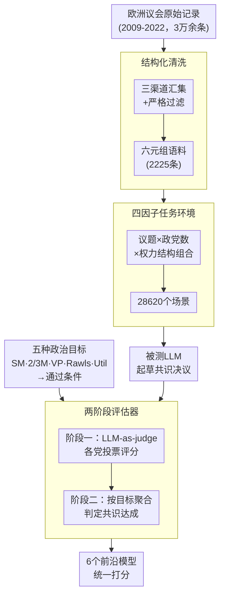

# PoliCon: Evaluating LLMs on Achieving Diverse Political Consensus Objectives

**会议**: ICLR 2026  
**arXiv**: [2505.19558](https://arxiv.org/abs/2505.19558)

**代码**: 有  
**领域**: AIGC检测 / LLM评测

**关键词**: 政治共识, LLM评测, 欧洲议会, 社会选择理论, 投票模拟

## 一句话总结

基于欧洲议会2009-2022年2225条高质量审议记录构建PoliCon基准，评估LLM在不同投票机制、权力结构和政治目标下起草共识决议的能力。结果显示前沿模型在简单多数任务表现尚可，但在2/3多数和安全议题上显著不足。

## 研究背景与动机

在多元化社会中建立政治共识是有效治理的基本前提。LLM在促进群体讨论和支持民主审议方面展现了潜力，但其在真实复杂政治场景中达成不同共识目标的能力尚未被系统评估。现有政治科学评测聚焦于立场分类或文本分析，没有评测LLM"找到共识"的能力。

PoliCon设计了四个可调因素：(1) 政治议题及其主题分类；(2) 政治目标（简单多数/2/3多数/否决权/罗尔斯主义/功利主义）；(3) 参与方数量(2/4/6个政党)；(4) 基于席位的权力结构。通过组合产生28,620个场景。

## 方法详解

### 整体框架

PoliCon 把一次政治共识任务抽象成「给定多方立场、起草一份能被表决通过的决议」，并围绕欧洲议会的真实审议数据搭建评估闭环。它先把13年的议会记录**结构化清洗**成六元组语料，再用**四因子任务环境**批量展开成数万个场景；被测 LLM 在每个场景下起草一份开放式决议，最后由一个**两阶段评估器**——先按各党立场模拟投票、再按所选**政治目标**的通过条件聚合——把决议映射成可比较的标量分数，从而对6个前沿模型做统一打分。

### 关键设计

**1. 真实审议数据的结构化清洗：把13年议会记录变成可计算的六元组**

直接拿原始议会记录评测会被噪声和缺失淹没，所以第一步是把它整理成统一格式。作者从欧洲议会官网、HowTheyVote、VoteWatch Europe 三个渠道汇集第7-9届议会（2009-2022）共30698条原始记录，按「最终投票已完成、信息完整」严格过滤后保留2225条。每条整理成六元组 $(issue, topic, background, stances, resolution, votes)$：用 DeepSeek-R1 做背景摘要与立场抽取，再用基于规则的同义词替换扩充立场表述的多样性；投票侧把每位议员匹配到所属政党、并把支持率四舍五入成0-9的整数。议题被归入5个粗类、19个细类（安全、经济等），为后续按主题切分难度埋好伏笔。

**2. 四因子任务环境：用可调旋钮覆盖从易到难的共识谱系**

单一场景无法刻画政治共识的多样性，因此 PoliCon 把任务拆成四个可独立调节的因子——政治议题（5大类19小类）、政治目标（5种共识标准）、参与方数量（2/4/6个政党）、以及权力结构。权力结构按席位随机分配各方比例 $w_i$ 且满足 $\sum_{i=1}^{n} w_i = 1$，用来刻画影响力差异并暴露模型对不同政党的潜在偏好。3种政党数量 × 5种设置共15种配置，落到2225条记录上展开成28620个具体场景，让评测既有真实背景又能系统地拉开难度。

**3. 五种政治目标：把现实投票规则编码成可判定的通过条件**

要自动判断「是否达成共识」，必须先把模糊的政治目标变成明确的数值条件。总投票结果按席位加权 $u = \sum_{i=1}^{n} w_i u_i$（$u_i$ 为政党 $p_i$ 的0-9投票评分），五种目标各对应一条通过规则：简单多数 SM 要求 $u \geq 5$；2/3多数要求 $u \geq 6.67$，对应修宪类重大决策；否决权 VP 在 $u \geq 5$ 之外还要求某关键方 $u_k \geq 6$，类比安理会常任理事国；罗尔斯主义取 $u = \min_{i}(u_i)$ 以最大化最弱势方利益；功利主义取 $u = \sum_{i} u_i$ 以最大化总效用。这样一份自由文本决议就被收敛成一个标量，不同目标下的成败也就有了统一口径。

**4. 基于社会选择理论的两阶段评估器：让开放式决议可被自动打分**

决议是开放式文本，没有现成标签，作者用「先模拟投票、再聚合判定」的两阶段评估器解决。第一阶段用 LLM-as-a-judge（GPT-4o-mini 骨干）替每个政党打出0-9的投票评分 $u_i = \text{JUDGE}(\cdot \mid \text{background}, s_i, \text{resolution})$，同时考量决议与该方立场的一致性及可行性；第二阶段按所选政治目标的通过条件把全部评分汇成定量分数，判定共识是否达成。为证明这个代理可信，作者在约41800个测试样本上比对评估器评分与真实投票，Pearson 相关达0.83，与人类标注者的平均误差仅1.61（72%误差落在 $\pm 1.92$ 内），说明用模型模拟投票来衡量真实通过率是站得住脚的。

### 损失函数 / 训练策略

PoliCon 是纯评测框架，不涉及模型训练；所有被测 LLM 均在 temperature=0.7、top-p=0.95 的推理设置下生成决议，评估器同样以推理方式调用。

## 实验关键数据

### 主实验（6个政党设置）

| 模型 | SM | 2/3M | VP | Rawls | Util |
|------|-----|------|-----|-------|------|
| Random | 0.56 | 0.14 | 0.38 | 1.77 | 4.80 |
| Greedy | 0.73 | 0.28 | 0.44 | 1.74 | 4.79 |
| GPT-4o | 0.87 | 0.51 | 0.66 | 2.36 | 5.38 |
| DeepSeek-V3.1 | **0.92** | **0.58** | **0.73** | **2.59** | **5.55** |

### 消融实验

| 设置 | 难度变化 | 说明 |
|------|---------|------|
| 2→6政党 | SM stable, 2/3M大幅下降 | 更多参与方→更难达到超级多数 |
| 安全议题 | 所有模型显著下降 | 政治敏感度影响 |
| 主导方偏见 | 模型倾向迎合主导方 | 而非联合小党 |

### 关键发现

- 所有模型在简单多数上表现良好(>80%)，但2/3多数显著下降(~40-58%)。

- 安全和国防议题是最难的主题类别——可能因为模型的安全训练限制了相关输出。

- LLM倾向于优先考虑席位最多的政党立场，而非尝试联合小党形成联盟——这揭示了模型的隐含"强者优先"偏见。

- Greedy baseline（总是选主导方立场）在某些设置下出奇地有效，说明LLM的策略并不比简单启发式好多少。

- 评估框架与20名人类标注者的一致性分析确认了其可靠性。

## 亮点与洞察

- 首个系统评测LLM政治共识能力的基准，设计巧妙（多目标+多权力结构）。

- 揭示了LLM的隐含政治偏见：倾向迎合强势方而非寻求真正的妥协。

- 基于社会选择理论的评估框架为开放式政治任务提供了可操作的评估方案。

## 局限与展望

- 仅基于欧洲议会数据，不同政治体制下的表现待评估。

- 投票模拟的评估器(GPT-4o-mini)本身可能存在偏见。

- 真实政治谈判涉及妥协、交换条件等动态过程，目前只是单轮生成。

## 相关工作与启发

- 与Tessler et al. (2024)的群体共识工作互补，但聚焦于更正式的政治场景。

- 可扩展到企业决策、社区治理等集体决策评测场景。

## 评分

- 新颖性: ⭐⭐⭐⭐ 首个政治共识评测基准

- 实验充分度: ⭐⭐⭐⭐ 6模型+多设置+人工验证

- 写作质量: ⭐⭐⭐⭐ 结构清晰
- 价值: ⭐⭐⭐⭐ 对AI治理有启示意义

<!-- RELATED:START -->

## 相关论文

- [\[ACL 2026\] mdok-style at SemEval-2026 Task 10: Finetuning LLMs for Conspiracy Detection](../../ACL2026/aigc_detection/mdok-style_at_semeval-2026_task_10_finetuning_llms_for_conspiracy_detection.md)
- [\[NeurIPS 2025\] ASCIIBench: Evaluating Language-Model-Based Understanding of Visually-Oriented Text](../../NeurIPS2025/aigc_detection/asciibench_evaluating_language-model-based_understanding_of_visually-oriented_te.md)
- [\[NeurIPS 2025\] Can LLMs Write Faithfully? An Agent-Based Evaluation of LLM-generated Islamic Content](../../NeurIPS2025/aigc_detection/can_llms_write_faithfully_an_agent-based_evaluation_of_llm-generated_islamic_con.md)
- [\[ACL 2026\] From Scoring to Explanations: Evaluating SHAP and LLM Rationales for Rubric-based Teaching Quality Assessment](../../ACL2026/aigc_detection/from_scoring_to_explanations_evaluating_shap_and_llm_rationales_for_rubric-based.md)
- [\[ACL 2026\] Who Wrote This Line? Evaluating the Detection of LLM-Generated Classical Chinese Poetry](../../ACL2026/aigc_detection/who_wrote_this_line_evaluating_the_detection_of_llm-generated_classical_chinese_.md)

<!-- RELATED:END -->
