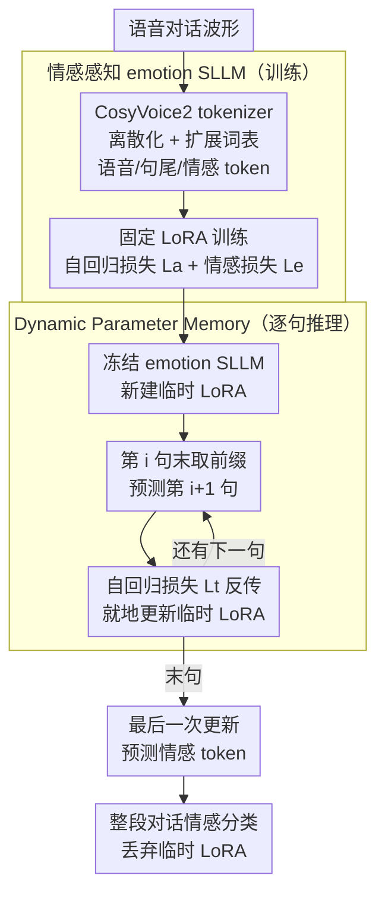

# Dynamic Parameter Memory: Temporary LoRA-Enhanced LLM for Long-Sequence Emotion Recognition in Conversation

**会议**: ICLR2026  
**arXiv**: [2507.09076](https://arxiv.org/abs/2507.09076)  
**代码**: 待确认  
**领域**: 音频语音  
**关键词**: Speech Emotion Recognition, Large Language Model, LoRA, Long-Sequence Processing, Emotion Recognition in Conversation  

## 一句话总结

提出 Dynamic Parameter Memory (DPM) 机制，在推理阶段通过逐句将语音信息编码到临时 LoRA 模块的参数空间中，使有限上下文窗口的语音大语言模型能够处理无限长度的情感对话音频，在 IEMOCAP 和 MELD 上达到 SOTA。

## 背景与动机

语音大语言模型（SLLM）在语音情感识别（SER）任务上展现出巨大潜力，但语音模态固有的高帧率特性严重制约了其处理长音频的能力。以 50Hz 采样率为例，一个 4K 上下文窗口的 SLLM 仅能处理约 80 秒的音频，远不足以覆盖真实对话或会议录音场景。

现有解决方案主要有两类：一是压缩输入 token（如低帧率编解码器、多尺度 Transformer），但这类方法忽略了多轮对话中情感的连续性和惯性；二是扩大模型上下文窗口（如 Kimi、Qwen2.5），但标准注意力机制的二次方复杂度使得计算代价随长度急剧增长。这两种路线在面对足够长的音频序列时，都会遇到根本性的性能瓶颈。

## 核心问题

如何让有限上下文窗口的 SLLM 高效处理无限长度的语音情感对话，同时保留跨语句的情感上下文信息？

## 方法详解

### 整体框架

方法分两阶段。**训练阶段**先造一个情感感知的语音大模型（emotion SLLM）：把语音波形离散化成 token 塞进扩展词表，再用一组固定 LoRA 在两个互补目标下训练它，使它既能像语言模型那样自回归续写后续语音 token、又能在句末吐出情感标识。**推理阶段**引入 Dynamic Parameter Memory (DPM)：冻结上面训好的 emotion SLLM，对每段长音频临时新挂一个 LoRA，让它逐句滑过整段对话，每过一句就用一次"预测下一句"的梯度就地更新这个临时 LoRA，把跨语句的情感上下文不断写进它的参数里。这样 emotion SLLM 充当存放通用情感知识的"长期记忆"，临时 LoRA 充当只服务当前这段对话的"短期工作记忆"，历史信息以参数而非 KV cache 的形态累积，于是显存里始终只装当前一句，绕开了上下文窗口对音频长度的硬性限制。

### 关键设计

**1. 情感感知的 emotion SLLM：让基座模型同时会"说语音"和"判情感"**

要让 LLM 直接消费语音，先得把连续波形离散化并融进词表。作者以 Llama2-7B（32K 上下文）为基座，用 CosyVoice2 tokenizer（25Hz 单码本）把音频转成离散编码，并扩展词表加入语音 token `<audio_i>`、句尾标识 `<audio_end>` 以及四个情感标识 `<emo_hap>`/`<emo_sad>`/`<emo_ang>`/`<emo_neu>`。训练只更新一组 LoRA（rank=64, alpha=64，激活 0.16B 参数），并用两个互补目标拉动：音频自回归损失 $\mathcal{L}_a$ 在每个句末取前 $n_o$ 个 token 作预测目标、前 $n_p$ 个 token 作前缀，用 teacher forcing 训练下一 token 预测，使模型学会语音序列的内在结构；情感监督损失 $\mathcal{L}_e$ 在句尾取前 $n_q$ 个 token 作前缀预测情感标识，并把输出 logits 约束到仅 4 个情感位置以稳住预测。总损失取两者均值 $\mathcal{L} = \frac{1}{2}(\mathcal{L}_a + \mathcal{L}_e)$。前者保证模型"听得懂语音的连续性"，后者直接对齐情感判别，二者结合才让基座模型在后续 DPM 中既能续写又能给出可靠情感。

**2. Dynamic Parameter Memory：用临时 LoRA 的参数当跨句记忆**

直接把整段对话塞进窗口会撞上语音高帧率的天花板——50Hz 下 4K 窗口只够约 80 秒。DPM 换一条路：推理时冻结 emotion SLLM 及其训练好的 LoRA，给每段音频新建一个临时 LoRA，逐句滑过对话。在第 $i$ 句结束时取前 $n_r$ 个 token 作前缀，自回归预测第 $i+1$ 句的 token，用预测与真实 token 间的自回归损失 $\mathcal{L}_t$ 反向传播、就地更新临时 LoRA 的参数。这一步的本质是把"前文说了什么、情感如何流动"通过梯度写进参数而非堆进 KV cache，于是历史信息以参数形态被持续累积，而显存里始终只装当前一句。处理完最后一句后，再做一次更新并让模型预测情感 token，作为整段对话的分类结果；样本结束即丢弃该临时 LoRA，避免污染下一条样本。

为什么参数空间能扛住情感连续性？这正是 DPM 借自人脑的设计直觉：emotion SLLM 是沉淀通用情感知识与音频理解能力的长期记忆，临时 LoRA 是只记住当下这段对话的短期工作记忆。相比把历史压成固定长度嵌入（信息一旦超出维度就被丢弃），用一组可持续微调的参数承载历史，更像"逐行精读"而非"一目十行略读"，能让多轮对话里的情感惯性自然延续而不在压缩中丢失，这也是它在长对话上稳定优于直接推理的根因。也正因为每一步只需容纳单句加前缀，DPM 能处理任意长度音频的充分条件就是 $n_{\text{limit}} \geq n_{\text{max}} + n_r$（上下文窗口 ≥ 单句最大 token 数 + 前缀长度），计算量随句子数线性增长，而非随总 token 数二次增长。

### 一个完整示例

以一段 $N$ 句的对话为例走一遍 DPM：新建临时 LoRA → 处理第 1 句、在句末取前 $n_r$ token 预测第 2 句、用 $\mathcal{L}_t$ 反传更新临时 LoRA → 处理第 2 句、同样预测第 3 句并更新 …… 如此逐句推进，每一步窗口里只有当前句，但临时 LoRA 的参数已累积了前面所有句的语义与情感上下文 → 处理完第 $N$ 句后做最后一次更新，让模型输出情感 token 得到整段对话的情感分类 → 丢弃该临时 LoRA。整段过程中显存占用恒定、历史信息全在参数里流转。

## 实验关键数据

### 消融实验（IEMOCAP / MELD）

| 方法 | IEMOCAP WA | IEMOCAP UA | IEMOCAP WF1 | MELD WF1 |
|------|-----------|-----------|------------|---------|
| SLLM-DPM | **79.38%** | **79.62%** | **79.34%** | **51.22%** |
| SLLM（无 DPM） | 72.82% | 73.34% | 73.58% | 47.90% |
| Classifier | 70.96% | 70.51% | 70.64% | 44.78% |

- DPM 在完整对话上比直接 SLLM 推理提升 **6.56% WA**（IEMOCAP）和 **3.32% WF1**（MELD）
- 在所有长度样本上，DPM 仍保持 2.23% WA 优势

### 与 SOTA 对比

DPM 在 IEMOCAP 上达到 79.38% WA / 79.62% UA / 79.34% WF1，在 MELD 上达到 51.22% WF1，均超越所有对比方法（包括 GatedxLSTM、MERITS-L 等）。

### 关键超参数

- 前缀长度：IEMOCAP 为 1024，MELD 为 256（与对话平均长度相关：IEMOCAP 约 64.96 句/对话，MELD 约 9.80 句/对话）
- LoRA rank=64, alpha=64，激活 0.16B 参数
- 训练学习率 5e-5，DPM 推理学习率 5e-5

## 亮点

1. **推理时参数更新的创新应用**：将 Temporary LoRA 的思想从文本扩展到语音情感识别，解决了跨模态迁移的关键挑战（语音的高时间密度和情感表达的独特结构）
2. **线性复杂度**：DPM 的计算量与句子数成正比，而非与总 token 数的平方成正比，实现了真正的可扩展长序列处理
3. **即插即用**：DPM 是纯推理机制，不需要额外训练，可直接增强已有 emotion SLLM 的长序列能力
4. **优雅的设计直觉**：通过预测-对比-更新的循环，自然地将语义和情感信息编码到参数空间，避免了固定长度嵌入的信息损失

## 局限与展望

1. **仅在离散语音编码上验证**：使用 CosyVoice2 tokenizer，未探索连续表示（如 HuBERT/WavLM 特征）的适用性
2. **句子边界依赖**：DPM 需要预先知道句子边界信息，实际应用中需要额外的 VAD 或分句模块
3. **推理速度**：每句都需要一次前向+反向传播来更新临时 LoRA，推理延迟较高
4. **数据集规模有限**：仅在 IEMOCAP（5531 句）和 MELD 上验证，缺少更大规模数据集的测试
5. **情感类别固定**：当前设计需要在词表中预定义情感标识，扩展到更多情感类别时需要重新训练
6. **单模态**：仅使用音频，未结合文本或视觉模态信息

## 与相关工作的对比

| 维度 | 本文 DPM | Token 压缩方法 | 扩大上下文窗口 | 嵌入压缩（如 Murph） |
|------|---------|--------------|-------------|-------------------|
| 理论上限 | 无限长度 | 受压缩率限制 | 受窗口+计算限制 | 无限但信息损失 |
| 复杂度 | 线性（句子数） | 取决于方法 | 二次方（token数） | 线性 |
| 情感连续性 | 参数空间保留 | 易丢失 | 自然保留 | 固定长度可能丢失 |
| 额外训练 | 不需要 | 需要 | 需要 | 需要 |

与 Temporary LoRA（Wang et al., 2024）的关键区别：原方法针对文本模态，本文针对语音模态，需要解决高帧率和情感表达结构差异的问题，并通过专门训练的 emotion SLLM 提供情感感知的基座模型。

## 启发与关联

- **推理时学习范式**：DPM 属于 test-time training/adaptation 的思路，将"记忆"从显式的 KV cache 转移到隐式的参数空间，这一思想可能推广到其他需要长序列处理的模态（视频理解、时间序列等）
- **参数作为记忆**：将 LoRA 参数视为可动态更新的记忆存储，与 memory-augmented neural networks 有概念上的关联，但实现更简洁
- **语音情感识别的 LLM 化趋势**：自回归结构在序列情感理解上优于传统分类器，暗示 SER 领域可能进一步向 LLM 范式迁移

## 评分

- 新颖性: ⭐⭐⭐⭐ — 将 test-time LoRA 更新应用于语音情感识别是新颖的组合创新
- 实验充分度: ⭐⭐⭐ — 两个标准数据集上验证充分，但缺少更多数据集和消融维度
- 写作质量: ⭐⭐⭐⭐ — 结构清晰，动机阐述合理，公式推导完整
- 价值: ⭐⭐⭐⭐ — 提供了长序列语音情感识别的可扩展解决方案，具有实用价值

<!-- RELATED:START -->

## 相关论文

- [\[AAAI 2026\] Cross-Space Synergy: A Unified Framework for Multimodal Emotion Recognition in Conversation](../../AAAI2026/audio_speech/cross-space_synergy_a_unified_framework_for_multimodal_emotion_recognition_in_co.md)
- [\[AAAI 2026\] Do LLMs Feel? Teaching Emotion Recognition with Prompts, Retrieval, and Curriculum Learning](../../AAAI2026/audio_speech/do_llms_feel_teaching_emotion_recognition_with_prompts_retrieval_and_curriculum_.md)
- [\[ACL 2026\] Anchored Cyclic Generation: A Novel Paradigm for Long-Sequence Symbolic Music Generation](../../ACL2026/audio_speech/anchored_cyclic_generation_a_novel_paradigm_for_long-sequence_symbolic_music_gen.md)
- [\[ACL 2026\] LLM-MC-Affect: LLM-Based Monte Carlo Modeling of Affective Trajectories and Latent Ambiguity for Interpersonal Dynamic Insight](../../ACL2026/audio_speech/llm-mc-affect_llm-based_monte_carlo_modeling_of_affective_trajectories_and_laten.md)
- [\[NeurIPS 2025\] Latent Space Factorization in LoRA](../../NeurIPS2025/audio_speech/latent_space_factorization_in_lora.md)

<!-- RELATED:END -->
