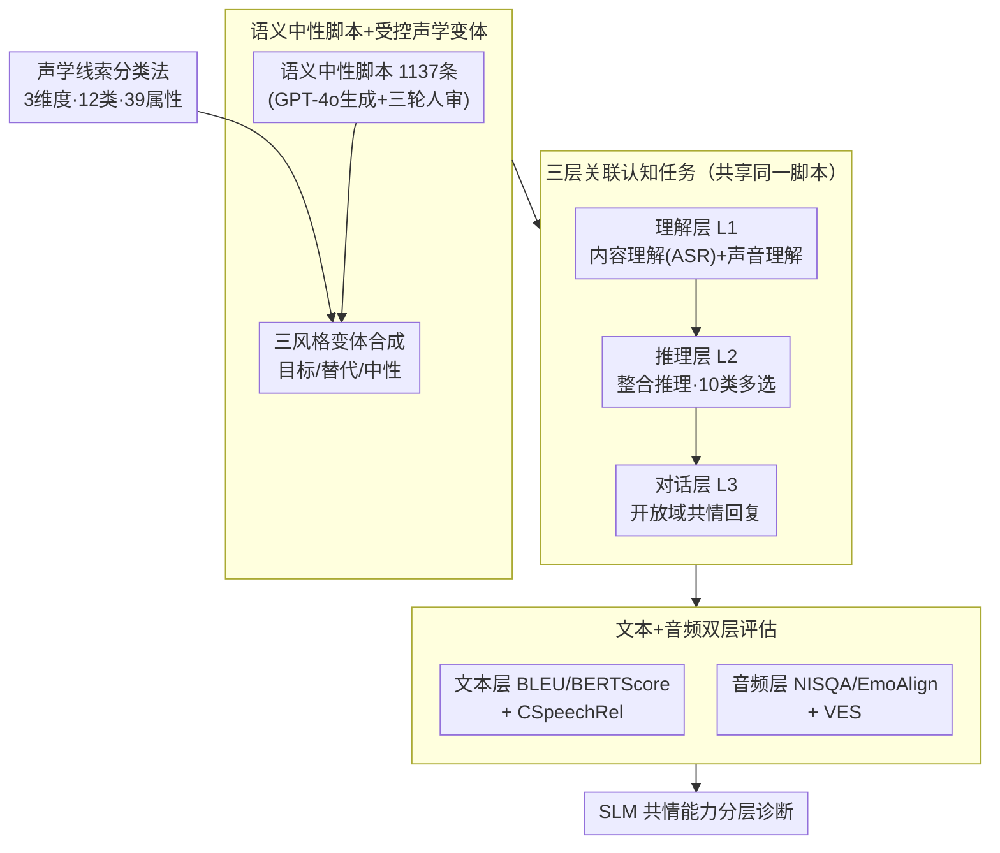

# EchoMind: An Interrelated Multi-level Benchmark for Evaluating Empathetic Speech Language Models

**会议**: ICLR2026  
**arXiv**: [2510.22758](https://arxiv.org/abs/2510.22758)  
**代码**: [项目主页](https://hlt-cuhksz.github.io/EchoMind/)  
**领域**: 音频语音  
**关键词**: Speech Language Model, Empathetic Dialogue, benchmark, Vocal Cue, Evaluation

## 一句话总结

提出 EchoMind，首个面向共情对话的多层级关联基准，通过理解→推理→对话的认知流程，系统评估 Speech Language Models 感知非语言声学线索并生成共情回复的能力。

## 背景与动机

Speech Language Models (SLMs) 在口语理解方面取得了显著进展，广泛应用于智能助手和情感陪伴等场景。然而，有效对话不仅需要理解"说了什么"，还要感知"谁在说"、"怎么说"以及"在什么情境下说"。非语言声学线索（韵律、情感、生理性语音信号、环境音等）对自然且有情感共鸣的交流至关重要。

现有基准存在三大局限：(1) 通常只评估单一能力（理解/推理/对话），缺乏跨能力联合评估；(2) 各任务之间缺乏共享上下文，无法研究层级间依赖关系；(3) 很少直接评估共情能力（empathy），制约了 SLM 在情感智能方面的发展。

## 核心问题

当前 SLM 能否真正感知语音中的非词汇声学线索（如韵律、情感、环境音），并在回复中做出与情感和上下文一致的共情响应？

## 方法详解

### 整体框架

EchoMind 是一个围绕"理解→推理→对话"认知流程构建的共情语音评估基准，整条数据流可以拆成"建数据—跑任务—做评估"三段。建数据时，先准备一批不含任何情感/语境提示的语义中性脚本，再按一套声学线索分类法把同一句话合成成多种声音变体，从而把"怎么说"从"说了什么"里干净地剥离出来。跑任务时，所有声学变体都喂给同一套层层递进的三层任务（理解→推理→对话），且三层共用同一批脚本，方便分析层级间的依赖。最后在文本和音频两个层面分别打分，既看回复内容是否共情，也看回复的声音本身是否共情，最终输出对各模型共情能力的分层诊断。

### 关键设计

**1. 声学线索分类法：给"非语言信息"一个可枚举的坐标系**

共情对话的难点在于情感和语境往往藏在词汇之外的声音里，而现有基准对这类线索的覆盖既零散又不成体系。EchoMind 把声学线索结构化为 3 个粗粒度维度、12 个细粒度类别、共 39 种具体属性：说话人信息涵盖性别（男/女）与年龄（儿童/老年）；副语言信息最为丰富，包含生理状态（嘶哑/气息/声带疲劳/抽泣）、6 类情感、音量（喊叫/耳语）、语速（快/慢）以及咳嗽、叹气、笑声、呵欠、呻吟等非言语表达；环境信息则覆盖天气（风/雷暴/雨）、地点（海滩/篮球场/公交/地铁）、背景人声、突发事件（警报/铃声/喇叭）及音乐、狗叫等其他声响。这套分类法是后续合成声学变体的"坐标系"，让"模型对哪类声学属性敏感、对哪类失聪"成为可逐项度量的问题。

**2. 语义中性脚本 + 受控声学变体：把声学贡献从文字内容里隔离出来**

如果脚本本身带情感词或语境提示，模型即便完全"听不出"语气也能靠文字蒙对，声学感知就无法被单独检验。为此 EchoMind 刻意采用语义中性的对话脚本——不含任何显式情感或上下文线索，再按上面的分类法让同一句话以三种声音风格变体呈现：目标表达、替代表达与中性表达。由于文字恒定、只有声学维度在变，任何能力差异都只能归因于模型对声音的感知。脚本经 GPT-4o 生成叠加人工三轮审核，保留 1,137 条高质量脚本；音频合成按难度分层施策：说话人信息用豆包 TTS，副语言线索用豆包对话、YouTube 声音克隆、GPT-4o-mini-TTS 多方法组合以保证表现力，环境音则混入 AudioCaps 背景声逼近真实场景。

**3. 三层关联认知任务：让层级之间共享上下文、可做依赖分析**

共情不是单一能力，而是"先听清、再想通、最后说得体"的链条；只评其中一环既不全面，也看不出层级间的依赖。EchoMind 据此设计层层递进且共享脚本的三层任务。理解层（Level 1）含两类：内容理解是在表现力语音与环境噪声下做 ASR 转录（3,356 条），声音理解是识别声学线索的多选题，覆盖 1 个粗粒度加 7 个细粒度子任务（4,576 题）。推理层（Level 2）是整合推理，要求综合语言内容与声学特征做高阶判断，分 10 类多选题（4,747 题），如个性化推荐匹配、先行事件推断、共情感知回复选择等。对话层（Level 3）是开放域回复生成（3,356 条），考查模型能否产出上下文连贯、社会得体且有共情力的回复。因为三层共用同一批脚本，可以直接分析"理解失败是否拖累推理与对话"，这正是同类基准缺失的关联性。

**4. 文本+音频双层评估：既评内容共情，又评声音共情**

共情既体现在回复说了什么，也体现在回复以什么声音说出，单测文本会漏掉后者。文本层先用 BLEU、ROUGE-L、METEOR、BERTScore 做客观度量，再用 GPT-4o 以 5 分制做主观打分，包含上下文匹配度（CCtxFit）、回复自然度（CRespNat）、口语化程度（CColloqDeg）与语音信息相关度（CSpeechRel），其中 CSpeechRel 专门衡量回复是否真正利用了输入语音里的声学线索。音频层用 NISQA/UTMOS 评音质、EmoAlign 评情感对齐，并由 Gemini-2.5-Pro 给出声音共情评分（Vocal Empathy Score, VES）来度量回复语音本身的共情表现。基准另附 EchoMind-Human 版本（491 脚本、1,453 条人工录音），用于对照真人语音与合成语音在各层级上的难度差异。

### 一个完整示例

以一句语义中性的台词"你今天回来得真早"为例：先把它合成为带哭腔、气息不稳的目标变体（Level 0 数据）。在理解层，模型需先把这句话准确转录出来（内容理解），并识别出"抽泣""气息"等副语言属性（声音理解）；在推理层，模型要据此推断说话人可能正经历情绪低落，从候选中选出与该状态匹配的共情回复（整合推理）；在对话层，模型则需直接生成一段既贴合语境又带安慰语气的开放域回复。最终用 CSpeechRel 检查回复是否真的回应了那段哭腔，用 VES 检查回复语音本身是否传达出共情——同一条脚本就此串起从"听见"到"听懂"再到"回应"的完整链路。

## 实验关键数据

测试了 12 个先进 SLM（1 个闭源 GPT-4o-Audio + 11 个开源模型）：

| 关键发现 | 数据 |
|---|---|
| 声音理解准确率 >60% 的开源模型 | 仅 Audio-Flamingo3、Qwen2.5-Omni-7B 等 3 个 |
| 推理准确率 >60% 的开源模型 | 仅 DeSTA2.5-Audio 1 个 |
| CSpeechRel（语音线索利用）最高分 | GPT-4o-Audio 3.42，无模型超过 4 分 |
| VES（声音共情）最高分 | GPT-4o-Audio 3.34 |
| 上界实验中 CSpeechRel 提升 | Step-Audio +1.10，GPT-4o-Audio +1.03 |
| Arena 评比胜率 | GPT-4o-Audio 42% > Step-Audio 34% > Qwen2.5-Omni-7B 28% |
| 人工录音 vs TTS | 人工语音在所有层级均更具挑战性，对话层差距最大 |

三个深度分析（RQ）：

1. **Prompt 敏感性**：7/12 模型在增强 prompt 下 CSpeechRel 最高，但部分模型无 prompt 时反而更好，暴露指令跟随能力不足
2. **语音来源影响**：人工录音比 TTS 更难处理，真实声学变异性和韵律细微差别带来更大挑战
3. **共情回复上界**：提供理想声学线索信息后所有模型均提升，但仍有显著提升空间

## 亮点

- **首个多层级关联评估**：理解→推理→对话的层级设计，所有任务共享脚本，可做跨层关联分析，这在同类基准中独一无二
- **语义中性设计**：脚本不含情感词，严格隔离声学线索的贡献，真正测试模型对"怎么说"的感知
- **39 种声学属性的全面覆盖**：从说话人到副语言再到环境信息，维度远超现有基准
- **文本+音频双层评估**：既评内容共情又评声音共情，兼顾客观指标和主观评分（Model-as-judge + 人工评估）
- **揭示核心瓶颈**：CSpeechRel 无模型超过 4 分，说明当前 SLM 在声学线索利用上有系统性短板

## 局限与展望

- 对话脚本由 LLM 生成，虽经人工审核但可能仍有偏向性，未来可引入真实人际对话
- 大部分音频为 TTS 合成，虽有 Human 版本但规模有限（491 条），真实场景覆盖不足
- 仅评估单轮对话，未考虑多轮交互中共情能力的维持与演变
- 评估大量依赖 GPT-4o 等模型打分（Model-as-judge），在 CSpeechRel 等细微维度上评分一致性较低（Spearman 0.64）
- 仅覆盖英语，未涉及其他语言的共情对话评估

## 与相关工作的对比

与现有基准的核心区别（参见论文 Table 1）：

- **SD-Eval / VoxDialog / EChat-eval**：只评对话，不涉及理解和推理，且任务间不关联
- **AIR-Bench / SAKURA / MMAU**：只评理解或推理，不涉及对话
- **URO-Bench**：覆盖理解+推理+对话，但任务间无关联（Corr. = ✗），且仅支持单一表达风格
- **EchoMind**：唯一同时满足多层级任务（理解+推理+对话）、任务间关联（Corr. = ✓）、多表达风格变体（M）、支持环境音的基准

## 启发与关联

- 当前 SLM 在"听懂文字"上已接近人类水平，但"听懂情感/语气/环境"方面差距巨大——这指向了 SLM 下一阶段的核心改进方向
- 上界实验表明，如果声学线索能被完美识别，共情质量可大幅提升，说明瓶颈在感知（perception）而非生成（generation）
- 评估框架的层级设计（感知→推理→生成）可推广到其他多模态评估场景（如视频对话、多模态情感分析）
- 对 prompt 敏感性的分析提示：在应用部署中，精心设计 system prompt 可显著提升共情回复质量

## 评分

- 新颖性: ⭐⭐⭐⭐ — 首个多层级关联共情评估基准，语义中性脚本 + 受控声学变体的设计巧妙
- 实验充分度: ⭐⭐⭐⭐⭐ — 12 个模型、多维评估、人工评估验证、三个深度分析问题，非常全面
- 写作质量: ⭐⭐⭐⭐ — 结构清晰，图表丰富，但部分符号定义分散
- 价值: ⭐⭐⭐⭐ — 揭示了 SLM 声学线索利用的系统性瓶颈，对社区有重要指导意义

<!-- RELATED:START -->

## 相关论文

- [\[ICML 2026\] MultiBreak: A Scalable and Diverse Multi-turn Jailbreak Benchmark for Evaluating LLM Safety](../../ICML2026/audio_speech/multibreak_a_scalable_and_diverse_multi-turn_jailbreak_benchmark_for_evaluating_.md)
- [\[AAAI 2026\] HPSU: A Benchmark for Human-Level Perception in Real-World Spoken Speech Understanding](../../AAAI2026/audio_speech/hpsu_a_benchmark_for_human-level_perception_in_real-world_spoken_speech_understa.md)
- [\[ICLR 2026\] MMSU: A Massive Multi-task Spoken Language Understanding and Reasoning Benchmark](mmsu_a_massive_multi-task_spoken_language_understanding_and_reasoning_benchmark.md)
- [\[ICLR 2026\] ParaS2S: Benchmarking and Aligning Spoken Language Models for Paralinguistic-Aware Speech-to-Speech Interaction](paras2s_benchmarking_and_aligning_spoken_language_models_for_paralinguistic-awar.md)
- [\[ACL 2026\] S2S-Arena: Evaluating Paralinguistic Instruction Following in Speech-to-Speech Models](../../ACL2026/audio_speech/s2s-arena_evaluating_paralinguistic_instruction_following_in_speech-to-speech_mo.md)

<!-- RELATED:END -->
