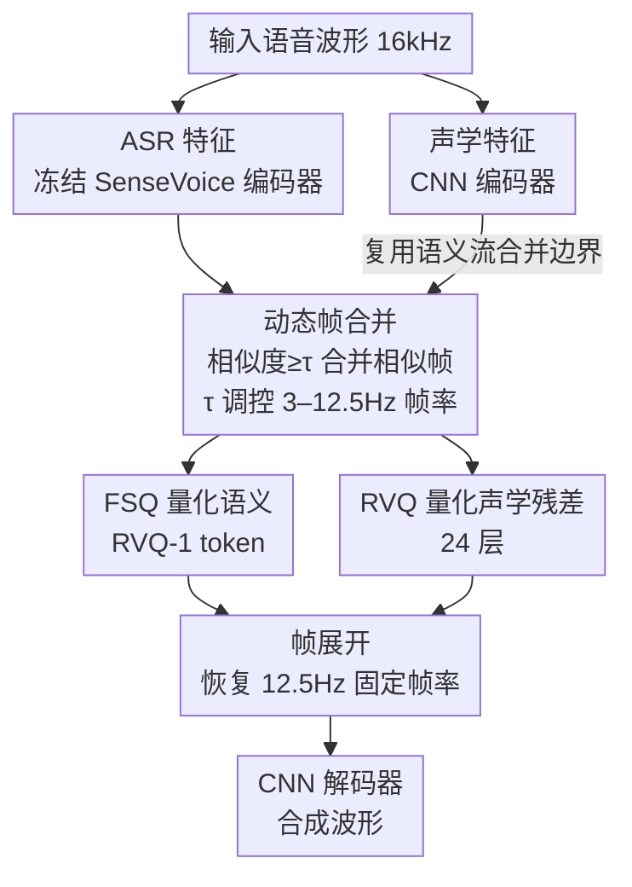

# FlexiCodec: A Dynamic Neural Audio Codec for Low Frame Rates

**会议**: ICLR 2026  
**arXiv**: [2510.00981](https://arxiv.org/abs/2510.00981)  
**代码**: [amphionteam/flexicodec](https://github.com/amphionteam/flexicodec)  
**领域**: 音频语音  
**关键词**: Neural Audio Codec, Dynamic Frame Rate, Low Frame Rate, Speech Tokenization, TTS

## 一句话总结

提出 FlexiCodec，通过 ASR 特征引导的动态帧率合并策略，在 3–12.5Hz 超低帧率下实现高质量语音编解码，同时保持优异的语义信息保留能力。

## 研究背景与动机

**领域现状**：Neural audio codec（如 EnCodec、DAC、SpeechTokenizer）是语音语言模型的基础组件，将语音压缩为离散 token 后可接入 AR LLM 范式。但主流 codec 帧率 ≥50Hz，1秒语音需 50+ token，与文本 ~4.5Hz 的帧率严重不匹配。

**现有痛点**：高帧率带来两个问题——(1) attention 的二次复杂度导致计算开销巨大；(2) 文本-语音模态帧率失配降低 LLM 性能。虽然 Mimi、DualCodec 将帧率降至 12.5Hz，但与文本 4.5Hz 仍有显著差距，且 <12.5Hz 的 codec 研究几乎空白。

**核心矛盾**：直接将现有 codec 推到极低帧率（<12.5Hz）会导致严重的语义信息丢失。作者实验发现 DualCodec 从 12.5Hz 降到 6.25Hz 时，RVQ-1 WER 从 5.93% 飙升至 31.5%。根源在于：(a) 语义与声学信息解耦不充分，低帧率下有限的信息容量被迫在两者间取舍；(b) 固定帧率下采样丢失瞬态语音细节，而自然语音的音素/音节本身是动态速率的。

**本文目标**：如何在 6.25Hz 甚至更低帧率下，既保留语义完整性又维持高音频重建质量，同时支持推理时帧率可控。

**切入角度**：(a) 动态帧率——信息密集区分配更多帧，稀疏区（静音、长元音）合并帧；(b) 用 ASR 特征替代 SSL 特征提供更浓缩的语义信息；(c) 单模型支持 3–12.5Hz 连续可控帧率。

**核心 idea**：利用预训练 ASR 特征的余弦相似度动态合并语义相似帧，实现内容自适应的低帧率语音编码。

## 方法详解

### 整体框架

FlexiCodec 把语音拆成两条平行的流：一条「语义流」用冻结 ASR 编码器抓内容，一条「声学流」用 CNN 抓音色波形，两者都先在 12.5Hz 上对齐。核心创新发生在中间——动态帧合并模块按 ASR 特征的相似度把连续相似帧并成一帧，让帧率随语音内容自适应地降到 3–12.5Hz，随后语义流过 FSQ、声学残差过 RVQ 完成量化；解码时再把动态帧率序列展开回 12.5Hz 固定帧率，交给 CNN 解码器合成波形。

### 关键设计

**1. ASR 特征替代 SSL 特征：把 RVQ-1 喂得更「干净」**

低帧率下每帧能携带的信息量被压到极限，谁占用了语义 token 的容量谁就是浪费。作者发现传统 SSL 特征（HuBERT、WavLM）是以重建为目标训练的，特征里语义和声学信息混杂冗余，分给 RVQ-1 后语义保留很差——DualCodec 从 12.5Hz 降到 6.25Hz 时，RVQ-1 的 WER 从 5.93% 暴涨到 31.5%。FlexiCodec 改用冻结的 SenseVoice-Small（230M）ASR 编码器最后一层隐层 $e_s \in \mathbb{R}^{T \times d}$ 作语义特征：ASR 经 CTC loss 训练、目标直接是预测文本，特征天然更「纯语义」。这一处替换的威力极大——仅在 DualCodec 架构里把 SSL 换成 ASR 特征，6.25Hz 的 RVQ-1 WER 就从 31.5% 直接降到 6.0%。

**2. 动态帧合并：让帧率随语音内容呼吸**

自然语音的信息密度本就不均匀——静音和长元音稀疏、爆破音和快速连读稠密，固定帧率在稀疏区白白烧容量。FlexiCodec 计算相邻语义帧的余弦相似度 $s_t = \cos(e_s[t], e_s[t+1])$，从左到右扫描，把满足 $\min_{t=i}^{j-1} s_t \geq \tau$ 的连续段 $[i, j]$ 取均值合并成一帧，并记录帧长 $\ell_k = j - i + 1$；合并后再接一个 local windowed attention（窗口 ±8）的 Transformer 做上下文精炼，避免相邻合并帧之间出现不自然的跳变。声学流复用语义流算出的同一套合并边界，保持两流帧对齐。这种合并是确定性、无额外可训练参数的，且事后被验证确实「踩在内容上」：合并后帧率与音素率呈强正相关（Pearson $r = 0.775$，线性系数约 0.5），等价于每个合并帧平均编码约两个音素——信息密集区自动拿到更多帧，稀疏区被压扁。

**3. 推理时帧率可控：一个 $\tau$ 调遍 3–12.5Hz**

合并阈值 $\tau$ 既是训练超参也是推理旋钮。训练时每步随机采样 $\tau \in [0.7, 1.0]$，逼模型适应从无合并到激进合并的各种帧率；推理时 $\tau = 1.0$ 不合并、输出 12.5Hz，$\tau$ 越小合并越狠、帧率越低。于是单一模型即可在 3–12.5Hz 连续可调，无需为每个目标帧率单独训练——边缘 TTS 可调低帧率换速度，高保真场景调高帧率换质量，这是固定帧率 codec 给不了的弹性。

**4. FSQ 量化语义、RVQ 量化声学：各用其长**

语义 token 要区分细粒度语义，需要大 codebook；声学残差信息分布复杂，需要逐层渐进精炼。两者用不同量化器：语义流用 Finite Scalar Quantizer（FSQ，$D=5, L=8$，组合出 $8^5 = 32768$ 个 entry）得 RVQ-1 token，FSQ 把特征投到低维后各维独立 round，无需学习 codebook、天然回避 VQ 的 codebook collapse，且以乘法组合方式轻松撑起大 codebook；声学流减去语义流后的残差用 24 层 RVQ（每层 4096 entry）编码，保留残差逐层补细节的能力。

### 损失函数 / 训练策略

总损失为：

$$\mathcal{L} = \mathcal{L}_{\text{recon}} + \lambda_{\text{GAN}} \mathcal{L}_{\text{GAN}} + \lambda_{\text{RVQ}} \mathcal{L}_{\text{RVQ}} + \lambda_{\text{feat}} \mathcal{L}_{\text{feat}}$$

- $\mathcal{L}_{\text{recon}}$：多尺度 L1 Mel 频谱重建损失
- $\mathcal{L}_{\text{GAN}}$：MPD + MRSD 的对抗损失和特征匹配损失
- $\mathcal{L}_{\text{RVQ}}$：RVQ 的 codebook 更新损失 + commitment loss（FSQ 无需额外损失）
- $\mathcal{L}_{\text{feat}}$：RVQ-1 语义 token 嵌入与未量化语义特征的 L2 对齐损失

训练策略：
- 数据：Librilight-Large，54k 小时，16kHz
- 800k steps，8×V100 32GB，batch=5×5s/GPU
- Quantizer dropout：随机选取 $n \in [1, N]$ 层 RVQ 解码，$n=1$ 时仅用语义流
- 每步随机采样 $\tau \in [0.7, 1.0]$，确保模型适应各帧率
- 最大合并帧长 $\ell_k = 8$，local attention 窗口 ±8

## 实验关键数据

### 主实验：与开源 Codec 全面对比（Table 5）

| 系统 | 帧率 (Hz) | 比特率 (kbps) | WER(RVQ1)↓ | WER(RVQ1:8)↓ | PESQ↑ | UTMOS↑ | MCD↓ | SIM↑ |
|------|-----------|---------------|------------|--------------|-------|--------|------|------|
| DAC | 75 | 6.0/8q | 31.2 | 2.27 | 3.77 | 3.62 | 2.34 | 0.90 |
| EnCodec | 75 | 6.0/8q | 5.90 | 2.24 | 3.12 | 3.01 | 2.60 | 0.89 |
| SpeechTokenizer | 50 | 4.0/8q | 5.56 | 2.47 | 3.01 | 3.90 | 3.17 | 0.85 |
| DualCodec | 12.5 | 1.2/8q | 5.93 | 2.26 | 3.29 | 4.18 | 2.81 | 0.85 |
| **FlexiCodec @12.5Hz** | 12.5 | 1.3/8q | **2.76** | **2.23** | **3.35** | **4.22** | **2.76** | 0.85 |
| WavTokenizer | 75 | 0.90/1q | 4.57 | 4.57 | 2.86 | 3.98 | 3.51 | 0.68 |
| XCodec2 | 50 | 0.80/1q | 2.80 | 2.80 | 2.77 | 4.08 | 3.65 | 0.82 |
| **FlexiCodec @8.3Hz** | 8.3 | 0.85/8q | **2.98** | **2.28** | **3.03** | **4.21** | **3.10** | 0.78 |
| TaDiCodec | 6.25 | 0.15/1q | 4.32 | 4.32 | 1.73 | 4.05 | 9.75 | 0.83 |
| SemantiCodec | 25 | 0.34/1q | 23.8 | 23.8 | 1.89 | 2.93 | 5.92 | 0.40 |
| **FlexiCodec @6.25Hz** | 6.25 | 0.64/8q | **4.15** | **2.53** | **2.76** | **4.18** | **3.42** | 0.71 |

Ground Truth WER = 2.1%。FlexiCodec 在各比特率区间均达到 SOTA 语义保留和音频质量。

### 消融实验：动态帧率的贡献（Tables 3 & 4）

**语义消融：**

| 配置 | WER(RVQ1)↓ | 相对变化 | WER(RVQ1:8)↓ | 相对变化 | ASR Probing WER↓ | 相对变化 |
|------|------------|----------|--------------|----------|-----------------|----------|
| FlexiCodec @8.3Hz | 2.98 | — | 2.28 | — | 13.0 | — |
| → 去掉动态帧率 (FFR) | 3.56 | +19% | 2.43 | +6% | 14.5 | +12% |
| FlexiCodec @6.25Hz | 4.15 | — | 2.53 | — | 15.6 | — |
| → 去掉动态帧率 (FFR) | 5.22 | +26% | 2.73 | +8% | 18.8 | +21% |

**声学消融：**

| 配置 | PESQ↑ | MCD↓ | UTMOS↑ | SIM↑ |
|------|-------|------|--------|------|
| FlexiCodec @8.3Hz | 3.03 | 3.10 | 4.21 | 0.78 |
| → 去掉动态帧率 | 3.03 | 3.18 | 4.21 | 0.76 |
| FlexiCodec @6.25Hz | 2.76 | 3.42 | 4.18 | 0.71 |
| → 去掉动态帧率 | 2.76 | 3.47 | 4.18 | 0.70 |

### 关键发现

- **帧率与音素率强正相关**（Pearson $r = 0.775$），验证了动态帧率确实按语音内容复杂度自适应分配——快速发音区获得更多帧，静音/长元音被合并
- **动态帧率的增益在更低帧率时更显著**：6.25Hz 下去掉动态帧率 RVQ-1 WER 恶化 26%，8.3Hz 下恶化 19%。这表明帧率越低，自适应分配越重要
- **动态帧率主要提升语义保留，对声学指标影响较小**：PESQ/UTMOS 几乎不变，MCD/SIM 有轻微改善。原因是声学信息密度与语义密度不一定对齐
- **仅替换 SSL 为 ASR 特征即可大幅提升**：DualCodec 架构下从 SSL 切换到 ASR 特征，6.25Hz RVQ-1 WER 从 31.5% 降至 6.0%
- **$\tau$ 控制帧率与质量的权衡**：$\tau = 0.7$ 时平均帧率仅 3.0Hz（RVQ1 WER 51.5%），$\tau = 0.8$ 时 4.5Hz（WER 14.4%），$\tau = 0.9$ 时 7.9Hz（WER 3.13%）
- **编解码效率高**：RTF 仅 0.018（编码）和 0.006（解码），全帧率通用
- **下游 TTS**：FlexiCodec-TTS 在多帧率下达到有竞争力的性能，同时显著快于高帧率基线

## 亮点与洞察

1. **问题洞察深刻**：精确定位了低帧率 codec 语义丢失的两个根因——语义解耦不足和固定帧率丢失瞬态细节，且用大量实验验证了这两个假设
2. **动态帧率设计优雅**：利用 ASR 特征余弦相似度做帧合并，无需额外训练参数，确定性可复现，且天然支持可控帧率——一个 $\tau$ 参数即可在 3–12.5Hz 间连续调节
3. **ASR 特征的双重复用**：同一个 ASR 特征既用于语义编码（提供 RVQ-1 输入），又用于指导合并边界（计算相似度），设计简洁而高效
4. **实验覆盖极其全面**：codec 重建、语义保留、ASR probing、下游 TTS、音频理解、跨语言泛化、消融、效率分析，几乎无死角
5. **每个合并帧约编码 2 个音素** 的发现，为低帧率 codec 的信息论理解提供了量化参考

## 局限与展望

1. **极低帧率（<4Hz）语义急剧退化**：$\tau = 0.7$ 时 3Hz 帧率 WER 达 51.5%，说明当前方案在极端压缩下仍有瓶颈
2. **声学质量受限于比特率**：动态帧率主要改善语义，声学指标提升有限；声学信息密度与语义密度不对齐是本质原因
3. **跨语言零样本语义性能差**：英文训练的模型在未见语言上语义 token 表现不佳，需要 fine-tuning
4. **帧长属性需额外 3 bit/帧传输**：虽然开销不大，但增加了解码端的复杂性
5. **RVQ-rest 未用 FSQ**：作者承认多层 FSQ（如 rFSQ）可能进一步提升声学量化质量
6. **未探索 AR 模型直接从动态帧率 token 生成**：当前仍需 Frame Unmerging 恢复固定帧率后解码，限制了动态帧率的端到端优势

## 相关工作与启发

- **与 DualCodec 的关系**：FlexiCodec 继承了其双流解耦思路，但将 SSL 特征替换为 ASR 特征并新增动态帧合并，语义保留能力大幅提升
- **与 Token Merging (ToMe) 的关系**：借鉴了视觉领域 DynTok 的思路——用预训练特征的相似度指导 token 合并，但适配到时序语音信号的一维场景
- **与 TaDiCodec 的差异**：TaDiCodec 也做 6.25Hz 但需要文本转写辅助合成，类似 TTS 系统；FlexiCodec 是传统 codec 范式，不依赖转写
- **对语音 LLM 的启发**：FlexiCodec 将语音 token 帧率降到接近文本帧率（4.5Hz），可大幅减少多模态 LLM 中语音 token 的序列长度，降低计算成本
- **对自适应传输的启发**：可控帧率特性适用于自适应码率传输场景——网络带宽好时用高帧率，差时用低帧率

## 评分

- **新颖性**: ⭐⭐⭐⭐ — 动态帧率 codec 的思路新颖，ASR 特征双重复用巧妙，但各子模块（Token Merging、FSQ、双流架构）均有先驱工作，整体是精妙的组合创新
- **实验充分度**: ⭐⭐⭐⭐⭐ — 极其充分，涵盖 codec 重建/语义/声学/消融/下游 TTS/音频理解/跨语言/效率分析，多帧率多基线全面对比
- **写作质量**: ⭐⭐⭐⭐⭐ — 逻辑清晰，动机-方法-实验一气呵成，图表信息量大且易读，Related Work 分类全面
- **价值**: ⭐⭐⭐⭐ — 为低帧率语音 codec 和语音 LLM 提供了实用基础设施，开源代码增强了实际价值；但极低帧率下质量衰减限制了激进压缩场景的适用性

<!-- RELATED:START -->

## 相关论文

- [\[ACL 2026\] Indic-CodecFake meets SATYAM: Towards Detecting Neural Audio Codec Synthesized Speech Deepfakes in Indic Languages](../../ACL2026/audio_speech/indic-codecfake_meets_satyam_towards_detecting_neural_audio_codec_synthesized_sp.md)
- [\[ACL 2025\] Analyzing and Mitigating Inconsistency in Discrete Audio Tokens for Neural Codec Language Models](../../ACL2025/audio_speech/audio_token_consistency.md)
- [\[ICLR 2026\] Toward Complex-Valued Neural Networks for Waveform Generation](toward_complex-valued_neural_networks_for_waveform_generation.md)
- [\[ICML 2025\] FLAM: Frame-Wise Language-Audio Modeling](../../ICML2025/audio_speech/flam_frame-wise_language-audio_modeling.md)
- [\[ICLR 2026\] Dynamic Parameter Memory: Temporary LoRA-Enhanced LLM for Long-Sequence Emotion Recognition in Conversation](dynamic_parameter_memory_temporary_lora-enhanced_llm_for_long-sequence_emotion_r.md)

<!-- RELATED:END -->
