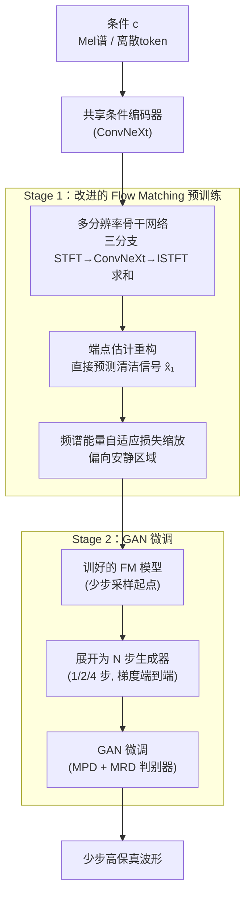

# Flow2GAN: Hybrid Flow Matching and GAN with Multi-Resolution Network for Few-step High-Fidelity Audio Generation

**会议**: ICLR 2026  
**arXiv**: [2512.23278](https://arxiv.org/abs/2512.23278)  
**代码**: [GitHub](https://github.com/k2-fsa/Flow2GAN)  
**领域**: 扩散模型/音频生成  
**关键词**: Flow Matching, GAN, 音频生成, 多分辨率, 少步推理

## 一句话总结
提出两阶段训练框架Flow2GAN，先用改进的Flow Matching学习生成能力，再用GAN微调实现少步（1/2/4步）高保真音频生成，结合多分辨率网络架构处理不同时频分辨率的傅里叶系数。

## 研究背景与动机

**领域现状**：音频生成主要依赖GAN（如HiFi-GAN、BigVGAN）和扩散模型（如DiffWave、RFWave）两大范式。GAN通过精心设计的判别器捕获多粒度音频细节，实现一步高效推理；扩散/Flow Matching模型训练稳定、生成质量高，但需要多步采样。

**现有痛点**：GAN训练收敛慢且存在模式坍塌风险；扩散方法多步推理计算开销大。已有的加速方法（蒸馏、一致性训练等）往往牺牲质量或需要昂贵的重训练。

**核心矛盾**：音频信号的特殊性给Flow Matching带来额外挑战——(a) 静音区域/零能量频段需要精确抵消噪声，速度估计困难；(b) MSE损失均匀对待所有区域，不符合听觉感知（安静区域的误差更明显）。

**本文目标**：同时获得FM的稳定训练特性和GAN的高效少步推理能力，并针对音频特性优化FM训练目标。

**切入角度**：将FM目标从速度估计重构为端点估计，避免空白区域的速度估计困难；引入频谱能量自适应损失缩放；用GAN微调加速推理。

**核心 idea**：改进FM做预训练（端点估计+能量损失缩放）+ GAN微调实现少步高保真。

## 方法详解

### 整体框架
Flow2GAN想同时拿到Flow Matching的稳定训练和GAN的少步高效推理，于是把训练拆成两个阶段。承担生成的骨干是一个多分支ConvNeXt网络：输入条件表示（Mel谱或离散token）先过一个共享的ConvNeXt条件编码器抽特征，再分三路在不同时频分辨率下处理复数STFT系数、各自ISTFT还原波形后求和得到输出。Stage 1用一套针对音频改造过的Flow Matching目标预训练这个骨干——把预测目标从速度改成清洁信号端点，并按频谱能量自适应缩放损失；Stage 2不再从头训GAN，而是直接拿Stage 1训好的模型展开成一个少步（1/2/4步）生成器，挂上MPD/MRD判别器做对抗微调，少量迭代就把高频细节补齐。

### 关键设计

**1. 多分辨率网络架构：三个分支并行覆盖不同时频分辨率**

音频的复杂性很难用单一STFT分辨率刻画清楚，Vocos那样的单分辨率ConvNeXt设计会有信息瓶颈。本文把骨干拆成三个分支，每个分支先把输入信号STFT成复数傅里叶系数、把实部虚部沿特征维拼接喂进ConvNeXt产生输出系数，再经ISTFT还原成波形，最后把三路波形相加得到结果；由于STFT/ISTFT都可微，整个网络端到端可训。其中低帧率分支配更大的嵌入维度、两个高帧率分支用较小维度，在性能和效率间取平衡。此外三个分支共享一个ConvNeXt条件编码器，从Mel谱或token嵌入里抽更深的条件特征——FM推理时这个编码器只需前向一次，特征在多步采样间复用。多分辨率的并行覆盖让网络在不同尺度上各司其职，对音频细节的捕捉比单分辨率更全面。

**2. 端点估计重构：把"学速度"换成"学清洁信号"，绕开空白区域的估计难题**

标准FM让网络预测从噪声到数据的速度 $v_t = x_1 - x_0$，但音频里大量静音区域和零能量频段会让速度估计变得棘手——在这些位置网络既要学 $x_1 - x_0$ 又要学 $-x_0$，两个目标方向不一致，训练信号互相打架。本文索性把预测目标改成端点本身，让网络直接输出 $\hat{x}_1 = g_\theta(x_t, t|\mathbf{c})$，损失也随之重写为

$$\mathcal{L}'_{\text{FM}} = \mathbb{E}_{t,x_0,x_1}\big[\|g_\theta(x_t,t|\mathbf{c}) - x_1\|^2\big]$$

这样无论在哪个区域，网络的任务都统一成"重建清洁信号"，目标一致、更好学。推理时只需把端点估计换算回速度即可走Euler步：

$$x_{t_{i+1}} = x_{t_i} + (t_{i+1}-t_i)\frac{g_\theta(x_{t_i},t_i|\mathbf{c}) - x_{t_i}}{1-t_i}$$

这个重构顺带去掉了速度形式损失里隐含的权重因子 $\frac{1}{(1-t)^2}$，相当于把训练注意力从大 $t$ 拉回到小 $t$ 区间，对少步生成更友好。

**3. 频谱能量自适应损失缩放：让损失偏向人耳更敏感的安静区域**

普通MSE对所有时频点一视同仁，但听感上安静区域里的同等误差比响亮区域更刺耳，均匀加权并不符合感知。本文按参考信号的频谱能量倒数来缩放每个时频点的误差：

$$\mathcal{L}''_{\text{FM}} = \mathbb{E}\Big[\sum_{i,j}\Big(\frac{\mathcal{S}(g_\theta - x_1)}{\sqrt{\mathcal{S}(x_1)+\epsilon}}\Big)_{i,j}\Big]$$

其中 $\mathcal{S}(x) = \text{LinFB}(|\text{STFT}(x)|^2)$ 是经线性滤波器组聚合的能量谱。能量低（安静）的位置分母小、权重大，模型就被迫更认真地拟合这些区域。和先前工作只在每帧（per-frame）做缩放不同，这里同时沿时间和频率两个维度区分能量，缩放粒度更细、更贴近人类听觉。

**4. GAN微调：用预训练好的FM当强初始化，少量对抗迭代补细节**

Stage 1的FM模型虽然稳定，但纯靠少步采样仍缺高频细节。本文从它出发构造一个 $N$ 步生成器 $G_\theta^N$，把多步采样过程展开、梯度在两次前向间端到端反传，再用MPD和MRD两组判别器做对抗微调，训练目标是HingeGAN对抗损失 + L1特征匹配 + 多尺度Mel重建损失的组合。关键在于FM预训练已经提供了一个很好的起点，GAN不必从零学习音频分布，只需少量迭代（如11k步）就能快速拉高细节质量——消融显示，若换成标准FM预训练再做同样的GAN微调，得到的1步模型质量会明显落后于改进FM版本，说明这一步的"免费午餐"建立在前面端点估计+能量缩放的好底子上。

### 损失函数 / 训练策略
- Stage 1: 改进的FM损失（端点估计 + 能量缩放），用ScaledAdam优化器
- Stage 2: HingeGAN + L1特征匹配 + 多尺度Mel重建损失（7个窗口大小）

## 实验关键数据

### 主实验
LibriTTS测试集（Mel-spectrogram条件）：

| 模型 | 参数量 | PESQ↑ | ViSQOL↑ | V/UV F1↑ | Periodicity↓ | FSD↓ |
|------|--------|-------|---------|----------|-------------|------|
| BigVGAN-v2* | 112.4M | 4.379 | 4.971 | 0.978 | 0.055 | 0.014 |
| PeriodWave-Turbo (4步) | 70.2M | 4.434 | 4.965 | 0.958 | 0.096 | 0.020 |
| WaveFM (1步) | 19.5M | 3.540 | 4.894 | 0.943 | 0.124 | 0.098 |
| Flow2GAN 1步 | 78.9M | 4.189 | 4.957 | 0.975 | 0.063 | 0.028 |
| Flow2GAN 2步 | 78.9M | 4.440 | 4.979 | 0.983 | 0.044 | 0.023 |
| Flow2GAN 4步 | 78.9M | **4.484** | **4.986** | **0.985** | **0.037** | 0.016 |

### 消融实验

| 配置 | PESQ↑ | ViSQOL↑ | 说明 |
|------|-------|---------|------|
| 标准FM + GAN微调(1步) | 显著下降 | 下降 | 标准FM预训练不够好 |
| 改进FM (无GAN) 2步 | 中等 | 中等 | 已有改善但缺少细节 |
| 改进FM + GAN 1步 | 4.189 | 4.957 | 完整方案 |
| 改进FM + GAN 4步 | 4.484 | 4.986 | 步数越多越好 |

### 关键发现
- 改进的FM（端点估计+能量缩放）是GAN微调成功的关键前提——标准FM预训练的1步GAN微调性能远不如改进FM版本
- 频谱能量缩放在时频两个维度上做比仅在时间维度上做效果更好
- GAN微调只需少量迭代即可获得快速质量提升，是一种高效的"免费午餐"
- 多分辨率架构比单分辨率Vocos有明显提升

## 亮点与洞察
- **端点估计的简洁优雅**：通过简单的目标重构避免了空白区域的速度估计困难，不需要复杂的architectural change，却有显著效果。
- **两阶段策略的互补性**：FM提供稳定训练+好初始化，GAN提供细节增强+少步推理，各取所长。这种hybrid思路可推广到其他生成领域。
- **能量缩放的感知对齐**：用信号能量倒数做损失权重，让模型更关注人耳敏感的安静区域，简单但有效。

## 局限与展望
- 模型参数量78.9M比Vocos(13.5M)大很多，计算效率值得关注
- 能量缩放的clamp范围(0.01-100)是经验值，未深入分析最优范围
- 三种分辨率的选择缺乏系统消融，可能存在更优配置
- 仅在语音和通用音频上验证，未扩展到音乐生成等其他音频领域

## 相关工作与启发
- **vs BigVGAN**: BigVGAN纯GAN训练需大数据集，Flow2GAN两阶段策略在相同数据上接近其大数据集版本效果
- **vs PeriodWave-Turbo**: 共享GAN微调FM的思路，但Flow2GAN基于改进FM的1步模型显著优于基于标准FM的版本
- **vs WaveFM (一致性蒸馏)**: Flow2GAN的GAN微调方案在1步生成质量上远超一致性蒸馏

## 评分
- 新颖性: ⭐⭐⭐⭐ 端点估计和能量缩放的组合设计针对音频特性，两阶段训练实用
- 实验充分度: ⭐⭐⭐⭐⭐ Mel条件、Token条件、TTS vocoder、消融全面覆盖
- 写作质量: ⭐⭐⭐⭐ 结构清晰，对比充分，demo可在线试听
- 价值: ⭐⭐⭐⭐ 对音频生成领域有直接实用价值，代码开源

<!-- RELATED:START -->

## 相关论文

- [\[ICML 2025\] BinauralFlow: A Causal and Streamable Approach for High-Quality Binaural Speech Synthesis with Flow Matching Models](../../ICML2025/audio_speech/binauralflow_a_causal_and_streamable_approach_for_high-quality_binaural_speech_s.md)
- [\[ACL 2026\] ZipVoice-Dialog: Non-Autoregressive Spoken Dialogue Generation with Flow Matching](../../ACL2026/audio_speech/zipvoice-dialog_non-autoregressive_spoken_dialogue_generation_with_flow_matching.md)
- [\[CVPR 2026\] OmniRet: Efficient and High-Fidelity Omni Modality Retrieval](../../CVPR2026/audio_speech/omniret_efficient_and_high-fidelity_omni_modality_retrieval.md)
- [\[NeurIPS 2025\] Shallow Flow Matching for Coarse-to-Fine Text-to-Speech Synthesis](../../NeurIPS2025/audio_speech/shallow_flow_matching_for_coarse-to-fine_text-to-speech_synthesis.md)
- [\[ICLR 2026\] PrismAudio: Decomposed Chain-of-Thoughts and Multi-dimensional Rewards for Video-to-Audio Generation](prismaudio_decomposed_chain-of-thoughts_and_multi-dimensional_rewards_for_video-.md)

<!-- RELATED:END -->
