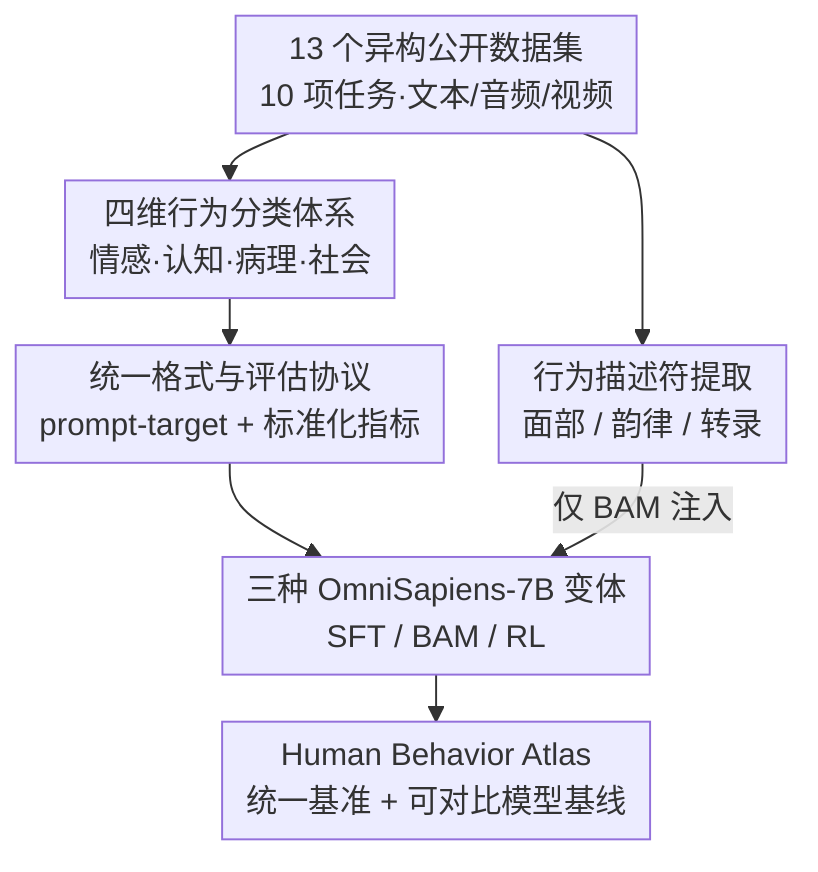

# Human Behavior Atlas: Benchmarking Unified Psychological and Social Behavior Understanding

**会议**: ICLR 2026  
**arXiv**: [2510.04899](https://arxiv.org/abs/2510.04899)  
**代码**: 待审稿后公开  
**领域**: 医学图像  
**关键词**: 行为理解基准, 心理与社会行为, 多模态学习, 统一模型, 情感计算

## 一句话总结

构建 Human Behavior Atlas——首个覆盖情感、认知、病理和社会过程四大维度的大规模多模态行为理解统一基准（101K+ 样本），并训练三种 OmniSapiens-7B 模型变体验证其在多任务训练和迁移学习中的有效性。

## 研究背景与动机

利用智能系统感知心理和社会行为——即通过可观察行为和社会交互表现出来的情感、认知和病理状态——一直是 AI 领域的核心挑战。现有工作的主要问题：

**碎片化**: 每个任务（情感分析、抑郁检测、动作识别等）都有专门的数据集和单任务系统，缺乏跨任务的可扩展性和迁移能力

**格式不一致**: 数据集在输入表示（预提取特征 vs. 原始信号）、输出格式（主观标注 vs. 分类标签）和评估协议上高度异构

**重复投入**: 每个任务需要独立的架构设计、数据收集和训练流程，造成大量资源浪费

**缺乏统一模型**: 社区在训练能够同时理解情感、认知、病理和社会行为的统一模型方面进展有限

Human Behavior Atlas 旨在通过标准化数据格式、统一评估指标来填补这一空白，推动通用行为理解模型的发展。

## 方法详解

### 整体框架

Human Behavior Atlas 把分散在十多个数据集里的心理与社会行为任务收编成一个统一基准。它的构建是一条流水线：先定义一套覆盖四大维度的**行为分类体系**给碎片化任务一个共同坐标系；再把 13 个异构公开数据集（10 项任务、共 101,964 个文本/音频/视频样本）改写成同一套 **prompt-target 格式并配上标准化评估指标**，抹平输入输出与打分口径；同时从原始信号里另抽一路**行为描述符**作为可选增强信号；最后在这个基准上训练三种 **OmniSapiens-7B 变体**（SFT / BAM / RL）。这样既给出"数据集 + 评估协议"，也给出可直接横向对比的统一模型基线。

### 关键设计

**1. 四维行为分类体系：给碎片化的任务一个共同坐标系**

现有任务（抑郁检测、幽默识别、动作理解……）各自为政，缺乏统一的组织视角。作者把所有行为归纳到四个维度：情感状态（从愤怒、快乐这类短期感受到持续性情感）、认知状态（注意力、推理、惊讶、决策等内在心理过程）、病理（抑郁、焦虑等精神疾病状态）、社会过程（幽默、意图、合作等社会互动）。关键之处在于允许一个任务跨多个维度——例如情绪识别同时涉及情感与认知——这让分类体系既能组织已有任务，也为自闭症等新领域预留了挂载位置。

**2. 统一格式与评估协议：抹平输入输出与打分口径的异构**

异构是统一建模的最大障碍：不同数据集在输入表示、输出格式、评估协议上千差万别。作者一方面把覆盖 10 项任务（情感极性 SEN、情绪识别 EMO、社会推理 SOC、意图识别 INT、非语言交流 NVC、幽默检测 HUM、讽刺检测 SAR、焦虑检测 ANX、抑郁检测 DEP、PTSD 检测）的全部样本改写成同一套 prompt-target 形式：prompt 声明可用模态，target 为自由文本或离散标签集；像 PHQ-9 分数这类连续输出则按原始论文的临床指南离散化为标签，保证不同来源的标注口径一致。另一方面统一打分口径——分类型任务用加权 F1（SEN 取正/负情感的二元加权 F1，HUM/SAR/ANX/DEP/PTSD 用加权 F1），EMO 取各类别加权准确率的均值；而 SOC/INT/NVC 这类开放式生成无法用固定标签匹配，改用 LLM-Judge 准确率，由 GPT-5-nano 判断生成回答是否与参考答案语义一致。为消除标注噪声，作者还统一了情绪标签（合并 joy/happiness、区分 positive/negative surprise），让跨任务比较真正可比。

**3. 行为描述符提取：把领域先验作为可选增强信号**

纯端到端模型容易忽略细微的面部和语音线索。作者从三种模态各抽一路结构化描述符：视觉用 MediaPipe 提取面部特征点与体姿关键点，音频用 OpenSMILE（ComParE 2016 特征集）提取音高、能量、谱属性等韵律特征，文本则用 Whisper v3 Large 转录缺失的语音。这些描述符不进入主干，而是作为外挂信号留给 BAM 变体按需调用——能用上的任务受益、用不上的任务直接略过。

**4. 三种 OmniSapiens-7B 变体：用同一基准对比三种建模范式**

三个模型都基于 Qwen2.5-Omni-7B，但走不同路线。SFT 直接监督微调，用倒数第二层（penultimate）表示分别接分类头与解码头处理不同任务类型。BAM 在 SFT 冻结后附加一个残差式 Behavioral Adapter Module，把上一设计抽出的行为描述符经 FFN 编码为 $z_f$ 后注入主干表示 $h_{\text{adapt}} = h_{\text{penult}} + \alpha \cdot z_f$——残差形式保证不破坏原有表示，只在需要时叠加领域线索，这正是描述符能"按需调用"的实现方式。RL 则用 GRPO（Group Relative Policy Optimization）训练，统一走解码头并要求输出推理链格式 `<think>...</think>\boxed{answer}`，把分类也转化为带显式推理的生成。三者并列正是为了在同一基准上验证监督微调、特征增强、强化学习的互补性。

### 损失函数 / 训练策略

三种变体的训练配置各异：SFT 训练 5 个 epoch，用 LoRA（$r=32,\ \alpha=64$），学习率 $1\times10^{-4}$、batch size 512；BAM 训练 4 个 epoch，冻结主干只训练适配器与输出头，适配器隐藏维度为 256；RL 训练 10 个 epoch，学习率 $1\times10^{-6}$，每组采样 $n=5$，奖励为准确率、格式合规与语义相似度三项的复合函数。

## 实验关键数据

### 多任务训练主结果

| 模型 | EMO | HUM | INT | PTSD | ANX | DEP | SEN | SAR | SOC | NVC |
|------|-----|-----|-----|------|-----|-----|-----|-----|-----|-----|
| Gemma-3-4B | .550 | .597 | .227 | .499 | .601 | .463 | .738 | .529 | .191 | .023 |
| Qwen2.5-Omni-7B | .583 | .543 | .254 | .760 | .793 | .714 | .672 | .656 | .254 | .069 |
| HumanOmniV2-7B | .597 | .638 | .263 | .824 | .527 | .654 | .742 | .395 | .282 | .093 |
| **OmniSapiens-7B SFT** | **.631** | .532 | .256 | **1.00** | .909 | .733 | **.768** | .624 | .257 | .121 |
| **OmniSapiens-7B BAM** | **.645** | **.644** | .177 | **1.00** | **.909** | **.789** | **.786** | **.795** | .201 | **.162** |
| **OmniSapiens-7B RL** | .573 | **.639** | **.486** | .968 | .919 | .772 | .396 | .647 | **.304** | .133 |

SFT 和 BAM 在 10 项中 8 项超越通用多模态 LLM。

### 迁移学习实验

| 数据集 | OmniSapiens-7B SFT | Qwen2.5-Omni-7B | 提升 |
|--------|-------------------|----------------|------|
| MOSEI (SEN) | 0.724 | 0.612 | +18.3% |
| MELD (EMO) | 0.711 | 0.684 | +3.95% |
| DAIC-WOZ (DEP) | 0.749 | 0.579 | +29.4% |
| MUStARD (SAR) — 新任务 | 0.658 | 0.473 | **+39.1%** |

### 行为描述符效果 (BAM vs SFT)

| 任务 | SFT | BAM | 变化 |
|------|-----|-----|------|
| NVC | 0.12 | 0.16 | +33.0% |
| SAR | 0.62 | 0.80 | +29.0% |
| HUM | 0.53 | 0.64 | +21.0% |
| DEP | 0.73 | 0.79 | +8.2% |
| SOC | 0.26 | 0.20 | -23.1% |
| INT | 0.26 | 0.18 | -30.8% |

### 关键发现

- **SFT vs RL 的互补性**: SFT 在结构化分类任务上更强，RL 在开放式生成任务（INT、SOC）上更优，体现了两种训练策略的互补性
- **行为描述符的选择性收益**: BAM 在依赖细微面部/语音线索的任务（NVC、SAR、HUM）上大幅提升，但在需要推理的任务（SOC、INT）上反而下降，说明描述符应选择性使用而非全局应用
- **预训练支撑的语用识别能力**: 在讽刺检测任务上，OmniSapiens-7B 能识别语用线索（如 Chandler 的反讽），而 Qwen2.5-Omni-7B 默认预测"无讽刺"（93.2% 预测率）
- **跨任务迁移**: 即使在预训练中未见过 SAR 任务，在 Human Behavior Atlas 上预训练也能提升 39.1% 的迁移效果

## 亮点与洞察

1. **系统性基准构建方法论**: 论文不仅提供数据集，更提出了构建"行为图谱"的方法论框架——从分类体系定义、数据标准化、评估指标统一到模型评测，可推广到自闭症等特定领域
2. **端到端与特征工程的结合**: 通过残差式 BAM 适配器实现行为描述符的非侵入式整合，既不破坏骨干表示，又能按需增强特定任务
3. **RL 在行为理解中的潜力**: OmniSapiens-7B RL 展示了强化学习在需要推理的社会理解任务中的独特优势，暗示未来混合训练策略的方向
4. **数据来源多样性**: 数据集源自北美、欧洲和亚洲的多个地区，具有一定的文化多样性

## 局限与展望

1. **样本量不均衡**: 各任务数据量差异悬殊（CMU-MOSEI 31K vs DAIC-WOZ 189），可能影响多任务训练的平衡
2. **评估依赖 LLM Judge**: SOC/INT/NVC 使用 GPT-5-nano 评判，其一致性和偏差未充分分析
3. **缺乏真实场景验证**: 所有数据来自实验室或影视剧场景，与真实自然交互存在差距
4. **情绪标签合并的主观性**: 将 joy/happiness 合并、拆分 surprise 的决策缺乏严格的理论依据
5. **模型规模受限**: 仅测试 7B 参数模型，未探索规模缩放效应
6. **隐私与伦理**: 使用真实人类行为数据涉及隐私和知情同意问题，论文讨论不够深入

## 相关工作与启发

- **eMotions (Wu et al., 2025)**: 短视频情感分析数据集，但仅覆盖情绪识别单一任务
- **HumanOmni (Zhao et al., 2025)**: 以人为中心的理解数据集，但主要针对人体场景理解而非心理行为
- **PaLI / BLIP / Kosmos**: 大规模多模态预训练的范例，证明了多任务预训练的泛化能力
- **Affective Computing (Picard, 2000)**: 情感计算的开创性工作，本文将其视野扩展到认知、病理和社会维度

## 评分

- 新颖性: ⭐⭐⭐⭐ — 首个覆盖四大行为维度的统一基准，方法论框架有推广价值
- 实验充分度: ⭐⭐⭐⭐⭐ — 三种模型变体、多任务+迁移+描述符消融，分析全面
- 写作质量: ⭐⭐⭐⭐ — 结构清晰，数据呈现直观，但部分细节需查阅附录
- 价值: ⭐⭐⭐⭐ — 填补统一行为理解基准的空白，为社区提供重要研究基础设施

<!-- RELATED:START -->

## 相关论文

- [\[CVPR 2026\] Omni-MMSI: Toward Identity-Attributed Social Interaction Understanding](../../CVPR2026/audio_speech/omni-mmsi_toward_identity-attributed_social_interaction_understanding.md)
- [\[ICML 2026\] Attend to Anything: Foundation Model for Unified Human Attention Modeling](../../ICML2026/audio_speech/attend_to_anything_foundation_model_for_unified_human_attention_modeling.md)
- [\[AAAI 2026\] HPSU: A Benchmark for Human-Level Perception in Real-World Spoken Speech Understanding](../../AAAI2026/audio_speech/hpsu_a_benchmark_for_human-level_perception_in_real-world_spoken_speech_understa.md)
- [\[AAAI 2026\] DualSpeechLM: Towards Unified Speech Understanding and Generation via Dual Speech Token Modeling](../../AAAI2026/audio_speech/dualspeechlm_towards_unified_speech_understanding_and_generation_via_dual_speech.md)
- [\[CVPR 2025\] Crab: A Unified Audio-Visual Scene Understanding Model with Explicit Cooperation](../../CVPR2025/audio_speech/crab_a_unified_audio-visual_scene_understanding_model_with_explicit_cooperation.md)

<!-- RELATED:END -->
