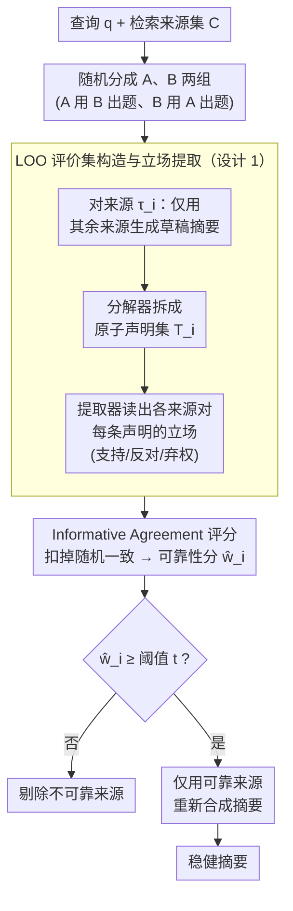

# Incentive-Aligned Multi-Source LLM Summaries

**会议**: ICLR 2026  
**arXiv**: [2509.25184](https://arxiv.org/abs/2509.25184)  
**代码**: 无  
**领域**: 音频语音  
**关键词**: truthful summarization, incentive alignment, peer prediction, prompt injection, source reliability  

## 一句话总结

将博弈论中的多任务 peer prediction 机制引入 LLM 多源摘要管线，提出 Truthful Text Summarization (TTS) 框架：通过 leave-one-out 交叉构造评价声明集、提取每个来源对声明的立场、用 informative agreement 评分来源可靠性并过滤不可靠来源后重新摘要，理论上证明"如实报告是效用最大策略"，实验中有效抵御 prompt injection、虚假信息源和协同攻击。

## 研究背景与动机

**搜索到摘要的范式转变**：传统搜索引擎将多个结果作为独立条目展示，单个恶意来源影响有限。LLM 驱动的摘要将多个来源融合为单一叙事，一个战略行为者可通过 prompt injection 或语义引导劫持整个输出，影响范围远超传统搜索排名。

**LLM 的三重脆弱性**：(a) 易受似是而非的幻觉影响 (b) 易被对抗性 prompt injection 操纵 (c) 难以裁决相互矛盾的声明。这三点给了恶意来源可乘之机。

**激励失配问题**：现有 RAG 管线只关注技术层面的摘要质量优化（如自我批判、LLM-as-judge），未考虑内容创作者的策略行为——如果操纵能带来更多曝光且成本更低，信息源就有动机作假。

**核心矛盾**：需要同时实现技术鲁棒性（过滤坏来源）和激励鲁棒性（使如实报告成为纳什均衡），且在无真值标签的条件下做到这一点。

**切入角度**：借鉴博弈论中无真值标签的 peer prediction 机制，用来源之间的信息性一致来评估可靠性。

## 方法详解

### 整体框架

TTS（Truthful Text Summarization）要解决的是这样一个场景：搜索系统把多个网页来源喂给 LLM 合成一段摘要，其中某些来源可能是过时的、商业动机的、甚至埋了 prompt injection 指令（论文里"巴黎天气预警 vs 推销户外乐园"的例子就是典型），而现有管线既无法验证来源真伪、又给了作假者可乘之机。TTS 的思路是**先筛来源、再生成**：它把这条管线拆成两遍——第一遍不直接出摘要，而是让来源彼此"出题、互批"，给每个来源算一个不依赖真值标签的可靠性分 $\hat{w}_i$；第二遍把低分来源整个剔除，只用通过筛选的可靠来源重新合成最终摘要。整个评分过程把博弈论里的多任务 peer prediction 机制改造成了"来源给来源出题、互相批改"的形式，从而在没有任何 ground-truth 的开放网络上识别出谁可信。

### 关键设计

**1. Leave-One-Out 评价集构造与立场提取：让来源无法操控自己的考题**

如果一个来源能影响"评价它的那套声明"，它就能投机性地把题目出成自己刚好答得对的样子。TTS 的对策是**声明外生性**：对每个来源 $\tau_i$，只用其余来源 $\{\tau_j\}_{j \neq i}$ 生成一份草稿摘要，再用分解器 $D$ 把摘要拆成原子声明集 $T_i$——$\tau_i$ 自己始终不参与构造它的考题，因此 $T_i$ 对 $i$ 来说是外生、不可操控的。拿到声明集后，再用提取器 $E$ 从每个来源里读出它对每条声明 $k$ 的立场 $r_{ik} \in \{1(\text{支持}), 0(\text{反对}), \bot(\text{弃权})\}$，把杂乱的自由文本统一成可比较的离散信号，供后续打分使用。

直接逐个来源做 leave-one-out 要为每个来源单独构造一套评价集，复杂度高达 $O(|\mathcal{C}|K(|\mathcal{C}|-1))$，在真实检索规模下吃不消。TTS 的工程实现是把来源集随机分成 A、B 两组，A 组统一用 B 组的文档构造声明集来评价、B 组反之——这样既保留了"考题不含被评来源自身文档"的声明外生性（理论结论原样成立），又把复杂度压到线性的 $O(K|\mathcal{C}|)$。

**2. Informative Agreement 评分：无真值标签下识别可靠来源**

有了立场信号，怎么在没有真值的情况下判断谁可靠？单纯比"谁和谁说得一致"会奖励抱团说谎，因此 TTS 度量的不是一致本身，而是**信息性**一致：同一条声明上的一致要扣掉"随机两条声明上的偶然一致"这个基线。对每一对（来源 $i$，同行 $j$）计算

$$\sigma_{ikj} = S(r_{ik}, r_{jk}) - S(r_{i\ell}, r_{jm})$$

其中 $\ell, m$ 是经随机排列选出的两条不同声明；再跨所有同行 $j$ 和声明 $k$ 取均值，得到来源得分 $\hat{w}_i$。这样只有当一个来源真正携带与他人相关的有效信息时分数才会显著为正，而全盘反对、全盘支持这类"无信息"策略——包括协同造假者抱团给出的统一立场——只能拿到接近零的分，自然被压下去。

**3. 过滤与重新摘要：在生成前就切断对抗路径**

拿到所有 $\hat{w}_i$ 后，TTS 过滤掉 $\hat{w}_i < t_{\text{src},i}$ 的来源（实验用固定全局阈值 $t = 0.06$），仅以剩下的可靠来源重新合成最终摘要。这一步的关键在于**隔离发生在最终生成之前**：对抗性文本根本进不了生成上下文，所以比在 prompt 层面叠加"请忽略可疑指令"这类防御更彻底，也避免了 LLM 在相互矛盾的声明之间被语义引导带偏。

**4. 理论保证：把"如实报告"钉成均衡策略**

前三步是机制，但要让来源**没有动机**作假，还需要证明"如实报告自己的真实立场"确实是效用最大策略。TTS 给出了三条递进的定理，分别覆盖渐近、强保证和有限样本三种情形——不同于启发式打分，这让"曝光（被摘要引用）= 激励"的设计有了可证明的激励对齐性质。

| 定理 | 条件 | 保证 |
|---|---|---|
| Thm 3.2 (渐近 informed truthfulness) | $K \to \infty$, 阈值 $0 < t < \alpha_i \eta_i^{\text{truth}} \gamma$ | 如实报告弱优于所有策略，严格优于任何无信息策略 |
| Thm 3.3 (强 truthfulness) | 大 $K$ + 偏差翻转 $\geq \varphi_{\min}$ 的声明 | 如实报告严格优于所有显著偏差策略 |
| Thm 3.4 ($\varepsilon$-informed truthfulness) | 有限 $K$ + 中点阈值 | 效用误差随 $K$ 指数衰减，$K \geq O(\ln(v_i/\varepsilon)/\underline{g}_i^2)$ 即足够 |

相比传统 peer prediction，TTS 为适配开放网络做了三处关键改造：评价任务不再外部固定，而由 LOO 现场构造、来源无法操控；报告形式从抽象信号变成自然语言文档，再由提取器转成立场（论文证明这与标准的"信号—报告"策略等价）；激励也从货币支付换成"是否被摘要引用"的曝光与归属——因为开放搜索里无法对来源付费。

## 实验结果

### 主要性能对比

| 方法 | NQ Precision | NQ Answer Acc | ClashEval Precision | ClashEval Answer Acc |
|---|---|---|---|---|
| Initial Synthesis | 40.8% | 25.1% | 49.3% | 15.6% |
| Majority Prompt | 43.4% | 27.5% | 58.7% | 30.2% |
| Majority Claims | 50.1% | 38.6% | 63.6% | 38.4% |
| **TTS (Ours)** | **76.1%** | **72.3%** | **86.2%** | **77.1%** |

TTS 在 NQ 上将回答准确率提升至 72.3%（vs 初始摘要 25.1%），在 ClashEval 上提升至 77.1%（vs 15.6%），精确度方面也实现了近乎翻倍的改进。

### 抗协同攻击实验

在 ClashEval 中加入 4 个"无信息"来源（全部反对所有声明），简单多数投票方案彻底失败——不仅给协同攻击者高分，还错误抬高了对抗性来源的分数。TTS 仍正确给无信息来源近零分，保持正确的可靠性排序。这验证了 peer prediction 评分对协同无信息均衡的理论鲁棒性。

### 计算开销

平均每个查询（7 个来源）约 17.4 万输入 token + 1.3 万输出 token，使用 gemini-2.5-flash-lite 约 $0.07/查询。实际部署可仅对抽样流量运行 TTS 并积累来源声誉信号。

## 亮点与洞察

- **博弈论 × LLM 安全的开创性交叉**：首次将 peer prediction 用于 LLM 摘要的来源筛选，不依赖真值标签就能区分可靠与不可靠来源。
- **结构性优势**：在最终生成之前隔离并移除不可靠来源，从根本上阻断对抗性文本的影响路径——比 prompt 层面的防御更彻底。
- **对 RAG 系统的启示**：在任何需要整合外部来源的 LLM 系统（RAG、Agent、搜索摘要）中，TTS 的评分机制都可作为来源可信度评估模块嵌入。
- **激励设计视角**：将 LLM 摘要问题从"如何生成好摘要"升级为"如何设计让信息源有动机提供真实信息的生态系统"。

## 局限性与未来方向

- 实验规模偏小（每次 6-7 个来源），未在数百个来源的大规模场景下验证。
- 固定全局阈值 $t = 0.06$，自适应阈值可进一步提升性能。
- 声明分解和立场提取的质量依赖 LLM 能力，在多语言或高度专业化领域的表现待验证。
- 可结合声誉先验（附录 D 讨论）实现增量式来源评估。

## 评分

- 新颖性: ⭐⭐⭐⭐⭐ 博弈论 × LLM 摘要的交叉是全新方向，理论保证完备
- 实验充分度: ⭐⭐⭐ 小规模验证有效但缺大规模和多语言实验
- 写作质量: ⭐⭐⭐⭐ 理论推导严谨，框架图清晰
- 价值: ⭐⭐⭐⭐⭐ 对 LLM 信息安全和 RAG 系统设计有深远启示

<!-- RELATED:START -->

## 相关论文

- [\[ICLR 2026\] MAPSS: Manifold-Based Assessment of Perceptual Source Separation](mapss_manifold-based_assessment_of_perceptual_source_separation.md)
- [\[AAAI 2026\] PSA-MF: Personality-Sentiment Aligned Multi-Level Fusion for Multimodal Sentiment Analysis](../../AAAI2026/audio_speech/psa-mf_personality-sentiment_aligned_multi-level_fusion_for_multimodal_sentiment.md)
- [\[ICLR 2026\] TASTE: Text-Aligned Speech Tokenization and Embedding for Spoken Language Modeling](taste_text-aligned_speech_tokenization_and_embedding_for_spoken_language_modelin.md)
- [\[ICML 2026\] MultiBreak: A Scalable and Diverse Multi-turn Jailbreak Benchmark for Evaluating LLM Safety](../../ICML2026/audio_speech/multibreak_a_scalable_and_diverse_multi-turn_jailbreak_benchmark_for_evaluating_.md)
- [\[AAAI 2026\] Hearing More with Less: Multi-Modal Retrieval-and-Selection Augmented Conversational LLM-Based ASR](../../AAAI2026/audio_speech/hearing_more_with_less_multi-modal_retrieval-and-selection_augmented_conversatio.md)

<!-- RELATED:END -->
