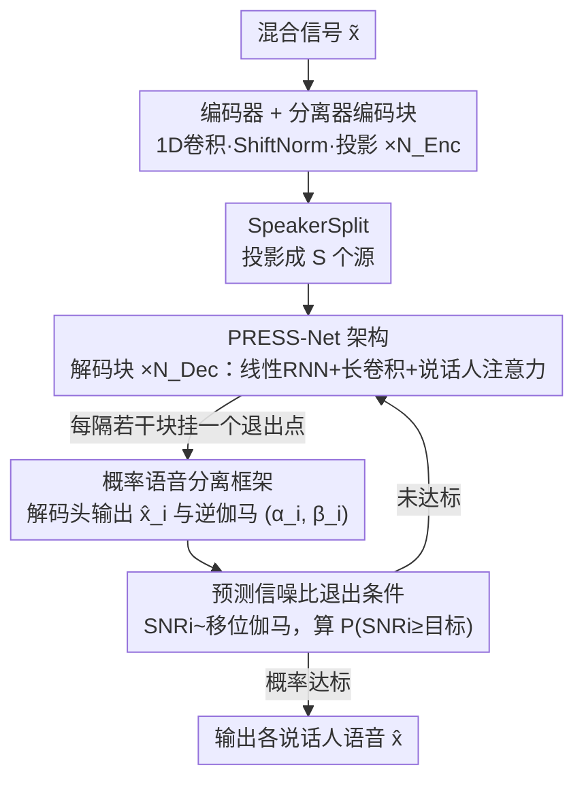

# Knowing When to Quit: Probabilistic Early Exits for Speech Separation

**会议**: ICLR 2026  
**arXiv**: [2507.09768](https://arxiv.org/abs/2507.09768)  
**代码**: 无  
**领域**: 音频与语音  
**关键词**: 语音分离, 早退出, 概率模型, 动态计算, TasNet

## 一句话总结
提出 PRESS（Probabilistic Early-exit for Speech Separation）方法和 PRESS-Net 架构，通过概率框架联合建模干净语音信号和误差方差，推导出基于信噪比（SNR）的可解释早退出条件，实现语音分离网络的细粒度动态计算缩放，同时保持与SOTA静态模型竞争力的性能。

## 研究背景与动机
单通道语音分离（鸡尾酒会问题）近年来在深度学习驱动下取得了显著进展，从TasNet到Conv-TasNet、SepFormer、TF-GridNet和SepReformer，性能不断提升。然而，这些架构都有一个根本性的局限：它们被设计为**固定的计算和参数预算**——无论输入音频是简单（如单人说话、低噪音）还是复杂（如多人重叠、高噪音），都消耗相同的计算资源。

这一局限严重限制了语音分离在**嵌入式和异构设备**（如手机、助听器/hearables）上的应用：
1. 这些设备计算资源有限且波动，需要模型能根据当前资源动态调整计算量
2. 许多实际场景中大部分时间音频是简单的（如安静环境、单人说话），使用全部计算是浪费
3. 现有的动态网络方法（如slimmable networks）的退出条件缺乏可解释性

核心矛盾在于：语音分离需要高质量输出（高SNR），但计算资源受限且变化；需要一种能够**在保证输出质量的前提下自适应地减少计算**的方法，且退出条件必须**可解释**——用户或系统需要知道"我退出是因为当前质量已经足够了"。

PRESS的核心idea：使用概率建模同时预测干净语音和误差不确定性，利用预测的SNR分布作为退出条件——当模型有足够信心认为当前输出已达到目标SNR时，就停止计算。

## 方法详解

### 整体框架
PRESS 要解决的是：让一个语音分离网络能根据输入难易**自适应地少算**，且"什么时候可以停"这件事要说得清楚。它落在 TasNet 家族的编码器-分离器-解码器骨架上：时域混合信号 $\tilde{x}\in\mathbb{R}^T$ 先被编码器压成高维表征，再送进一条很深的解码块堆叠，沿深度每隔若干块就埋一个退出点，每个退出点挂一个独立解码头重建出各说话人语音 $\hat{x}_i$。关键的不同在于，每个退出点除了吐信号，还额外输出一对逆伽马参数 $(\alpha_i,\beta_i)$ 来刻画当前估计的误差不确定性；网络据此把不确定性换算成一个**预测信噪比分布**，在每个退出点自问"达到目标 SNR 的概率够了吗"，够了就停、不够就继续往下算。

### 关键设计

**1. 概率语音分离框架：把"误差不确定性"变成可预测的量**

固定计算预算的分离网络只输出一个点估计，无从判断"现在算到这里到底好不好"。PRESS 改用贝叶斯目标，联合建模干净信号估计 $\hat{x}_i$ 和误差方差 $\sigma_i^2$：假设信号误差服从高斯分布、方差服从共轭逆伽马先验，把 $\sigma_i^2$ 边缘化掉后得到一个多元 Student-t 似然，网络要预测的就是其中的 $(\alpha_i,\beta_i)$：

$$\mathcal{L}_i = \mathrm{St}\big(x_j \mid \hat{x}_i,\, 2\alpha_i,\, (\beta_i/\alpha_i)I\big)$$

这样网络在估计信号的同时被迫预测出刻画自身置信度的 $(\alpha_i,\beta_i)$。相比传统 SI-SNR 只盯着"误差有多大"，Student-t 似然天然在"压低误差/方差比"和"别低估方差"之间取得平衡——低估方差会被似然里的对数方差项惩罚——于是模型对输出质量的自评是被正确校准的，这就为后面的早退出判断提供了原则性依据，也省去了"重建损失 + 利用率损失"那种需要手工调权重、且权衡在训练时就被冻死的做法。

**2. 预测信噪比退出条件：让停机判据直接说人话**

有了不确定性，关键一步是把它翻译成用户能理解的指标。基于上面的分布假设，误差能量服从 $\|x_j-\hat{x}_i\|_2^2\sim\sigma_i^2\chi_T^2$，论文据此把信噪比改进 SNRi 写成（非中心）卡方之比，在长序列下近似成一个移位伽马分布：

$$\text{SNRi} \to 1 + z,\qquad z \sim \mathrm{Gam}\!\left(\alpha_i,\ \frac{\|\hat{x}_i - \tilde{x}\|_2^2}{\beta_i T}\right)$$

这意味着退出条件不再是"连续两层输出的欧氏距离小于某阈值"这类不挂钩性能的黑盒指标，而是 SNRi 本身。用户可以直接指定一个目标（如 22 dB 的信噪比改进），模型在每个退出点用这个伽马分布的 CDF 算出"当前已达标的概率"，一旦概率超过容忍阈值就停止计算。退出由此变得**可解释**——系统能明确告诉你"我停下来是因为质量已经以高置信度满足了你的目标"，而且整套判据可以在推理时随设备资源现场调整，而非训练时定死。

**3. PRESS-Net 架构：用线性 RNN 撑长程、用累积参数化保证质量单调不降**

要让"多退出点"真正可用，架构必须满足两点：长序列上算得起、且越深的退出点质量不能反而变差。时序建模因此用基于 minGRU/RG-LRU 的线性 RNN（配 Hydra 双向化 + 并行关联扫描）替代注意力，以**线性复杂度**做长程依赖，避开 Transformer 把算力绑死在上下文长度上的问题；整体沿用 SepReformer 的早分裂 U-net 思路，前 $N_{\text{Enc}}$ 个编码块处理混合表征、经 SpeakerSplit 投影成 $S$ 个源，后 $N_{\text{Dec}}$ 个解码块各串起线性 RNN、长卷积、说话人注意力，并用初始化为 $10^{-5}$ 的 LayerScale 把网络训得又深又窄。

真正让多退出点不互相拖累的是**累积参数化**：逆伽马参数取前缀和 $\alpha_i = \sum_{j\le i}\tilde{\alpha}_j$、$\beta_i = (\sum_{j\le i}\tilde{\beta}_j)^{-1}$，从而强制后一个退出点的预测分布**随机支配**前一个，保证估计质量沿深度单调不降——这正是消融里"退出点从 4 加到 12 也不掉点"的来源。此外编码器在下采样后用 **ShiftNorm** 取代标准归一化：下采样会让信号幅度随输入响度漂移，标准归一化会放大安静段的混叠伪影，ShiftNorm 额外编码一个幅度通道来消除这一伪影。

### 损失函数 / 训练策略
主损失就是上面的多元 Student-t 对数似然，等价于在对数尺度上度量误差。多说话人分离需要把预测源和目标源对应起来，传统 uPIT 用匈牙利算法枚举最优排列、复杂度 $O(S^3)$ 且在排列切换处不连续；PRESS 改把每个目标源 $x_s$ 看成所有预测源的一个混合，用混合模型似然来匹配，借 LogSumExp 实现排列不变并把复杂度降到 $O(S^2)$、同时抹平硬排列的不连续：

$$\ln p(x_s) = \ln \sum_i w_i \cdot \mathrm{St}\big(x_s \mid \hat{x}_i,\, 2\alpha_i,\, (\beta_i/\alpha_i)I\big)$$

训练初期为防梯度消失，用带温度 $\tau$ 的 LogSumExp 变体，$\tau$ 从序列长度 $T$ 快速退火到 1。排列处理还采用**联合早退出似然**——把所有退出点的源当成整体一起排列（求和所有退出点与说话人、不加权），而非每个退出点各自独立排列；后者会差 1.2–1.4 dB，因为独立排列允许网络在说话人注意力层偷偷交换源。优化用 AdamW（$\beta=(0.9, 0.999)$，weight decay 0.01），基础学习率 $5\times10^{-4}$，余弦调度加 5000 步线性 warmup，4 秒片段、batch size 1、最多 4M 步、梯度 L2 范数裁剪到 1。两档配置为 PRESS-4(S)（$D=64$、$P=4$、$N_{\text{Enc}}=8$、$N_{\text{Dec}}=12$、4 个退出点）和 PRESS-12(M)（$D=128$、$N_{\text{Enc}}=4$、$N_{\text{Dec}}=24$、12 个退出点）。

## 实验关键数据

### 主实验

| 模型 | WSJ0-2Mix SI-SNRi | WSJ0-2Mix SDRi | Libri2Mix SI-SNRi | 参数量 |
|------|------------------|----------------|-------------------|--------|
| Conv-TasNet | — | — | — | —M |
| SepFormer | — | — | — | —M |
| MossFormer2 + DM | — | — | — | —M |
| TF-GridNet (L) | — | — | — | —M |
| SepReformer (L) + DM | — | — | — | —M |
| **PRESS-4 @ 4 (S)** | 竞争力 | 竞争力 | 竞争力 | —M |
| **PRESS-12 @ 4 (M)** | — | — | — | —M |
| **PRESS-12 @ 8 (M)** | — | — | — | —M |
| **PRESS-12 @ 12 (M)** | 竞争力 | 竞争力 | 竞争力 | —M |

（注：原文表格中具体数值在HTML转换时丢失，但结论明确）

### 消融实验

| 配置 | SI-SNRi变化 | 说明 |
|------|-----------|------|
| SI-SNR vs Student-t似然 | 相当 | 概率损失不牺牲性能 |
| uPIT vs 混合似然 | 相当 | 混合似然更高效且不损失性能 |
| 联合排列 vs 逐退出排列 | +1.2~1.4 dB | 联合排列显著更优 |
| 有ShiftNorm vs 无 | SI-SNRi相同 | 但ShiftNorm消除了混叠伪影 |
| 退出点数量 4/6/12 | 无性能下降 | 增加退出点不损害最终性能 |

### DNS2020 语音增强

| 模型 | SI-SNRi | PESQ | 计算量 |
|------|---------|------|--------|
| MP-SENet | — | — | — |
| TF-Locoformer | — | 3.72 | — |
| ZipEnhancer | — | 98.65(DNSMOS) | — |
| PRESS-4 @ 4 (S) | 超越ZipEnhancer | — | 显著更低 |

### 关键发现
- 单一PRESS模型通过早退出可以覆盖多个计算预算点，与多个不同规模的静态模型竞争
- 增加退出点数量（从4到6到12）不会损害任何退出点的性能——这意味着可以"免费"获得更细粒度的计算缩放
- 概率损失（Student-t似然）与传统SI-SNR损失性能一致，但额外提供了不确定性估计
- 联合排列策略（所有退出点的源统一排列）远优于逐退出点独立排列，这可能是因为后者允许网络在说话人注意力层中交换源
- 预测SNRi分布在训练集上校准良好，但在测试集上存在系统性过度自信，可通过简单的矩匹配重校准修正
- PRESS在语音增强任务上也表现出色，甚至在显式建模噪声信号的情况下仍优于专门的增强模型

## 亮点与洞察
- **概率框架的优雅性**：将贝叶斯不确定性估计与实际工程需求（SNR目标）精确对接，退出条件不再是"黑盒指标"而是用户可直接设定的SNR阈值
- **混合似然替代uPIT**：O(S²)的混合似然不仅更高效，还消除了匈牙利算法的不连续性，且理论上可扩展到更多说话人
- **线性RNN替代注意力**：使用minGRU/RG-LRU实现线性时间复杂度的长距离时序建模，配合Hydra双向性，在保持性能的同时大幅降低计算
- **ShiftNorm的工程洞察**：编码器下采样后信号幅度依赖于输入响度，标准归一化会放大安静段的伪影，ShiftNorm通过附加一个常数通道编码幅度信息来解决
- **累积参数化强制退出质量单调递增**：α_i = Σ_{j≤i} α̃_j, β_i = (Σ_{j≤i} β̃_j)^{-1}，确保后续退出点的预测分布随机支配前序退出点

## 局限与展望
- 当前建模全局标量方差σ²，对非平稳信号（安静段+嘈杂段并存）的时变特性建模不足
- 预测SNRi近似依赖于序列足够长（T→∞），对短片段的可靠性受限
- 在WSJ0-2Mix测试集上存在显著的校准差距（训练集校准良好但测试集过度自信），虽可通过重校准缓解但根本原因（可能是分布外泛化）未解决
- 未探索因果/实时场景下的时间维度早退出——当前每个退出点处理整个发言
- 未探索混响和噪声环境下的语音分离性能
- 迭代模型变体（单一共享块重复使用）是一个有趣方向但存在参数-计算耦合问题

## 相关工作与启发
- **SepReformer**: PRESS-Net的架构设计大量借鉴SepReformer的早分裂、U-net结构和构建块，但用线性RNN替代注意力
- **Slimmable Networks**: 通过调整网络宽度实现动态计算的另一路线，PRESS选择的是深度维度的动态性
- **PDRE**: 之前在语音增强中使用概率模型（GMM）但未探索退出条件，PRESS补全了这一关键缺环
- **SepIt / DiffSep**: 迭代精化和扩散方法也具有自然的动态计算特性，PRESS提供了更原则性的停止条件
- 本文的概率早退出框架可推广到任何具有迭代结构的信号处理任务

## 评分
- 新颖性: ⭐⭐⭐⭐⭐ （概率早退出框架+SNR退出条件的推导极具创新性）
- 实验充分度: ⭐⭐⭐⭐⭐ （三个数据集、多种模型配置、详尽的消融和校准分析）
- 写作质量: ⭐⭐⭐⭐⭐ （数学推导严谨，工程洞察清晰，附录详实）
- 价值: ⭐⭐⭐⭐⭐ （为语音分离的动态部署提供了原则性框架，实用价值高）

<!-- RELATED:START -->

## 相关论文

- [\[ICLR 2026\] MAPSS: Manifold-Based Assessment of Perceptual Source Separation](mapss_manifold-based_assessment_of_perceptual_source_separation.md)
- [\[ICLR 2026\] Efficient Audio-Visual Speech Separation with Discrete Lip Semantics and Multi-Scale Global-Local Attention](efficient_audio-visual_speech_separation_with_discrete_lip_semantics_and_multi-s.md)
- [\[ICLR 2026\] When and Where to Reset Matters for Long-Term Test-Time Adaptation](when_and_where_to_reset_matters_for_long-term_test-time_adaptation.md)
- [\[ICLR 2026\] When Style Breaks Safety: Defending LLMs Against Superficial Style Alignment](when_style_breaks_safety_defending_llms_against_superficial_style_alignment.md)
- [\[ACL 2026\] TellWhisper: Tell Whisper Who Speaks When](../../ACL2026/audio_speech/tellwhisper_tell_whisper_who_speaks_when.md)

<!-- RELATED:END -->
