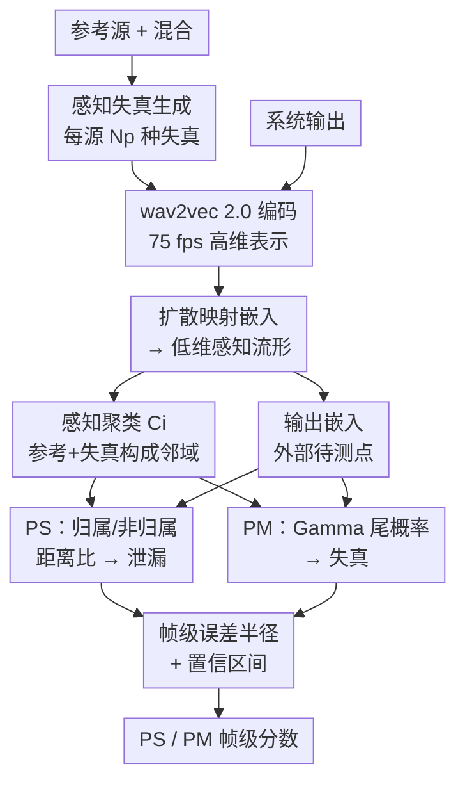

# MAPSS: Manifold-Based Assessment of Perceptual Source Separation

**会议**: ICLR 2026  
**arXiv**: [2509.09212](https://arxiv.org/abs/2509.09212)  
**代码**: 有（[https://github.com/Amir-Ivry/MAPSS-measures](https://github.com/Amir-Ivry/MAPSS-measures)）  
**领域**: 音频语音  
**关键词**: 音源分离评估, 感知度量, 扩散映射, 流形学习, 自监督表示

## 一句话总结

提出 Perceptual Separation（PS）和 Perceptual Match（PM）两个互补度量，利用扩散映射将自监督编码表示嵌入低维流形，首次在功能上解耦音源分离中的泄漏和自失真，与 18 种主流指标对比在与主观评分的相关性上几乎始终排名第一或第二。

## 研究背景与动机

音源分离的客观评估与人类主观感知长期存在不匹配。现有指标的根本缺陷：

**混淆泄漏与失真**：SDR、SI-SDR 等将竞争说话人泄漏和目标信号失真混合为全局能量比，无法判断错误来源

**缺乏细粒度分析**：PESQ、STOI 将整段语音映射为单一 MOS 分数，无帧级定位能力

**黑盒缺乏置信度**：DNSMOS 等学习型指标无法量化决策可靠性

**无法兼顾多维需求**：没有现有指标族能同时实现解耦泄漏/失真、帧级分析和误差估计

核心目标：设计互补的感知度量——PS 量化分离程度（泄漏），PM 量化匹配程度（失真），均可微、帧级操作（75 fps）、具备理论误差保证。

## 方法详解

### 整体框架

MAPSS 是一个**纯评估框架**（不训练任何网络），目标是把音源分离里一直被混在一起的两类错误——别的说话人"泄漏"进来、目标语音自身"失真"——在功能上拆开来分别打分。它的核心思路是：与其在波形/能量域里算比值，不如把信号送进一个能反映人耳感知的低维几何空间，让"距离"直接等于"听起来有多不一样"，再在这个空间里量出输出离目标源有多近、像不像目标源。

整条管线是这样走通的：先对混合中每个参考源施加几十种基础失真，把它和系统输出一起用预训练 wav2vec 2.0 编码成高维表示；这些表示经扩散映射统一投射到低维感知流形上，每个源的"参考 + 失真"自然聚成一团点（感知聚类），而系统输出则作为一个"外部待测点"落在流形某处；最后在流形上算两个互补分数——PS 看输出离哪团聚类更近（泄漏多少），PM 看输出落在目标聚类失真分布的哪个位置（失真多少），并给每一帧的分数配一个可证明的误差半径。全程帧级操作（75 fps），PS/PM 都可微。

### 关键设计

**1. 扩散映射：让流形上的欧氏距离直接等于感知相异度**

整套度量的几何根基是扩散映射，它要解决的是"在什么空间里算距离才对应人的听感"这个根本问题。把编码后的高维向量集记为 $\mathcal{X} = \{\mathbf{x}_i\}_{i=1}^N$，先用高斯核衡量两两相似度 $\mathbf{K}_{i,j} = \exp(-\|\mathbf{x}_i - \mathbf{x}_j\|_2^2 / \sigma_\mathbf{K}^2)$，再做 $\alpha$-归一化抵消采样密度不均的影响，归一成行随机转移矩阵 $\mathbf{P} = \mathbf{D}^{-1}\mathbf{K}$。对 $\mathbf{P}$ 做谱分解得到低维嵌入 $\boldsymbol{\Psi}_t(\mathbf{x}_i) = (\lambda_1^t \mathbf{u}_1(i), \ldots, \lambda_d^t \mathbf{u}_d(i))^T$。这样做的关键收益是：嵌入空间里的欧氏距离恰好等于原空间的扩散距离 $D_t^2(i,j) = \|\boldsymbol{\Psi}_t(\mathbf{x}_i) - \boldsymbol{\Psi}_t(\mathbf{x}_j)\|_2^2$，于是后面所有"算距离"的操作都能直接在低维流形上做，而距离值仍忠实反映表示的感知相异性。它是 PS、PM 共享的舞台——没有这层几何，后面"离哪团聚类更近"的判断就没有感知意义。

**2. 感知失真聚类：用几十种失真把每个源的"感知邻域"撑成一团点**

要判断系统输出离哪个源更近，先得给每个源在流形上画出它的"势力范围"。对第 $i$ 个参考源，对它施加 $N_p \in [60,70]$ 种基础失真（截幅、陷波滤波、音高偏移、混响、有色噪声等），失真从轻度（15 dB SNR 有色噪声）一路覆盖到重度（重尾混响、硬削波），让这组样本撑满人耳能接受的感知波动范围。把这些失真波形连同参考自身经 wav2vec 2.0 编码、扩散映射嵌入后，构成感知聚类

$$\mathcal{C}_i^{(d)} = \{\boldsymbol{\Psi}_t^{(d)}(\mathbf{x}_i), \boldsymbol{\Psi}_t^{(d)}(\mathbf{x}_{i,p}) \mid p=1,\ldots,N_p\}$$

一个刻意的设计是：**系统输出的嵌入不放进聚类里**——聚类只由参考及其失真构成，输出始终作为"外部待测点"来度量，避免输出自己影响自己的归属判断而引入循环偏差。正是这团失真点把"目标源在感知上还能接受的范围"具象成了几何区域，PS/PM 才有了可比较的参照系。

**3. PS 与 PM：解耦泄漏与失真的两个互补度量**

有了流形和聚类，MAPSS 用两个独立分数分别回答两个被传统指标搅在一起的问题。

PS（感知分离）回答"输出里混进了多少别的源"。它用 Mahalanobis 距离比较输出到两类聚类的远近：

$$\widehat{\text{PS}}_i^{(d)} = 1 - \frac{\hat{A}_i^{(d)}}{\hat{A}_i^{(d)} + \hat{B}_i^{(d)}} \in [0,1]$$

其中 $\hat{A}_i^{(d)}$ 是输出到自身归属聚类的距离，$\hat{B}_i^{(d)}$ 是到最近的非归属聚类的距离。当 $\hat{A} \ll \hat{B}$，即输出牢牢贴着目标源、远离其他源时，PS → 1 表示分离干净；反之若输出被其他源拉近，$\hat{B}$ 变小、PS 下降，恰好对应泄漏增多。它只看"相对归属"而非绝对能量，这正是它能把泄漏从失真里单独拎出来的原因。

PM（感知匹配）回答另一半问题"输出对目标源本身有多大失真"。做法是先收集聚类内各失真样本到参考的距离集 $\hat{\mathcal{G}}_i^{(d)}$，经 KS 检验确认这些距离近似服从 Gamma 分布，再用矩匹配估出 Gamma 参数 $\hat{k}_i^{(d)}, \hat{\theta}_i^{(d)}$。把输出到参考的实际距离代入 Gamma 的尾概率，就得到

$$\widehat{\text{PM}}_i^{(d)} = Q(\hat{k}_i^{(d)}, \hat{a}_i^{(d)} / \hat{\theta}_i^{(d)}) \in [0,1]$$

直观上，只要输出落在"可接受失真"的分布范围内，PM → 1；输出偏离参考越远、落到分布尾部，PM 越低。把失真建模成概率分布而非单一阈值，让 PM 能容忍合理的感知波动、只惩罚真正异常的偏离。两者一个看"是否站对了源"、一个看"像不像自己"，归一化互信息分析证实它们提供不重叠的评估视角。

**4. 理论误差保证：给每一帧的分数配一个可证明的误差半径**

因为流形维度 $d$ 是有限截断的，PS/PM 必然和理论真值有偏差，这个偏差需要可控，否则"带置信度"无从谈起。论文基于 Schur 补分解推导出帧级的确定性误差半径，例如对 PS

$$|\text{PS}_i - \text{PS}_i^{(d)}| \leq \frac{B_i^{(d)} |\delta_{i,i}| + A_i^{(d)} |\delta_{i,j^*}|}{(A_i^{(d)} + B_i^{(d)})^2}$$

并进一步给出非渐近的高概率置信区间。实验中代入这个最坏情况误差半径后，PS/PM 与主观分的排名几乎不变——说明截断带来的误差小到不影响实际选型判断，这也是 MAPSS 敢称"带置信度"的依据。

### 损失函数 / 训练策略

MAPSS 不涉及任何网络训练，编码器直接用预训练 wav2vec 2.0。核心计算全是确定性步骤：失真生成（信号处理）、wav2vec 2.0 前向推理、扩散映射谱分解、Mahalanobis 距离与 Gamma 拟合。由于 PS、PM 均**可微**，它们也可反过来直接作为训练损失去优化分离模型，打通了评估与优化的壁垒。

## 实验关键数据

### 主实验

**与 18 种主流指标在 SEBASS 数据库上的对比**

在英语/西班牙语/音乐混合场景中，PS 和 PM 与人类主观 MOS 的线性（Pearson）和秩（Spearman）相关性：

| 指标类别 | 代表指标 | 排名表现 |
|---------|---------|---------|
| 能量比 | SDR, SI-SDR, SIR, SAR | 中等偏下 |
| 经典感知 | PESQ, STOI, ESTOI | 中等 |
| 学习型 | DNSMOS, SpeechBERTscore | 中上 |
| **MAPSS** | **PS, PM** | **几乎总排第1或第2** |

**互补性验证**：PS 和 PM 的归一化互信息（NMI）分析表明二者高度互补——PS 捕捉泄漏，PM 捕捉失真，提供不重叠的评估视角。

### 消融实验

**编码器选择**：wav2vec 2.0 表现最佳，其自监督表示与人类感知对齐度最高

**失真集大小**：$N_p \in [60,70]$ 为最佳范围，过少覆盖不足，过多收益递减

**误差半径验证**：帧级确定性误差半径在几乎所有场景下不改变 PS/PM 排名，高概率置信区间进一步提供统计保证

### 关键发现

1. **解耦确实有效**：PS 专门捕获泄漏、PM 专门捕获失真，NMI 证实互补性
2. **自监督表征 + 流形学习 > 传统特征**：扩散映射下自然形成有意义的感知聚类
3. **帧级粒度价值**：75 fps 的帧级评估可精细定位分离质量问题
4. **跨语言/跨模态泛化**：英语、西班牙语和音乐场景均表现优异

## 亮点与洞察

- **首个功能性解耦泄漏与失真**的音源分离评估指标，填补方法论空白
- **"感知-几何假说"被实验验证**：扩散距离→欧氏距离→感知相似性的链条成立
- **可微性使其可作为训练损失**，打破评估与优化的壁垒
- 基础失真集设计精巧：从轻度到重度创建参考信号的"感知邻域"
- **首次为分离度量提供理论误差保证**：确定性半径 + 非渐近置信区间

## 局限与展望

1. 每源需编码 60-70 种失真，计算开销较高，实时应用受限
2. 依赖 wav2vec 2.0，对非语音音频（纯乐器）可能非最优
3. $N_f \geq 2$ 假设：PS 需要非归属聚类，单源增强场景下无法直接使用
4. 手工失真集可能存在盲区，可探索数据驱动的失真生成
5. 西班牙语秩相关较弱，跨语言鲁棒性需更多验证

## 相关工作与启发

- **扩散映射**（Coifman & Lafon, 2006）本用于降维，创新性应用于音频质量评估
- **wav2vec 2.0** 的自监督表示有效捕捉感知相关的音频特征
- **Mahalanobis 距离 + Gamma 分布建模**提供概率统计框架
- 启发：流形学习在评估指标设计中大有可为，可推广到图像/视频质量评估

## 评分

- 新颖性: ⭐⭐⭐⭐⭐ — 全新评估范式，理论和实践均有开创性贡献
- 技术深度: ⭐⭐⭐⭐⭐ — 扩散映射推导充分，误差保证完整且非平凡
- 实验充分度: ⭐⭐⭐⭐ — 18 种基线对比全面，但仅用一个评估数据库
- 实用价值: ⭐⭐⭐⭐ — 可微可做训练损失，但计算开销可能限制大规模应用

<!-- RELATED:START -->

## 相关论文

- [\[ICLR 2026\] Incentive-Aligned Multi-Source LLM Summaries](incentive-aligned_multi-source_llm_summaries.md)
- [\[ICLR 2026\] Knowing When to Quit: Probabilistic Early Exits for Speech Separation](knowing_when_to_quit_probabilistic_early_exits_for_speech_separation.md)
- [\[AAAI 2026\] Multi-granularity Interactive Attention Framework for Residual Hierarchical Pronunciation Assessment](../../AAAI2026/audio_speech/multi-granularity_interactive_attention_framework_for_residual_hierarchical_pron.md)
- [\[ICLR 2026\] Efficient Audio-Visual Speech Separation with Discrete Lip Semantics and Multi-Scale Global-Local Attention](efficient_audio-visual_speech_separation_with_discrete_lip_semantics_and_multi-s.md)
- [\[ACL 2026\] Exploration of Perceptual Speech Features for Clinical Decision-Support in Mental Health Care](../../ACL2026/audio_speech/exploration_of_perceptual_speech_features_for_clinical_decision-support_in_menta.md)

<!-- RELATED:END -->
