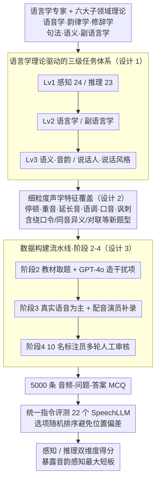

# MMSU: A Massive Multi-task Spoken Language Understanding and Reasoning Benchmark

**会议**: ICLR 2026  
**arXiv**: [2506.04779](https://arxiv.org/abs/2506.04779)  
**代码**: [https://huggingface.co/datasets/ddwang2000/MMSU](https://huggingface.co/datasets/ddwang2000/MMSU)  
**领域**: 音频语音  
**关键词**: 语音理解, SpeechLLM, 语言学基准, 多任务评测, 感知与推理

## 一句话总结
提出 MMSU（5000 条音频 QA、47 个任务），首个系统融合语言学理论的语音理解与推理基准，评测 22 个 SpeechLLM，发现现有模型在音韵感知和复杂推理上仍存在显著差距。

## 研究背景与动机

**领域现状**: SpeechLLM（如 Qwen-Audio、Kimi-Audio、Gemini 等）已具备处理音频输入的能力，在 ASR、音频理解等任务上表现优异。然而，这些模型在细粒度语音感知和复杂推理上的能力尚未被系统评估。

**现有痛点**: 现有语音基准存在三大不足：
   - **覆盖面窄**: 主要聚焦于语义级任务，忽略了日常语音中常见的非语言现象（停顿、讽刺、自我纠正、韵律变化等）
   - **数据真实性不足**: 大量依赖 TTS 合成语音，缺乏人类真实语音的声学多样性
   - **缺乏语言学理论指导**: 评估设计未考虑语音学、韵律学、修辞学等基础语言学原理，导致评估存在盲区

**核心矛盾**: 真正的语音理解不仅要理解"说了什么"（语义），还需理解"怎么说的"（韵律、情感）和"真正想表达什么"（语用），但现有基准无法评测后两者。

**本文目标** 构建一个全面、有语言学理论支撑的语音理解评测框架，系统评估 SpeechLLM 在感知和推理两个维度的能力。

**切入角度**: 以语言学理论体系（语音学、韵律学、修辞学、句法学、语义学、副语言学）为基础，自上而下设计任务分类体系。

**核心 idea**: 将语言学理论系统融入语音基准设计，创建跨 47 个任务的综合评测框架，揭示 SpeechLLM 在音韵感知和推理上的关键短板。

## 方法详解

### 整体框架
MMSU 要解决的问题是：现有语音基准大多只评"说了什么"（语义），评不了"怎么说的"（韵律、情感）和"真正想表达什么"（语用），而且大量依赖 TTS 合成语音、缺乏语言学理论支撑。它的破解思路是**先立骨架、再填数据、最后评模型**。骨架是一套建立在语言学理论上的**三级任务体系**：第一级把能力切成感知（Perception，24 任务）和推理（Reasoning，23 任务）——感知只需从音频里提取基础特征、不依赖跨模态背景知识，推理则要在感知之上整合上下文语义做多步推断；第二级各分语言学（Linguistics）和副语言学（Paralinguistics）；第三级再细到语义/音韵、说话人特征/说话风格。围绕这副骨架，MMSU 刻意覆盖停顿、重音、语调、讽刺等细粒度声学现象，并用一条**四阶段流水线**（框架与任务设计 → 题目与选项 → 音频采集 → 人工审核）产出 5000 条专家标注的音频多选题（MCQ），最后以统一指令评测 22 个 SpeechLLM。

### 关键设计

**1. 语言学理论驱动的三级任务体系：给评测一副学科骨架**

以往基准"有什么数据评什么"，任务零散、缺学科逻辑，最后只能给出一个笼统的平均分，没法定位模型究竟在哪个语言层面失灵。MMSU 反过来**先从六个语言学子领域出发**（语音学、韵律学、修辞学、句法学、语义学、副语言学），反推需要哪些任务才能覆盖完整的语言理解能力，再把这些任务挂到一棵三级树上：第一级感知 vs 推理，对应人类"先听清、再想懂"的认知过程；第二级语言学（研究语言结构与意义）vs 副语言学（研究音色、情绪、音高等如何影响语义）；第三级语言学再分语义与音韵、副语言学再分说话人特征与说话风格。这套自上而下的设计让评测有了学科深度——哪个子领域弱、是听不出还是想不通，都能在树上对号入座，而不是被一个总分糊弄过去。

**2. 细粒度声学特征覆盖：把评测推到"怎么说的"层面**

多数基准停在语义层，对停顿、重音、延长音、语调升降这类非语言信号几乎不评，而它们恰恰是日常语音里携带大量信息的部分。MMSU 沿着上面的骨架为每类声学现象单独设题：非语言声音（哭泣、咳嗽）、口音（印度英语、英式英语）、情感状态、韵律特征（重音、延长音、停顿）、语调变化等都有专门题目去考；更进一步，它首次纳入了绕口令、讽刺检测、同音异义推理、语调推理、对联匹配等以往基准从未涉及的题型。结果是模型无法只靠转写文本蒙混过关，必须真正"听"出声学线索才能答对，从而把感知能力从语义理解中单独剥离出来度量。

**3. 四阶段构建流水线（真实语音 + 专家质控）：保证声学真实与标注可靠**

合成语音复现不出人类发声中那些微妙的声学细节，而这些细节正是音韵、副语言任务的命门。MMSU 因此用一条带严格质控的四阶段流水线产出数据：**阶段 1** 是上面的框架与任务设计（咨询语言学专家、定出 47 个任务，即设计 1）；**阶段 2** 从权威语言学教材与在线来源收集多选题，并用"专家在环"策略让 GPT-4o 生成额外的合理干扰项以丰富答案空间；**阶段 3** 优先采集真实人类语音，音韵类任务（重音、延长音、语调、停顿）缺开源数据时请专业配音演员定向录制，另补 15 名不同背景的真人录音、少量用 Azure 多音色 TTS 增广；**阶段 4** 由 10 名受训标注员多轮过滤/精修低质或歧义样本，再经专家与团队终审，并为每条样本标上任务类型、类别和语言学子领域。先理论后数据的顺序，保证每条样本都对应明确的语言学考察点，而不是事后硬贴标签。

评测本身采用统一指令提示、选项随机排序以避免位置偏差；本文是 benchmark 工作，不涉及模型训练。

## 实验关键数据

### 主实验

| 模型 | 大小 | 感知 Avg | 推理 Avg | 整体 Avg |
|------|------|----------|----------|----------|
| Human | - | 91.24 | 86.77 | 89.72 |
| Gemini-2.0-Flash | - | 57.51 | 68.15 | 62.63 |
| GPT-4o-Audio | - | 57.30 | 66.62 | 61.67 |
| Qwen2.5-Omni-7B | 7B | 53.26 | 69.99 | 61.25 |
| Kimi-Audio | 7B | 43.52 | 76.03 | 59.28 |
| Qwen2.5-Omni-3B | 3B | 42.37 | 72.76 | 56.83 |
| MiniCPM-O | 8.6B | 40.54 | 73.57 | 56.53 |
| MERaLiON | 10B | 35.74 | 73.68 | 54.10 |
| SALMONN | 7B | 29.83 | 30.04 | 30.01 |
| Random Guess | - | 25.02 | 25.37 | 25.37 |

### 消融实验

| 维度 | 最佳模型 | 准确率 | 人类表现 | 差距 |
|------|----------|--------|----------|------|
| 感知-语义 | Kimi-Audio | 57.64% | 87.10% | -29.5 |
| 感知-音韵 | Qwen2-Audio | 44.93% | 94.32% | -49.4 |
| 感知-副语言 | Qwen2.5-Omni-3B | 39.19% | 92.88% | -53.7 |
| 推理-语义 | Qwen2.5-Omni-7B | 81.52% | 82.16% | -0.6 |
| 推理-音韵 | Qwen2.5-Omni-7B | 82.39% | 87.60% | -5.2 |

### 关键发现
- **人机差距巨大**: 最佳模型整体准确率 62.63%，人类 89.72%，差距 27 个点
- **音韵感知是最大短板**: 感知-音韵维度上最佳模型仅 44.93%，与人类差距近 50 个点
- **推理强于感知**: 模型在语义推理上接近人类水平，但在需要整合声学线索的感知任务上表现差
- **闭源模型优势不明显**: Gemini/GPT-4o 仅略优于 Qwen2.5-Omni-7B，说明感知能力未随规模显著提升
- **端到端模型 > 级联模型**: 直接处理音频的模型表现优于基于 ASR 转写再理解的方案

## 亮点与洞察
- 首个系统融合语言学理论的语音理解基准，任务设计有学科深度
- 47 个任务覆盖面极广，相比此前最大的 MMAU（27 任务）提升明显
- 揭示了一个重要洞察：SpeechLLM 的推理能力已接近人类，但感知能力（尤其是音韵感知）严重落后
- 数据质量高：真实语音为主、专家审核、多轮标注

## 局限与展望
- 目前仅支持英语，多语言覆盖有待扩展
- 评测格式为四选一 MCQ，可能无法完全反映开放式语音理解能力
- 部分任务样本量有限（每任务约 100 条），统计显著性需关注
- 未纳入多轮对话场景下的语音理解能力评测
- 可以进一步分析模型错误的类型和模式，指导针对性改进

## 相关工作与启发
- 与 VoiceBench、MMAU、AIR-Bench 等语音基准互补：MMSU 首次覆盖韵律、语调、修辞等维度
- "感知≠推理"的发现为 SpeechLLM 训练策略提供重要方向：应重点提升声学感知能力
- 为多模态 VLM 评测提供新范式：以学科理论指导 benchmark 设计，避免"有什么评什么"的被动模式

## 评分
- 新颖性: ⭐⭐⭐⭐ 首次系统引入语言学理论指导语音基准设计
- 实验充分度: ⭐⭐⭐⭐⭐ 22 个模型、47 个任务、含人类基线，评测极为全面
- 写作质量: ⭐⭐⭐⭐ 层次清晰，任务分类体系完善
- 价值: ⭐⭐⭐⭐⭐ 揭示 SpeechLLM 关键瓶颈，为社区提供重要评测基础设施

<!-- RELATED:START -->

## 相关论文

- [\[ICLR 2026\] Stitch: Simultaneous Thinking and Talking with Chunked Reasoning for Spoken Language Models](stitch_simultaneous_thinking_and_talking_with_chunked_reasoning_for_spoken_langu.md)
- [\[NeurIPS 2025\] A Multi-Task Benchmark for Abusive Language Detection in Low-Resource Settings](../../NeurIPS2025/audio_speech/a_multitask_benchmark_for_abusive_language_detection_in_lowr.md)
- [\[AAAI 2026\] HPSU: A Benchmark for Human-Level Perception in Real-World Spoken Speech Understanding](../../AAAI2026/audio_speech/hpsu_a_benchmark_for_human-level_perception_in_real-world_spoken_speech_understa.md)
- [\[ICLR 2026\] EchoMind: An Interrelated Multi-level Benchmark for Evaluating Empathetic Speech Language Models](echomind_an_interrelated_multi-level_benchmark_for_evaluating_empathetic_speech_.md)
- [\[ICLR 2026\] TASTE: Text-Aligned Speech Tokenization and Embedding for Spoken Language Modeling](taste_text-aligned_speech_tokenization_and_embedding_for_spoken_language_modelin.md)

<!-- RELATED:END -->
