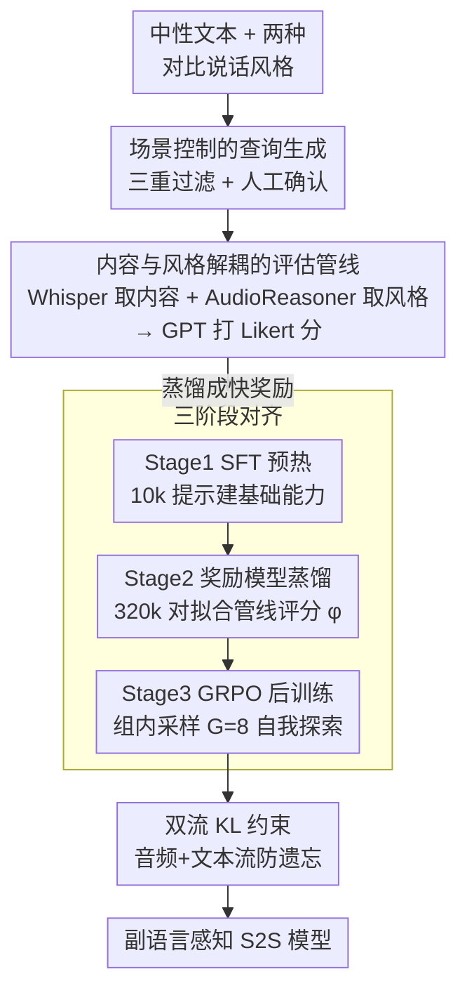

# ParaS2S: Benchmarking and Aligning Spoken Language Models for Paralinguistic-Aware Speech-to-Speech Interaction

**会议**: ICLR 2026  
**arXiv**: [2511.08723](https://arxiv.org/abs/2511.08723)  
**代码**: [项目页面](https://paras2sbench.github.io/)  
**领域**: 语音对话 / 强化学习  
**关键词**: 语音到语音, 副语言感知, benchmark, GRPO, 奖励模型

## 一句话总结

提出 ParaS2S 框架——包含一个评估副语言感知（emotion/sarcasm/age/gender）的语音到语音基准 ParaS2SBench，以及一个基于 GRPO 的 RL 对齐框架 ParaS2SAlign，使 S2S 模型能够在极少标注数据下习得根据说话风格调整回复的能力。

## 研究背景与动机

语音不仅传递文字内容，还携带丰富的**副语言信号**（paralinguistic cues）——情感、语调、说话者属性等，这些信号共同塑造了真实意图并引导恰当的回复。当前 S2S 模型存在几个核心问题：

**"语调聋" (Tone-deaf) 问题**：当前 S2S 模型（包括 Qwen2.5-Omni、GPT-4o Voice mode、GLM-4-Voice）在面对不同说话风格时，回复几乎没有差异。实验显示它们的评分在 3 分左右（5 分制），与忽略说话风格的 Pipeline 基线表现相当。

**缺乏评估基准**：现有基准大多关注语音到文本的理解能力（如 VoiceBench），或评估文本回复质量，没有基准直接评估 S2S 模型的输出语音在内容和风格上的恰当性。

**数据稀缺瓶颈**：构建副语言感知的 S2S 训练数据需要风格标注和表达性录制，成本极高。这是开发此类模型的主要障碍。

核心研究问题：受 DeepSeek-R1 的启发——推理能力可以通过 RL 在无 SFT 示范下涌现——**副语言感知对话能力是否也能通过 RL 在最少监督下涌现**？

## 方法详解

### 整体框架

ParaS2S 由两块拼成：评估侧的 ParaS2SBench 自动生成覆盖情感、讽刺、年龄、性别四个副语言维度的语音测试查询，每个查询配对两种对比说话风格，并直接对"输入语音—输出语音"这一对的适配度打分；训练侧的 ParaS2SAlign 则用 SFT 预热、蒸馏奖励模型、GRPO 后训练三步，把这套自动评分变成可优化的奖励信号，在几乎不依赖人工标注的情况下让 S2S 模型学会按说话风格调整回复。评估侧产出的 Likert 分数正是训练侧的奖励来源，两块由此串成一条从"怎么测"到"怎么练"的闭环。

### 关键设计

**1. 场景控制的查询生成：逼模型只能靠音频判断说话者状态**

测试副语言感知最大的陷阱是模型可能仅凭文本字面就"猜中"恰当回复，从而绕过对音频的理解。为此每条查询都被刻意构造成中性文本，例如 "I just bumped into my ex." 这句话本身不暗示任何情绪倾向；同一句文本再配上两种对比鲜明的说话风格（如惊讶 vs 悲伤），使得只有读懂语气才能给出正确回应。生成数据时用 ChatGPT 自动施加中性测试、合理性测试、副语言相关性测试三重过滤——分别确保文本不泄露情绪、两种风格下都存在合理回复、且风格确实改变了恰当回复的内容——最后再由人工确认，保证基准考的是音频信号而非文本捷径。

**2. 内容与风格解耦的评估管线：把"语音好不好"拆成两个可自动化的子问题**

直接判断一段输出语音是否得体很难，于是评估被分解为内容和风格两路并行：用 Whisper-v3 把输入输出语音转成文本拿到内容 $c_i, c_o$，用 AudioReasoner 分析说话风格得到 $s_i, s_o$，再交给 ChatGPT 4.1 结合查询要求 $r$ 综合打一个 Likert 分数，即 $f_{\text{gpt}} = GPT(c_i, s_i, c_o, s_o, r)$。这种"文本中介"的桥接方式既规避了端到端语音评分的困难，又让整条管线完全可自动运行，实测与人工评分的 Pearson 相关系数稳定超过 0.7。

**3. 三阶段对齐：先有基础能力，再把慢评估蒸馏成快奖励，最后放进 RL 探索**

基座模型完全没有副语言感知，直接上 RL 根本采样不到有意义的回复，所以 Stage 1 先用 10k 语音提示、经 gpt-4o-mini-tts 合成表达性回复做 SFT 预热，把基础能力建起来。但评估管线本身太慢、无法支撑 RL 的高频打分，于是 Stage 2 让 SFT 模型对 10k 查询各生成 32 个回复（共 320k 对），用管线打分后训练一个奖励模型 $\phi$ 去逼近管线评分，把"慢但准"的评估蒸馏成"快且够用"的标量奖励。Stage 3 则在 100k 条无标注语音提示上跑 GRPO：组内采样 $G=8$ 个回复，用 $\phi$ 打分后组内归一化得到优势函数并更新策略——这样模型从自身生成的回复中自我探索，把人工标注需求压到最低的同时仍能持续提升。

**4. 双流 KL 约束：学新技能时别把原有对话智能忘掉**

GRPO 在追逐副语言奖励时很容易偏离基座分布、损坏原本的通用对话能力，因此损失里加入 KL 惩罚项并同时作用于音频和文本两个 token 流。消融显示去掉该项（$\beta=0$）会让 VoiceBench 性能严重下降，呈现典型的灾难遗忘；而取 $\beta=0.2$ 时副语言能力与通用能力达到最佳平衡，是新旧能力之间的稳态工作点。

### 损失函数 / 训练策略

三个阶段各用一套损失：SFT 是标准 next-token prediction，同时优化音频流 $a_o$ 和文本流 $t_o$；奖励模型用交叉熵损失，把 Likert 分数当成单字符预测任务来拟合；GRPO 是带 KL 惩罚的组相对策略优化，奖励直接来自蒸馏出的奖励模型 $\phi$。训练以 Kimi-Audio 为基座，SFT 与 GRPO 跑在 8×NVIDIA H100 上用 FSDP，SFT 学习率 1e-5、全局批次 64，RL 学习率 5e-4、查询批次 32、组大小 8，奖励模型则在单张 H100 上用 LoRA 微调、学习率 1e-6。

## 实验关键数据

### 主实验

**S2S 模型综合比较**（ParaS2SBench 分数，5 分制）

| 模型 | Synthetic Avg | Real Avg | Overall Avg |
|------|-------------|---------|------------|
| Whisper-GPT-TTS (Pipeline基线) | 3.022 | 3.487 | 3.176 |
| GPT-4o Voice mode | 3.284 | 3.639 | 3.403 |
| Qwen2.5 Omni | 3.248 | 3.612 | 3.369 |
| GLM-4-Voice | 3.033 | 3.037 | 3.034 |
| Kimi-Audio (基座) | 2.892 | 1.265 | 2.350 |
| **Kimi-Audio SFT** | **4.076** | **3.714** | **3.955** |
| **Kimi-Audio GRPO** | **4.441** | **4.161** | **4.382** |
| GPT-TTS (Topline) | 4.705 | 4.766 | 4.725 |

关键观察：
- 所有现有 S2S 模型的表现与 Pipeline 基线相当（~3.0-3.4），说明它们确实不具备副语言感知
- SFT 带来 68% 的相对提升，GRPO 在此基础上再提升 11%
- GRPO 模型接近 Topline（理想 TTS 系统）的表现

### 消融实验

| 配置 | 关键指标 | 说明 |
|------|---------|------|
| RL w/ 10h SFT 预热 | 匹配 50h SFT | RL 的标签效率极高 |
| RL w/ 20h SFT 预热 | 匹配 100h SFT | 仅需 1/5 标注即可达到相同性能 |
| KL $\beta = 0$ | VoiceBench 大幅下降 | 无 KL 约束导致灾难遗忘 |
| KL $\beta = 0.2$ | 两指标均优 | 最优平衡点 |
| 组大小 $G < 8$ | 性能显著下降 | $G=2$ 时两个样本常获相同分数 |
| 组大小 $G \geq 8$ | 无额外提升 | $G=8$ 足够提供学习信号 |
| 更多资源投入 SFT vs RM | SFT 更有利 | 10h 标注即可构建可用的奖励模型 |

### 关键发现

1. **基准与人类评分高度一致**：Pearson 相关系数均超过 0.7，模型排名与人类评估几乎一致（仅一个交换）
2. **RL 的标签效率远超 SFT**：10h SFT 预热 + RL 即可匹配 50h 纯 SFT。SFT 需要超过 10 倍的数据才能与 RL 持平
3. **合成数据到真实语音的泛化**：在合成数据上训练的 SFT 和 GRPO 在真实语音测试集（IEMOCAP、MELD）上同样有效
4. **跨域泛化**：在 IEMOCAP 上 RL 训练的模型在 MELD 上也有提升，反之亦然
5. **人类主观评估**：GRPO 模型在主观评估中也超越 SFT 7.6%，尽管普通用户对副语言失误更宽容

## 亮点与洞察

1. **发现并量化了"语调聋"问题**：首次系统性地揭示当前 SOTA S2S 模型在副语言感知上的严重不足，所有模型表现与忽略风格的 Pipeline 基线相当
2. **端到端语音级评估**：ParaS2SBench 是首个直接评估 S2S 输出语音的内容和风格恰当性的基准，而非仅评估文本回复
3. **RL 解锁副语言能力**：证明了类似 DeepSeek-R1 的 RL 范式可以在语音领域发挥作用——仅需最少的 SFT 预热，就能通过自我探索习得副语言感知
4. **极强的数据效率**：10 小时标注数据 + RL 即可超越所有现有模型，挑战了"需要大量高质量标注"的固有认知
5. **实用的自动评估管线**：将复杂的语音质量评估分解为 ASR + 风格识别 + LLM 评分的可组合管线，高效且与人类判断一致

## 局限与展望

1. **评估管线的相关系数未达 0.9**：虽然超过 0.7 且显著，但仍有改进空间，特别是在需要精细风格区分的场景
2. **依赖多个外部模型**：评估管线依赖 Whisper-v3、AudioReasoner 和 ChatGPT，这些模型本身的偏差会传播到评估结果
3. **TTS 合成数据的保真度**：gpt-4o-mini-tts 的不稳定性需要生成 10 个候选并人工筛选，合成语音的自然度仍有差距
4. **仅在 Kimi-Audio 上验证**：虽然框架声称适用于任何 LM-based S2S 模型，但实验仅在一个基座模型上进行
5. **计算成本**：Stage 2 需要生成 320k 语音回复并通过评估管线打分，计算和 API 成本不低
6. **可扩展方向**：支持更多副语言维度（如口音、语速、停顿）、多轮对话中的风格一致性、多说话者场景

## 相关工作与启发

- **DeepSeek-R1**：RL 可以在无 SFT 下涌现推理能力的开创性工作，ParaS2S 将此思想移植到语音领域
- **StyleTalk / ParalinGPT**：最早关注副语言感知对话的工作，但仅限于语音到文本，且完全依赖 SFT
- **GOAT-SLM**：唯一强调副语言的 S2S 模型，使用多阶段 SFT 管线。ParaS2S 用 RL 替代了大量标注需求
- **Align-SLM**：使用 DPO 对齐语音模型，但关注长距离语义而非副语言
- 启发：RL 在模态扩展中的力量被低估——即使是"软技能"（如情感感知）也可以通过 RL 高效学习

## 评分

- 新颖性: ⭐⭐⭐⭐⭐ — 首次将 RL 框架应用于副语言感知 S2S，问题定义和解决方案都是新的
- 实验充分度: ⭐⭐⭐⭐⭐ — 极其全面：基准验证、模型比较、消融、数据效率、泛化性、人类评估
- 写作质量: ⭐⭐⭐⭐ — 结构清晰，实验详尽，但部分内容有冗余
- 价值: ⭐⭐⭐⭐⭐ — 填补了 S2S 领域的重要空白，基准和方法都有长期价值

<!-- RELATED:START -->

## 相关论文

- [\[ACL 2026\] S2S-Arena: Evaluating Paralinguistic Instruction Following in Speech-to-Speech Models](../../ACL2026/audio_speech/s2s-arena_evaluating_paralinguistic_instruction_following_in_speech-to-speech_mo.md)
- [\[ICLR 2026\] TASTE: Text-Aligned Speech Tokenization and Embedding for Spoken Language Modeling](taste_text-aligned_speech_tokenization_and_embedding_for_spoken_language_modelin.md)
- [\[ICLR 2026\] Stitch: Simultaneous Thinking and Talking with Chunked Reasoning for Spoken Language Models](stitch_simultaneous_thinking_and_talking_with_chunked_reasoning_for_spoken_langu.md)
- [\[ICML 2025\] Aligning Spoken Dialogue Models from User Interactions](../../ICML2025/audio_speech/aligning_spoken_dialogue_models_from_user_interactions.md)
- [\[ICLR 2026\] EchoMind: An Interrelated Multi-level Benchmark for Evaluating Empathetic Speech Language Models](echomind_an_interrelated_multi-level_benchmark_for_evaluating_empathetic_speech_.md)

<!-- RELATED:END -->
