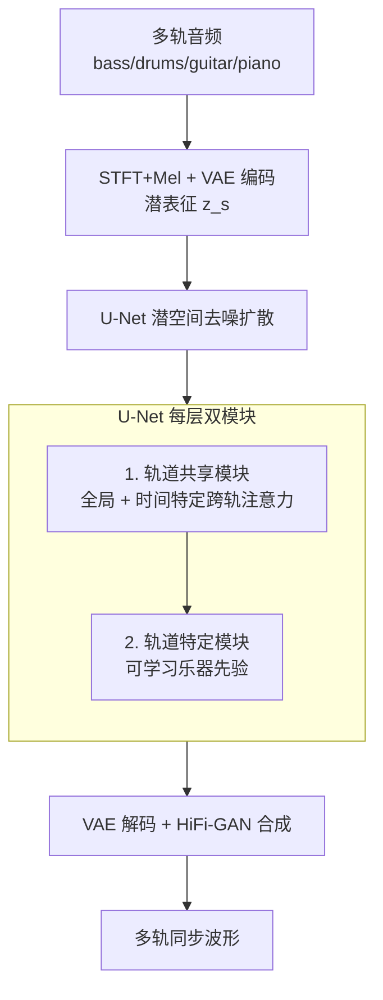

# SyncTrack: Rhythmic Stability and Synchronization in Multi-Track Music Generation

**会议**: ICLR 2026  
**arXiv**: [2603.01101](https://arxiv.org/abs/2603.01101)  
**代码**: [https://synctrack-v1.github.io](https://synctrack-v1.github.io)  
**领域**: 音乐生成 / 音频  
**关键词**: 多轨音乐生成, 节奏同步, 扩散模型, 跨轨注意力, 评估指标

## 一句话总结
提出 SyncTrack，通过轨道共享模块（双跨轨注意力确保节奏同步）和轨道特定模块（可学习乐器先验保留音色差异）的统一架构，以及三个新的节奏一致性评估指标（IRS/CBS/CBD），显著提升多轨音乐生成质量（FAD 从 6.55→1.26，主观 MOS 3.42 vs 1.57）。

## 研究背景与动机

**领域现状**：多轨音乐生成允许分别控制各乐器轨道（混音、重编排），MSDM、MSG-LD 等方法用扩散模型学习多轨联合分布。

**现有痛点**：现有方法将多轨当作多变量时序或视频生成，过度强调轨间差异，忽略共享节奏——导致节奏不稳定、轨间不同步。MSDM 的 FAD 高达 6.55，主观评分仅 1.57/5.0。

**核心矛盾**：节奏信息跨轨共享（所有乐器遵循同一拍子），但音色信息轨道独立（bass 低沉、piano 明亮）——需要分别处理这两种信息。

**核心 idea**：track-shared modules（共享节奏）+ track-specific modules（独立音色）+ 新评估指标。

## 方法详解

### 整体框架
SyncTrack 建在潜空间扩散模型上：多轨音频先经 STFT+Mel 与 VAE 编码成潜表征 $z^s \in \mathbb{R}^{C \times T \times F}$，U-Net 在潜空间做去噪扩散后由 VAE 解码、HiFi-GAN 合成波形。四个轨道（bass、drums、guitar、piano）并行生成，关键在于 U-Net 的 input/mid/output 每个 block 里都把每一层拆成两类模块——轨道共享模块负责让所有轨道对齐同一节奏，轨道特定模块负责保住各乐器独有的音色。此外作者还配套提出三个节奏一致性指标（IRS/CBS/CBD）来量化"节奏稳不稳、轨间齐不齐"这一 FAD 测不到的维度。

### 关键设计

**1. 轨道共享模块：用两种互补的跨轨注意力强制节奏对齐**

多轨生成的核心痛点是各轨道独立去噪时节拍会漂移、轨间不同步，而现实中所有乐器其实遵循同一拍子。SyncTrack 在每个共享层里除了 ResBlock 和内轨注意力，额外加了两条跨轨注意力路径，分工处理不同时间尺度的同步。全局跨轨注意力让每个时频元素 $z_{t,f}^s$ 对所有轨道的所有时频位置做注意力，相当于在整段音乐范围内交换节奏信息，维持稳定的全局节拍框架；时间特定跨轨注意力则约束在同一时间步 $t$ 内，只对所有轨道的频率维度做注意力，实现逐拍的细粒度对齐和和弦同步。前者管"大节奏不跑偏"，后者管"每一拍踩在一起"，两者叠加后节拍框架既稳又齐。

**2. 轨道特定模块：可学习乐器先验保留音色差异**

把所有轨道塞进共享注意力虽然同步了节奏，却容易抹平 bass 低沉、piano 明亮这类轨道独有的音色与音域信息。轨道特定模块为此给每个轨道注入一个可学习的乐器先验：轨道的 one-hot 标识先过位置编码、再经两层 MLP，得到的乐器嵌入直接加到该轨道的 ResBlock 输出上。这条支路极其轻量，却让网络在共享节奏的同时仍能按乐器身份分化各自的频谱特征，避免不同乐器被生成得"千篇一律"。

**3. 三个节奏一致性指标：补上 FAD 测不到的时序维度**

FAD 只比对音频分布的整体保真度，完全捕捉不到"节奏稳不稳、轨间齐不齐"，因此作者基于节拍检测设计了三个互补指标。IRS（Inner-track Rhythmic Stability）取单轨相邻拍间隔的标准差再跨轨取均值，刻画单轨节奏稳定性，越小越稳；CBS（Cross-track Beat Synchronization）用一个滑动容差窗口统计跨轨拍点落在容差内的对齐比例，越大说明轨间越同步；CBD（Cross-track Beat Dispersion）则把跨轨拍点的误差归一化后取均值，越小说明轨间拍点越集中。三者分别从"单轨稳定""跨轨对齐""跨轨离散"三个角度量化节奏质量，实验中与人类主观偏好高度相关。

### 损失函数 / 训练策略
训练沿用标准 DDPM 噪声预测目标 $\|\epsilon - \epsilon_\theta(\{z_l^s\}, l)\|^2$，其中 $l$ 标识轨道。权重从 MusicLDM 预训练初始化以复用已有音频生成知识，共训练 320K 步、batch 16，推理用 DDIM 200 步采样。

## 实验关键数据

### 主实验

| 方法 | FAD↓ | IRS↓ | CBS↑ | CBD↓ |
|------|------|------|------|------|
| MSDM | 6.55 | 0.167 | 0.428 | 0.156 |
| MSG-LD | 1.31 | 0.148 | 0.434 | 0.147 |
| **SyncTrack** | **1.26** | **0.125** | **0.487** | **0.120** |
| Ground Truth | - | 0.049 | 0.592 | 0.079 |

SyncTrack 在所有指标上均最接近 Ground Truth，特别是 IRS 和 CBS 的改善表明节奏一致性提升显著。

### 消融实验

| 配置 | FAD↓ | IRS↓ | CBS↑ | 说明 |
|------|------|------|------|------|
| Full SyncTrack | 1.26 | 0.125 | 0.487 | 完整 |
| w/o 全局跨轨 attn | ~1.8 | ~0.14 | ~0.45 | 全局节奏退化 |
| w/o 时间特定跨轨 attn | ~1.6 | ~0.13 | ~0.46 | 细粒度对齐退化 |
| w/o 乐器先验 | ~1.4 | ~0.13 | ~0.47 | 音色区分度降低 |

### 关键发现
- FAD 从 MSDM 的 6.55 降到 1.26（-80%），从 MSG-LD 的 1.31 降到 1.26（-3.8%）
- 分轨 FAD 在 Piano 上提升最大（MSG-LD 2.04→1.11，-45.6%），因为钢琴音域宽、谱复杂
- IRS 从 MSG-LD 的 0.148 降到 0.125，CBS 从 0.434 提到 0.487——节奏一致性显著改善
- 主观评测中 SyncTrack 混音 MOS 3.42 vs MSG-LD 1.57 vs GT 4.48
- 消融：全局跨轨注意力对全局节奏稳定贡献最大，时间特定注意力对逐拍同步贡献最大
- 所提三个指标与人类主观偏好高度相关——FAD 无法捕获的时序结构被 IRS/CBS/CBD 有效量化

## 亮点与洞察
- **共享/特定模块分离**的设计理念可推广到其他多通道生成任务——任何存在"共享属性+独有属性"的多通道场景都适用
- **节奏评估指标填补空白**——FAD 无法捕获时序结构，IRS/CBS/CBD 提供了互补的维度
- 双跨轨注意力的分工清晰：全局跨轨→节拍框架，时间特定跨轨→逐拍同步
- 可学习乐器先验仅需 one-hot + 位置编码 + MLP，极其轻量但有效区分音色
- 主观评测差距巨大（3.42 vs 1.57）——节奏同步是人类听感的核心因素
- 从 MusicLDM 预训练初始化有效利用了已有的音频生成知识，加速了收敛

## 局限与展望
- 仅在 Slakh2100（4 轨：bass/drums/guitar/piano）上验证，更复杂编制（管弦乐、合唱）和更多轨道数量未测试
- 条件生成（文本/旋律引导）未探索——当前为无条件生成
- 评估指标（IRS/CBS/CBD）基于节拍检测算法，其精度影响指标可靠性
- 轨道共享模块的全局跨轨注意力在轨道数增多时计算复杂度可能成为瓶颈
- 生成音频的采样率（16kHz）远低于商业标准（44.1kHz），高采样率下的表现待验证

## 相关工作与启发
- **vs MSDM**：MSDM 用统一模型学习多轨联合分布，不区分共享/特定信息，FAD 从 6.55 降到 1.26 是巨大提升
- **vs MSG-LD**：MSG-LD 更强但仍忽视节奏同步，SyncTrack 在 IRS/CBS/CBD 上全面超越
- **vs StemGen/JEN-1 Composer**：它们用 Transformer/LDM 但无显式跨轨同步机制
- **启发**：共享/特定模块分离的原则适用于所有多通道生成任务（如多说话人语音生成、多乐器编曲）

## 评分
- 新颖性: ⭐⭐⭐⭐ 共享/特定模块分离 + 双跨轨注意力 + 新节奏评估指标
- 实验充分度: ⭐⭐⭐⭐ 客观+主观评测+消融，指标设计完整
- 写作质量: ⭐⭐⭐⭐ 动机阐述清晰，图示直观
- 价值: ⭐⭐⭐⭐ 填补多轨音乐节奏评估空白，模型设计原则可推广

<!-- RELATED:START -->

## 相关论文

- [\[AAAI 2026\] Diff-V2M: A Hierarchical Conditional Diffusion Model with Explicit Rhythmic Modeling for Video-to-Music Generation](../../AAAI2026/audio_speech/diff-v2m_a_hierarchical_conditional_diffusion_model_with_explicit_rhythmic_model.md)
- [\[ACL 2026\] Jamendo-MT-QA: A Benchmark for Multi-Track Comparative Music Question Answering](../../ACL2026/audio_speech/jamendo-mt-qa_a_benchmark_for_multi-track_comparative_music_question_answering.md)
- [\[ICLR 2026\] PrismAudio: Decomposed Chain-of-Thoughts and Multi-dimensional Rewards for Video-to-Audio Generation](prismaudio_decomposed_chain-of-thoughts_and_multi-dimensional_rewards_for_video-.md)
- [\[NeurIPS 2025\] Unifying Symbolic Music Arrangement: Track-Aware Reconstruction and Structured Tokenization](../../NeurIPS2025/audio_speech/unifying_symbolic_music_arrangement_track-aware_reconstruction_and_structured_to.md)
- [\[ICLR 2026\] Flow2GAN: Hybrid Flow Matching and GAN with Multi-Resolution Network for Few-step High-Fidelity Audio Generation](flow2gan_hybrid_flow_matching_and_gan_with_multi-resolution_network_for_few-step.md)

<!-- RELATED:END -->
