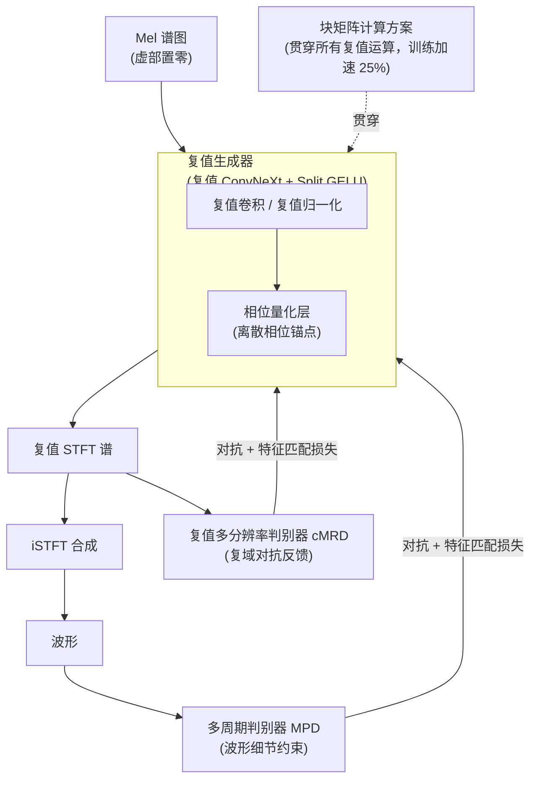

# Toward Complex-Valued Neural Networks for Waveform Generation

**会议**: ICLR 2026  
**arXiv**: [2603.11589](https://arxiv.org/abs/2603.11589)  
**代码**: [https://hs-oh-prml.github.io/ComVo/](https://hs-oh-prml.github.io/ComVo/)  
**领域**: 语音合成 / 声码器  
**关键词**: 复值神经网络, iSTFT声码器, 相位量化, GAN, 波形生成

## 一句话总结
提出 ComVo，首个在生成器和判别器中均使用复值神经网络（CVNN）的 iSTFT 声码器，通过相位量化层稳定训练，并引入块矩阵计算方案将训练时间减少 25%，在 LibriTTS 上合成质量超过 Vocos 等实值基线。

## 研究背景与动机

**领域现状**：iSTFT 声码器（如 Vocos、iSTFTNet）在频域直接预测复值谱图，通过 iSTFT 合成波形，避免了逐样本生成和学习式上采样带来的复杂度和延迟。

**现有痛点**：所有现有 iSTFT 声码器均使用实值网络（RVNN），将复数谱图的实部和虚部作为两个独立通道分别处理。这种分离破坏了复值谱图中实部与虚部之间的固有耦合关系——它们共同决定了幅度和相位。

**核心矛盾**：实值网络无法直接建模复数域中的代数结构（如复数乘法、旋转），导致相位建模不准确。控制实验表明，CVNN 在合成复值分布时的 JSD（Jensen-Shannon 散度）在幅度和相位上分别比 RVNN 低 64% 和 81%。

**切入角度**：复值神经网络（CVNN）将输入、激活和权重都表示为复数，能天然捕获实部-虚部之间的交叉依赖。但 CVNN 在声码器中从未被探索过——主要困难在于复域非线性变换设计和训练效率。

**核心 idea**：用 CVNN 构建生成器和判别器，形成完整的复域对抗训练框架；用相位量化作为归纳偏置稳定训练；用块矩阵计算方案提升效率。

## 方法详解

### 整体框架
ComVo 把整条 iSTFT 声码器流水线搬进复数域：以 Mel 谱图作为输入（虚部初始化为零）喂给复值 ConvNeXt 生成器，由生成器直接预测复值 STFT 谱，再经 iSTFT 合成波形。对抗训练侧配两类判别器——直接吃复值谱的复值多分辨率判别器 cMRD，以及在时域波形上工作的多周期判别器 MPD——使生成器同时受到复域结构反馈和波形细节约束。生成器内部嵌入相位量化层稳住复域训练，而所有复值线性运算都走块矩阵计算方案，把训练开销压回实值网络的水平。

### 关键设计

**1. 复值生成器：让实部与虚部端到端耦合**

RVNN 声码器把复谱的实部、虚部当成两条独立通道处理，破坏了二者共同决定幅度与相位的耦合关系。ComVo 沿用 Vocos 的 ConvNeXt 骨干，但把其中的 Conv1d、LayerNorm 全部换成复值版本，权重、激活、特征都以复数承载，于是复数乘法、旋转这类代数结构能被网络原生表达。非线性上采用 Split GELU——对复数的实部和虚部分别施加 GELU——既保留 ConvNeXt block 的结构，又给复域提供了稳定的逐元素激活。这样实部-虚部的交叉依赖在整条前向路径上都不被拆散，相位建模因此更准确。

**2. 相位量化层：用离散化锚住相位、稳住训练**

复域训练最大的麻烦是相位容易漂移、难以收敛。ComVo 对中间复特征 $z = re^{i\theta}$ 只量化其相位，把连续相位离散到 $N_q$ 个均匀级别 $\theta_q = \frac{2\pi}{N_q} \cdot \text{round}(\frac{N_q}{2\pi}\theta)$，而幅度 $r$ 保持不变；round 不可导，用直通估计器（STE）让梯度照常回传。本质上这是一种作用在相位上的正则化：把中间表征限制到有限个"相位锚点"附近，抑制训练中的相位不一致，引导网络学到更结构化的相位模式。消融显示移除它后 UTMOS 下降约 0.12，是稳定复值训练的关键归纳偏置。

**3. 复值多分辨率判别器 cMRD：让对抗反馈尊重复域结构**

多个子判别器在不同 STFT 分辨率上工作，但与常规做法不同，它们直接以复值谱图为输入，而非把实/虚部拼成独立通道；对抗损失分别在实部和虚部上计算，使判别器给出的反馈本身就带着复域几何，而不是被实值化抹平。配合在波形域工作的 MPD，生成器同时受到频域复结构和时域波形细节的双重监督，缺了 cMRD 后 UTMOS 跌到 3.58。

**4. 块矩阵计算方案：把复值运算压回实值的算力成本**

朴素实现一次复值线性运算 $z' = Wz$（$W = W_r + iW_i$，$z = x + iy$）要算 4 个独立的实值矩阵乘，开销翻倍。ComVo 把它重写成单个块矩阵乘

$$\begin{bmatrix} \text{Re}(z') \\ \text{Im}(z') \end{bmatrix} = \begin{bmatrix} W_r & -W_i \\ W_i & W_r \end{bmatrix} \begin{bmatrix} x \\ y \end{bmatrix}$$

用一次结构化矩阵乘吸收掉冗余，并通过自定义 autograd 函数让前向、反向都走这条路径。它与朴素实现数学等价、合成质量完全一致，却把训练时间降低约 25%，把复值网络看似奢侈的算力需求拉回到与实值相当的水平。

### 损失函数 / 训练策略
总损失由 cMRD（复域）与 MPD（波形域）的对抗损失、特征匹配损失，以及多分辨率 STFT 重建损失共同构成，分别从复谱结构、判别器中间特征和多尺度频谱三个角度约束生成器。训练数据为 LibriTTS 的 train-clean-100/360 与 train-other-500，采样率 24kHz。

## 实验关键数据

### 主实验（LibriTTS test-clean + test-other）

| 模型 | UTMOS↑ | PESQ↑ | MR-STFT↓ | MOS↑ | CMOS↑ |
|------|--------|-------|----------|------|-------|
| HiFi-GAN | 3.35 | 2.94 | 1.05 | 4.00 | -0.09 |
| iSTFTNet | 3.36 | 2.81 | 1.10 | 3.98 | -0.04 |
| BigVGAN | 3.52 | 3.61 | 0.90 | 4.00 | -0.01 |
| Vocos (RVNN) | 3.60 | 3.72 | 0.87 | 4.04 | +0.02 |
| **ComVo (CVNN)** | **3.75** | **3.89** | **0.83** | **4.07** | **+0.10** |
| Ground Truth | 3.87 | - | - | 4.08 | +0.14 |

### 消融实验

| 配置 | UTMOS↑ | PESQ↑ | 说明 |
|------|--------|-------|------|
| ComVo 完整 | 3.75 | 3.89 | 全复值 + 相位量化 + 块矩阵 |
| w/o 相位量化 | 3.63 | 3.75 | 训练不稳定，相位漂移 |
| w/o cMRD（仅 MPD） | 3.58 | 3.68 | 缺少复域对抗反馈 |
| RVNN 基线（同参数量） | 3.60 | 3.72 | 公平对比：复值优势明确 |
| 块矩阵 vs 朴素实现 | 相同质量 | 相同质量 | 数学等价但训练快 25% |

### 关键发现
- CVNN 在主客观指标上均优于参数量匹配的 RVNN（UTMOS +0.15，PESQ +0.17）
- 相位量化是关键组件——移除后 UTMOS 下降 0.12，说明相位正则化对复值训练至关重要
- 块矩阵方案在不损失质量的前提下将训练时间减少 25%

## 亮点与洞察
- **首个全复值声码器**——在生成器和判别器中均使用 CVNN，建立了复域对抗训练的范式
- **相位量化**是简洁有效的归纳偏置——将连续相位离散化相当于给网络一个"相位锚点"，防止训练中的相位不一致问题
- **块矩阵计算**巧妙利用了复值运算的结构化特性——将看似低效的复值需求转化为与实值相当的计算成本
- 初步实验（合成复值分布 GAN）验证了 CVNN 在复域建模上的理论优势，为后续声码器设计提供了控制实验支持

## 局限与展望
- CVNN 层的参数量约为 RVNN 的 2×（实部+虚部各需独立权重），虽然块矩阵优化了计算，但内存开销仍较高
- 仅与 Vocos 做了严格公平对比，与更多声码器（如 BigVGAN v2、Descript Audio Codec）的比较
- 相位量化的级别 $N_q$ 如何选择？不同数值对质量的影响未做系统消融
- 未在 TTS 端到端系统中验证——声码器质量是否能转化为整体 TTS 质量提升？

## 相关工作与启发
- **vs Vocos**：共享 iSTFT 框架，但 Vocos 用 RVNN，ComVo 用 CVNN——差异仅在网络是否原生复值
- **vs HiFi-GAN/BigVGAN**：它们在波形域直接生成，ComVo 在频域生成后 iSTFT，架构范式不同
- **CVNN 领域**：复值网络在 MRI 重建、雷达分类中已有应用，ComVo 首次将其引入音频生成
- **启发**：任何自然以复数形式存在的信号处理任务（如 RF 信号、光学成像）都可考虑类似的 CVNN 替换

## 评分
- 新颖性: ⭐⭐⭐⭐ 首个全复值 iSTFT 声码器，相位量化设计新颖
- 实验充分度: ⭐⭐⭐⭐ 主客观评价+控制实验+消融，但对比基线可更丰富
- 写作质量: ⭐⭐⭐⭐ 从初步实验到完整系统的叙事流畅
- 价值: ⭐⭐⭐⭐ 推动复值网络在音频生成领域的应用，为后续研究铺路

<!-- RELATED:START -->

## 相关论文

- [\[ICLR 2026\] FlexiCodec: A Dynamic Neural Audio Codec for Low Frame Rates](flexicodec_a_dynamic_neural_audio_codec_for_low_frame_rates.md)
- [\[NeurIPS 2025\] SHAP Meets Tensor Networks: Provably Tractable Explanations with Parallelism](../../NeurIPS2025/audio_speech/shap_meets_tensor_networks_provably_tractable_explanations_with_parallelism.md)
- [\[ACL 2026\] Hard to Be Heard: Phoneme-Level ASR Analysis of Phonologically Complex, Low-Resource Endangered Languages](../../ACL2026/audio_speech/hard_to_be_heard_phoneme-level_asr_analysis_of_phonologically_complex_low-resour.md)
- [\[ICLR 2026\] Flow2GAN: Hybrid Flow Matching and GAN with Multi-Resolution Network for Few-step High-Fidelity Audio Generation](flow2gan_hybrid_flow_matching_and_gan_with_multi-resolution_network_for_few-step.md)
- [\[CVPR 2025\] Towards Lossless Implicit Neural Representation via Bit Plane Decomposition](../../CVPR2025/audio_speech/towards_lossless_implicit_neural_representation_via_bit_plane_decomposition.md)

<!-- RELATED:END -->
