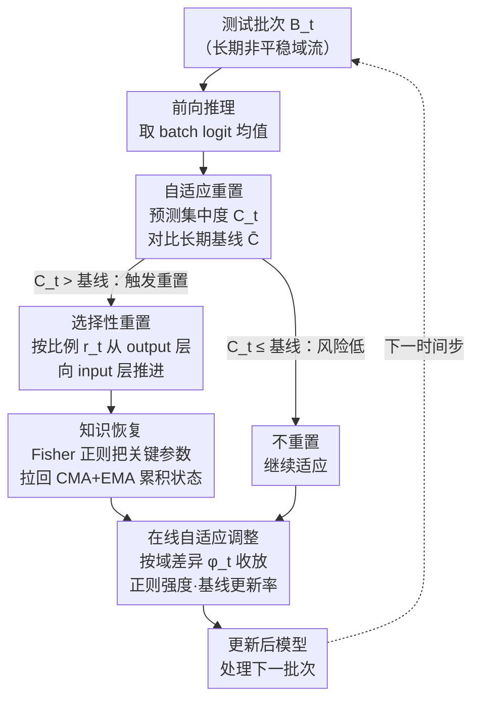

# When and Where to Reset Matters for Long-Term Test-Time Adaptation

**会议**: ICLR 2026  
**arXiv**: [2603.03796](https://arxiv.org/abs/2603.03796)  
**代码**: [https://github.com/YonseiML/asr](https://github.com/YonseiML/asr)  
**领域**: 音频语音  
**关键词**: 测试时适应, 模型崩溃, 自适应重置, 选择性重置, Fisher信息, 长期域漂移

## 一句话总结
ASR提出自适应选择性重置方案，通过预测集中度 $\mathcal{C}_t$ 动态判断何时重置（避免固定周期的次优性），通过从output层向input层渐进的层选择策略判断重置哪些层（保留有价值的适应知识），配合importance-aware正则化恢复被重置的关键知识和on-the-fly适应调整，在CCC-Hard上比SOTA提升44.12%。

## 研究背景与动机

**领域现状**：持续测试时适应（TTA）在非平稳域流上更新模型，但长期适应导致错误累积→模型崩溃（model collapse）：模型对所有输入只预测少数几个类别。

**现有痛点**：(1) RDumb等方法用固定周期全量重置→周期与实际崩溃风险无关，要么太早（浪费适应知识）要么太晚（错误深度累积）；(2) 全量重置灾难性地丢弃所有时间积累的知识；(3) 每次重置后都有显著的性能骤降和恢复延迟。

**核心矛盾**：重置太频繁→适应不充分；重置太稀→崩溃不可逆。全量重置→知识丢失；不重置→错误累积。

**本文目标**：(1) When: 如何动态判断何时有崩溃风险？(2) Where: 如何选择重置哪些层以最小化知识损失？(3) 如何恢复被重置但仍然重要的知识？

**切入角度**：利用预测集中度（prediction concentration）作为崩溃风险的proxy，利用深度网络的层次结构（靠近output的层先被label noise corruption）决定重置范围。

**核心 idea**：用预测集中度偏离长期基线来触发重置，按崩溃严重度从output层向input层渐进重置，用Fisher信息加权正则化恢复被重置的关键知识。

## 方法详解

### 整体框架
ASR是一个挂在现有持续TTA方法（ETA、EATA、ROID等）之上的即插即用模块，对长期非平稳域流里的每个测试批次重复同一套流程：先前向推理拿到 batch 级的预测，用一个崩溃风险信号（预测集中度）判断**何时**该重置、并据此决定**重置多深**（从靠近输出的层往输入端推进），再用一套Fisher加权的正则化把被重置层里仍有价值的知识"拉回来"，最后根据当前域与源域的差异在线微调正则强度和基线更新率，更新后的模型继续处理下一批次。四件事环环相扣：什么时候重置、重置哪些层、重置后如何不丢知识、以及如何让这些机制随域漂移自动收放。

### 关键设计

**1. 自适应重置——判断何时该重置：用预测集中度替代固定周期**

RDumb这类方法每隔固定步数全量重置一次，问题在于这个周期和模型真正逼近崩溃的时机毫无关系，重早了浪费已积累的适应、重晚了错误已深度累积。ASR改用一个能直接反映崩溃风险的信号——预测集中度 $\mathcal{C}_t = \sum_{c=1}^C \hat{p}_{t_c} \log(\hat{p}_{t_c})$，其中 $\hat{p}_t = \sigma(\frac{1}{|\mathcal{B}_t|}\sum_i f_{\theta_{t-1}}(x_t^i))$ 是当前batch logit均值过softmax后的分布。模型一旦开始只往少数几类上塌缩，这个分布就越尖锐、$\mathcal{C}_t$ 越大，意味着崩溃风险越高。为了判断"高到该重置了"，方法维护一条EMA长期基线 $\bar{\mathcal{C}}_t = \mu_\mathcal{C} \cdot \bar{\mathcal{C}}_{t-1} + (1-\mu_\mathcal{C}) \cdot \mathcal{C}_t$，并在 $\mathcal{C}_t > \bar{\mathcal{C}}_{t-1}$（当前集中度突破历史基线）时立即触发重置；初始基线设为 $\bar{\mathcal{C}}_0 = -\log(\alpha_0 \cdot C)$，把 $\alpha_0$ 调到足够大以免开局还没适应就乱重置。这个信号之所以可靠，是因为它和实际准确率的Pearson相关系数高达0.88，几乎不花额外计算就能当作崩溃的proxy。

**2. 选择性重置——判断重置哪些层：从output端往input端按需推进**

全量重置一刀切地丢掉所有时间积累的知识，代价太大。ASR借用了一个已知现象：label noise带来的corruption是从网络末端（靠近输出的层）先开始侵蚀的，越靠近输入的层越鲁棒。于是重置不必全做，只从output端开始重置一定比例 $r_t$ 的层、其余原样保留。重置多深由崩溃严重程度决定：$r_t = r_0 + \lambda_r \cdot (\mathcal{C}_t - \bar{\mathcal{C}}_{t-1})$，集中度超出基线越多说明corruption已渗得越深、就重置越多层，$r_0$ 是最小重置比例、$r_t$ 上限取1.0。这样既切掉了已被污染的部分，又把仍干净的浅层适应知识留了下来，显著缓解了全量重置后那种性能骤降和漫长恢复。

**3. 重要性加权的知识恢复——别让重置抹掉关键参数**

即便是被重置的层里，也有一些参数对先前任务至关重要，直接清零会损失这部分知识。ASR用一个Fisher加权的正则项把它们往累积状态上拉：$\mathcal{L} = \mathcal{L}_u + \lambda_\mathcal{F}\sum_i \bar{\mathcal{F}}^i(\theta_{t-1}^i - \bar{\theta}^i)^2$，其中 $\bar{\mathcal{F}}^i$ 是累积Fisher信息矩阵、$\bar{\theta}^i$ 是累积参数，Fisher值越高代表该参数越重要、被约束得越紧。难点在于怎么算"累积"：越靠近重置点的参数虽然更贴合当前域，却也更可能已被corruption污染，所以EMA那种偏好近期的加权并不适合直接用。方法用了CMA+EMA混合方案——两次重置之间用CMA等权累积参数和Fisher矩阵（避免被临近崩溃的脏参数主导），到重置触发点再用EMA把各段CMA值聚合起来，兼顾时效性与抗污染。

**4. 在线自适应调整——让上述机制随域差异自动收放**

固定的正则化强度和基线更新率无法应对差异悬殊的域漂移。ASR用源模型和当前模型的预测不一致性来度量域差异：$\phi_t = \frac{1}{|\mathcal{B}_t|}\sum_i \mathbb{I}(\arg\max(\breve{y}_t^i) \neq \arg\max(\hat{y}_t^i))$，两者分歧越大说明当前域离源域越远。据此在线调两个旋钮：正则化系数 $\lambda_\mathcal{F} = \lambda_0 \cdot \phi_t^2$（域差异大就加重正则、更努力保住源知识），基线更新率 $\mu_\mathcal{C} = \mu_0 \cdot \phi_t + 1 - \mu_0$（域差异大就放慢集中度基线的更新、避免误判）。这一步让前三个组件不依赖手调的固定超参，而是随域流变化自动收放力度。

## 实验关键数据

### CCC Benchmark（主实验，ResNet-50）

| 方法（基于ETA） | Easy | Medium | Hard | Mean |
|----------------|------|--------|------|------|
| ETA | 43.24 | 19.03 | 0.32 | 20.86 |
| + RDumb | 49.47 | 39.42 | 9.77 | 32.89 |
| + COME | - | - | - | - |
| + ReservoirTTA | - | - | - | - |
| **+ ASR (Ours)** | **最高** | **最高** | **最高** | **最高** |

CCC-Hard上比SOTA提升 **44.12%**。

### 其他Benchmark
- Concatenated ImageNet-C (CIN-C)：所有方法中表现最佳
- ImageNet-C (20次循环)：稳定适应无崩溃
- ImageNet-D109 (20次循环)：同样最优

### 关键发现
- ASR作为add-on方法适用于ETA、EATA、ROID等多个基线方法
- 在challenging设置下（CCC-Hard）提升尤为显著——这正是现有方法崩溃最严重的场景
- $\mathcal{C}_t$ 相比其他崩溃检测指标（如极高置信度、分布偏移检测）更稳定可靠
- 选择性重置vs全量重置：显著减少重置后的性能骤降和恢复延迟

### 消融实验
- 去掉自适应重置（固定周期）→性能下降
- 去掉选择性重置（全量重置）→性能骤降和恢复延迟增大
- 去掉Fisher正则化→无法恢复被重置的关键知识
- 去掉on-the-fly调整→在challenging域漂移下适应性不足

## 亮点与洞察
- **信号设计的优雅性**：$\mathcal{C}_t$ 基于batch-level的logit均值softmax的熵，既简单又有效（0.88相关性），无需额外模型或计算
- **层次重置的理论依据**：利用了corruption从网络末端开始这一已知现象，将通用观察转化为实用策略
- **CMA+EMA混合累积**：巧妙解决了"接近重置时参数更适应当前域但更可能被corruption"的bootstrapping困境
- **即插即用**：ASR可作为add-on加到任何现有TTA方法上，不需要修改基础适应算法

## 局限与展望
- 超参数（$r_0, \lambda_r, \alpha_0, \lambda_0, \mu_0$）需要在holdout数据上确定，虽然使用的数据量很少（5%单split）
- 当前假设batch内样本来自相同域，mixed-domain batch场景有待研究
- Fisher信息估计在连续在线学习中的准确性可能随时间退化
- 对ViT-B-16的验证相对初步，更多架构和规模有待评估
- 与prompt-based TTA方法的集成值得探索

## 相关工作与启发
- **vs RDumb**: 固定周期全量重置是naive但effective的baseline，ASR在此基础上引入自适应性和选择性
- **vs CoTTA**: CoTTA用augmentation-averaged伪标签和随机参数恢复，ASR用更原则性的Fisher-based方法
- **vs ROID/CMF**: 权重集成方法，ASR的重置+恢复范式是互补的
- **vs PeTTA**: 基于参数发散的正则化，ASR的预测集中度是更直接的崩溃指标

## 评分
- 新颖性: ⭐⭐⭐⭐ 自适应+选择性重置的组合以及CMA+EMA混合累积有创新
- 实验充分度: ⭐⭐⭐⭐⭐ 4个benchmark、多个基线方法组合、详细消融、多架构验证
- 写作质量: ⭐⭐⭐⭐⭐ 动机清楚（Fig.1极为直观）、方法图解清晰（Fig.2）、统计严谨
- 价值: ⭐⭐⭐⭐⭐ CCC-Hard 44.12%提升是实质性突破，即插即用的设计具有广泛适用性

<!-- RELATED:START -->

## 相关论文

- [\[NeurIPS 2025\] E-BATS: Efficient Backpropagation-Free Test-Time Adaptation for Speech Foundation Models](../../NeurIPS2025/audio_speech/e-bats_efficient_backpropagation-free_test-time_adaptation_for_speech_foundation.md)
- [\[NeurIPS 2025\] AVRobustBench: Benchmarking the Robustness of Audio-Visual Recognition Models at Test-Time](../../NeurIPS2025/audio_speech/textttavrobustbench_benchmarking_the_robustness_of_audio-visual_recognition_mode.md)
- [\[ICLR 2026\] Knowing When to Quit: Probabilistic Early Exits for Speech Separation](knowing_when_to_quit_probabilistic_early_exits_for_speech_separation.md)
- [\[ICLR 2026\] When Style Breaks Safety: Defending LLMs Against Superficial Style Alignment](when_style_breaks_safety_defending_llms_against_superficial_style_alignment.md)
- [\[NeurIPS 2025\] Instance-Specific Test-Time Training for Speech Editing in the Wild](../../NeurIPS2025/audio_speech/instance-specific_test-time_training_for_speech_editing_in_the_wild.md)

<!-- RELATED:END -->
