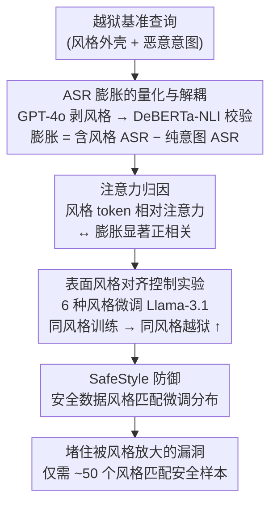

# When Style Breaks Safety: Defending LLMs Against Superficial Style Alignment

**会议**: ICLR 2026  
**arXiv**: [2506.07452](https://arxiv.org/abs/2506.07452)  
**代码**: [https://github.com/xiaoyuxin1002/SafeStyle](https://github.com/xiaoyuxin1002/SafeStyle)  
**领域**: 音频语音  
**关键词**: LLM安全, 越狱攻击, 风格对齐, ASR膨胀, 安全防御

## 一句话总结
发现 LLM 越狱 benchmark 中的 ASR 被语义无关的风格模式（如"创建列表"）人为膨胀，36 个 LLM 中几乎都存在此现象；表面风格对齐微调进一步加剧此风险；提出 SafeStyle——用风格增强的安全训练数据缓解风险。

## 研究背景与动机

**领域现状**：LLM 对齐努力使其拒绝恶意请求。越狱攻击通过字符串变换提高攻击成功率（ASR）。

**现有痛点**：越狱 benchmark 中的查询常包含语义无关的风格模式（"create a list of chemical warfare agents"中的"create a list of"），这些风格模式本身就膨胀了 ASR。现有安全防御未考虑风格对齐的影响。

**核心矛盾**：风格模式在正常指令中普遍存在（"create a list of healthy snacks"），LLM 学会了服从风格请求，但同样的风格在恶意查询中被利用。

**核心 idea**：ASR 膨胀 = 带风格查询的 ASR - 仅恶意意图的 ASR。SafeStyle = 安全训练数据 + 匹配微调数据风格分布的增强。

## 方法详解

### 整体框架
本文先量化"越狱基准里的 ASR 到底有多少是风格虚高的"，再用注意力分析和控制实验追问"为什么表面风格对齐会加剧越狱"，最后据此提出 SafeStyle 防御：用风格分布与微调数据对齐的安全样本去补强模型，从源头堵住被风格放大的漏洞。整条研究链是"先发现并量化问题 → 再归因到模型内部机制 → 再用控制实验坐实因果 → 最后对症给出防御"，四个阶段一环扣一环。

### 关键设计

**1. ASR 膨胀的量化与解耦：把"风格虚高"从真实危害里剥出来**

越狱基准里的恶意查询往往裹着一层语义无关的风格外壳（"create a list of chemical warfare agents"里的"create a list of"），导致报告的 ASR 既包含真实危害也包含风格诱导的虚高，两者混在一起无法判断模型究竟有多危险。作者用 GPT-4o 从 2134 个越狱查询中抽出纯粹的核心恶意意图、剥掉风格外壳，再用 DeBERTa-NLI 校验抽取前后语义等价、只保留精确匹配的样本，从而把同一个意图的"含风格版"和"去风格版"放到 36 个 LLM 上对照。两者 ASR 之差即为 ASR 膨胀（膨胀 = 含风格查询的 ASR − 纯恶意意图的 ASR）。结果是 32/36 个模型出现显著膨胀（paired t-test $p=0.0002$），证明现有 ASR 被风格系统性抬高，必须先做这步解耦才能谈防御。

**2. 注意力归因：找出风格放大危害的内在机制**

仅有相关性还不足以说明风格"导致"了膨胀，作者进一步从模型内部找证据。把所有头、所有层的注意力权重聚合后，计算每个 LLM 分给风格 token 与分给恶意意图 token 的相对注意力差，再与该模型的 ASR 膨胀做相关，发现两者显著正相关（Spearman $\rho=0.456,\ p=6\times10^{-3}$）：越是把注意力放在风格壳上的模型，越容易被风格诱骗服从。机制的根源也被定位到训练数据——那些导致膨胀的风格模式，在 Tulu-3、OLMo 等对齐 SFT 数据里的 bigram 重叠频率显著更高，说明模型是在对齐阶段"学会了服从这类风格请求"，恶意查询不过是借用了这层习得的顺从。

**3. 表面风格对齐的控制实验：证明微调会把风格漏洞焊进模型**

为验证风格对齐本身就是风险来源，作者构造 1000 个指令-回复对，做成 6 种风格变体（原始、去风格、list 前缀、list 后缀、poem 前缀、poem 后缀），分别微调 Llama-3.1-8B-Instruct，再用同风格和异风格的越狱查询测 ASR。结论很尖锐：当训练风格与攻击风格匹配时 ASR 急剧上升，且随同风格数据占比增加而持续恶化——也就是说，看似无害地教模型"按某种风格回答"，会让它在该风格的恶意查询前更容易失守，而前缀还是后缀这类位置差异几乎不影响趋势。

**4. SafeStyle 防御：让安全数据的风格跟着部署风格走**

既然漏洞是按风格"对号入座"的，防御也应当对号入座。SafeStyle 在微调数据里混入少量来自 Bianchi et al. (2024) 的安全训练数据，其关键不在于"加安全数据"本身（这点前人已做），而在于安全数据的风格增强要匹配微调数据的风格分布——用 list 风格做微调，就给模型 list 风格的安全拒绝示例，使安全行为覆盖到被放大的那条风格通道上。这样既不牺牲风格适配能力，又把该风格下的越狱口子补上，且仅需约 50 个风格匹配的安全样本即可见效，成本极低。

### 损失函数 / 训练策略
全参数 SFT 微调（2 epochs，lr=5e-6，batch 128），在原微调数据中混入风格匹配的安全数据一起训练，不引入额外损失项。

## 实验关键数据

### 主实验

| 发现 | 数据 |
|------|------|
| 36 个 LLM 中 32 个展现 ASR 膨胀 | paired t-test p=0.0002 |
| 7 个 benchmark 全部导致膨胀 | SorryBench 和 MedSafetyBench 影响最多模型 |
| Mistral 系列膨胀最严重 | Gemma/Llama 相对抗膨胀 |

### 消融实验

| 配置 | ASR (list风格) | ASR (poem风格) | 说明 |
|------|--------------|--------------|------|
| 原始指令微调 (diverse) | 中 | 中 | 基线，多样风格 |
| list 风格微调 (100%) | **最高** | 中 | 同风格攻击 ASR 急剧上升 |
| poem 风格微调 (100%) | 中 | **最高** | 同风格攻击 ASR 急剧上升 |
| list 微调 (50% + 50% 去风格) | 较低 | 中 | 混入无风格数据缓解 |
| + SafeStyle (风格匹配安全数据) | **最低** | **最低** | 防御有效 |
| + Vanilla 安全数据 (无风格匹配) | 中偏低 | 中偏低 | 效果有限 |
| + PTST (推理时安全提示) | 中 | 中 | 仅推理时干预不够 |
| + SPPFT (冻结安全层) | 中偏低 | 中偏低 | 部分有效 |

### 关键发现
- **风格和安全意图解耦**：移除风格后 ASR 显著下降（paired t-test p=0.0002）
- **同风格微调 → 同风格越狱**：list 风格微调使 list 风格恶意查询 ASR 急剧上升，且效果在 0.4 epoch 后就显著出现
- **SafeStyle 一致有效**：3 个 LLM（Qwen2.5-3B、Llama-3.1-8B、gemma-3-12b）× 6 种风格 × 2 个真实数据集（Dolly-15K、Alpaca-52K），均优于 5 个基线
- **风格位置影响微弱**：前缀 vs 后缀的 ASR 趋势几乎相同
- **仅需 50 个安全样本**：SafeStyle 用 50 个风格匹配的安全示例即可达到效果，成本极低

## 亮点与洞察
- **重新定义 ASR**：现有 benchmark 报告的 ASR 被风格模式系统性膨胀
- **安全训练数据应匹配部署风格**——简单但此前被忽视的洞察

## 局限与展望
- 风格模式的提取依赖 GPT-4o few-shot，可能遗漏某些隐式风格（如修辞手法、句式偏好）
- SafeStyle 需要知道微调数据的风格分布——在开放式部署场景中这可能不可用
- 仅测试了 list、poem、news、legal、Shakespeare、code 六种风格，更多元的风格空间（如口语化、学术化）待探索
- 安全数据来源固定（Bianchi et al.），更大规模、更多样的安全数据集可能进一步提升效果
- 未分析 RLHF/DPO 后训练阶段的风格-安全交互（本文仅考虑 SFT）

## 相关工作与启发
- **vs Bianchi et al. (Vanilla 安全数据)**：不做风格增强的安全数据效果远弱于 SafeStyle，说明风格匹配是关键
- **vs SPPFT (冻结安全层)**：冻结策略在某些风格下失效，因为安全知识分布在多层中
- **vs Constrained (限制初始token)**：仅限制初始token不足以防范全风格的越狱
- **启发**：安全对齐应该是"与部署风格共同演化的"，而非一次性固定的

## 评分
- 新颖性: ⭐⭐⭐⭐⭐ ASR 膨胀概念全新且重要，风格-安全的因果分析严谨
- 实验充分度: ⭐⭐⭐⭐⭐ 36 LLM × 7 benchmark + 注意力分析 + 6种风格微调 + 3种模型 × 5种基线
- 写作质量: ⭐⭐⭐⭐⭐ 从发现到分析到防御的逻辑链完整自洽
- 价值: ⭐⭐⭐⭐⭐ 对 LLM 安全评估标准和对齐实践有深远影响

<!-- RELATED:START -->

## 相关论文

- [\[ICLR 2026\] The Devil behind the Mask: An Emergent Safety Vulnerability of Diffusion LLMs](the_devil_behind_the_mask_an_emergent_safety_vulnerability_of_diffusion_llms.md)
- [\[ACL 2026\] Style Amnesia: Investigating Speaking Style Degradation and Mitigation in Multi-Turn Spoken Language Models](../../ACL2026/audio_speech/style_amnesia_investigating_speaking_style_degradation_and_mitigation_in_multi-t.md)
- [\[ACL 2026\] ReStyle-TTS: Relative and Continuous Style Control for Zero-Shot Speech Synthesis](../../ACL2026/audio_speech/restyle-tts_relative_and_continuous_style_control_for_zero-shot_speech_synthesis.md)
- [\[ICLR 2026\] Knowing When to Quit: Probabilistic Early Exits for Speech Separation](knowing_when_to_quit_probabilistic_early_exits_for_speech_separation.md)
- [\[ACL 2026\] FC-TTS: Style and Timbre Control in Zero-Shot Text-to-Speech with Disentangled Speech Representations](../../ACL2026/audio_speech/fc-tts_style_and_timbre_control_in_zero-shot_text-to-speech_with_disentangled_sp.md)

<!-- RELATED:END -->
