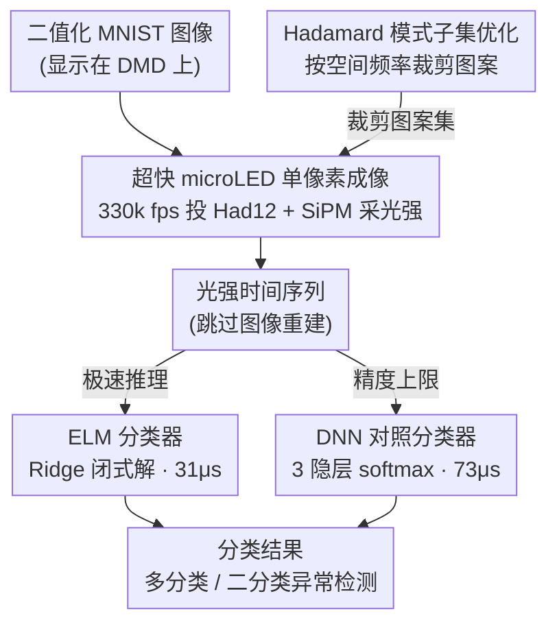

# Single Pixel Image Classification using an Ultrafast Digital Light Projector

**会议**: ICLR 2026  
**arXiv**: [2603.12036](https://arxiv.org/abs/2603.12036)  
**代码**: 无  
**领域**: 自动驾驶  
**关键词**: 单像素成像, 图像分类, microLED, Hadamard 模式, 极限学习机

## 一句话总结
本文利用 microLED-on-CMOS 超高速数字光投影仪实现单像素成像（SPI），结合低复杂度机器学习模型（ELM 和 DNN）实现亚毫秒级图像编码和 kHz 帧率的图像分类，在 MNIST 数据集上达到 90%+ 准确率，并在二分类场景中实现 >99% 的 AUC。

## 研究背景与动机
1. **领域现状**：机器视觉是嵌入在自动驾驶等自主代理中的成熟技术，但传统数字相机的操作带宽正成为瓶颈。事件相机虽然在动态场景中数据量更少，但受限于可见光和近红外波段。
2. **现有痛点**：
    - 传统 SPI 系统使用 DMD（数字微镜器件）生成图案，受限于机械切换速度（约 $10^4$ fps），整体成像速率与普通 CMOS 相机相当（$\lesssim 10^2$ Hz）
    - 现有 SPIC 工作多为仿真或低速实验，缺乏真正的超高速光学实验验证
    - 图像重建步骤增加了延迟和计算复杂度
3. **核心矛盾**：SPI 需要投射大量图案序列来采集信息，但投影速度是带宽瓶颈；压缩感知可减少图案数量但会牺牲分类精度。
4. **本文要解决什么**：实验验证基于超快 microLED 投影的单像素图像分类系统，在不重建图像的前提下直接对光检测时间序列进行分类。
5. **切入角度**：利用 microLED 阵列比 DMD 快约 100 倍的切换速度，完全绕过图像重建，直接在时空变换后的数据上进行分类。
6. **核心 idea**：将图像分类问题从空间域转变为时空域——每张图像被编码为光强度时间序列，直接用低复杂度 ML 模型分类。

## 方法详解

### 整体框架
系统把"拍照+分类"压缩成一条纯时序的光学流水线：microLED 投影仪以 33 万 fps 高速依次投射一组 Hadamard 编码图案，照亮挂在 DMD 上的待分类图像，单像素检测器把每一帧的光强叠加信号采下来形成一段时间序列，再交给低复杂度 ML 模型直接分类。整条链路完全跳过传统 SPI 的图像重建步骤——分类器吃的是时空变换后的光强序列，而不是重建出来的图片，因此延迟和算力开销都被压到最低。Hadamard 模式子集优化则横跨在投影前端，按空间频率裁掉低信息量图案、成倍提升有效带宽。

### 关键设计

**1. 超快 microLED 单像素成像：用电子级切换速度换掉机械瓶颈**

传统 SPI 靠 DMD 翻转微镜来生成图案，机械切换把帧率卡在约 $10^4$ fps，整套成像速率退化到和普通 CMOS 相机一个量级。本文换用 128×128 的 microLED-on-CMOS 阵列（像素 30×30 μm²、50 μm pitch）作为图案发生器，靠纯电子开关把帧刷新拉到 MHz 级，在全局快门下以 330,000 fps 投射一组 12×12 的 Hadamard 模式集（Had12）。被照亮的二值化 MNIST 图像显示在 1024×768 的 DMD 上，光强由 Onsemi SiPM 单像素检测器收集、再用 1 GHz 带宽示波器记录成时间序列。若需要重建图像（本文分类时并不需要），可用 $I_{(x,y),M} = \frac{1}{M}\sum_{m=1}^{M} S_m P_{(x,y),m}$，其中 $S_m$ 是每对互补 Hadamard 模式检测信号的差值，$P_{(x,y),m}$ 是第 $m$ 个模式。microLED 比 DMD 快约 100 倍的切换速度，正是让真正 kHz 级 SPI 成像第一次落地的关键。

**2. 极限学习机（ELM）分类器：闭式一步求解换极致推理速度**

超高速场景容不下迭代训练和重网络，本文主分类器选用单隐含层的 ELM：输入权重 $W_{\text{in}}$ 和偏置 $b$ 随机初始化后固定不动，隐含层输出 $H = f(XW_{\text{in}} + b)$ 用 ReLU 激活，唯一要学的输出权重通过 Ridge 回归一步闭式解出 $\beta = (H^\top H + \alpha I)^{-1} H^\top T$（正则化 $\alpha = 1.0$）。多分类取 $\hat{y} = \max(Y)$，二分类用 0.5 阈值。这种"只解一个线性方程"的结构没有反向传播，训练几乎瞬时完成，单张图像推理只要 31 μs，恰好匹配 kHz 级数据涌入的节奏。

**3. 深度神经网络（DNN）对照分类器：用更重的模型标定精度上限**

为了量出"低复杂度"到底牺牲了多少精度，本文同时训练一个前馈 DNN 作为对照：286 维输入经三个逐层递减、ReLU 激活的隐含层后接 softmax 输出，用 Adam 优化器、稀疏分类交叉熵损失训练 300 个 epoch。它单图推理 73 μs，约为 ELM 的两倍耗时，但实验帧率下精度更高（>90% vs 87.37%）。两者并排正好画出这条流水线上精度与速度的权衡曲线。

**4. Hadamard 模式子集优化：按空间频率裁剪图案数换带宽**

SPI 的速度瓶颈本质是要投多少张图案——投得越多越慢。本文发现 Hadamard 模式携带的分类信息并不均匀：低序号（低空间频率）模式贡献最大，只用前 1/4 模式仍能保持约 78% 的准确率。按变化方向把模式分成两类——Cat1（前 44 个）只沿单一空间轴变化、捕获粗糙轮廓，Cat2（第 45–288 个）沿两个方向变化、捕获精细结构。由此可以只投高信息量的低频子集，成倍提高有效带宽，而精度只有轻微回落。

### 损失函数 / 训练策略
ELM 走 Ridge 回归闭式解（$\alpha = 1.0$），无迭代训练；DNN 用 Adam 优化器配稀疏分类交叉熵损失、训练 300 epochs。数据为 MNIST（60K 训练 / 10K 测试），先二值化再缩放铺满 DMD 全表面。

## 实验关键数据

### 主实验

| 方法/配置 | 准确率(%) | 推理速度 | 备注 |
|-----------|----------|---------|------|
| DNN + 完整 Had12 (实验) | >90 | 73 μs/图像 | 1.2 kfps 帧率 |
| ELM + 完整 Had12 (实验) | 87.37 | 31 μs/图像 | 2× 快于 DNN |
| DNN + 二值化 MNIST (仿真) | 97.50 | - | 理论上限 |
| ELM + 二值化 MNIST (仿真) | 93.32 | - | ELM 上限 |
| ELM 二分类 (one-vs-all) | AUC >99% | - | 异常检测 |

### 消融实验

| 配置 | 分类准确率(%) | 说明 |
|------|-------------|------|
| 完整 Had12 (DNN) | >90 | 全部 144 模式 |
| 前 1/2 Had12 | ~86 | 精度轻微下降 |
| 前 1/4 Had12 | ~78 | 可接受精度，带宽 ×4 |
| 前 1/8 Had12 | ~68 | 精度显著下降 |
| 后 1/2 Had12 | ~75 | 高频模式信息量较少 |
| 随机 1/2 Had12 | ~82 | 介于前/后之间 |
| σ=0.1 高斯噪声 | >95 | 噪声影响小 |
| σ=0.5 高斯噪声 | >95 | 仍可收敛 |
| σ=1.0 高斯噪声 | ~85 | 显著下降+波动 |

### 关键发现
- 分类精度下降的主因不是等效信噪比降低，而是压缩感知导致的空间信息损失
- 低空间频率 Hadamard 模式对分类贡献最大，高频模式信息量较少
- ELM 虽然精度低于 DNN，但推理速度是 DNN 的 2 倍，适合极端实时场景
- 减少模式数量时 DNN 出现更长的梯度消失阶段，这与压缩输入的特性有关
- 二分类场景下 AUC 接近 1.0，适用于快速变化场景中的异常检测

## 亮点与洞察
- 首次实验性地在 kHz 帧率下验证了单像素图像分类，突破了传统成像速度限制
- 完全绕过图像重建的设计极大简化了系统、降低了延迟
- ELM 模型的极简设计契合超高速场景的需求（训练快、推理快、开销低）
- 对 Hadamard 模式子集的频率特性分析提供了实用的压缩策略指导
- 噪声与压缩感知的对比实验提供了有价值的理论洞察

## 局限性 / 可改进方向
- 仅在 MNIST 数据集上验证，该数据集相对简单，与真实机器视觉场景差距较大
- 12×12 的 Hadamard 模式分辨率较低，限制了对复杂图像的分辨能力
- 目前 FPGA 板卡的存储深度限制了模式集大小
- 检测端使用的 SiPM 和示波器难以小型化和集成化
- 未探索更复杂的 ML 模型（如 CNN）和更大规模数据集上的表现
- 从 MNIST 到自动驾驶实际场景的迁移尚需大量工作

## 相关工作与启发
- 压缩感知理论为减少投影数量提供了数学基础
- microLED 阵列在模拟光学计算中的应用表明该技术在下一代光学计算中的核心角色
- 重建-free 的 SPIC 方法近年发展迅速，本文是其中速度最快的实验验证
- ELM/储备池计算等低复杂度模型与光学硬件的结合是一个有前景的方向
- 单像素成像技术在非可见光波段（太赫兹、紫外线）有独特优势

## 评分
- 新颖性: ⭐⭐⭐⭐
- 实验充分度: ⭐⭐⭐
- 写作质量: ⭐⭐⭐⭐
- 价值: ⭐⭐⭐

<!-- RELATED:START -->

## 相关论文

- [\[ICLR 2026\] SiMO: Single-Modality-Operable Multimodal Collaborative Perception](simo_single-modality-operable_multimodal_collaborative_perceptio.md)
- [\[ICLR 2026\] SMART-R1: Advancing Multi-agent Traffic Simulation via R1-Style Reinforcement Fine-Tuning](advancing_multi-agent_traffic_simulation_via_r1-style_reinforcement_fine-tuning.md)
- [\[ICLR 2026\] NeMo-map: Neural Implicit Flow Fields for Spatio-Temporal Motion Mapping](nemo-map_neural_implicit_flow_fields_for_spatio-temporal_motion_mapping.md)
- [\[ICLR 2026\] MARC: Memory-Augmented RL Token Compression for Efficient Video Understanding](marc_memory-augmented_rl_token_compression_for_efficient_video_un.md)
- [\[ICLR 2026\] EgoDex: Learning Dexterous Manipulation from Large-Scale Egocentric Video](egodex_learning_dexterous_manipulation_from_large-scale_egocentric_video.md)

<!-- RELATED:END -->
