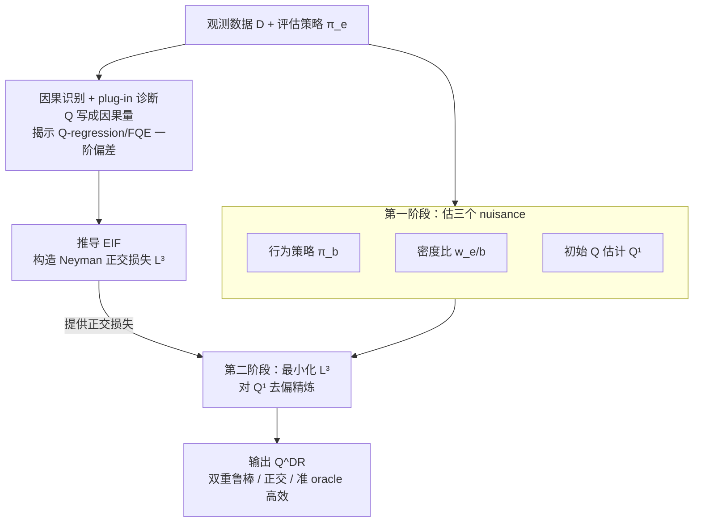

# An Orthogonal Learner for Individualized Outcomes in Markov Decision Processes

**会议**: ICLR 2026  
**arXiv**: [2509.26429](https://arxiv.org/abs/2509.26429)  
**代码**: [EmilJavurek/Orthogonal-Q-in-MDPs](https://github.com/EmilJavurek/Orthogonal-Q-in-MDPs)  
**领域**: 因果推断  
**关键词**: Q函数估计, 双重鲁棒, Neyman正交, 因果推断, 离线策略评估

## 一句话总结

将因果推断中的半参数效率理论系统引入MDP的Q函数估计，证明经典的Q-regression和FQE本质上是有plug-in偏差的朴素学习器，并提出DRQQ-learner——一个同时具备双重鲁棒性、Neyman正交性和准oracle效率的元学习器，通过推导有效影响函数(EIF)构造去偏二阶段损失，在Taxi和Frozen Lake环境中全面超越基线方法。

## 研究背景与动机

**领域现状**：在个性化医疗等场景中，从观测数据估计特定策略下的个体化潜在结果（即估计Q函数）是核心任务。现有方法如Q-regression（Liu et al., 2018）和FQE（Le et al., 2019）主要关注如何打破"horizon的诅咒"（即累积密度比随时间步指数爆炸的问题），但对估计器本身的统计性质缺乏理论保障。

**现有痛点**：Q-regression通过逆概率加权（IPTW）进行调整，直接使用累积密度比 $\rho_{1:t}$，在长horizon下方差爆炸；FQE通过递归拟合Bellman方程避免了累积密度比，但存在"deadly triad"问题（函数逼近+自举+离策略的不稳定组合），可能导致发散。更关键的是，这两种方法都没有任何关于正交性或效率性的理论保证。

**核心矛盾**：从因果推断的视角看，Q-regression和FQE都属于plug-in学习器——直接将估计的nuisance参数"插入"识别公式。Plug-in估计的根本缺陷在于nuisance参数的一阶估计误差会线性传播到最终估计量，导致收敛速度受限于nuisance估计的最慢分量。在静态因果推断中，双重鲁棒(DR)和Neyman正交方法已成功解决了这一问题，但在MDP的序列决策框架下，由于Bellman方程的递归结构和跨时间步的误差传播，这些工具的推广并不直接。

**本文目标** (1) 如何从半参数效率理论出发，推导MDP中Q函数估计的有效影响函数(EIF)？(2) 如何基于EIF构造一个Neyman正交的损失函数，使得nuisance估计误差仅以二阶项影响最终估计？(3) 所得到的估计器能否同时具备双重鲁棒性和准oracle效率？

**切入角度**：作者观察到Q函数本质上是一个因果估计量（potential outcome under evaluation policy $\pi_e$），可以通过潜在结果框架形式化。一旦建立这种因果解读，就可以利用半参数统计中成熟的去偏工具（EIF、正交学习、交叉拟合）来系统地改进估计。

**核心 idea**：推导Q函数MSE损失的有效影响函数，构造一个"先估nuisance、再用EIF去偏"的两阶段元学习器，使Q函数估计器同时获得双重鲁棒性、Neyman正交性和准oracle效率。

## 方法详解

### 整体框架

DRQQ-learner 把一个看似纯理论的问题落成一条清晰的流水线，整体逻辑分三步走。先把 Q 函数翻译成因果量，从而能诊断出现有方法（Q-regression / FQE）的 plug-in 偏差；再据此推导有效影响函数（EIF）、构造一个 Neyman 正交损失 $\hat{L}^3_{\pi_e}$；最后用「先粗估 nuisance、再用正交损失去偏」的两阶段元学习器把 Q 函数估出来，并附带可证明的统计保证。

具体地，输入是行为策略 $\pi_b$ 产生的观测数据集 $\mathcal{D}_{\pi_b}$（由 i.i.d. 轨迹分解为一步转移 $(S, A, R, \tilde{S})$ 的集合）以及目标评估策略 $\pi_e$。第一阶段估计三个 nuisance 函数：行为策略 $\hat{\pi}_b$、密度比 $\hat{w}_{e/b}$、初始 Q 函数估计 $\hat{Q}^1_{\pi_e}$。第二阶段在给定 nuisance 后，对正交损失 $\hat{L}^3_{\pi_e}$ 做经验风险最小化来精炼 Q 估计，输出最终的 $\hat{Q}^{DR}_{\pi_e}$。整个框架对第一阶段的具体模型选择不做限制——神经网络、线性模型或表格方法都行，第二阶段的模型类 $\mathcal{G}$ 也可灵活指定（如要求可解释性时用线性模型）。

### 关键设计

**1. 因果识别与 plug-in 诊断：先把 Q 函数翻译成因果量，再戳破现有方法的偏差**

这一步不提新方法，而是搭一个统一的诊断台。作者用潜在结果框架把 Q 函数写成因果参数 $\xi_{\pi_e}(s,a) = \mathbb{E}[R_0 + \sum_{t=1}^{\infty} \gamma^t R_t[\pi_e(\cdot|S_t)] \mid S_0=s, A_0=a]$。在 Markov 性、无未观测混杂、正值性这套标准假设下，它有两条识别路径：一条基于完整轨迹的 IPTW 识别，要乘上累积密度比 $\rho_{1:t}$，对应 Q-regression；另一条基于一步转移的 Bellman 方程识别，对应 FQE。

关键的诊断动作是计算这两个损失对 nuisance 参数的 Gâteaux 导数。结果导数不为零，意味着 nuisance 的一阶估计误差会线性地传播进最终估计——这正是 plug-in 偏差的定义。于是 Q-regression 和 FQE 被统一归类为 plug-in 学习器，它们的收敛速度被卡在最慢的那个 nuisance 分量上，这也为后面要做的去偏指明了攻击点。

**2. EIF 推导与 Neyman 正交损失：把一阶偏差降成二阶**

诊断出 plug-in 偏差后，作者对标准 MSE 总体风险 $L^1_{\pi_e}(\eta, g) = \mathbb{E}_{pb}[\sum_a \pi_e(a|S)(Q_{\pi_e}(S,a) - g(S,a))^2]$ 推导有效影响函数（EIF），用它构造去偏损失 $L^3_{\pi_e}$。EIF 的核心是一个校正项：Bellman 残差 $R' + \gamma v_{\pi_e}(\tilde{S}') - Q_{\pi_e}(S', A')$ 分别乘上密度比 $\pi_e/\pi_b$ 和 $w_{e/b}$，前者负责"本地"去偏（修正当前状态下的动作分布偏移），后者负责"全局"去偏（修正整条轨迹的状态访问分布偏移）。把这两个校正项打包成伪结果 $\phi_1, \phi_2$，原始 MSE 目标就被替换成带校正项的去偏目标。

这样构造出的损失满足 Neyman 正交性：

$$D_\eta D_g L^3(g^*, \eta)[\hat{g}-g, \hat{\eta}-\eta] = 0$$

即损失梯度对 nuisance 在真值附近的一阶扰动为零。直接后果是 nuisance 估计误差只能以二阶（乘积）形式渗进最终估计，因此哪怕 nuisance 模型收敛得慢，整体 Q 估计器依然能跑出快速率——这正是 plug-in 学习器做不到的。

**3. 双重鲁棒性与准 oracle 效率：给医疗场景一张容错保险**

第三个设计点是把前两步的好处兑现成两条可证明的统计保证。准 oracle 效率体现为超额风险界

$$\|g^* - \hat{g}\|^2 \lesssim \|\Delta^2 \hat{\pi}_b\|^2 \|\Delta^2 \hat{Q}_{\pi_e}\|^2 + \|\Delta^2 \hat{w}_{e/b}\|^2 \|\Delta^2 \hat{Q}_{\pi_e}\|^2$$

误差只依赖 nuisance 误差的乘积，而非任何单项。双重鲁棒性是它的直接推论：只要 $\hat{Q}^1_{\pi_e}$ 一致，或者 $(\hat{\pi}_b, \hat{w}_{e/b})$ 同时一致，最终估计器就一致——两组 nuisance 里对一组就够了。这点在精准医疗里尤其值钱，因为行为策略和转移动态的模型错误指定几乎不可避免，DR 性质等于允许"只赌对一个模型"仍拿到一致估计。

### 训练策略

第一阶段的三个nuisance模型通过标准监督学习分别训练：$\hat{\pi}_b$ 是一个分类模型拟合行为策略；$\hat{w}_{e/b}$ 是密度比估计，通过估计转移概率和稳态分布的比值获得；$\hat{Q}^1_{\pi_e}$ 可以用任意现有的Q估计方法（如FQE）获得初始估计。第二阶段在给定nuisance估计后，对正交损失 $\hat{L}^3_{\pi_e}$ 做经验风险最小化，支持使用交叉拟合（样本分割）来避免过拟合偏差。整个流程是模型无关的，nuisance和目标模型都可以使用任意ML模型（神经网络、线性模型、表格方法等）。

## 实验关键数据

### 主实验

实验在OpenAI Gym的Taxi和Frozen Lake两个环境上进行。行为策略 $\pi_b$ 和评估策略 $\pi_e$ 均为epsilon-greedy策略。评价指标为相对MSE：$\text{rMSE} = \|\hat{Q} - Q_{\pi_e}\|_2^2 / \|Q_{\pi_e}\|_2^2$。

| 实验条件 | Q-regression | FQE | MQL | DRQQ (本文) |
|---------|-------------|-----|-----|------------|
| Taxi, n=4000, 无限制 $\mathcal{G}$ | 较高rMSE，受horizon诅咒影响 | 中等rMSE | 中等rMSE | **最低rMSE** |
| Taxi, 长horizon ($h$=20) | rMSE显著上升 | 基本稳定 | 中等 | **稳定最优** |
| Taxi, 低overlap (ε_e=0.1) | rMSE爆炸 | 中等上升 | 中等 | **显著优于所有基线** |
| Frozen Lake, 无限制 $\mathcal{G}$ | 较高rMSE | 中等 | 中等 | **最低rMSE** |
| Taxi, 线性 $\mathcal{G}$ | 中等 | 中等 | 中等 | **多数设定最优** |

### 消融与诊断实验

论文通过三个维度的系统变量实验来验证理论性质：

| 变量维度 | 变化范围 | 验证的理论性质 | DRQQ表现 |
|---------|---------|-------------|---------|
| 数据集大小 $n$ | 2000→6000 | 收敛速率 | 随$n$增大稳定下降，始终优于基线 |
| 有效horizon $h=1/(1-\gamma)$ | 3→20 | 打破horizon诅咒 | rMSE对$h$不敏感，Q-regression则急剧上升 |
| Overlap程度 (ε_e) | 0.1→0.9 | Neyman正交的低overlap优势 | 低overlap下优势最大，高overlap下与基线差距缩小 |
| 模型类限制 | 无限制 vs 线性 | 对restricted $\mathcal{G}$ 的适用性 | 线性 $\mathcal{G}$ 下仍表现最优 |

### 关键发现

- **低overlap是DRQQ-learner的最大优势场景**：当评估策略与行为策略差异大时，plug-in方法的偏差被放大，而DRQQ的Neyman正交性使其对这种分布偏移不敏感。实验中低overlap设定下DRQQ相对FQE的改善幅度远大于高overlap设定
- **Q-regression受horizon诅咒严重影响**：随着有效horizon从3增加到20，Q-regression的rMSE急剧上升，因为累积密度比 $\rho_{1:t}$ 的方差指数增长。DRQQ和FQE因使用一步转移而不受此影响
- **限制模型类不影响方法有效性**：在线性 $\mathcal{G}$ 设定下DRQQ仍然表现最优，验证了理论的通用性；这也说明该方法可用于需要可解释模型的医疗场景
- **高overlap下DRQQ优势减小但不反转**：当 $\pi_e$ 接近随机策略时，密度比接近1，所有方法的nuisance估计都变简单，DRQQ的去偏优势自然减弱，但不会比基线更差

## 亮点与洞察

- **因果推断与RL的理论桥梁**：首次在MDP的Q函数估计中完整引入半参数效率理论框架，将Q-regression和FQE统一归类为plug-in学习器并精确诊断其偏差来源。这不仅提出了新方法，更提供了一个分析和比较不同Q估计方法的统一理论透镜
- **"先粗估再去偏"的元学习范式**：DRQQ-learner的两阶段结构非常优雅——第一阶段可以用任意现成方法（哪怕是有偏的FQE）粗估nuisance，第二阶段通过EIF导出的正交损失自动修正偏差。这种"模型无关的去偏wrapper"思路可以直接迁移到其他涉及nuisance参数的序列决策估计问题
- **双重鲁棒性的实用价值**：在精准医疗等场景中，行为策略 $\pi_b$ 和转移动态通常都难以精确估计。DR性质提供了一种"容错保险"——只要Q函数初始估计或密度模型中有一组正确，最终结果就一致

## 局限与展望

- **实验环境局限性明显**：仅在Taxi（25×5状态×6动作）和Frozen Lake（16状态×4动作）两个小规模离散环境验证。尽管理论上支持连续状态空间，但缺乏任何连续/高维场景的实验验证，离实际医疗应用（高维患者特征、连续剂量）差距较大
- **密度比 $w_{e/b}$ 的估计在实际中困难**：该nuisance涉及稳态分布的比值，在连续或大规模离散状态空间中估计难度极高，可能成为整个方法在实际应用中的瓶颈
- **计算开销翻倍**：需要先训练三个nuisance模型，再进行第二阶段优化，相比直接用FQE的一次训练计算量显著增加，且需要交叉拟合进一步增加开销
- **非平稳MDP的扩展**：当前理论严格要求时不变MDP和平稳策略，而实际医疗场景中患者状态转移和治疗策略往往随时间变化，扩展到非平稳设定需要重新推导EIF

## 相关工作与启发

- **vs Q-regression (Liu et al., 2018)**：Q-regression通过IPTW调整分布偏移，使用完整轨迹的累积密度比。本文证明它是基于轨迹识别的plug-in学习器，受horizon诅咒影响且有一阶plug-in偏差。DRQQ使用一步转移避免了horizon问题，同时通过正交损失消除了plug-in偏差
- **vs FQE (Le et al., 2019)**：FQE通过递归拟合Bellman方程使用一步转移，成功打破了horizon诅咒。本文证明它是基于Bellman识别的plug-in学习器，仍存在一阶plug-in偏差。DRQQ在FQE基础上增加了EIF校正项，获得了Neyman正交性
- **vs Shi et al. (2021)的去偏OPE**：Shi等人为OPE的置信区间推导了逐点迭代去偏方法，在离散设定下与DRQQ的特例一致。但DRQQ的优势在于：(1) 适用于连续状态空间（Shi的方法含Dirac delta函数，无法直接推广）；(2) 支持受限模型类 $\mathcal{G}$；(3) 提供了完整的正交性和准oracle效率的理论证明
- **vs 静态因果推断的DR方法**：DoubleML (Chernozhukov et al., 2018)和DR-learner (Kennedy, 2020)的正交学习理论是本文的直接理论基础，DRQQ将这些概念从静态/短期设定推广到了无限horizon的MDP

## 评分

- 新颖性: ⭐⭐⭐⭐ 将半参数效率理论系统引入MDP的Q估计是重要的理论创新，但核心工具（EIF、正交损失、交叉拟合）本身来自因果推断的成熟框架
- 实验充分度: ⭐⭐⭐ 实验设计合理地验证了理论预测（变数据量、变horizon、变overlap），但仅有两个小规模离散环境，缺乏对连续/高维场景的验证
- 写作质量: ⭐⭐⭐⭐⭐ 理论推导极其严谨，从plug-in诊断到EIF推导到正交损失构造的叙事线索清晰，将复杂的半参数统计理论讲得很有逻辑
- 价值: ⭐⭐⭐⭐ 为离线Q函数估计提供了全新的理论视角和有严格保证的方法，对个性化医疗和可靠RL有重要意义

<!-- RELATED:START -->

## 相关论文

- [\[ICML 2026\] Rank-Learner: Orthogonal Ranking of Treatment Effects](../../ICML2026/causal_inference/rank-learner_orthogonal_ranking_of_treatment_effects.md)
- [\[ICML 2025\] Transformer-Based Spatial-Temporal Counterfactual Outcomes Estimation](../../ICML2025/causal_inference/transformer-based_spatial-temporal_counterfactual_outcomes_estimation.md)
- [\[ICLR 2026\] RFEval: Benchmarking Reasoning Faithfulness under Counterfactual Perturbations](rfeval_benchmarking_reasoning_faithfulness_under_counterfactual_perturbations.md)
- [\[ICLR 2026\] Synthesising Counterfactual Explanations via Label-Conditional Gaussian Mixture Variational Autoencoders](synthesising_counterfactual_explanations_via_label-conditional_gaussian_mixture_.md)
- [\[ICLR 2026\] Action-Guided Attention for Video Action Anticipation](action-guided_attention_for_video_action_anticipation.md)

<!-- RELATED:END -->
