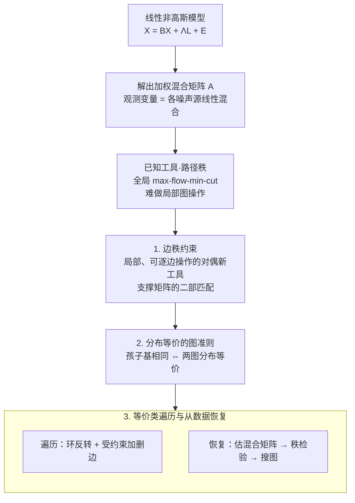

# Distributional Equivalence in Linear Non-Gaussian Latent-Variable Cyclic Causal Models

**会议**: ICLR 2026 (Oral)  
**arXiv**: [2603.04780](https://arxiv.org/abs/2603.04780)  
**代码**: [MarkDana/Equiv-LiNG-Latent](https://github.com/MarkDana/Equiv-LiNG-Latent) / [在线演示](https://equiv.cc/)  
**领域**: 因果推断 / 因果发现  
**关键词**: 因果发现, 潜变量, 循环因果模型, 分布等价性, 边秩约束, 非高斯模型

## 一句话总结

首次在线性非高斯设定下、不依赖任何结构假设，给出了含潜变量和环的因果图之间分布等价性的完整图准则，核心工具是新提出的**边秩约束**（edge rank constraints），据此开发了遍历等价类和从数据恢复因果模型的算法——这是参数化因果模型中首个无结构假设的等价性刻画和发现方法。

## 研究背景与动机

**领域现状**：因果发现旨在从观测数据中推断因果关系，是因果推理的基础任务。在现实场景中，数据往往存在未观测的潜变量（latent variables）和因果循环（cycles），如基因调控网络中的反馈环路、经济系统中的相互因果。这使得因果发现成为极具挑战的问题。

**现有痛点**：
1. 大多数方法要求潜变量具有特定的指示模式（indicator patterns），如每个潜变量至少影响两个观测变量且不共享
2. 部分方法限制潜变量只能以特定方式与其他变量交互（如无直接潜-潜因果关系）
3. 几乎所有方法禁止因果图中存在环（循环因果关系），仅处理 DAG 结构
4. 这些结构假设在实际应用中常常不成立，严重限制了方法的适用范围

**核心矛盾**：走向通用、无结构假设方法的核心障碍是**缺乏等价性刻画**——如果不知道什么能被识别（即哪些图产生相同的观测分布），通常就无法设计出识别方法。没有等价性理论，就不知道因果发现的可达精度上限是什么。

**本文方案**：在线性非高斯模型（LiNG-Latent）下，建立完整的等价性理论。核心创新是引入**边秩约束**这一新工具——它填补了现有独立约束（independence constraints）在潜变量设定下不完备的缺口，从而实现了完整的图准则。

## 方法详解

### 整体框架

本文不提出新的估计器，而是先把"在线性非高斯、含潜变量和环的最一般设定下，哪些因果图无法区分"彻底讲清楚，再据此设计遍历等价类和从数据恢复模型的算法。一切围绕模型 $X = BX + \Lambda L + E$ 展开：$X$ 是观测变量向量，$B$ 是观测变量之间允许成环的因果系数矩阵，$L$ 是潜变量，$\Lambda$ 是潜变量到观测变量的效应矩阵，$E$ 是非高斯的独立噪声。解出方程得 $X = A E$，每个观测变量都写成所有噪声源（含潜变量驱动项）的线性混合，这张**加权混合矩阵** $A$ 里编码了完整的因果结构，于是"两图是否等价"被翻译成"它们能生成的混合矩阵集合是否一致"。

沿这条主线，方法分三步推进：已知的**路径秩**（path ranks）虽然理论上足以判定等价，却是全局量、难做局部图操作；本文先造出局部、可逐边操作的对偶新工具**边秩约束**（设计 1），再借它把等价判据化简成逐点可查的**图准则**（设计 2），最后把准则落成**等价类遍历与从数据恢复**的算法（设计 3）。

### 关键设计

**1. 边秩约束：给全局难算的路径秩配一个局部、可逐边操作的对偶工具**

传统潜变量因果发现主要靠**独立约束**——两变量之间没有因果路径相连就应当统计独立。但有潜变量时它不完备：两个观测变量哪怕没有任何直接因果关系，也可能被共同潜变量牵连而相关。更一般的工具是**秩约束**——看混合矩阵子矩阵的秩，独立约束只是它在秩为 $0$ 时的特例。这种秩对应的就是已知的**路径秩** $\rho_G(Z,Y)$：由 $Y$ 到 $Z$ 的最大顶点不交路径数（即 max-flow-min-cut）定义，且与混合矩阵子矩阵的秩一一对应（$\mathrm{rank}(A_{Z,Y})=\rho_G(Z,Y)$）。路径秩理论上已足以判定等价，但它是**全局量**：一条边可能落在多个瓶颈上，局部改一条边会引发路径秩不可预测的全局变化，难以拿来做结构搜索。本文造的新工具是**边秩** $r_G(Z,Y)$——直接在边上定义、由"从 $Y$ 到 $Z$ 的最大二部匹配"给出，代数上对应的不是混合矩阵而是二值**支撑矩阵** $Q(G)$（$\mathrm{mrank}(Q(G)_{Z,Y})=r_G(Z,Y)$），并证明它与路径秩之间存在**对偶关系**。边秩是局部的、可逐边增删的，正好补上路径秩缺的那一块，这是后面能给出干净准则、能做图遍历的关键。

**2. 分布等价的图准则：把"两图不可区分"化简成逐点可查的"孩子基相同"**

仅有路径秩版判据并不可操作：它要遍历所有顶点置换和所有 $(Z,Y)$ 子集，阶乘加指数级，相当于要求"两图有完全相同的 d-分离"，太全局。边秩的局部性带来转机——等价判据可被分解为**只逐个检查单个观测变量** $X_i$，从而得到最终图准则：两个不可约模型分布等价，当且仅当存在顶点置换 $\pi$，使二者的"孩子基"（children bases，由完美边匹配定义的子集族 $\mathrm{bases}_G(Y)$）在 $L$ 以及每个 $L\cup\{X_i\}$ 上都相同。这把全局条件降成了类似"相同邻接与 v-结构"的局部可查条件；在无潜变量（$L=\varnothing$）时它恰好退化为已知的线性非高斯精确可识别结论。非高斯性是关键杠杆：相比高斯模型，非高斯噪声携带额外可识别信息，把等价类切得更细、能区分出更多因果图，这与 LiNGAM 一脉相承。

**3. 等价类遍历与从数据恢复：把准则落成枚举算法和发现算法**

判定准则只能回答"两图等不等价"，既不能生成整个等价类，也不能从数据恢复模型，本文为这两件事各给出一套算法。遍历用的是类似 Meek 猜想的**变换刻画**：在保持孩子基（边秩约束）不变的前提下做两类图编辑——(a) 对不相交的简单环整体反向（环在线性非高斯下不引入本质复杂度）；(b) 按"$V_j$ 是否为支撑矩阵中的支柱（coloop）"判据增删边——反复施加即可系统枚举出整个等价类。从数据恢复则反向走这条链：先用过完备独立成分分析（OICA）从观测数据估出混合矩阵并定出潜变量个数，再用矩阵秩检验把成立的边秩约束/孩子基逐一读出，最后搜索同时满足所有约束的因果图，输出精度恰停在等价类这一可识别上限——这是首个无结构假设的潜变量因果发现方法。

## 实验关键数据

### 主实验：等价性刻画的验证

| 实验设置 | 评估内容 | 核心结果 |
|---------|---------|---------|
| 合成数据（无环、无潜变量） | 退化为 LiNGAM 设定 | 与已知结果完全一致，验证正确性 |
| 合成数据（有环、无潜变量） | 循环因果模型 | 图准则正确识别所有等价/不等价图对 |
| 合成数据（无环、有潜变量） | 潜变量 DAG | 边秩约束提供了比独立约束更细的等价类 |
| 合成数据（有环+有潜变量） | 最一般设定 | 准则完备——等价类内的图确实不可区分 |
| 在线交互演示 equiv.cc | 用户自定义验证 | 用户可手动指定图，系统即时展示等价类 |

### 消融实验：约束类型的贡献

| 约束组合 | 等价类粒度 | 可识别性强度 |
|---------|-----------|-------------|
| 仅独立约束 | 粗（多个不等价图被合并） | 弱 |
| 独立约束 + 边秩约束 | 最细（精确等价类） | **最强** |
| 高斯模型 + 所有约束 | 介于两者之间 | 中等（非高斯性提供额外信息） |
| 非高斯 + 仅秩约束（无独立约束） | 接近最细 | 强（秩约束已包含独立约束） |

### 核心发现

- **边秩约束是不可或缺的**：仅靠独立约束时，多个不等价图被错误归为同一等价类；加入边秩约束后等价类精确收紧
- **非高斯性提供显著可识别性**：相比高斯模型，非高斯设定下等价类更小（更多图可区分），这与 LiNGAM 的经典结论一致
- **环不根本阻碍因果发现**：循环因果关系增大了等价类但未使问题不可解——在线性非高斯设定下仍可进行有意义的因果推断
- **等价类大小随复杂度增长**：但在中等规模图（$\sim$10个变量）上仍然可处理

## 亮点与洞察

- **理论突破性极强**：首个在任何参数化设定下、不依赖结构假设的等价性完整刻画——因果发现领域的里程碑
- **ICLR 2026 Oral**：获得口头报告接收，反映审稿人对理论贡献的高度认可
- **新工具具有独立价值**：边秩约束不仅服务于本文，对更广泛的潜变量因果发现问题也有重要应用前景
- **问题定位精准**："等价性刻画是通用方法的前提"——这一认识论层面的洞察对整个因果发现社区具有指导意义
- **实用性好**：提供了开源代码和在线交互演示 equiv.cc，降低了使用门槛

## 局限与展望

- 限于线性模型假设，非线性因果关系（加性噪声模型、后非线性模型等）未涉及
- 非高斯性假设在某些领域（如金融数据中近似高斯的情况）可能不成立
- 算法的计算复杂度随变量数量指数增长，大规模问题（>20个变量）的可扩展性有待验证
- 等价类遍历在极大等价类时面临组合爆炸问题
- 缺乏在大规模真实数据上的系统评估（实验以合成数据和小规模验证为主）
- 可以进一步扩展到混合非高斯-高斯、部分非线性等更一般的模型设定

## 评分

- 新颖性: ⭐⭐⭐⭐⭐
- 实验充分度: ⭐⭐⭐
- 写作质量: ⭐⭐⭐⭐
- 价值: ⭐⭐⭐⭐⭐

<!-- RELATED:START -->

## 相关论文

- [\[AAAI 2026\] I-CAM-UV: Integrating Causal Graphs over Non-Identical Variable Sets Using Causal Additive Models with Unobserved Variables](../../AAAI2026/causal_inference/i-cam-uv_integrating_causal_graphs_over_non-identical_variable_sets_using_causal.md)
- [\[ICML 2025\] Estimating Causal Effects in Gaussian Linear SCMs with Finite Data](../../ICML2025/causal_inference/estimating_causal_effects_in_gaussian_linear_scms_with_finite_data.md)
- [\[ICML 2025\] Latent Variable Causal Discovery under Selection Bias](../../ICML2025/causal_inference/latent_variable_causal_discovery_under_selection_bias.md)
- [\[ICML 2026\] Causal-JEPA: Learning World Models through Object-Level Latent Masking](../../ICML2026/causal_inference/causal-jepa_learning_world_models_through_object-level_latent_masking.md)
- [\[ICLR 2026\] Synthesising Counterfactual Explanations via Label-Conditional Gaussian Mixture Variational Autoencoders](synthesising_counterfactual_explanations_via_label-conditional_gaussian_mixture_.md)

<!-- RELATED:END -->
