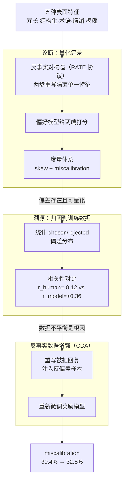

# Flattery, Fluff, and Fog: Diagnosing and Mitigating Idiosyncratic Biases in Preference Models

**会议**: ICLR 2026  
**arXiv**: [2506.05339](https://arxiv.org/abs/2506.05339)  
**代码**: [GitHub](https://github.com/anirudhb123/preference-model-biases)  
**领域**: 因果推理  
**关键词**: preference model, reward model bias, RLHF, counterfactual data augmentation, LLM alignment

## 一句话总结

系统研究偏好模型对五种表面特征（冗长、结构化、术语、谄媚、模糊）的过度依赖——通过因果反事实对量化偏差来源于训练数据的分布不平衡，并提出基于**反事实数据增强 (CDA)** 的后训练方法，将模型与人类判断的平均失校准率从 39.4% 降至 32.5%。

## 研究背景与动机

**领域现状**: 语言模型越来越多地作为人类偏好判断的代理——既用作 RLHF 中的奖励模型，也用作自动评估器（LLM-as-a-Judge）。

**现有痛点**: 
   - 偏好模型存在系统性的**失校准 (miscalibration)**：偏向表面特征（如长度、列表格式）而非实质质量
   - 用作奖励模型时导致 reward hacking（优化代理特征而非真正质量）
   - 用作评估器时歪曲评估结论
   - 先前研究孤立地记录单个偏差，缺乏对训练数据瑕疵→模型失校准的**系统性因果分析**

**核心矛盾**: 训练数据中的偏差特征与人类偏好标签仅有微弱相关（平均 $r_{human} = -0.12$），但模型却对这些特征产生强正相关（平均 $r_{model} = +0.36$）——模型放大了数据中的微弱伪信号

**本文目标**: ① 量化偏好模型在五个维度上的失校准程度；② 追溯偏差至训练数据；③ 提出简单有效的修复方法

**切入角度**: 采用**因果推断**方法——构造反事实对 (RATE 协议)，实验性地隔离每个偏差特征的效应，而非简单相关分析

**核心 idea**: 通过反事实对量化偏差、通过训练数据分析追溯根因、通过反事实数据增强修复失校准。

## 方法详解

### 整体框架

这篇论文想搞清楚一件事：偏好模型为什么会偏爱那些"看起来好"但实质未必好的回复，问题出在哪、又怎么修。它把整套工作拆成诊断、溯源、修复三步，沿着一条因果链推进。诊断阶段（§3）针对冗长、结构化、术语、谄媚、模糊这五种表面特征，分别构造一组"只在该特征上不同、其余尽量一致"的反事实回复对，再用偏好模型给两端打分，量化它有多偏（skew）以及与人类判断有多不一致（miscalibration）。溯源阶段（§4）把镜头转向训练数据，统计这些偏差特征在 chosen/rejected 标注里的分布，看模型的偏好是不是从数据里学来的。修复阶段（§5）则不碰模型结构和训练算法，只在数据层面做反事实数据增强（CDA），重新微调奖励模型。整条流水线的逻辑是：先证明偏差存在且可量化，再把它归因到数据的分布不平衡，最后从源头补上反偏差信号。

### 关键设计

**1. 反事实对构造（RATE 协议）：用实验性隔离取代相关分析**

直接统计"特征与人类偏好的相关性"会把多个特征混在一起，分不清到底是哪个特征在起作用。本文借用 RATE（Reber et al., 2025）的两步重写协议来隔离单一特征：对每个查询 $Q$ 和基础回复 $R$，第一步把 $R$ 重写成放大目标偏差特征的版本 $R_p' = f_p(R)$，第二步再对它重写一次得到控制基线 $R_p$。之所以要重写两次，是为了让 $R_p$ 和 $R_p'$ 都经历过同样的"重写扰动"，从而抵消重写本身引入的风格噪声，剩下的差异才近似只来自目标特征。用 $(R_p, R_p')$ 这一对去喂偏好模型，就能把该特征的因果效应单独拎出来测量，而不是和别的特征纠缠在一起。

**2. 度量体系：用 skew 和 miscalibration 两个互补指标刻画偏差**

有了反事实对，还需要一把尺子去量。本文定义两个互补指标。Skew Rate 衡量模型自身有多偏向加了偏差的那一端——统计偏好模型给 $R_p'$ 打的分高于 $R_p$ 的比例：

$$\text{Skew}_p = \frac{1}{N}\sum_{i=1}^N \mathbb{I}(\Delta s_i > 0), \quad \Delta s_i = W_{RM}(Q^{(i)}, R_p'^{(i)}) - W_{RM}(Q^{(i)}, R_p^{(i)})$$

但模型偏向某个特征不一定就是错——也许人类也偏向它。所以还要 Miscalibration Rate，直接对齐到人类判断，统计"模型的选择"与"人类的选择"不一致的比例：

$$\text{Miscal}_p = \frac{1}{N}\sum_{i=1}^N \left|\mathbb{I}(\Delta s_i > 0) - \mathbb{I}(\text{Human}(R_p'^{(i)} > R_p^{(i)}))\right|$$

两者分工明确：skew 描述模型的内在倾向，miscalibration 才是真正的"病情"——它扣掉了人类本身也认可的那部分偏好，剩下的就是模型相对人类多出来的、不该有的偏差。

**3. 反事实数据增强（CDA）：从数据侧注入反偏差信号**

既然偏差被归因到训练数据的分布不平衡，修复就顺势从数据下手。CDA 的做法是：在训练集里挑出那些两个回复都不含目标偏差的偏好对，把其中被拒绝的回复 $R_{rejected}$ 重写成放大该偏差的版本 $R_{rejected,p}$，再构造新的训练样本 $(Q, R_{chosen} \succ R_{rejected,p})$。这条样本传达的信号很直白——"哪怕给被拒回复加上漂亮的偏差特征，它依然该被拒"，从而抵消数据里"偏差特征常和 chosen 共现"的伪相关。为防止注入这些重写样本造成分布偏移，还补入一批 Chatbot Arena 样本做平衡。整个过程不改模型架构、不改训练目标，只换训练数据，因此能无缝接进现有的 RLHF 流水线。

### 损失函数 / 训练策略

沿用标准 Bradley-Terry 偏好损失，不做任何修改；只是在 Skywork v0.2 的训练数据基础上掺入 CDA 构造的反偏差样本后重新微调奖励模型。

## 实验关键数据

### 主实验

**偏好模型失校准分析 (Figure 2)**:

| 偏差类型 | 模型 Skew | 人类 Skew | Miscalibration |
|---------|----------|----------|---------------|
| Length (冗长) | ~60% | ~45% | ~30% |
| Structure (结构化) | ~89.5% | ~85% | ~15% |
| Jargon (术语) | ~70% | ~30% | >50% |
| Sycophancy (谄媚) | ~55% | ~50% | ~40% |
| Vagueness (模糊) | ~65% | ~25% | >50% |
| **平均** | **>60%** | - | **~39.4%** |

**训练数据偏差分析 (Figure 3, 相关性)**:

| 偏差特征 | $r_{human}$ (人类标签) | $r_{model}$ (模型预测) | $r_{human}^{train}$ (训练数据) |
|---------|---------------------|---------------------|---------------------------|
| Length | 弱负相关 | 正相关 | 弱正相关 |
| Structure | 中等正相关 | 强正相关 | 正相关 (65.5%选结构化) |
| Jargon | 弱负相关 | 强正相关 | 弱正相关 (54.4%选术语) |
| Sycophancy | 弱负相关 | 中等正相关 | 弱正相关 |
| Vagueness | 负相关 | 正相关 | 弱相关 |
| **平均** | **-0.12** | **+0.36** | - |

### 消融实验

**CDA 修复效果 (Figure 5)**:

| 指标 | 基线 (Base) | CDA 微调后 | 改善 |
|------|-----------|-----------|------|
| 平均 Miscalibration | 39.4% | **32.5%** | -6.9% |
| 平均 |Skew - HumanSkew| | 20.5% | **10.0%** | -10.5% |
| Vagueness Miscal | ~55% | **~32%** | -22.8% |
| Jargon Miscal | ~55% | **~38%** | -17.1% |
| Length Miscal | ~30% | **~27%** | -3.4% |
| Structure Miscal | 12.6% | 17.3% | +4.7% (过矫正) |
| Sycophancy Miscal | 40.6% | 44.4% | +3.8% (过矫正) |
| RewardBench 总分 | 基线 | **基本不变** | ~0 |

### 关键发现

1. **偏好模型系统性失校准**: 在所有五个偏差维度上，模型偏好与人类判断显著不一致，平均 39.4% 失校准
2. **Jargon 和 Vagueness 最严重**: 失校准率超过 50%——模型被"看似专业"和"面面俱到但不具体"的回复欺骗
3. **训练数据是根因**: 偏差特征与人类标签相关性仅 -0.12，但与模型预测相关性达 +0.36——模型将微弱的数据伪信号放大了 3 倍
4. **CDA 有效且低成本**: 平均失校准降低 6.9%，skew 差异降低 10.5%，且 RewardBench 性能不变
5. **LLM 评估器同样受影响**: GPT-4o、Gemini-2.5-Pro、Claude-3.7-Sonnet 对谄媚的偏好率高达 75-85%（人类仅 ~50%）
6. **过矫正风险**: Structure 和 Sycophancy 的失校准在 CDA 后略有上升——因为基线 skew 本身接近甚至低于人类

## 亮点与洞察

1. **因果视角的偏差分析**: 不是简单列出"模型有偏差"，而是用反事实对实验性地量化因果效应，并追溯到训练数据
2. **偏差放大效应的量化**: $r_{human} = -0.12$ vs $r_{model} = +0.36$ 的对比数据极具说服力——标准 RLHF 流水线无意中将微弱的数据伪信号放大为强烈的偏好信号
3. **简洁实用的修复方案**: CDA 不需要修改模型架构或训练算法，仅增强数据即可——可直接集成到现有对齐流水线
4. **五维度全面覆盖**: Length、Structure、Jargon、Sycophancy、Vagueness 涵盖了 LLM 生成文本的主要特质偏差

## 局限与展望

1. 仅覆盖单轮英语查询——多轮对话中谄媚等偏差可能更复杂
2. 合成扰动可能无法反映自然语言中偏差的全部表现形式
3. 人类标注仍有噪声（每例仅 3 个判断），RewardBench 也只是粗略的下游评估
4. CDA 对 Structure 和 Sycophancy 存在过矫正——需要更精细的数据配比策略
5. 未来方向：多偏差联合去偏、扩展到多语言/多轮场景、与 DPO 等直接偏好优化结合

## 相关工作与启发

- **Li et al. (2024)**: 发现 Chatbot Arena 中风格胜过实质——本文系统量化了这一现象并追溯根因
- **RATE 协议 (Reber et al., 2025)**: 反事实重写消除混淆因素——本文将其应用于偏好模型偏差的因果分析
- **OffsetBias (Park et al., 2024)**: 识别了具体性偏差和熟悉知识偏差——本文扩展了偏差的维度覆盖
- **启发**: 对齐/评估中的偏差问题本质上是因果推断问题——反事实方法 > 相关性分析

## 评分

- 新颖性: ⭐⭐⭐⭐ 组合了已有技术（反事实重写 + CDA）但系统性和因果视角是新的；五维度分类框架实用
- 实验充分度: ⭐⭐⭐⭐ 4 个奖励模型 + 3 个 LLM 评估器 × 5 种偏差 + 人类评估 + 训练数据分析 + CDA 修复，但缺少下游 RLHF 端到端实验
- 写作质量: ⭐⭐⭐⭐⭐ 标题生动（Flattery, Fluff, and Fog），问题定义清晰，Table 1 的偏差分类非常直观，实验层层递进（诊断→溯源→修复）
- 价值: ⭐⭐⭐⭐⭐ 对 RLHF 和 LLM-as-a-Judge 领域有直接实践价值；CDA 方法简单可落地；偏差放大效应的发现对理解对齐失败机制有重要意义

<!-- RELATED:START -->

## 相关论文

- [\[ICML 2026\] The Synthetic Web: Adversarially-Curated Mini-Internets for Diagnosing Epistemic Weaknesses of Language Agents](../../ICML2026/causal_inference/the_synthetic_web_adversarially-curated_mini-internets_for_diagnosing_epistemic_.md)
- [\[ICLR 2026\] Distributional Equivalence in Linear Non-Gaussian Latent-Variable Cyclic Causal Models](distributional_equivalence_in_linear_non-gaussian_latent-variable_cyclic_causal_.md)
- [\[ACL 2026\] Evaluating Counterfactual Strategic Reasoning in Large Language Models](../../ACL2026/causal_inference/evaluating_counterfactual_strategic_reasoning_in_large_language_models.md)
- [\[ICML 2025\] RATE: Causal Explainability of Reward Models with Imperfect Counterfactuals](../../ICML2025/causal_inference/rate_causal_explainability_of_reward_models_with_imperfect_counterfactuals.md)
- [\[ACL 2025\] On the Reliability of Large Language Models for Causal Discovery](../../ACL2025/causal_inference/llm_causal_discovery_reliability.md)

<!-- RELATED:END -->
