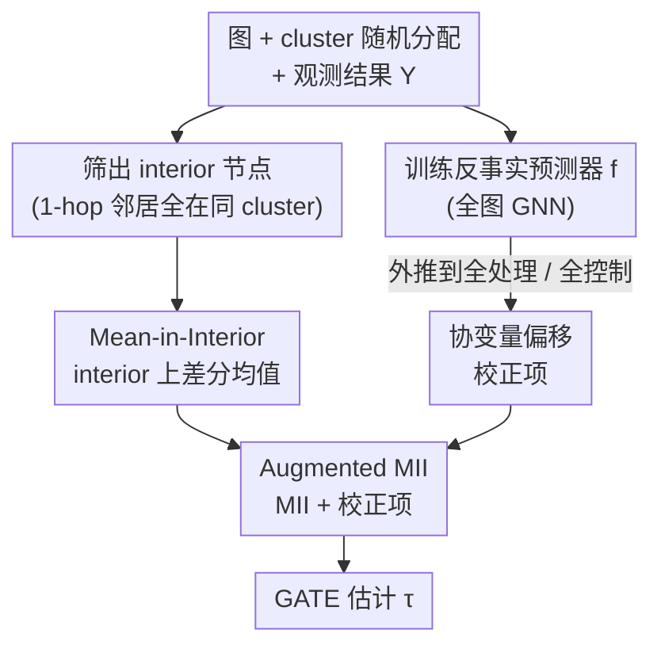

# Journey to the Centre of Cluster: Harnessing Interior Nodes for A/B Testing under Network Interference

**会议**: ICLR2026  
**arXiv**: [2602.04457](https://arxiv.org/abs/2602.04457)  
**代码**: [GitHub](https://github.com/Cqyiiii/AMII-Harnessing-Interior-Nodes-for-Network-Experiments)  
**领域**: 因果推理  
**关键词**: A/B testing, network interference, causal inference, cluster randomization, GATE estimation

## 一句话总结

针对网络干扰下 A/B 测试中 GATE 估计的高方差问题，提出 Mean-in-Interior (MII) 估计器——仅对 cluster 内部节点取均值，大幅降低方差；再通过反事实预测器进行协变量偏移校正，得到增广版 AMII 估计器，同时实现低偏差和低方差。

## 背景与动机

在线平台的 A/B 测试中，经典的 SUTVA 假设（每个用户的结果仅取决于自身处理）常被违反：社交网络中一个用户的行为会受到邻居处理状态的影响，称为 **network interference**。一般用 **Global Average Treatment Effect (GATE)** 作为估计目标，即全局处理与全局控制下平均结果的差值。

为应对网络干扰，**cluster-level randomization** 是工业界标准做法：先对图做社区发现得到 cluster，再以 cluster 为单位随机分配处理。在此框架下，**interior node**（所有 1-hop 邻居都在同一 cluster 内的节点）的局部环境天然接近全局处理/控制，是 GATE 估计的理想样本。

然而现有方法存在根本性的方差问题：

- **HT 估计器**：对每个满足 exposure 条件的节点用逆概率加权，权重为 $(1/p)^c$（$c$ 为节点连接的不同 cluster 数），在实际社交网络中 $c$ 可达数十，权重爆炸导致方差极高
- **CAE 估计器**：采用两级平均（cluster 内 → cluster 间），虽然用均值替代了逆概率加权，但其双层结构在实际聚类质量不佳时仍存在不必要的复杂性
- **DIM 估计器**：完全忽略图结构，在干扰存在时偏差严重

作者在 Facebook 社交网络（11,586 节点、568,309 边）上的分析显示：interior 节点仅占总体约 8%，但在经过 exposure 条件筛选后，它们构成了绝大多数被保留的样本。这一观察直接启发了本文方法。

## 核心问题

1. **方差爆炸**：现有 network-aware 估计器（如 HT）需要对 boundary 节点施加指数级的逆概率权重，导致在低处理比例（$p \le 10\%$）的早期实验中方差极高
2. **选择偏差**：interior 节点在协变量分布上（如 degree、连接 cluster 数等网络依赖特征）与全体总体存在系统性差异，直接对 interior 取均值会引入偏差
3. **干扰函数外推困难**：在低处理比例下需要从局部观测外推到全局处理场景，非线性干扰函数（如平方根、二次型）使纯回归方法表现较差

## 方法详解

### 整体框架

这篇论文要解决的是：网络干扰下做 A/B 测试时，怎么把全局处理效应（GATE）估得又准（低偏差）又稳（低方差）。整体分两步走。第一步是 **Mean-in-Interior（MII）** 估计器——先做 cluster 级随机化，然后丢掉所有 boundary 节点、只在 interior 节点上做差分均值，把 HT 那种爆炸的逆概率权重换成温和的均匀权重以压低方差。第二步是 **Augmented MII（AMII）**——另起一路在全图上训练一个反事实预测器（如 GNN），外推到全局处理/全局控制场景，构造一个校正项补偿 interior 子群与全体总体之间的协变量偏移，把它叠加到 MII 上，从而在保住低方差的同时把偏差也吃掉。最后再从 **Prediction-Powered Inference（PPI）** 的视角回看 AMII，把它统一成"用预测去偏"的半监督估计，解释它为什么能同时低方差、低偏差。

### 关键设计

**1. Mean-in-Interior 估计器：用均匀权重换掉爆炸的逆概率权重**

现有 HT 估计器为了在 boundary 节点上满足无偏性，要施加 $(1/p)^c$ 的指数级权重（$c$ 是节点连接的不同 cluster 数，实网络中可达数十），权重一爆方差就失控。MII 的应对极其直接：把 boundary 节点全部丢弃，只在 interior 节点上做差分均值 $\hat{\tau}_{MII} = \frac{\sum_{i \in \text{Int}} z_i Y_i}{\sum_{j \in \text{Int}} z_j} - \frac{\sum_{i \in \text{Int}} (1-z_i) Y_i}{\sum_{j \in \text{Int}} (1-z_j)}$，所有保留下来的样本都拿均匀权重。这之所以站得住脚，是因为 interior 节点的 1-hop 邻居全在同一 cluster 内，局部环境天然接近全局处理/控制；在 NIA 假设加上"interior 比例跨 cluster 渐近均匀、interior 能代表整个 cluster"等技术条件下，MII 满足一致性 $\hat{\tau}_{MII} - \tau = o_p(1)$。对一类典型的潜在结果模型 $Y_i(\mathbf{z}) = \beta z_i + h(\sum_j z_j / \deg_i, v_i)$，每个 interior 节点本身就是全局均值的无偏估计，而等权平均按 Cauchy-Schwarz 不等式恰好是其中方差最小的那个，所以 MII 的方差在所有方法里始终最低。

**2. Augmented MII：用反事实预测去掉 interior 的选择偏差**

MII 的软肋是 interior 节点在网络协变量（degree、连接 cluster 数等）上与全体总体有系统性差异，直接取均值会引入选择偏差。AMII 引入一个反事实预测器 $f(\mathbf{z}, X, A)$（论文用 3 层 Chebyshev 卷积的 GNN），在整张图上训练后外推到全处理 $\mathbf{1}$ 与全控制 $\mathbf{0}$，构造校正项 $\hat{\tau}_{AMII} = \hat{\tau}_{MII} + \big(\frac{1}{n}\sum_j f(\mathbf{1},X,A)_j - \frac{1}{s_1}\sum_{i \in \text{Int}} z_i f(\mathbf{1},X,A)_i\big) - \big(\frac{1}{n}\sum_j f(\mathbf{0},X,A)_j - \frac{1}{s_0}\sum_{i \in \text{Int}} (1-z_i) f(\mathbf{0},X,A)_i\big)$，括号里分别是处理组、控制组的校正，捕捉的正是预测值在全体总体与 interior 子群之间的差距。偏差分析（Theorem 4.1）量化了收益：在部分线性模型 $Y_i(\mathbf{z}) = (\beta + \alpha u_i)z_i + h(\cdot)$ 下，MII 偏差为 $\alpha(\mu_{\text{Int}} - \mu)$（协变量均值差乘以交互系数），AMII 偏差则降到 $(\mathbb{E}[\hat{\alpha}_n] - \alpha)(\mu - \mu_{\text{Int}})$——只要回归的线性部分估得准，偏差就被大幅吃掉；当两群无分布差异时校正项归零，不引入额外偏差（harmlessness）。

**3. 半监督 / PPI 视角：把网络实验看成"用预测去偏"**

重新整理 AMII 可写成 $\hat{\tau}_{AMII,1} = \frac{1}{n}\sum_j f(\mathbf{1},X,A)_j + \frac{1}{s_1}\sum_{i \in \text{Int}} z_i (Y_i - f(\mathbf{1},X,A)_i)$，这恰好是 **Prediction-Powered Inference（PPI）** 的点估计形式。其中 interior 节点充当带标签数据（但带选择偏差），boundary 节点提供有代表性的协变量却只有部分标签信息。这个视角把 AMII 的本质讲清楚了：它做的是"用预测去偏（debiasing using predictions）"——修正 interior 因聚类产生的选择偏差，恰好与经典 doubly-robust 估计器"用标签去偏预测"互补；区别在于标准 PPI 假设标签样本 MCAR，而这里的 interior 节点本身就是有选择偏差的子群，所以 AMII 必须额外处理这层分布偏移。

## 实验关键数据

在 Facebook 网络（11,586 节点，Louvain 聚类生成 95 个 cluster，interior 占比约 8%）上进行 1,000 次 Monte Carlo 模拟：

| 设置 | 方法 | 核心表现 |
|------|------|---------|
| NIA 成立 ($r_2=0$), $p=0.1$ | AMII | MSE 显著最低，偏差远低于 MII/CAE/Hájek |
| NIA 成立, $p=0.3$ | MII | 方差在所有方法中始终最低 |
| 2-hop 干扰 ($r_2=1$), $p=0.1$ | AMII | 偏差修正优势更加明显 |
| 无交互项无 2-hop 干扰 | MII | 近乎无偏且方差最低，最优选择 |
| 低处理比例 $p=0.1$ | GNN | 表现差，因信息量不足无法有效外推 |

关键发现：

- **AMII 在所有设置下 MSE 最优**，即使 $p=0.1$ 且 GNN 本身表现较差时仍然如此
- **MII 方差始终最低**，但偏差受网络协变量分布差异影响
- 当交互项系数从 0.5 增至 1 时，AMII 的优势更加突出
- 聚类分辨率 $\gamma$ 从 2 增到 5 时方差下降，但进一步增到 10 时改善微弱（存在不可约方差）
- 在低 $p$ 下用全图训练 $f$ 远优于仅用 boundary 节点训练；$p$ 增大时二者趋近

## 亮点

- **思路极其简洁**：MII 的核心就是"只看 interior 节点取均值"，但有坚实的理论支撑
- **AMII 的 PPI 视角**：将反事实预测调整与半监督学习框架优雅统一，赋予估计器更丰富的理论内涵
- **对工业实践高度相关**：在十亿级社交平台上验证了 interior 与 boundary 节点的协变量分布差异确实存在
- **harmlessness property**：当 interior 与全体总体无分布差异时，AMII 的校正项不引入额外偏差
- **理论假设显著弱于 CAE**：MII 的一致性仅要求 interior 节点比例渐近均匀和代表性，不需要 cluster 内均值为常数

## 局限与展望

- **仅证明了一致性**，未建立 CLT：无法直接进行假设检验和置信区间构造，实际部署需要 bootstrap 等替代方案
- **interior 节点占比很低**（约 8%）：在极稀疏图或聚类质量差时可能更低，数据利用效率受限
- **GNN 预测器的选择**：论文使用简单的 3 层 Chebyshev 卷积，更强大的架构可能进一步提升 AMII 表现
- **仅考虑 NIA 和线性 2-hop 干扰**：更复杂的干扰模式（如高阶干扰、动态网络）未涉及
- **实验仅在模拟数据上进行**：虽展示了工业平台的分布差异证据，但未报告真实 A/B 测试结果

## 与相关工作的对比

| 方法 | 偏差 | 方差 | 适用场景 |
|------|------|------|---------|
| DIM | 严重（忽略网络结构） | 低 | 无干扰 |
| HT/Hájek | 无偏/低偏（NIA 下） | 极高（逆概率权重爆炸） | 理论分析 |
| CAE | 中等 | 中等 | 聚类质量好时 |
| GNN 回归 | 依赖模型和 $p$ | 不稳定 | 高处理比例 |
| **MII（本文）** | 中等（协变量偏移） | **最低** | NIA + 良好聚类 |
| **AMII（本文）** | **最低** | 与 MII 相当 | **通用推荐** |

与 PPI 框架（Angelopoulos et al., 2023）的区别：PPI 假设标签样本为 MCAR（完全随机缺失），而本文的 interior 节点存在选择偏差，AMII 需要额外处理这种分布偏移。

## 启发与关联

- **半监督 + 因果推断的交叉**：将网络实验中的 interior/boundary 划分映射为有标签/无标签的半监督问题，PPI 框架为网络因果推断提供了新工具箱
- **对大规模在线实验的实际价值**：腾讯等平台每周开展数千个 A/B 测试，MII/AMII 的计算简洁性（无需复杂加权）对部署友好
- **可扩展至其他选择偏差场景**："用预测去偏"的思想可迁移到 survey sampling、missing data 等领域的选择偏差修正

## 评分

- 新颖性: ⭐⭐⭐⭐ — MII 思想虽简单但此前未被正式提出，AMII 的 PPI 视角是新颖贡献
- 实验充分度: ⭐⭐⭐⭐ — 大量消融实验和不同设置，但缺少真实平台 A/B 测试结果
- 写作质量: ⭐⭐⭐⭐⭐ — 动机清晰，理论与直觉并重，从 MII 到 AMII 的推进逻辑流畅
- 价值: ⭐⭐⭐⭐ — 对在线实验领域有直接实用价值，理论贡献与实践需求吻合

<!-- RELATED:START -->

## 相关论文

- [\[ICLR 2026\] Resisting Contextual Interference in RAG via Parametric-Knowledge Reinforcement](resisting_contextual_interference_in_rag_via_parametric-knowledge_reinforcement.md)
- [\[ICLR 2026\] RFEval: Benchmarking Reasoning Faithfulness under Counterfactual Perturbations](rfeval_benchmarking_reasoning_faithfulness_under_counterfactual_perturbations.md)
- [\[NeurIPS 2025\] Cyclic Counterfactuals under Shift–Scale Interventions](../../NeurIPS2025/causal_inference/cyclic_counterfactuals_under_shift-scale_interventions.md)
- [\[ICML 2025\] Causal Abstraction Inference under Lossy Representations](../../ICML2025/causal_inference/causal_abstraction_inference_under_lossy_representations.md)
- [\[ICML 2026\] Density-Guided Robust Counterfactual Explanations on Tabular Data under Model Multiplicity](../../ICML2026/causal_inference/density-guided_robust_counterfactual_explanations_on_tabular_data_under_model_mu.md)

<!-- RELATED:END -->
