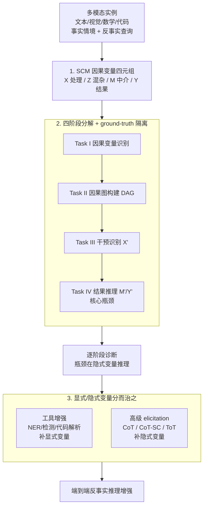

# On the Eligibility of LLMs for Counterfactual Reasoning: A Decompositional Study

**会议**: ICLR2026  
**arXiv**: [2505.11839](https://arxiv.org/abs/2505.11839)  
**代码**: 待确认  
**领域**: 因果推理  
**关键词**: counterfactual reasoning, structural causal model, LLM evaluation, decompositional analysis, tool-augmented learning

## 一句话总结

提出基于结构因果模型（SCM）的分解式评估框架，将 LLM 的反事实推理拆分为四个阶段（因果变量识别→因果图构建→干预识别→结果推理），在 11 个多模态数据集上系统诊断 LLM 在各阶段的能力瓶颈，并提出工具增强和高级 elicitation 策略来改善性能。

## 背景与动机

- 反事实推理（Counterfactual Reasoning）是评估 LLM 适应性与可靠性的关键能力：给定假设性前提变化，模型能否调整推理结论？
- 已有研究表明 LLM 在反事实推理任务中表现不佳，但缺乏**标准化框架**来系统分析失败原因
- 现有评估方式大多是端到端的"直接测试"：直接给反事实干预让模型回答，但忽略了反事实推理背后的**因果建模基础**——变量识别、因果依赖关系构建等前置步骤
- 需要一种分解式方法，将反事实推理拆成可独立评估的阶段，从而精确定位 LLM 的推理瓶颈

## 核心问题

1. LLM 在反事实推理的各个分解阶段（因果变量识别、因果图构建、干预识别、结果推理）分别表现如何？
2. 哪些辅助技术能有效提升 LLM 的反事实推理能力？

## 方法详解

### 整体框架

本文不训练新模型，而是搭建一套"诊断台"，回答一个被以往端到端评测掩盖的问题：LLM 的反事实推理到底卡在哪一步。做法是以 Pearl 的结构因果模型（SCM）为骨架，把任务里的信息形式化成四类因果变量，再把端到端的反事实推理拆成四个可独立测量的阶段——因果变量识别、因果图构建、干预识别、结果推理；评测每个阶段时都喂入前置阶段的 ground-truth，从而把误差归因到具体某一步而非笼统判一个对错。配套 benchmark 横跨文本、视觉-语言、数学符号、代码四种模态共 11 个数据集。诊断定位出瓶颈后，再按"显式/隐式变量分而治之"叠加两类改进——工具增强补显式变量、高级 elicitation 补隐式变量。

### 关键设计

**1. SCM 因果变量四元组：给反事实推理一个可计算的形式化底座**

以往评测把反事实推理当成一个黑盒整体，对了错了说不清原因，根子在于缺一个能逐变量核对的形式化定义。本文借 Pearl 的结构因果模型把任务信息归约为四类变量：Exposure $X$（施加的处理/干预条件）、Covariate $Z$（同时影响 $X$ 与 $Y$ 的预处理混杂变量）、Mediator $M$（落在 $X\to Y$ 路径上的中介，$M=f_M(X,Z)$）、Outcome $Y$（受干预影响的结果，$Y=f_Y(X,M,Z)$）。有了这套两阶段因果机制，反事实推理就有了确切答案：给定观测事实 $(x,z,m,y)$，若把 $X$ 干预为 $x'$，正确结果应是沿因果链重算的

$$M_{x'}=f_M(x',z),\qquad Y_{x'}=f_Y(x',M_{x'},z).$$

这一步把"模型答得对不对"从直觉判断变成了可逐变量核对的计算，是后面分阶段诊断能成立的前提——没有它，就无法把一次端到端失败拆给具体某个变量。

**2. 四阶段分解 + ground-truth 隔离：把整体失败拆成可归因的局部失败**

四元组定下来后，评估顺着 SCM 的计算顺序切成四个阶段：Task I 因果变量识别（从事实信息中标出 $X,Z,M,Y$）、Task II 因果图构建（给定变量连出正确的 DAG）、Task III 干预识别（从反事实查询中读出被干预变量及其取值 $X'$）、Task IV 结果推理（结合因果图与干预推断 $M'$ 和 $Y'$）。关键在 ground-truth 隔离：评测某一阶段时直接提供前置阶段的标准答案作为输入，于是该阶段的得分只反映它自身的能力，不被前面累积的错误污染。端到端测试只能告诉你"模型不行"，这种隔离式拆解才能回答"到底哪一步不行"——本文正是借此定位出真正的瓶颈在 Task IV 对隐式变量 $M',Y'$ 的推理（反事实下二者都不可直接观测），而非看似最复杂、实则 F1>0.9 的因果图构建。

**3. 显式/隐式变量分而治之：对症下药而非一招通用**

诊断发现两类变量的失败机理不同，因此改进分两路、各打各的痛点。显式变量（$X,Z,Y$，实体大多在输入中可直接定位）的问题主要来自跨模态识别，用工具增强执行（function-calling 式的 NER 范式）：文本与数学用 bert-base-NER 抽候选实体，视觉用 grounding-dino-base 检测图中相关物体并屏蔽无关背景，代码用 GraphCodeBERT 提取函数、变量与控制结构；工具给出候选后再由 LLM 整合精炼成最终因果表达。隐式变量（需要推算的中介 $M$ 与反事实 $M',Y'$）的问题来自推理深度，则上更强的 elicitation：CoT 逐步推理，CoT-SC 采 $k=5$ 条路径后多数投票，ToT 同样展开 $k=5$ 条分支并用 BERTScore 衡量中间结果与任务描述的一致性来择优。区分对待的好处是把算力花在刀刃上；但实验也提醒它不是越多越好——ToT 这类复杂策略偶尔触发过度推理（overthinking），会引入输入并不支持的因果链（如把"马拉松中晕倒"的中介从"脱水"过度推断成"缺乏训练"），反而劣于朴素 CoT。

## 实验关键数据

评估 7 个主流 LLM：GPT-5、GPT-o4-mini-high、Qwen3-VL-235B、Llama-4-Scout、Llama-4-Maverick、Gemini2.5-Pro、DeepSeek-VL。

### Task I：因果变量识别

- 文本数据集上 X 的 F1 可达 87–92%，但视觉/代码模态下降明显（如 Open-Critic 上 <72%）
- **隐式变量 M 的识别最困难**：即使在文本数据集上，M 的 F1 也比 X 低 5–10 个百分点
- 模态复杂度越高，识别越难；变量的推理性质（显式 vs 隐式）也是独立于模态的难度因素

### Task II：因果图构建

- 整体表现最好，大多数情况 F1 > 0.9
- 原因：因果图结构是规则化的，给定变量后 LLM 能有效应用构建规则

### Task III：反事实干预识别

- LLM 普遍能准确识别 X' 的值，跨模态表现稳定
- 但该任务相对简单，不涉及干预效果的传播推理

### Task IV：结果推理（核心瓶颈）

- **LLM 在推理反事实 M' 和 Y' 时表现最差**
- GPT-5 在 CRASS 上 M'=92.1%, Y'=88.0%；但在代码数据集上 M'≈75%, Y'≈70%
- 较弱模型（如 DeepSeek-VL）在视觉数据集上 Y' 低至 ~54%
- 说明 LLM 缺乏沿因果链进行推理的充分能力

### 改进效果

- 工具增强对显式变量的提升显著：Llama-4-Scout 在 CVQA-Count 上 X 提升 +32.0%
- 高级 elicitation 对隐式变量有效但有上限：CoT-SC 和 ToT 有时不如简单 CoT，因为复杂策略可能导致**过度推理**（overthinking）
- 两种策略结合时整体提升最大但非简单叠加，误差会在管道中累积传播

## 亮点

1. **系统性分解框架**：首次基于 Pearl 的 SCM 将 LLM 反事实推理拆分为四个可独立评估的阶段，实现精细化诊断
2. **大规模多模态 benchmark**：覆盖 11 个数据集、4 种模态，每个实例都标注了因果变量和参考 DAG
3. **诊断性发现**：明确指出因果图构建不是瓶颈（>0.9 F1），真正的瓶颈在隐式变量推理，特别是反事实 M' 和 Y'
4. **可操作的改进策略**：工具增强和 elicitation 策略分别针对显式/隐式变量的弱点，且发现了 ToT 过度推理的限制

## 局限与展望

- 预处理阶段的因果变量标注和 DAG 构建依赖人工/半自动方式，扩展性有限
- 隔离式评估（每阶段提供 ground-truth）无法反映真实端到端场景中的误差累积
- 高级 elicitation 的"过度推理"问题（overthinking）未给出有效的缓解方案
- 仅评估了有限数量的 LLM，缺少对开源小模型的分析
- 工具增强方案中工具的选择较为固定，未探索更多替代配置

## 与相关工作的对比

| 方法 | 评估方式 | 因果建模 | 多模态 | 分解分析 |
|------|----------|----------|--------|----------|
| CRASS (Frohberg et al., 2021) | 端到端 QA | 无 | 仅文本 | 无 |
| DICE (Shrivastava et al., 2025) | 诊断性 QA | 部分 | 仅文本 | 无 |
| CausalProbe (Chi et al., 2024) | 探针测试 | 部分 | 仅文本 | 无 |
| MalAlgoQA (Sonkar et al., 2024) | 多选 QA | 无 | 文本+符号 | 无 |
| **本文** | **四阶段分解** | **完整 SCM** | **4 种模态** | **逐阶段诊断** |

核心区别：之前的工作主要是端到端评估，本文首次将评估对齐到 SCM 的结构化步骤，实现逐模块的失败归因。

## 启发与关联

- 分解式评估的思想可推广到其他复杂推理任务（如数学证明、多步规划），通过拆分步骤精确定位模型弱点
- "工具增强 + LLM 高层推理"的模式值得在因果推断领域进一步探索，特别是多智能体框架
- 过度推理现象（overthinking）提示在设计 elicitation 策略时需要平衡推理深度与输入数据的支撑度
- 隐式变量推理是 LLM 因果能力的关键瓶颈，未来需从训练层面（而非仅推理策略）增强此能力

## 评分
- 新颖性: 8/10 — 分解框架的切入点新颖，但单个阶段的任务定义较标准
- 实验充分度: 8/10 — 11 个数据集 + 7 个 LLM 覆盖全面，但缺少开源小模型和消融实验
- 写作质量: 7/10 — 结构清晰，但表格数据密集，核心 insight 的提炼可更精练
- 价值: 8/10 — 为 LLM 反事实推理提供了系统化的诊断工具和改进方向

<!-- RELATED:START -->

## 相关论文

- [\[ICLR 2026\] RFEval: Benchmarking Reasoning Faithfulness under Counterfactual Perturbations](rfeval_benchmarking_reasoning_faithfulness_under_counterfactual_perturbations.md)
- [\[ACL 2026\] Parallel Universes, Parallel Languages: A Comprehensive Study on LLM-based Multilingual Counterfactual Example Generation](../../ACL2026/causal_inference/parallel_universes_parallel_languages_a_comprehensive_study_on_llm-based_multili.md)
- [\[ICLR 2026\] SelfReflect: Can LLMs Communicate Their Internal Answer Distribution?](selfreflect_can_llms_communicate_their_internal_answer_distribution.md)
- [\[ACL 2025\] CoA-Reasoning: Explorations on Counterfactual Analysis in Physical Reasoning of LVLMs](../../ACL2025/causal_inference/coa-reasoning_explorations_on_counterfactual_analysis_in_physical_reasoning_of_l.md)
- [\[ACL 2026\] Evaluating Counterfactual Strategic Reasoning in Large Language Models](../../ACL2026/causal_inference/evaluating_counterfactual_strategic_reasoning_in_large_language_models.md)

<!-- RELATED:END -->
