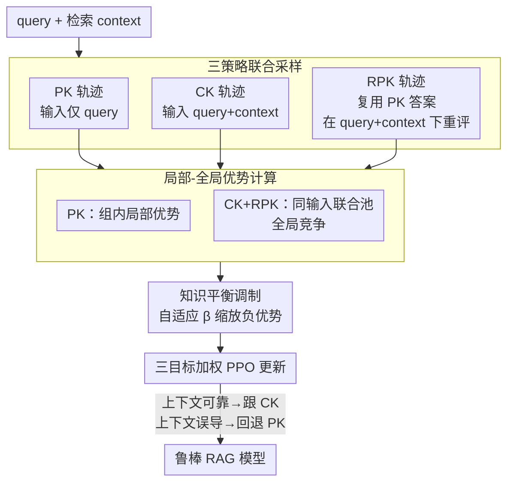

# Resisting Contextual Interference in RAG via Parametric-Knowledge Reinforcement

**会议**: ICLR2026  
**arXiv**: [2506.05154](https://arxiv.org/abs/2506.05154)  
**代码**: [lcy80366872/knowledgeable-R1](https://github.com/lcy80366872/knowledgeable-R1)  
**领域**: 因果推理  
**关键词**: RAG, Parametric Knowledge, Reinforcement Learning, Knowledge Conflict, GRPO  

## 一句话总结
提出 Knowledgeable-R1，一个基于强化学习的框架，通过联合采样参数知识（PK）和上下文知识（CK）的轨迹，结合局部/全局优势计算和自适应不对称优势变换，使 LLM 在 RAG 场景中能够抵抗误导性检索上下文的干扰，同时保留对可靠上下文的利用能力。

## 背景与动机
RAG 通过引入外部检索内容来减少 LLM 的幻觉和事实错误，但当检索到的上下文包含噪声、反事实或内部矛盾信息时，LLM 往往会过度依赖这些外部信息而压制自身的参数知识，即所谓的 **context dominance** 现象。现有方法存在明显不足：

- **Prompting 方法**（如 Astute-RAG）：引导模型验证/过滤上下文，但增加计算复杂度且缺乏通用决策规则
- **Decoding 方法**（如 CK-PLUG）：调整 token 分布以缓解冲突，但同样缺乏泛化能力
- **Fine-tuning 方法**（如 Self-RAG, InFO-RAG）：需要复杂的数据标注流程，灵活性和可扩展性受限
- **标准 GRPO**：采样空间局限于带检索输入的 query+context，难以让模型探索"忽略上下文回退到参数知识"这一关键但稀有的决策

## 核心问题
如何让 LLM 在 RAG 系统中**动态决策**：何时信任检索到的上下文知识（CK），何时回退到自身参数知识（PK），并在不损害正常 RAG 性能的前提下显著提升对误导性上下文的鲁棒性？

## 方法详解

### 整体框架
Knowledgeable-R1 想解决的是 RAG 里的 **context dominance**：检索来的上下文一旦有噪声或反事实，模型就被它带跑、压住了自己本来答对的参数知识。它的做法是把"该不该信这段上下文"这个决策本身变成强化学习可以探索的对象，整套训练接在标准 GRPO 之上。

具体到每个 query，它**同时采样三类轨迹**：只喂 query 的参数知识轨迹（PK）、喂 query+context 的上下文轨迹（CK）、以及在 query+context 输入下仍坚持复述参数答案的鲁棒参数知识轨迹（RPK）。三类轨迹按答案是否正确（EM）拿到奖励后，进入一套**局部/全局混合的优势计算**：PK 在自己组内归一化、CK 与 RPK 放进同一个"输入 $p'$ 联合池"里互相竞争。最后再经过一层**自适应不对称优势变换**调节惩罚力度，把三个 PPO-style 目标加权更新进同一个模型。训练完模型不需要显式开关，token 分布里就编码好了"上下文可靠时跟 CK、上下文误导时回退 PK"。

### 关键设计

**1. 三策略联合采样：让"忽略上下文"成为可被采到的轨迹**

标准 GRPO 只在 query+context 输入下采样，模型几乎采不到"无视上下文、回退参数知识"这一稀有却关键的行为，于是被误导上下文牵着走。这里对每个 query 显式定义三种解码策略：PK 用输入 $p$（仅 query）生成参数知识回答 $o$；CK 用输入 $p'$（query+context）生成利用上下文的回答 $o'$；RPK 同样在输入 $p'$ 下，但**不独立生成新答案**，而是把已采出的 PK 轨迹 $o^{pk}$ 当作目标，逐 token 重新评估它在 $p'$ 下的对数概率 $\pi_\theta(o_t^{pk} \mid p', o_{<t}^{pk})$ 并最大化。这样 RPK 几乎不增加采样开销，却把"有上下文存在、但依然坚持参数知识 token"这一行为塞进了采样空间，使后续优化能直接奖励或惩罚它。

**2. 局部-全局优势计算：在同一输入下让 CK 与 RPK 互相竞争**

三类轨迹目标不同，所以优势的归一化范围分开设计。PK 只用同策略组内 Z-score 归一化得到的局部优势 $A_i = A_i^{pk\text{-}local}$，专注把 query-only 回答本身做准。CK 取局部与全局之和 $A_j' = A_j^{ck\text{-}local} + A_j^{ck\text{-}global}$，其中全局项在"输入 $p'$ 联合池" $\mathcal{U}_{p'} = \{R_j^{ck}\} \cup \{R_i^{rpk}\}$ 里归一化；RPK 则只取全局优势 $\hat{A}_i = \hat{A}_i^{global}$，同样在这个联合池中竞争。关键在于 CK 和 RPK 共享同一输入 $p'$：两种知识都对时，CK 因更新及时、信息更可靠而占优；上下文误导时 RPK 拿到正优势顶上来。普通组内归一化在"整组轨迹奖励一致"时会把优势全压成 0、丢掉 CK vs RPK 的偏好信号，而全局归一化正好保住了这层跨来源的区分。

**3. 知识平衡调制：用自适应 $\beta$ 控制参数知识探索的力度**

一味鼓励 RPK 会损害正常 RAG（该信上下文时不信），一味压制又退回 context dominance，所以惩罚力度需要动态平衡。方法引入不对称优势变换 $T(\hat{A}_i; \beta)$：正优势原样保留，负优势乘以系数 $\beta \in [0.01, 1]$ 后再用——即只"软化"对 RPK 探索行为的惩罚、不削弱正向奖励。$\beta$ 不靠手调，而是按 mini-batch 中 CK 与 RPK 的累积优势实时计算，$\beta \leftarrow \text{clip}\big((S_{ck} - S_{rpk+})/S_{rpk-},\, 0.01,\, 1\big)$。当 CK 大幅优于 RPK 时 $\beta$ 变小，减轻对 RPK 负优势的惩罚、放开参数知识探索；两者差距缩小时 $\beta$ 回升、训练转谨慎。这个量约 8 步即收敛到稳定值，使框架无需为每个数据集重调超参。

### 损失函数 / 训练策略
总目标是三类轨迹的 PPO-style 裁剪更新加权和，

$$\mathcal{J}(\theta) = \lambda_{pk} J_{PK} + \lambda_{ck} J_{CK} + \lambda_{rpk} J_{RPK}$$

实验中三个权重均取 $\lambda_{pk} = \lambda_{ck} = \lambda_{rpk} = 1.0$，裁剪参数 $\epsilon = 0.2$。由于 RPK 复用 PK 轨迹、不需额外 rollout，整套训练相对标准 GRPO 几乎不增加采样成本。

## 实验关键数据
在 5 种上下文场景下评估（正确/对抗/自冲突/无关/部分相关），基座模型 Qwen2.5-7B-Instruct：

| 场景 | RAG Prompting | GRPO w/ RAG | Knowledgeable-R1 | 提升 |
|------|:---:|:---:|:---:|:---:|
| S1 正确上下文 (PC-QA) | 74.35% | 80.03% | **80.90%** | +6.54% |
| S2 对抗上下文 (NC-MR) | 13.47% | 26.94% | **43.94%** | +30.47% |
| S2 对抗上下文 (NC-MC) | 8.06% | 19.74% | **37.34%** | +29.28% |
| S3 自冲突上下文 (SC) | 59.50% | 75.33% | **76.33%** | +15.92% |
| S4 无关上下文 (ExplainPE) | 62.21% | 66.50% | **67.57%** | +5.36% |
| S5 部分相关 (HotpotQA) | 20.36% | 27.93% | **31.45%** | +11.09% |

在参数知识可回答子集上，NC-MR/MC/QA 平均比 GRPO w/ RAG 提升 **+22.89%**。Llama3.1-8B-Instruct 上也有一致的提升。

**消融实验关键发现**：
- 移除 $J_{RPK}$ 后 TIFE（参数正确、上下文错误）场景性能下降最大（MC 下降 33.12%）
- 移除自适应 $\beta$ 后 TIFE 性能下降 27.39%（MC）
- 移除全局优势 $A^{ck\text{-}global}$ 导致 TIFE 下降显著

## 亮点
- **问题定义精准**：将 RAG 中的知识冲突问题明确分解为三个子目标（参数正确性、上下文利用、鲁棒回退），设计针对性的联合采样策略
- **RPK 设计巧妙**：不生成新轨迹，而是复用 PK 轨迹在 query+context 输入下重新评估，以低成本实现"有上下文但忽略它"的探索
- **自适应 $\beta$** 无需手调超参数即可在不同数据集上保持鲁棒，且收敛迅速
- **泛化能力强**：在 2WikiMultiHopQA 和 MuSiQue 上未经微调即取得显著提升
- **仅用 1% 错误上下文训练**仍优于 GRPO，说明学到的是真正的决策边界而非数据统计

## 局限与展望
- S3（自冲突）和 S5（部分相关）场景提升相对有限，上下文内部矛盾的处理仍有空间
- 未深入分析不同冲突比例（如 5 条检索结果中 1 条错 vs. 4 条错）下的敏感度
- 联合采样使约一半 rollout 预算用于 query-only PK 轨迹，S1 正确上下文场景比 GRPO w/ RAG 略低（可通过调整 $\lambda_{ck}$ 权重缓解）
- 仅在知识密集型 QA 任务上验证，未探索更复杂的多源检索环境

## 与相关工作的对比
- **vs. GRPO w/ RAG**：GRPO 仅在 query+context 下采样，缺乏参数知识探索；Knowledgeable-R1 通过 PK/RPK 分支显式鼓励参数知识回退，S2 场景平均提升 22.89%
- **vs. Self-RAG / InFO-RAG**：这些 SFT 方法依赖复杂标注流程；Knowledgeable-R1 通过 RL 自动学习决策规则，无需显式标注"何时信任上下文"
- **vs. CK-PLUG**：CK-PLUG 在解码时调整 token 概率但效果有限（S2 反而更差）；Knowledgeable-R1 直接在训练阶段优化知识利用策略
- **vs. Astute-RAG**：Astute-RAG 通过 prompting 引导模型过滤上下文，但在检索无关场景下表现欠佳；Knowledgeable-R1 全面优于它

## 启发与关联
- 思路可推广到任何"多源信息融合"场景，如多模态中视觉与文本信息冲突时的知识选择
- RPK 的"共享轨迹不同条件评估"思想可借鉴到其他 RL 训练框架中，减少额外采样开销
- 自适应 $\beta$ 的 reward shaping 策略可用于解决 RL 训练中探索不足的通用问题

## 评分
- 新颖性: 8/10 — 三策略联合采样+RPK 设计是创新点，但 PPO-style 优化本身不新
- 实验充分度: 8/10 — 5 种场景、4 个基座模型、详细消融，但缺少冲突比例敏感度分析
- 写作质量: 7/10 — 方法描述清晰但公式符号较多，部分 notation 可简化
- 价值: 8/10 — 解决 RAG 中关键的知识冲突问题，且方法简洁实用

<!-- RELATED:START -->

## 相关论文

- [\[ICLR 2026\] Journey to the Centre of Cluster: Harnessing Interior Nodes for A/B Testing under Network Interference](journey_to_the_centre_of_cluster_harnessing_interior_nodes_for_ab_testing_under_.md)
- [\[ACL 2026\] Better and Worse with Scale: How Contextual Entrainment Diverges with Model Size](../../ACL2026/causal_inference/better_and_worse_with_scale_how_contextual_entrainment_diverges_with_model_size.md)
- [\[AAAI 2026\] KTCF: Actionable Recourse in Knowledge Tracing via Counterfactual Explanations for Education](../../AAAI2026/causal_inference/ktcf_actionable_recourse_in_knowledge_tracing_via_counterfactual_explanations_fo.md)
- [\[NeurIPS 2025\] A Principle of Targeted Intervention for Multi-Agent Reinforcement Learning](../../NeurIPS2025/causal_inference/a_principle_of_targeted_intervention_for_multi-agent_reinforcement_learning.md)
- [\[NeurIPS 2025\] Root Cause Analysis of Outliers with Missing Structural Knowledge](../../NeurIPS2025/causal_inference/root_cause_analysis_of_outliers_with_missing_structural_knowledge.md)

<!-- RELATED:END -->
