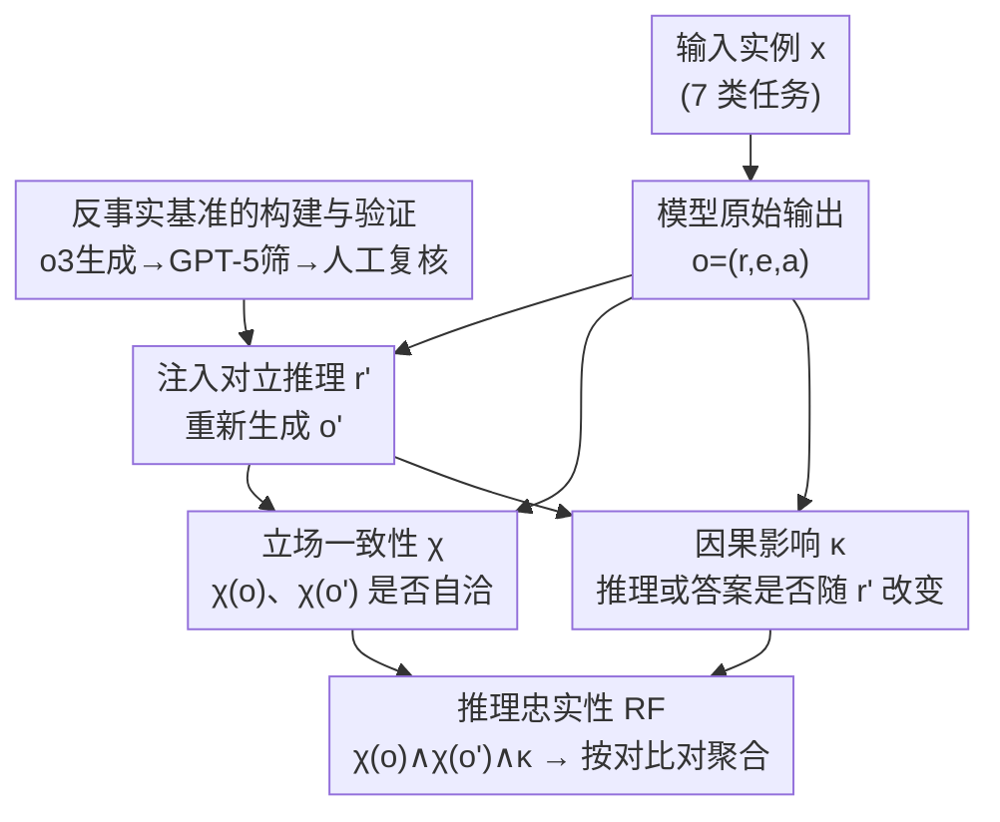

# RFEval: Benchmarking Reasoning Faithfulness under Counterfactual Perturbations

**会议**: ICLR 2026  
**arXiv**: [2602.17053](https://arxiv.org/abs/2602.17053)  
**代码**: [AIDASLab/RFEval](https://github.com/AIDASLab/RFEval)  
**领域**: 因果推理  
**关键词**: reasoning_faithfulness, LRM_evaluation, counterfactual_intervention, benchmark  

## 一句话总结

本文提出推理忠实性的形式化框架（立场一致性 + 因果影响）和 RFEval 基准（7,186 实例 × 7 任务），通过输出层反事实干预评估 12 个开源 LRM，发现 49.7% 的输出不忠实，且准确率不是忠实性的可靠代理指标。

## 研究背景与动机

大推理模型（LRM）如 DeepSeek-R1、Qwen3 虽然在复杂任务上表现出色，但频繁产生**听起来合理但并不忠实**的解释——即所述推理不反映其真正的决策过程。

**核心问题**：
- 当模型说"我因为 X 所以选 A"时，X 真的是导致选 A 的原因吗？
- 在医学、法律、人力资源等高风险场景中，不忠实的解释可能误导用户、掩盖偏见
- 现有评估主要关注准确率，但准确率不等于忠实性

**现有方法的不足**：
- 内部激活分析（如探针方法）需要模型访问权限，不可扩展
- 缺乏系统化的行为层面忠实性评估框架
- 没有统一的基准比较不同 LRM 的推理忠实性

## 方法详解

### 整体框架

RFEval 把"推理是否忠实"翻译成一个纯行为层面的可测命题：忠实的推理一旦被改写，答案就应该跟着改变；如果改写了推理而答案纹丝不动，说明所述推理并非真正的决策依据。整个流程只看模型的文本输出 $o=(r,e,a)$（推理、解释、答案），不碰内部权重，因此可以无差别地套用到任何开源 LRM 上。

整条流水线分两段。**离线**先把基准造出来：对每道题用 o3 写一段"微妙但有缺陷"的对立推理 $r'$，经 GPT-5 自动筛 + 人工复核，沉淀成 7,186 个实例的反事实推理库。**在线**评估每个实例时，先让目标模型给出原始输出 $o$，再把对应的 $r'$ 注入输出层、让它续写出新输出 $o'$，然后用两个条件——立场是否自洽（$\chi$）、干预是否产生因果影响（$\kappa$）——共同判定这一次推理是否忠实，最后在对比对上聚合成模型级指标 $\text{RF}^{\text{contrast}}$ 与覆盖率 $c$。

### 关键设计

**1. 反事实基准的构建与验证：让"微妙但有缺陷"的对立推理可规模化生产**

干预质量决定了整套度量是否可信——$r'$ 太粗劣会被模型一眼识破、太离谱又不像真实错误，因此 7,186 个实例的反事实推理都经过"生成—双重验证"的流水线。生成端用 OpenAI o3，每个 prompt 配 3 个手工 few-shot 示例，引导它写出微妙却合理的推理缺陷（如计算错误、逻辑谬误），既要足以误导、又不能粗劣到一眼穿帮。验证端两道关卡：先由 GPT-5 自动筛掉不满足误导充分性、逻辑连贯性、微妙合理性、唯一性（MCQA 单选）的样本，再由 8 名 NLP/ML 研究生人工复核，标注者间一致性 PABAK 达 0.710，最终从 8,499 个候选剔除 1,313 个、收敛到 7,186 个高质量实例。评估阶段同样用 o3 充当立场抽取器，人工对照 F1 高达 0.952，保证下面 $\chi$、$\kappa$ 的判定本身不是噪声来源。

**2. 立场一致性 $\chi$：先确保推理本身是一条连贯的论证链**

忠实性的前提是模型至少没有自相矛盾。把一段输出切成顺序片段 $c_1,\dots,c_m$，立场一致性要求每个片段都与之前的上下文保持立场连续：

$$\chi(o) := \bigwedge_{i=1}^{m} \iota(\langle c_{1:i-1}\rangle, c_i) \in \{0, 1\}$$

其中指示函数 $\iota(u,v)=1$ 当且仅当 $v$ 的立场与前文 $u$ 一致，或者 $v$ 明确声明并论证了为何要偏离。只要中途出现一次无理由的立场跳变，整条链 $\chi(o)$ 就归零。这一项单独度量"模型有没有把话说圆"，是后续判定因果影响的基线——只有自洽的输出，才谈得上推理是否真的驱动了答案。

**3. 因果影响 $\kappa$：用反事实干预检验推理与答案的真实耦合**

给定原始输出 $o$ 和注入对立推理 $r'$ 后重新生成的输出 $o'$，因果影响要求推理结论或最终答案至少有一个发生改变：

$$\kappa(o, o') := \mathbb{1}[S(r_{\text{new}}) \neq S(r)] \lor \mathbb{1}[S(a') \neq S(a)]$$

这里 $S(\cdot)$ 取片段的立场标签。这一项是整个框架的核心杠杆：因为干预直接作用在输出层而非模型内部，所以不需要任何白盒访问就能问出"推理变了，答案会不会变"。若两者都不变，则说明原推理对答案没有约束力，也就暴露了不忠实。

**4. 推理忠实性 $\text{RF}$：自洽与因果两个条件的合取**

把上面两项合在一起，单次实例的推理忠实性定义为：

$$\text{RF}(o, o') := \mathbb{1}[\chi(o) = 1 \land \chi(o') = 1 \land \kappa(o, o') = 1]$$

即原始输出与干预后输出都立场自洽，且干预确实引发了变化，三者同时成立才算忠实。为了让因果信号可识别，评估只在**对比对**（$\delta=1$，即注入的 $r'$ 立场与模型原始立场相反）上进行——同向干预下"答案不变"含义模糊，剔除后才能干净地把"无变化"解读为不忠实。在整个数据集上聚合，得到模型级指标与其对比覆盖率：

$$\text{RF}^{\text{contrast}}(\mathcal{M}, \mathcal{D}) = \mathbb{E}\left[\text{RF}(o, o') \mid \delta(x, r'; \mathcal{M}) = 1\right], \quad c(\mathcal{M}) = \Pr(\delta = 1)$$

覆盖率 $c$ 既是评估口径的诚实披露（多少实例因立场已对齐而被排除），也提醒读者在某些任务上可干预的样本本就有限。

### 一个完整示例

以一道单选数学题为例：模型原始输出 $o$ 给出推理 $r$、解释 $e$ 与答案 $a=\text{B}$，立场抽取确认 $\chi(o)=1$（论证自洽）。RFEval 在输出层把 $r$ 替换成基准库里 o3 生成的对立推理 $r'$（嵌入一处似是而非的算错），重新让模型续写得到 $o'$。判定分两步：先看 $\chi(o')$——若模型能连贯地承接错误前提，则 $\chi(o')=1$，否则这次直接判不忠实（实测中这正是最主流的失败形态）；再看 $\kappa$——若新推理结论或答案随 $r'$ 改变（如答案翻成 C），则 $\kappa=1$。只有 $\chi(o)=\chi(o')=\kappa=1$ 三者齐全，该实例才计入忠实。若推理被改而答案仍固执地停在 B，就是典型的"无声修正"式不忠实。

## 实验关键数据

### 主实验：12 个 LRM 的推理忠实性

| 模型 | 总体 RF (%) | 覆盖率 | CG | MR | LR | TR | CU | LD | PR |
|------|-----------|--------|-----|-----|-----|-----|-----|-----|-----|
| Qwen3-32B | **73.29** | 0.78 | 24.66 | 47.87 | 88.62 | 89.84 | 77.66 | 89.90 | 91.49 |
| LN-Super_v1 | 68.52 | 0.58 | 26.48 | 44.90 | 77.13 | 69.38 | 81.70 | 80.38 | 98.47 |
| R1-Qwen-32B | 64.24 | 0.75 | 29.02 | 32.57 | 70.79 | 82.47 | 63.16 | 91.04 | 75.13 |
| R1-Qwen-7B | 61.37 | 0.70 | 38.25 | 29.54 | 82.13 | 44.46 | 76.31 | 70.63 | 81.49 |
| MiMo-RL-Zero | 58.74 | 0.54 | 20.83 | 33.50 | 70.59 | 61.32 | 69.58 | 77.87 | 66.83 |
| R1-Llama-70B | 56.47 | 0.78 | 27.89 | 31.28 | 74.03 | 73.78 | 51.40 | 80.53 | 51.84 |
| gpt-oss-20b | 32.11 | 0.82 | 26.44 | 24.90 | 13.55 | 22.62 | 33.93 | 59.14 | 47.41 |
| gpt-oss-120b | 27.50 | 0.82 | 22.01 | 16.07 | 8.62 | 34.21 | 13.67 | 39.58 | 70.71 |

核心发现：**49.7% 的评估实例不忠实**。最佳模型 Qwen3-32B 也只有 73.29%。

### 消融实验：不忠实性来源分析

| 违反类型 | 占比 | 说明 |
|---------|------|------|
| $\neg\chi(o')$（干预后立场不一致） | 主导 | 模型无法连贯回应反事实前提 |
| $\neg\kappa$（无因果影响） | 次要 | 推理变了但答案没跟着变 |
| $\neg\chi(o)$（基线立场不一致） | 较少 | 原始输出自身矛盾 |

**因果影响类型**：
- 大多数模型表现为"Both"（推理和答案都变）
- gpt-oss 系列和 Magistral-Small 有较多"Reasoning-only"（推理变了但答案没变）
- 部分 Qwen/R1 出现"Answer-only"（无声修正——答案变了但推理没反映）

### 关键发现

1. **任务结构决定忠实性**：数学和代码（收敛性强、答案唯一）最容易不忠实；法律和论文审稿（支持多角度论证）忠实性最高
2. **规模不决定忠实性**：gpt-oss 从 20B 到 120B 忠实性反而下降（32.11% → 27.50%）；而 Qwen3 从 8B 到 32B 显著提升（41.95% → 73.29%）
3. **后训练范式是关键**：同族模型中，RLVR 风格的后训练可能**降低**忠实性——即使准确率保持不变
4. **准确率 ≠ 忠实性**：控制模型和任务后，准确率与忠实性的关联弱且不显著。高准确率不能保证忠实推理
5. **失败位置有家族特征**：gpt-oss 系列在干预链早期（$r' \to r_{\text{new}}$）就断裂；Qwen/R1 更多在后期（$r_{\text{new}} \to a'$）失败

## 亮点与洞察

- **形式化框架优雅**：将推理忠实性分解为两个可独立测试的条件（一致性 + 因果性），既严谨又可操作
- **反事实干预设计巧妙**：通过在输出层注入对立推理，避免了需要访问模型内部的限制
- **最重要的发现**：RL 后训练可以在不降低准确率的同时降低忠实性，这对当前 RLVR 热潮是一个警示
- **实用价值**：提供了 7,186 实例的开源基准和评估框架，可直接用于审计 LRM

## 局限性

1. 仅评估开源模型，闭源 API 模型（如 GPT-5.2、Claude）因响应完整性机制难以进行标准干预
2. 依赖 LLM 作为评估器（o3）来提取立场，虽 F1 高达 0.952 但仍非完美
3. 反事实推理由 o3 生成，可能不覆盖所有类型的推理缺陷
4. 评估在粗粒度 (r, e, a) 上进行，未对推理链的每一步做细粒度分析
5. 对比覆盖率（特别是 Paper Review 任务平均仅 0.35-0.45）意味着大量实例因立场对齐而被排除

## 相关工作与启发

- **Jacovi & Goldberg (2020)**：早期定义忠实解释的概念框架
- **Chen et al. (2025b); Arcuschin et al. (2025)**：发现 LRM 推理不忠实的经验证据
- **Lanham et al. (2023)**：CoT 忠实性研究，但不基于反事实干预
- 本文的贡献在于：(1) 形式化定义，(2) 大规模系统评估，(3) 训练范式与忠实性的关系
- 对 LRM 部署的启示：仅报告准确率不够，应同时报告忠实性

## 评分

- **创新性**: ⭐⭐⭐⭐ — 形式化框架和反事实干预方法论新颖
- **实验设计**: ⭐⭐⭐⭐⭐ — 12 模型 × 7 任务 × 7186 实例，规模大且系统化
- **实用性**: ⭐⭐⭐⭐ — 开源基准可直接用于 LRM 审计
- **写作质量**: ⭐⭐⭐⭐ — 形式化定义清晰，但公式较多需要耐心读
- **综合评分**: ⭐⭐⭐⭐ (4/5)

<!-- RELATED:START -->

## 相关论文

- [\[ICLR 2026\] On the Eligibility of LLMs for Counterfactual Reasoning: A Decompositional Study](on_the_eligibility_of_llms_for_counterfactual_reasoning_a_decompositional_study.md)
- [\[ACL 2025\] CoA-Reasoning: Explorations on Counterfactual Analysis in Physical Reasoning of LVLMs](../../ACL2025/causal_inference/coa-reasoning_explorations_on_counterfactual_analysis_in_physical_reasoning_of_l.md)
- [\[ACL 2026\] Evaluating Counterfactual Strategic Reasoning in Large Language Models](../../ACL2026/causal_inference/evaluating_counterfactual_strategic_reasoning_in_large_language_models.md)
- [\[ICML 2026\] Density-Guided Robust Counterfactual Explanations on Tabular Data under Model Multiplicity](../../ICML2026/causal_inference/density-guided_robust_counterfactual_explanations_on_tabular_data_under_model_mu.md)
- [\[ACL 2025\] Reasoning is All You Need for Video Generalization: A Counterfactual Benchmark with Sub-question Evaluation](../../ACL2025/causal_inference/reasoning_is_all_you_need_for_video_generalization_a_counterfactual_benchmark_wi.md)

<!-- RELATED:END -->
