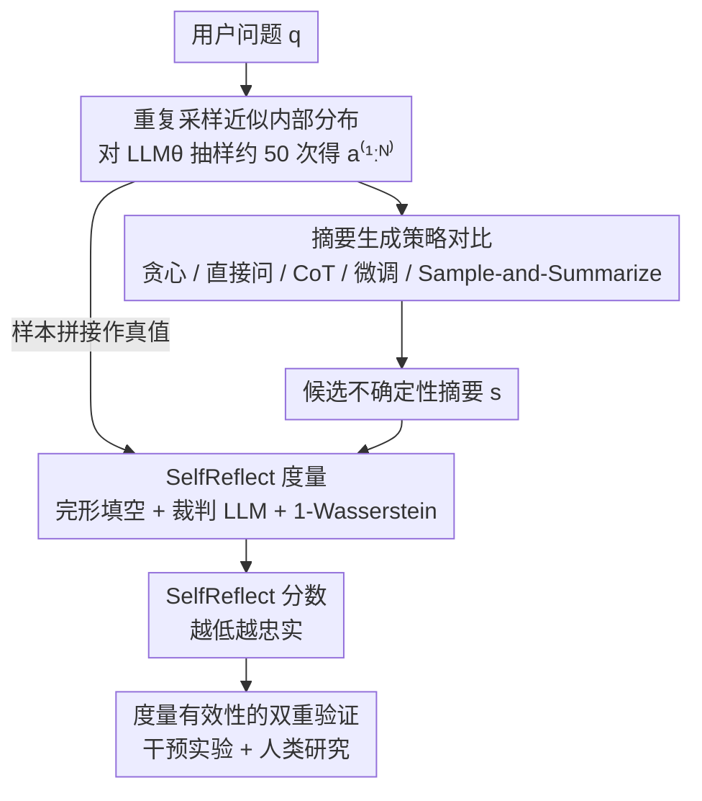

# SelfReflect: Can LLMs Communicate Their Internal Answer Distribution?

**会议**: ICLR 2026  
**arXiv**: [2505.20295](https://arxiv.org/abs/2505.20295)  
**代码**: [apple/ml-selfreflect](https://github.com/apple/ml-selfreflect)  
**领域**: 因果推理  
**关键词**: LLM不确定性, 内部分布, 信息论距离, 忠实性度量, 不确定性沟通

## 一句话总结
提出SelfReflect度量指标——一个衡量LLM自述不确定性摘要与其真实内部答案分布之间差异的信息论距离，发现现代LLM普遍无法自主反映内部不确定性，但通过采样多个输出并反馈到上下文中可以生成忠实的不确定性摘要。

## 研究背景与动机

传递LLM的不确定性是构建可信赖AI的关键。当前向用户传达LLM不确定性的常见方式是在响应中添加百分比数字或对冲性词语（如"我不太确定，但..."）。然而，这种做法存在根本性的局限：它仅对单一答案进行修饰，而非真正反映模型内部的完整信念分布。

**核心问题**：一个真正对用户透明的LLM需要能够反思其内部信念分布，输出它认为所有可能的选项及其概率的摘要。那么，LLM是否具备这种能力？

**现有痛点**：
1. 现有的不确定性量化方法（如logit校准、置信度估计）主要面向开发者，终端用户无法直接使用
2. 对冲语言（"大约"、"可能"）在表达精确不确定性方面过于粗糙
3. 缺乏一个**标准化的度量**来衡量"LLM对自身不确定性的描述"与"LLM的真实内部分布"之间的忠实程度

**核心矛盾**：我们希望LLM能够忠实地传达其不确定性，但缺乏评估这种忠实性的工具，也不知道LLM是否具备这种自我反思能力。

**切入角度**：设计一个信息论度量（SelfReflect score），度量一个自然语言"不确定性摘要"（如"60%答案A，30%答案B，10%其他"）与LLM内部答案分布之间的距离，然后系统评估现代LLM在此度量下的表现。

## 方法详解

### 整体框架
SelfReflect 不是一个新模型，而是"一把尺子 + 一套评测协议"，要回答的问题是：当一个 LLM 对某个问题心里其实有好几个可能答案时，它用一句话写出的"不确定性摘要"（如"我 70% 认为是 Barton，但也可能是 Fisher 或 Deakin"）到底有没有忠实复述出它自己内部的答案分布。整条流程这样转：先对同一问题反复采样，把模型自己的多次回答当成它内部分布的代理真值；再用各种策略让模型写出一句不确定性摘要；最后用 SelfReflect 度量给这句摘要打分——分数越低，说明摘要越忠实地反映了模型的真实信念。度量本身建立在一个"完形填空"式的预测充分性判据上，并额外用干预实验和人类研究证明这把尺子确实可信。

### 关键设计

**1. 重复采样近似内部分布：拿模型自己的输出当真值**

LLM 的"内部答案分布" $p_\theta(A\mid q)$ 没法直接读出来，本文用经验分布去逼近：对同一个问题向模型发出约 50 次相同查询，得到一组样本 $a^{(1:N)}$，用它们出现的频率作为该分布的代理。这一步合理在于自回归解码本身就是从模型学到的条件分布里抽样，采样足够多次，频率自然收敛到这个分布。这样一来评测就不依赖任何外部标注的"标准不确定性"，而是以模型自己的行为为基准，问的始终是"你写的摘要和你自己实际会给出的答案一致吗"。

**2. 摘要生成策略对比：穷举让 LLM 表达不确定性的手段**

要回答"LLM 到底能不能自述不确定性"，必须把可能的手段从弱到强都试一遍。贪心解码只给最可能的单一答案，作为完全不含不确定性信息的下界；直接询问让模型自己描述把握，CoT 让它先推理再描述，二者代表"靠提示就够了"的乐观假设；SFT 和 DPO 微调进一步在带有正确不确定性描述的数据上训练模型，代表"教得够多就会"的假设。最后的 Sample-and-Summarize 换了条路：先按第 1 点采样出多个答案、把它们写回上下文，再让模型去总结这一堆答案的分布——本质上是把内部分布显式喂回去，绕开"凭空内省"这一最难的环节。前几种策略覆盖了"不改 / 改提示 / 改权重"的全谱，最后一种则提供了"开卷"对照。

**3. SelfReflect 度量：用完形填空把"摘要是否忠实"变成可计算距离**

难点在于：摘要 $s$ 是一个字符串，而它要概括的却是一个"字符串上的分布" $p_\theta(A\mid q)$，无法靠字面匹配或单个置信度来比较。本文从充分统计量的角度给出判据——一个理想摘要应当是样本 $a^{(1:N)}$ 关于后续回答 $B$ 的预测充分统计量，即 $p(B\mid a^{(1:N)})=p(B\mid s)$。这个条件可等价转写成一个完形填空任务：从一条新回答 $B$ 里挖掉某个词 $B_i$，分别在"给摘要 $s$"和"给样本 $a^{(1:N)}$"两种上下文下，用一个裁判模型 $\text{LLM}_J$ 去预测被挖掉的词；如果两种上下文给出的预测分布一致，就说明摘要携带了和样本同样的信息。SelfReflect 就是把这两个预测分布的差异用 1-Wasserstein 距离 $W_1$ 度量、再对问题、采样、挖词位置取期望：

$$m_{\text{SelfReflect}}(\psi)=\mathbb{E}\big[\,W_1\big(p_J(B_i\mid q,s,B_{-i}),\,p_J(B_i\mid q,a^{(1:N)},B_{-i})\big)\,\big]$$

因为它直接比较裁判模型完整的 token 预测向量（而非只看最终采样到的那个 token），所以哪怕摘要只把某个选项的概率写偏一点，分数也会随之变化，能区分"几乎忠实"和"明显失真"——这正是 LM judge 评分和嵌入距离做不到的细粒度。也正因为要拿到完整概率向量，实现上需挂在开源 LLM 的 logit 接口（VLLM 的 LogitProcessor）之上，对只暴露文本输出的闭源 API 不完全适用。

**4. 度量有效性的双重验证：干预实验 + 人类研究**

一把新尺子得先自证可信。干预实验人为改动摘要里提到的答案或概率，检验 SelfReflect 分数是否随偏差单调变化，确认它确实对内容敏感而非噪声；人类研究则收集人对摘要忠实性的判断，检验分数排序与人类偏好是否一致。在自由式和封闭式两类问答数据上，SelfReflect 都能精确区分好 / 坏 / 接近好的摘要，并且与人类判断、以及 LM judge、嵌入距离等替代指标相比都更准——正因为先过了这两关，它才有资格用来评判上面各种摘要策略孰优孰劣。

## 实验关键数据

### 主实验
在多种LLM和数据集上评估不同不确定性摘要策略的SelfReflect分数（越低越好）：

| 摘要策略 | 整体表现 | 说明 |
|----------|---------|------|
| Greedy（基线） | 较高分数 | 只给单一答案，无不确定性 |
| 直接询问 | 接近基线 | LLM无法自主反映不确定性 |
| CoT推理 | 接近基线 | 推理不能帮助反映不确定性 |
| SFT/DPO 微调 | 接近基线 | 即使微调也无法有效教会LLM自我反思 |
| Sample-and-Summarize | **显著更低** | 唯一有效的方法 |

### 消融实验

| 配置 | 关键指标 | 说明 |
|------|---------|------|
| 干预实验（修改概率） | 度量敏感度 | SelfReflect能检测轻微偏差 |
| 人类研究 | 人-度量一致性 | 与人类判断高度一致 |
| 不同LLM | 跨模型一致性 | 所有模型均无法自主反映不确定性 |
| 不同数据集 | 跨任务一致性 | 包括NQ等问答数据集 |

### 关键发现
- **核心发现（负面结果）**：现代LLM**全面**无法自主揭示其不确定性——无论通过直接询问、推理链还是显式微调，所有方法在SelfReflect度量下的表现均不理想
- **唯一有效方案**：Sample-and-Summarize方法——先采样多个输出再让LLM总结——是唯一能产生忠实不确定性摘要的方法
- **度量有效性**：SelfReflect度量对轻微偏差也敏感，与人类判断高度一致
- 这一发现具有深刻的含义：LLM缺乏真正的"自我反思"能力，它们不能直接访问和报告自己的内部不确定性状态

## 亮点与洞察
- **问题定义精准**：将"LLM能否传达不确定性"从模糊的直觉转化为可量化的科学问题
- **度量设计巧妙**：SelfReflect是一个细粒度的信息论度量，能捕捉到传统方法忽略的微小偏差
- **发现有冲击力**：全面否定了LLM内在的不确定性自我反思能力，这是一个重要的负面结果
- **解决方案务实**：Sample-and-Summarize虽然简单，但指出了一条可行的不确定性传达路径
- **来自Apple的工作**：代码开源在apple/ml-selfreflect，展示了工业界对LLM可信度的重视
- **连接了LLM能力评估和不确定性量化两个领域**：为未来研究提供了标准化的评估工具

## 局限与展望
- 内部分布通过多次采样近似，采样次数有限（如50次）时可能不够精确，尤其对于长尾分布
- SelfReflect度量需要对同一问题进行大量采样来建立基准分布，计算开销较大
- 评估主要在问答任务上进行，未验证在开放生成（如创意写作）场景下的适用性
- Sample-and-Summarize方法需要多次推理调用，增加了推理成本
- 未探索更复杂的不确定性表示形式（如校准曲线、置信区间等）
- 未分析不同规模模型的自我反思能力差异——更大的模型是否更好？
- SelfReflect度量依赖于VLLM的LogitProcessor钩子，对闭源API模型（如GPT-4）不完全适用

## 相关工作与启发
- **LLM不确定性量化**（Token-level entropy、Conformal Prediction等）：面向开发者的技术，本文关注面向用户的不确定性传达
- **LLM校准**（Calibration）：关注单一答案的置信度是否准确，本文关注的是完整分布的忠实传达
- **Self-Consistency (Wang et al., 2022)**：多次采样后投票选择答案，本文进一步要求LLM能总结采样结果
- **Chain-of-Thought推理**：被证明无法帮助LLM反映内部不确定性
- 启发：Sample-and-Summarize范式可能是当前条件下唯一可行的LLM不确定性传达方案，未来可以探索将其嵌入到对话交互中

## 评分
- 新颖性: ⭐⭐⭐⭐⭐ （全新的研究问题定义和度量方法）
- 实验充分度: ⭐⭐⭐⭐ （多模型、多策略、干预+人类研究）
- 写作质量: ⭐⭐⭐⭐ （问题动机清晰，发现有冲击力）
- 价值: ⭐⭐⭐⭐⭐ （为LLM可信度研究提供了关键工具和洞察）

<!-- RELATED:START -->

## 相关论文

- [\[ICML 2025\] Internal Causal Mechanisms Robustly Predict Language Model Out-of-Distribution Behaviors](../../ICML2025/causal_inference/internal_causal_mechanisms_robustly_predict_language_model_out-of-distribution_b.md)
- [\[ICLR 2026\] On the Eligibility of LLMs for Counterfactual Reasoning: A Decompositional Study](on_the_eligibility_of_llms_for_counterfactual_reasoning_a_decompositional_study.md)
- [\[ICCV 2025\] Social Debiasing for Fair Multi-modal LLMs](../../ICCV2025/causal_inference/social_debiasing_for_fair_multi-modal_llms.md)
- [\[ICLR 2026\] RFEval: Benchmarking Reasoning Faithfulness under Counterfactual Perturbations](rfeval_benchmarking_reasoning_faithfulness_under_counterfactual_perturbations.md)
- [\[ICLR 2026\] Validating Interpretability in siRNA Efficacy Prediction: A Perturbation-Based, Dataset-Aware Protocol](validating_interpretability_in_sirna_efficacy_prediction_a_perturbation-based_da.md)

<!-- RELATED:END -->
