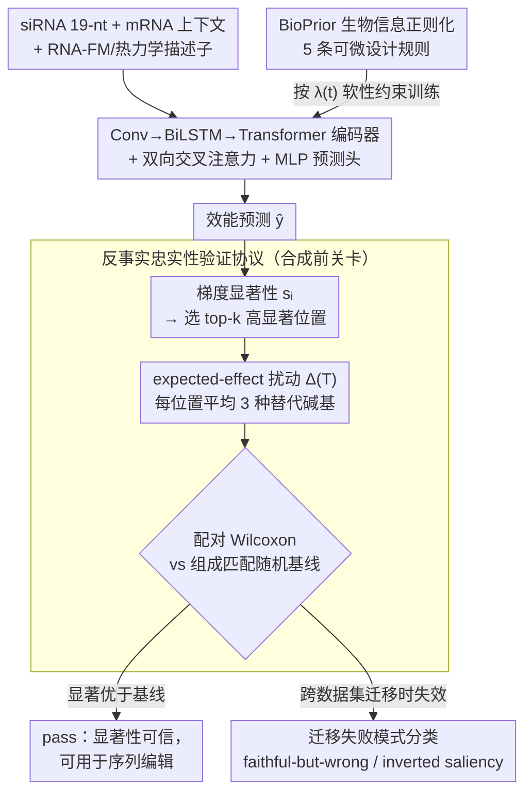

# Validating Interpretability in siRNA Efficacy Prediction: A Perturbation-Based, Dataset-Aware Protocol

**会议**: ICLR 2026  
**arXiv**: [2602.10152](https://arxiv.org/abs/2602.10152)  
**代码**: [https://github.com/shadi97kh/BioPrior](https://github.com/shadi97kh/BioPrior)  
**领域**: 医学/生物 可解释AI  
**关键词**: siRNA, 显著性图, 忠实性验证, 扰动测试, 生物信息正则化

## 一句话总结
提出一个标准化的扰动式显著性忠实性验证协议用于 siRNA 效能预测，作为"合成前关卡"检验显著性图是否可信；同时提出 BioPrior 生物信息正则化提升解释忠实性，发现 19/20 折instances 通过验证，但跨数据集迁移暴露两种失败模式。

## 研究背景与动机

**领域现状**：siRNA 药物（如 patisiran、givosiran）已获 FDA 批准。深度学习模型用于预测 siRNA 敲低效能，研究者会检查显著性图来推断哪些核苷酸位置"重要"，指导序列编辑。

**现有痛点**：显著性方法（梯度、积分梯度等）在 siRNA 领域被广泛使用但很少被验证。归因方法不保证反映真正的特征重要性，尤其在协议/分布偏移下可能悄然失效。

**核心矛盾**：模型可能在某个数据集上预测准确且显著性看起来合理，但当迁移到不同实验方案（如不同检测方法）时，显著性可能完全不可靠——而这种失败在部署前无法察觉。

**本文目标**：(a) 提供标准化的显著性忠实性测试协议；(b) 发现和分类跨数据集迁移的失败模式；(c) 用生物学先验正则化提升显著性忠实性。

**切入角度**：定义"反事实忠实性"——突变高显著性位置是否比对照引起更大的预测变化？用这种可操作的测试作为部署前的"合成前关卡"。

**核心 idea**：expected-effect 扰动操作符（对每个位置平均 3 种替代碱基的预测变化）+ 核苷酸组成匹配的随机基线对照 + 配对 Wilcoxon 检验 → pass/fail 判定。

## 方法详解

### 整体框架

这篇论文要解决的不是"怎么把 siRNA 效能预测得更准"，而是"研究者拿来指导序列编辑的那张显著性图，到底可不可信"。它的主干沿用 OligoFormer 风格：siRNA 19-nt 序列与 mRNA 上下文经 Conv→BiLSTM→Transformer 混合编码器、双向交叉注意力融合，再拼上 RNA-FM 嵌入与热力学描述子，由 MLP 预测头输出效能 $\hat{y}$；训练时由 BioPrior 可微生物正则化按调度 $\lambda(t)$ 软性引导。真正的创新不在这套网络，而在训练完成后那道"合成前关卡"：对每个核苷酸位置算梯度显著性、挑出 top-$k$ 高显著位置、扰动它们度量模型敏感度、再和组成匹配的随机对照做配对统计检验，给出一个干脆的 pass/fail；当模型跨实验方案迁移时，再把观测到的失败归入两种可诊断的类型。

### 关键设计

**1. 反事实忠实性验证协议：把"显著性是否可信"变成一道可统计检验的关卡**

显著性图在 siRNA 领域被大量用来推断"哪些位置重要"，却几乎从不被验证——一张看起来合理的图，可能根本反映不了模型真实的敏感度。本文的做法是定义一个 expected-effect 扰动算子：对位置 $i$，把它换成另外 3 种碱基，取预测变化的平均幅度 $\Delta_i = \frac{1}{3}\sum_{b \neq x_i} |\hat{y}(\mathbf{X}) - \hat{y}(\mathbf{X}^{i \leftarrow b})|$，并在每次替换后**重算所有派生通道**（种子区指示、GC 含量、热力学描述子），保证扰动捕捉的是核苷酸改动的真实因果效应而非梯度的线性近似。相比标准 ISM 只做单次突变，平均三种替代能消掉特定碱基的偶然效应。随后挑出 top-$k$ 显著位置算其平均敏感度 $\Delta(T)$，并与一组**核苷酸组成匹配**的随机位置基线 $\Delta(R)$ 对照——匹配组成是为了剔除"某些碱基天生更敏感"这一混淆，保证比较的是显著性挑位置的能力而非碱基偏好。最后用配对单边 Wilcoxon 符号秩检验在留出集上判定显著性是否系统性优于基线，从而把模糊的"图看着对"压成一条明确的部署前合格线。

**2. BioPrior 生物信息正则化：用已知设计规则把模型往真实机制上拉**

即便预测精度达标，模型也可能靠错误的统计捷径学到敏感度，导致显著性不忠实。BioPrior 把成熟的 siRNA 设计经验编码成一组可微惩罚项——热力学末端不对称性、种子区组成约束、全局 GC 含量启发式、免疫刺激基序回避、双链稳定性代理——汇总为 $\mathcal{L}_{bio} = \sum_{c} \bar{\alpha}_c \mathcal{L}_c$。这些约束作用在模型输出的逐位置软核苷酸概率 $\mathbf{P}^{si}$ 上，使生物先验的梯度能回传进序列表示，让模型偏好与已知机制一致的特征；学到的敏感度因此落在生物上可解释的区域（实验中高显著位置确实聚集在种子区与 3' 端），从而间接抬高显著性的忠实性。

**3. 迁移失败模式分类学：给"在新数据集上崩掉"的方式起名字**

跨实验方案迁移是显著性悄悄失效的高发区，本文把观测到的失败归成两类可诊断的类型。一类是 *faithful-but-wrong*：忠实性测试通过，但预测本身失败——模型内部自洽，却学了一条错误的规则，显著性"如实"地反映了这条错规则。另一类是 *inverted saliency*：高显著性位置的敏感度反而**低于**随机对照（效应量 $d_z < 0$，如 Taka→Hu 迁移时 $d_z = -1.25$），相当于显著性图放了烟幕弹，把注意力引向了模型其实并不敏感的位置。有了这套命名，跨数据集诊断就从笼统的"性能下降"细化为可定位的失败机制——这也直接支撑了本文"显著性应作为部署时声明、在目标数据集上现验现用"的主张。

### 损失函数 / 训练策略

总目标为 $\mathcal{L}_{total} = \mathcal{L}_{pred} + \lambda(t)\,\mathcal{L}_{bio} + \lambda_{aux}\,\mathcal{L}_{aux}$。其中生物正则化权重 $\lambda(t)$ 采用 warmup+ramp 调度：前 8 个 epoch 让模型先专注学预测特征，之后再把权重从 0.10 线性升到 0.30，逐步引入生物先验，避免一开始就用强约束干扰预测能力的形成。

## 实验关键数据

### 主实验

| 数据集 | 模型 | AUC | Pearson r | 忠实性 win rate | Cohen's $d_z$ |
|--------|------|-----|-----------|----------------|-------------|
| Huesken (2431 siRNAs) | +BioPrior | ~0.78 | ~0.65 | 85.2% | 0.86 |
| Huesken | Baseline | ~0.77 | ~0.64 | 82% | 0.77 |
| Katoh (702 siRNAs) | +BioPrior | ~0.76 | ~0.58 | 80%+ | 0.82 |
| Mix (581 siRNAs) | +BioPrior | ~0.77 | ~0.62 | 83%+ | 0.79 |

19/20 折-数据集组合通过忠实性测试。

### 消融实验

| 配置 | 忠实性 $d_z$ | AUC 变化 | 说明 |
|------|------------|---------|------|
| +BioPrior（完整） | 0.86 | +0.01 | 忠实性提升 |
| Baseline（无BioPrior） | 0.77 | 基线 | |
| 随机权重 | -0.45~0.03 | N/A | 负控制，确认失败 |
| 打乱标签 | <0.03 | N/A | 负控制 |
| 底部-k（低显著性） | 失败 | N/A | 反向控制 |

### 关键发现
- **跨数据集迁移揭示关键问题**：Katoh（荧光素酶报告基因）数据集与其他三个数据集（mRNA 水平测定）之间迁移失败——模型在一种实验方案上学到的显著性在另一种上可能完全无效
- **两种失败模式**：faithful-but-wrong（预测失败但显著性通过）和 inverted saliency（Taka→Hu 时 $d_z = -1.25$）
- **BioPrior 提升忠实性但预测改善有限**：+0.01 AUC，但忠实性 $d_z$ 从 0.77 提升到 0.86
- **高显著性位置聚集在功能区域**：种子区（5'端）和 3'端——与生物学先验一致

## 亮点与洞察
- **"合成前关卡"概念的实用价值**：在实验室-AI 循环中，显著性验证应该是标准操作流程，类似于统计检验的显著性阈值
- **迁移失败的预警价值**：协议/实验方案偏移可能悄然无效化部署——即使域内性能看起来很好
- **负控制设计严谨**：随机权重、打乱标签、打乱显著性、底部-k 四种负控制都失败，确认测试有区分力

## 局限与展望
- 仅验证了模型敏感度忠实性，不等于生物因果性（需要湿实验验证）
- RNA-FM 嵌入在扰动时保持固定（出于计算考虑），可能引入误差
- BioPrior 的规则是手动编码的，更多规则或数据驱动的先验可能更好
- 4 个数据集规模有限

## 相关工作与启发
- **vs ISM（体外突变扫描）**：ISM 是解释输出，本文协议是统计接受测试——目的不同
- **vs OligoFormer**：共享架构基础，但本文增加了 BioPrior 和忠实性验证
- **与 physics-informed ML 的联系**：BioPrior 类似 PINN 中的物理约束，但生物系统的先验更不确定

## 评分
- 新颖性: ⭐⭐⭐⭐ 组合了已知组件但在 siRNA 领域的应用新颖，失败模式分类学有价值
- 实验充分度: ⭐⭐⭐⭐⭐ 4 数据集、5 折 CV、跨数据集迁移、多种负控制、消融，非常全面
- 写作质量: ⭐⭐⭐⭐ 结构清晰，协议描述详细可复现
- 价值: ⭐⭐⭐⭐ 对生物序列模型的可解释性验证有实际指导意义

<!-- RELATED:START -->

## 相关论文

- [\[ICLR 2026\] Function Induction and Task Generalization: An Interpretability Study with Off-by-One Addition](function_induction_and_task_generalization_an_interpretability_study_with_off-by.md)
- [\[ICML 2026\] Outcome-Aware Spectral Feature Learning for Instrumental Variable Regression](../../ICML2026/causal_inference/outcome-aware_spectral_feature_learning_for_instrumental_variable_regression.md)
- [\[NeurIPS 2025\] LLM Interpretability with Identifiable Temporal-Instantaneous Representation](../../NeurIPS2025/causal_inference/llm_interpretability_with_identifiable_temporal-instantaneous_representation.md)
- [\[ICML 2025\] Classifier Reconstruction Through Counterfactual-Aware Wasserstein Prototypes](../../ICML2025/causal_inference/classifier_reconstruction_through_counterfactual-aware_wasserstein_prototypes.md)
- [\[ECCV 2024\] Distill Gold from Massive Ores: Bi-level Data Pruning towards Efficient Dataset Distillation](../../ECCV2024/causal_inference/distill_gold_from_massive_ores_bi-level_data_pruning_towards_efficient_dataset_d.md)

<!-- RELATED:END -->
