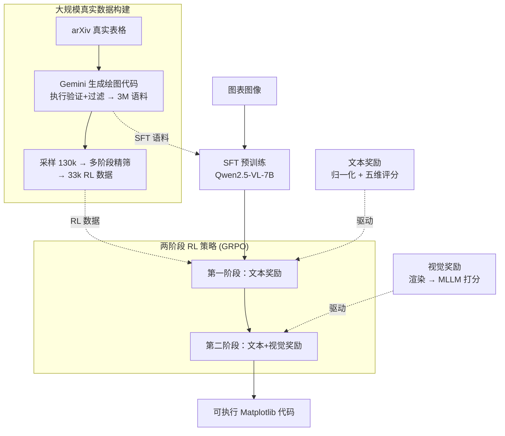

# Breaking the SFT Plateau: Multimodal Structured Reinforcement Learning for Chart-to-Code Generation

**会议**: ICLR 2026  
**arXiv**: [2508.13587](https://arxiv.org/abs/2508.13587)  
**代码**: [GitHub](https://github.com/DocTron-hub/MSRL)  
**领域**: 多模态VLM / 代码生成  
**关键词**: Chart-to-Code, 强化学习, SFT瓶颈, 多粒度奖励, GRPO

## 一句话总结
针对图表到代码生成任务中SFT的性能瓶颈问题，提出多模态结构化强化学习（MSRL），通过文本+视觉双层奖励函数和两阶段RL策略，在ChartMimic和ReachQA上分别提升6.2%和9.9%的高层指标，达到开源SOTA并媲美GPT-4o。

## 研究背景与动机
**领域现状**: 多模态大模型（MLLM）在视觉问答等任务上表现出色，但在处理信息密集型图像（如图表）并生成结构化输出（如代码）时能力仍然有限。Chart-to-code生成任务要求模型深度理解可视化图表并生成准确的绘图代码，具有重要的实际价值。

**现有痛点**: 已有方法依赖SFT或DPO在合成数据上训练，数据模式单一（合成数据缺乏真实复杂度），泛化能力有限。而且SFT存在固有缺陷——它对目标序列中每个token赋予相同重要性，而绘图代码中大量是模板代码（如`plt.plot`），关键信息（数据值、样式参数）出现频率很低。

**核心矛盾**: SFT数据量扩大到一定规模后收益递减，出现**性能平台效应**。实验证明从200k扩展到2.8M样本后，超过2M之后性能不再增长。这意味着靠堆数据无法突破上限。

**本文目标**: (1) 系统验证SFT的性能天花板；(2) 设计有效的RL策略突破这个天花板；(3) 构建大规模真实数据的Chart-to-code训练语料。

**切入角度**: 作者观察到SFT的均匀权重分配机制无法重视关键token，而RL可以通过定制奖励函数重点优化关键内容的准确性。同时，纯文本奖励忽视整体视觉结构，需要引入视觉反馈形成多粒度奖励。

**核心 idea**: 用多粒度（文本+视觉）奖励函数驱动两阶段GRPO强化学习，突破Chart-to-code任务中SFT的性能瓶颈。

## 方法详解

### 整体框架
任务是给定一张图表图像、输出一段能跑出同款图的 Matplotlib 绘图代码。MSRL 的核心判断是：单靠 SFT 堆数据会撞上性能天花板，因为 SFT 给目标序列里每个 token 同等权重，而绘图代码里大量是 `plt.plot` 这类模板代码，真正关键的数据值、样式参数出现频率很低，被模板淹没。所以 MSRL 先用一份大规模真实数据把 SFT 能力顶到天花板，再用强化学习去专门拉高那些"关键但低频"的内容。

整条流水线分两大块：一块是**数据侧**——从 arXiv 真实表格出发自动生成约 300 万对图表-代码语料供 SFT 用，再从中精筛出 33k 高质量样本专供 RL；另一块是**训练侧**——SFT 预训练之后接两阶段 GRPO，第一阶段只用文本奖励低成本抠代码细节，第二阶段再叠加视觉奖励提升整体视觉保真度。底座是 Qwen2.5-VL-7B，RL 用 GRPO（组内相对优势做优化、省掉 critic 模型）。

### 关键设计

**1. 大规模真实数据构建：真实表格替合成数据，并为 RL 单独精筛一份**

已有数据集有两个硬伤：纯合成数据趋势单调、缺多样性，规模也不足以暴露 SFT 的真实上限。MSRL 因此从 2023 年及以前的 arXiv 论文爬取真实表格，用 Gemini-2.5-Flash 结合表格与示例代码生成绘图代码，再经执行验证与过滤，得到约 300 万对语料——目前最大的 chart-to-code 数据集，覆盖 24 种图表类型、1555 种 Matplotlib API，正是它撑起了后面对 SFT 平台效应的量化验证。RL 阶段不能直接复用这份 SFT 数据，否则模型会过拟合 SFT 的输出格式、丧失探索空间。所以再从语料中采样 13 万候选，经多阶段过滤（按图表类型与数据定义格式筛代码内容，用树结构解析识别复杂图表；再做视觉质量评估），精挑出 33k 干净样本专供 RL。规模不大但和 SFT 数据分离，才能逼模型去探索而非背格式。

**2. 文本奖励：先归一化消除语法变体，再五维算细粒度正确性**

绘图代码风格极其多样，同一语义能有很多种写法，直接抽取关键信息做奖励会被语法噪声淹没。MSRL 的关键适配是先做一步**格式归一化**，把每个输出映射到一个规范表示，让奖励对语法变体不敏感；之后才从五个维度评分——数据值用软匹配（容忍 $\pm 5\%$ 相对误差）、图表类型用硬字符串匹配、布局用硬值匹配、标题标签等文本元素用编辑距离，加权得到一个细粒度正确性分。执行奖励则单独算，是"代码能否跑通"的二值信号。归一化是把 RLVR 用到结构化代码生成上的核心 trick——没有它，奖励几乎被语法变体淹没到没法用。

**3. 视觉奖励：把代码渲染成图，让 MLLM 判"像不像"**

文本奖励只盯细粒度代码细节，看不到整体视觉结构和风格，而 chart-to-code 恰恰要求复刻图表的整体观感。视觉奖励补这个盲区：把生成代码执行、渲染成图像，再用 Qwen2.5-VL-72B 当评估模型，从图表类型、布局、文本内容、数据、样式、清晰度六个维度打分并归一化；渲染失败的代码直接得 0。它把"代码对不对"换算成"图像像不像"这个更直观的维度，正好和只看代码细节的文本奖励互补。

**4. 两阶段 RL 策略：先低成本文本奖励铺量，再高成本视觉奖励精修**

视觉奖励要渲染图像、还要调大模型打分，开销很大，全程开着不划算。MSRL 因此把训练拆成两阶段课程，总奖励写成

$$R = w_t R_\text{text} + w_v R_\text{vis} + w_e R_\text{exec}$$

第一阶段令 $w_v=0$，只用文本奖励训练，以低成本拿到大部分提升（约 5%）；第二阶段再引入混合奖励微调，补上约 1.5% 的视觉保真度。全程用 GRPO 靠组内相对优势优化。这样既保住了性能，又把视觉奖励的算力花在刀刃上——消融里两阶段策略用 576 GPU hours 就逼近了全程纯视觉 RL（1344 GPU hours）的效果。

### 损失函数 / 训练策略
- SFT 阶段：标准自回归负对数似然损失。
- RL 阶段：GRPO，组内采样多个响应算相对优势，无需额外的 critic 模型。
- 两阶段课程训练：先文本奖励（约 240 GPU hours）→ 再混合奖励（约 336 GPU hours）。

## 实验关键数据

### 主实验

| 模型 | 参数量 | ChartMimic Exec. | ChartMimic High | ReachQA Exec. | ReachQA High |
|------|--------|-------------------|-----------------|---------------|--------------|
| GPT-4o | - | 93.2 | 83.5 | 92.8 | 84.0 |
| Qwen2.5-VL-7B | 7B | 73.2 | 41.6 | 62.2 | 37.6 |
| ChartCoder | 7B | 91.4 | 74.0 | 83.8 | 69.4 |
| MSRL-SFT | 7B | 93.2 | 77.6 | 92.2 | 80.0 |
| **MSRL** | **7B** | **96.5** | **83.8** | **98.2** | **89.9** |

MSRL以7B参数量超越所有开源模型，ChartMimic高层指标83.8超过GPT-4o的83.5，ReachQA高层指标89.9大幅超过GPT-4o的84.0。

### 消融实验

| 配置 | ChartMimic Exec. | Low-Level | High-Level | 说明 |
|------|-------------------|-----------|------------|------|
| Baseline (无SFT/RL) | 73.2 | 44.6 | 41.6 | Qwen2.5-VL-7B原始模型 |
| SFT only | 93.2 | 73.0 | 77.6 | SFT达到的天花板 |
| RL only (无SFT) | 93.8 | 65.6 | 62.3 | 直接RL不如SFT |
| SFT + RL (文本奖励) | 97.0 | 78.1 | 82.7 | 突破SFT瓶颈 |
| SFT + RL (两阶段) | 96.5 | 78.6 | 83.8 | 最终版，加入视觉奖励 |

奖励策略对比：纯视觉RL效果最好但需1344 GPU hours，两阶段策略以576 GPU hours达到相近性能。

### 关键发现
- **SFT瓶颈确认**：数据从200k增到2.8M，超过2M后性能不再增长，证明SFT有固有天花板
- **RL突破效果显著**：在饱和的SFT模型上，RL仍能带来ChartMimic高层指标+6.2%、ReachQA +9.9%的提升
- **两阶段策略高效**：第一阶段文本奖励贡献约5%提升，第二阶段视觉奖励额外贡献1.5%，但计算开销大幅降低
- **跨库泛化**：MSRL在Seaborn和Plotly测试集上也展示了泛化能力（训练仅用Matplotlib），Plotly上执行率从62.7%提升至90.0%

## 亮点与洞察
- **系统化的SFT瓶颈分析**：通过六个数据规模（200k-2.8M）的对照实验，首次在chart-to-code领域给出了SFT性能天花板的量化证据，这种方法论可以迁移到其他结构化生成任务。
- **代码格式归一化是RLVR的关键适配**：绘图代码的语法多样性（同一语义可以用不同写法），如果不做归一化，奖励函数会被噪声淹没。这个trick对所有涉及代码生成的RLVR任务都有参考价值。
- **视觉奖励作为结构化输出的全局校验**：将代码渲染为图像再评估，巧妙地把"代码是否正确"映射到了"图像是否相似"这个更直观的维度，适用于任何代码输出可被可视化的场景（如LaTeX生成、网页代码生成等）。
- **先文本后视觉的课程设计**：先用低成本奖励建立基础能力，再引入高成本奖励精细调整，是一个实用的资源-性能权衡策略。

## 局限与展望
- 仅在Matplotlib风格上训练，虽然展示了对Seaborn/Plotly的泛化，但泛化提升有限（Plotly高层仅35.9），多库联合训练值得探索
- 视觉奖励依赖Qwen2.5-VL-72B打分，成本高且可能引入MLLM自身偏差，能否用更轻量的度量（如SSIM、LPIPS）替代？
- 数据构建使用2023年前论文，可能不覆盖新型可视化风格
- RL数据仅33k，是否更大规模RL数据能进一步突破？论文显示RL也有性能平台（22k左右收敛）

## 相关工作与启发
- **vs ChartCoder**: ChartCoder也做chart-to-code但只用SFT+DPO在合成数据上训练，MSRL通过真实数据+RLVR大幅超越（高层指标74.0→83.8）
- **vs Chart-R1/BigCharts-R1**: 这些用RLVR提升图表推理QA，但不涉及代码生成。MSRL是首个将RLVR应用于chart-to-code的结构化代码生成任务。
- **vs DeepSeek-R1/Vision-R1**: R1系列关注通用推理的RL训练，MSRL在结构化输出生成上提出了针对性的多粒度奖励设计，展示了RLVR在不同任务范式下的适配方法。

## 评分
- 新颖性: ⭐⭐⭐⭐ SFT瓶颈的系统化验证和多粒度奖励设计有新意，但整体框架是GRPO+定制奖励的标准范式
- 实验充分度: ⭐⭐⭐⭐⭐ 数据规模实验、多维度消融、跨库泛化、与GPT-4o对比，实验非常充分
- 写作质量: ⭐⭐⭐⭐ 逻辑清晰，图表信息丰富，动机阐述有说服力
- 价值: ⭐⭐⭐⭐ 在chart-to-code这个细分领域建立了强SOTA，方法论对其他结构化代码生成任务有参考价值

<!-- RELATED:START -->

## 相关论文

- [\[CVPR 2026\] MM-ReCoder: Advancing Chart-to-Code Generation with Reinforcement Learning and Self-Correction](../../CVPR2026/code_intelligence/mm-recoder_advancing_chart-to-code_generation_with_reinforcement_learning_and_se.md)
- [\[ACL 2026\] MARS2: Scaling Multi-Agent Tree Search via Reinforcement Learning for Code Generation](../../ACL2026/code_intelligence/mars2_scaling_multi-agent_tree_search_via_reinforcement_learning_for_code_genera.md)
- [\[AAAI 2026\] ReCode: Updating Code API Knowledge with Reinforcement Learning](../../AAAI2026/code_intelligence/recode_updating_code_api_knowledge_with_reinforcement_learning.md)
- [\[ACL 2026\] Aligned Multi-View Scripts for Universal Chart-to-Code Generation](../../ACL2026/code_intelligence/aligned_multi-view_scripts_for_universal_chart-to-code_generation.md)
- [\[ICLR 2026\] Learning to Reason without External Rewards](learning_to_reason_without_external_rewards.md)

<!-- RELATED:END -->
