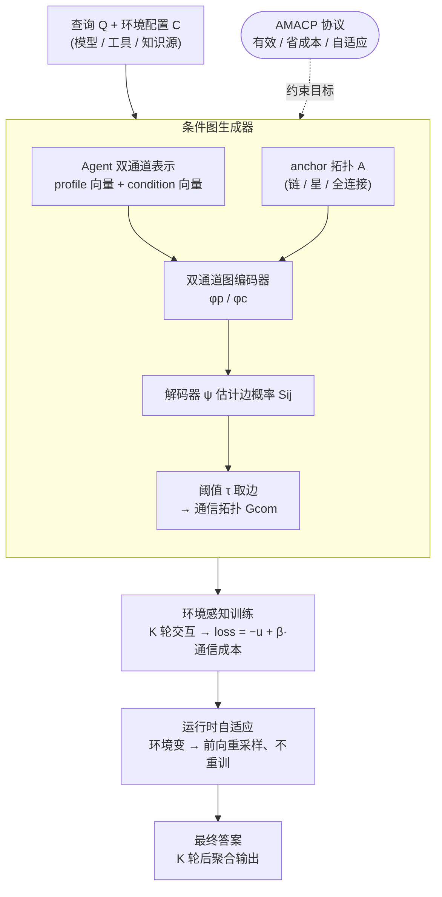

# CARD: Towards Conditional Design of Multi-agent Topological Structures

**会议**: ICLR 2026  
**arXiv**: [2603.01089](https://arxiv.org/abs/2603.01089)  
**代码**: [https://github.com/Warma10032/CARD](https://github.com/Warma10032/CARD)  
**领域**: 代码智能  
**关键词**: 多Agent通信拓扑, 条件图生成, 图神经网络, 动态环境信号, Agent协作

## 一句话总结
CARD提出了一种条件图生成框架(Conditional Agentic Graph Designer)，通过条件变分图编码器和环境感知优化，根据模型能力、工具可用性和知识源变化等动态环境信号自适应地设计多Agent通信拓扑结构，在HumanEval、MATH和MMLU上一致超越静态和基于提示的基线方法。

## 研究背景与动机
基于LLM的多Agent系统在代码生成和协作推理等任务上展现了强大的能力，但这些系统的有效性和鲁棒性在很大程度上取决于Agent之间的通信拓扑结构。当前方法存在两个关键缺陷：(1) 通信拓扑通常是**固定的**（如链式、层级式）或**静态学习的**，忽视了真实世界中的动态因素——模型升级、API变更、工具能力变化、知识源更新等；(2) 缺乏一个系统性的协议来描述和适应这些环境变化。核心矛盾在于：静态拓扑无法适应部署环境的动态变化，而手动重新设计拓扑又不可扩展。本文的切入点是：将多Agent拓扑设计视为一个**条件图生成问题**，让环境信号驱动拓扑的自适应构建。

## 方法详解

### 整体框架
CARD 把一个多 Agent 系统看成一张有向通信图 $G=(V,E)$：节点是 Agent（每个 Agent 绑定角色、底座模型、可用工具、知识源），有向边是"谁把消息传给谁"。难点在于，这张图过去要么人手写死（链式、层级），要么在静态环境下学出来，可一旦底座模型升级、工具失效或知识源变化，原本好用的拓扑就不再合适，而人手重设计不可扩展。

CARD 的思路是让一个"以环境为条件"的图生成器来现场画这张图。它分四步：先用 **AMACP 协议**把部署环境（模型能力、工具可用、知识源状态）显式形式化成条件，并规定一张合格拓扑必须同时满足有效、省成本、自适应三条要求；再把每个 Agent 的静态画像（profile）和动态条件（condition）编码成双通道向量，喂给**条件图生成器**——双通道图编码器产出隐表示、解码器逐对估计边概率 $S_{ij}$、按阈值 $\tau$ 取边得到通信拓扑 $G_{com}$；训练时在多种环境配置下跑 $K$ 轮多 Agent 交互，用"任务效用 $-\,\beta\cdot$ 通信成本"的目标学一个**从环境到拓扑的映射**；部署时环境一变，只需把新条件前向**重采样**一次拓扑、无需重训。

### 关键设计

**1. AMACP 协议：把动态环境从隐含假设变成可输入的条件**

现有多 Agent 拓扑写死或静态学习，环境一变（模型升级、API 变更、工具失效）就脆——会产生冗余交互或信息流中断。AMACP（Adaptive Multi-Agent Communication Protocol）的做法是把环境状态**形式化成模型的输入**：每个 Agent 用 profile（角色、底座模型、工具）和 condition（运行时的模型可用性、token 成本、API 可靠性等）两组属性描述；同时规定一张合格拓扑必须满足三条——有效（产出合格解）、省成本（最小化模型/API/token 开销）、自适应（随环境条件 $C$ 的变化调整结构），并把它们写成统一的优化目标 $\min_{G}\ -u(G(Q\mid C)) + \beta\cdot w(G;C)$，其中 $u$ 是任务效用、$w$ 是条件感知的通信成本、$\beta$ 是权衡系数。正因为环境被写成了模型输入而非固化在结构里，系统才有机会"感知到变化并据此改连接"。

**2. 条件图生成器：双通道表示 + 编码-解码算出每条边的概率**

这是 CARD 的核心，负责把"Agent 画像 + 环境条件"映射成一张拓扑。每个 Agent 的 profile 文本和 condition 文本分别嵌入成 $X^p_i$、$X^c_i$；边集先从一张 anchor 拓扑 $A$（链/星/全连接）初始化，提供结构先验。编码端用两个可学习的图编码器 $\phi_p$、$\phi_c$ 分别对两个通道产出隐表示 $H^p$、$H^c$；解码器 $\psi$ 把查询当作一个连向所有 Agent 的辅助节点 $h^Q$，逐对估计边概率

$$\psi(S\mid H^p,H^c)=\prod_{i,j}\psi\big(S_{ij}\mid h^p_i,h^c_i,h^p_j,h^c_j,h^Q;\Theta_d\big),$$

再按阈值取边得到通信拓扑 $E_{com}=\{(v_i,v_j)\mid S_{ij}>\tau\}$。这里用的是条件变分图编码（conditional variational graph encoder），同一任务、同一环境下可以采样出多张候选拓扑再择优，提升鲁棒性。把 profile 与 condition **分通道**编码、再在解码端融合，正是为了让"静态角色分工"和"动态环境资源"各自充分表达，使生成的边既看任务分工、又看实时资源状态。

> ⚠️ 原文只称 $\phi_p/\phi_c$ 为"可学习的图编码器"，未点名具体是 GCN 还是 GAT；以原文为准。

**3. 环境感知训练：用"任务效用 − β·通信成本"学环境到拓扑的映射**

普通图生成只学"什么拓扑好"，部署环境一变这个答案就过时。CARD 在训练时遍历采样的 $(Q,C)$ 对，在 $G_{com}$ 上跑 $K$ 轮多 Agent 交互、聚合末轮输出 $\alpha^{(K)}$，按 $L_{CARD}=-u(\alpha^{(K)})+\beta\,w(G_{com};C)$ 对编码/解码参数 $\Theta_p,\Theta_c,\Theta_d$ 做梯度下降。其中条件感知成本把每条边的期望 token 成本按其激活概率加权，$w(G_{com};C)=\sum_{(i,j)}\text{Cost}_{ij}\,p_{ij}$（$p_{ij}=S_{ij}$），鼓励稀疏而精准的通信而非冗余全连接。由于训练数据覆盖多种环境配置（不同 LLM 组合、不同工具可用性），生成器学到的是一个**从环境信号到最优拓扑的映射**，而不是某个固定的好拓扑。

**4. 运行时自适应：环境变只需前向重采样、不重训**

部署后模型/工具随时在变，靠重训来适配不可扩展。因为生成器已经把"环境→拓扑"压成一次前向，运行时只要把实时感知到的新条件 $C$ 喂进编码-解码，就能一次性重算出适配的拓扑 $G_{com}$，无需重新训练。拿到拓扑后由执行引擎跑起来：拓扑调度函数 $\varphi$ 先给出一个尊重无环依赖的 Agent 执行顺序，每轮每个 Agent 接收系统/用户提示和上游邻居的回复、产出自己的回复，$K$ 轮后由聚合算子（投票/选择/摘要）给出最终答案。这把适应环境变化的成本从"重新训练"降到"一次前向采样"，正是条件生成相比静态学习的关键价值。

### 损失函数 / 训练策略
训练在采样的 $(Q,C)$ 对上进行：拓扑从 anchor 拓扑（链/星/全连接 + 任务节点）初始化，跑 $K$ 轮多 Agent 交互、聚合末轮输出后，按 $L_{CARD}=-u(\alpha^{(K)})+\beta\,w(G_{com};C)$ 联合优化 profile 编码器 $\phi_p$、condition 编码器 $\phi_c$ 与解码器 $\psi$ 的参数，梯度通过软邻接概率矩阵 $S$ 回传；$\beta$ 平衡任务效用与通信成本。

## 实验关键数据

### 主实验

三个基准上各 LLM 基座的平均分（%）：

| 方法 | 多Agent | 自动拓扑 | 条件 | HumanEval | MATH | MMLU |
|------|:---:|:---:|:---:|------|------|------|
| Vanilla | ✗ | ✗ | ✗ | 85.50 | 63.33 | 81.04 |
| CoT | ✗ | ✗ | ✗ | 87.66 | 64.33 | 84.18 |
| Random-graph | ✓ | ✗ | ✗ | 86.00 | 64.67 | 83.27 |
| LLM-Debate | ✓ | ✗ | ✗ | 86.00 | 66.83 | 83.92 |
| GPT-Swarm | ✓ | ✓ | ✗ | 86.66 | 70.16 | 84.05 |
| Aflow | ✓ | ✓ | ✗ | 89.83 | 73.83 | 82.87 |
| G-Designer | ✓ | ✓ | ✗ | 86.50 | 72.66 | 84.44 |
| **CARD** | ✓ | ✓ | ✓ | **90.50** | **74.50** | **86.67** |

CARD 在三个基准上平均分均最高，并在 15 个"模型基座 × 基准"组合里有 13 个拿到或并列最高分。

### 消融实验：条件该怎么注入拓扑生成

| 注入方式 | 效果 |
|------|------|
| 无条件（w/o Cond.） | 退化为无条件图生成，作基线 |
| 提示级注入（w/ Cond.p，把条件描述拼进 system prompt） | 不稳定甚至反伤——MATH 上 M5 基座最多 **−12.50%**、MMLU 上 M1 基座 −2.00% |
| CARD（条件嵌入图生成模块） | 全部非负增益：MATH +0.83~+3.34%、MMLU +0.66~+2.62%、HumanEval +2.50~+23.33% |

### 关键发现
- **结构化注入 > 提示拼接**：把条件直接拼进 prompt 会反伤（最多 −12.5pp），而把条件嵌进图生成模块才稳定正收益——说明拓扑级的条件自适应远比提示级可靠
- **设计抽象越丰富收益越累积**：单 Agent（Vanilla/CoT）→ 固定拓扑（Random-graph/LLM-Debate，+0.5~2.0pp）→ 静态自动拓扑（GPT-Swarm/Aflow/G-Designer，+1.0~4.0pp）→ CARD 条件自适应再加 +0.5~3.0pp
- **换到没见过的 LLM（out-of-domain）时优势最大**：MATH 上从 deepseek-v3 换到 qwen-72B，G-Designer 准确率从 91.66% 跌到 79.16%（−12.5pp），CARD 仅从 91.66% 跌到 82.50%，跌幅小得多
- **Agent 数量增加时优势进一步扩大**：CARD 比 G-Designer 更可扩展，OOD 设置下随 Agent 数增加最多 +1.99pp
- 节点被攻击时 CARD 降幅最小（在攻击+干净条件下都训练过），鲁棒性强于 LLM-Debate 与 G-Designer

## 亮点与洞察
- **从NAS到Agent拓扑搜索的类比**：正如神经架构搜索（NAS）自动化了网络设计，CARD自动化了多Agent协作结构的设计，且引入了条件生成使其能应对动态环境
- **图生成 + Agent系统的融合**：将GNN的图结构学习能力与LLM Agent系统结合，是一个有前景的研究方向
- **AMACP协议的泛用性**：虽然本文聚焦代码/数学/知识任务，但AMACP协议的设计是通用的，可以扩展到任何需要多Agent协作的场景
- **环境信号的显式建模**：这是区别于GDesigner等先前工作的关键创新——不仅学习"什么拓扑好"，还学习"在什么条件下什么拓扑好"

## 局限与展望
- 目前仅在代码生成、数学推理和知识问答三类任务上验证，缺少更复杂的多Agent协作场景（如辩论、创意写作）
- 环境信号的定义和采集可能在实际部署中面临挑战——如何自动检测模型能力变化？
- 条件VAE的训练需要在多种环境配置下收集足够多的数据，初始训练成本较高
- Agent数量固定为5个，未充分探讨动态增减Agent的场景
- 图的生成目前是一次性的，未探索在执行过程中动态调整拓扑的能力

## 相关工作与启发
- **GDesigner**: 本文的核心参考工作，使用GNN设计多Agent拓扑，但缺乏条件适应能力。CARD在此基础上引入了条件生成
- **MetaGPT / AutoGen / CrewAI**: 流行的多Agent框架，使用固定拓扑（如SOP流程），难以适应环境变化
- **CVAE在图生成中的应用**: Graph VAE等方法为CARD的条件图生成器提供了理论基础
- **启发**：多Agent系统的"元设计"（设计如何设计Agent系统）是一个受关注度还不够的方向，CARD开辟了条件化设计这条新路径

## 评分
- 新颖性: ⭐⭐⭐⭐⭐
- 实验充分度: ⭐⭐⭐⭐
- 写作质量: ⭐⭐⭐⭐
- 价值: ⭐⭐⭐⭐

<!-- RELATED:START -->

## 相关论文

- [\[NeurIPS 2025\] Automated Multi-Agent Workflows for RTL Design](../../NeurIPS2025/code_intelligence/automated_multi-agent_workflows_for_rtl_design.md)
- [\[ICLR 2026\] ReasoningBank: Scaling Agent Self-Evolving with Reasoning Memory](reasoningbank_scaling_agent_self-evolving_with_reasoning_memory.md)
- [\[ACL 2026\] MARS2: Scaling Multi-Agent Tree Search via Reinforcement Learning for Code Generation](../../ACL2026/code_intelligence/mars2_scaling_multi-agent_tree_search_via_reinforcement_learning_for_code_genera.md)
- [\[AAAI 2026\] Extracting Events Like Code: A Multi-Agent Programming Framework for Zero-Shot Event Extraction](../../AAAI2026/code_intelligence/extracting_events_like_code_a_multi-agent_programming_framework_for_zero-shot_ev.md)
- [\[ACL 2026\] ChatHLS: Towards Systematic Design Automation and Optimization for High-Level Synthesis](../../ACL2026/code_intelligence/chathls_towards_systematic_design_automation_and_optimization_for_high-level_syn.md)

<!-- RELATED:END -->
