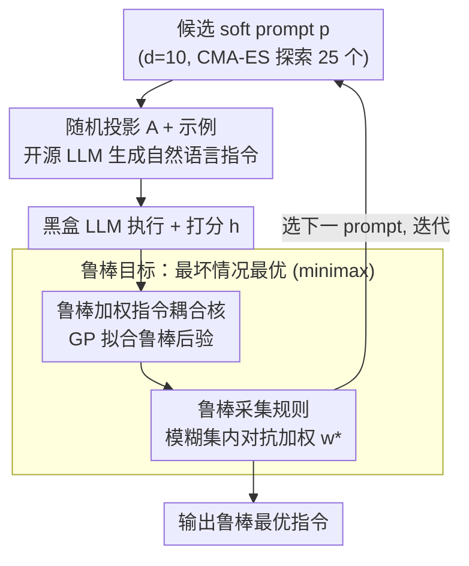

# DRO-InstructZero: Distributionally Robust Prompt Optimization for Large Language Models

**会议**: ICLR 2026  
**arXiv**: [2510.15260](https://arxiv.org/abs/2510.15260)  
**代码**: 无  
**领域**: 代码智能  
**关键词**: prompt optimization, distributionally robust optimization, Bayesian optimization, instruction tuning, zero-shot learning

## 一句话总结

将分布鲁棒优化（DRO）引入 InstructZero 的贝叶斯优化框架，通过在 f-divergence 球定义的模糊集上最大化最坏情况期望效用，使自动搜索得到的 prompt 在分布偏移下仍能保持可靠性能。

## 研究背景与动机

大语言模型对 prompt 措辞高度敏感——即使是轻微改写也可能导致准确率骤降。InstructZero 等自动指令搜索方法通过贝叶斯优化（BO）在连续潜在空间中搜索最优 soft prompt，取得了不错成果，但它们优化的目标是**单一验证分布上的期望得分**。这一假设在实际部署中存在根本缺陷：

**分布偏移不可避免**：用户输入的分布可能与验证分布存在显著差异，例如领域切换、对抗样本、查询风格变化

**过拟合训练分布**：在固定分布上优化的指令往往脆弱，换一个评估场景就可能失效

**迁移性不足**：经典 BO 采集函数（EI、UCB）只关注平均表现，忽略了尾部风险

作者的核心洞察：现有方法追求"平均最优"，而实际部署需要"最坏情况可靠"——这恰好是分布鲁棒优化（DRO）的经典应用场景。将 DRO 与 BO 结合，可以在保持查询效率的同时显式优化鲁棒性。

## 方法详解

### 整体框架

DRO-InstructZero 要解决的问题是：自动搜出来的 prompt 一旦遇到分布偏移就翻车。它沿用 InstructZero 把 prompt 搜索转化为连续空间贝叶斯优化（BO）的整套管线——一个低维 soft prompt $p$ 经随机投影 $A$ 拼上示例后喂给开源 LLM 生成自然语言指令，再交给黑盒 LLM 执行、用打分函数 $h$ 评估——这条「生成指令 → 执行打分」的链路完全不动。真正改动的是 BO 的搜索目标和采集那一环：原来 BO 是在「单一验证分布上的平均得分」上做高斯过程（GP）回归并采集下一个候选，现在整个 BO 循环改为服务一个 minimax 的**鲁棒目标**——每一步先用对抗加权找出最刁难当前候选的那个邻近分布，再选出在这个最坏分布下仍最优的 prompt，循环往复直到查询预算耗尽。这样鲁棒性被直接写进了搜索偏好，而每轮只额外解一个小凸优化、不增加对 LLM 的调用。

### 关键设计

**1. 鲁棒目标：把「平均最优」换成「最坏情况最优」**

针对的痛点正是开头那条——在固定验证分布上优化出的指令换个场景就脆弱。InstructZero 的标准目标 $\max_v \mathbb{E}_{(X,Y)\sim D^t}[h(f([v;X]),Y)]$ 只盯着固定验证分布 $D^t$ 的平均得分，所以分布一偏移就退化。DRO-InstructZero 把它改写成 minimax 形式：

$$\max_{v \in V} \inf_{Q \in \mathcal{U}(D^t)} \mathbb{E}_{(X,Y)\sim Q}[h(f([v;X]),Y)]$$

内层 $\inf$ 在模糊集 $\mathcal{U}(D^t)$ 里搜出最坏分布，外层 $\max$ 要求指令在这个最坏分布下仍表现良好。模糊集取以参考分布 $w_{\text{ref}}$ 为中心、f-divergence（KL 散度）半径为 $\epsilon$ 的球，$\epsilon$ 就是「允许分布偏移多大」的旋钮。沿用 InstructZero 同款 soft prompt 参数化后，这个鲁棒目标坍缩成一个低维黑盒函数 $H(p) \triangleq \inf_{Q \in \mathcal{U}(D^t)} \mathbb{E}_{(X,Y)\sim Q}[h(f([g([Ap;\text{exemplars}]);X]),Y)]$，因此仍然能用 BO 在 $d=10$ 维空间里高效求解——既显式优化尾部风险，又不放弃查询效率。这是它和只追平均的旧目标最根本的区别。

**2. 鲁棒加权的指令耦合核：让 GP 同时建模语义接近性与分布鲁棒性**

要把上面的鲁棒目标交给 BO，第一步是 GP 得能在「鲁棒」这个维度上分辨候选。InstructZero 的指令耦合核已经把 prompt 空间相似度 $l(\cdot,\cdot)$ 与指令语义相似度 $s(\cdot,\cdot)$ 结合，使两个 soft prompt 即便数值相近、只要诱导出的指令语义不同也能被区分。本文进一步用上一步算出的对抗分布 $w^*$ 对核矩阵加权，让 GP 在拟合时不仅看两个候选语义有多接近，还看它们在最坏分布上的表现有多一致。这样后验不确定性的估计与鲁棒采集目标对齐，BO 的探索方向天然向「最坏情况下也稳」的区域收敛，而不是被几个平均分虚高的候选带偏。

**3. 鲁棒采集规则：在模糊集内做对抗加权再挑 prompt**

有了鲁棒后验，还得有一个会「往最坏处想」的采集函数——经典 EI/UCB 只看后验均值，会把搜索引向平均分高但脆弱的指令。这里改成两步：对每个候选 prompt $p_m$，先用 GP 后验算出跨任务的乐观 UCB 分数向量 $\text{ucb}_m = [\mu^t(p_m) + \beta(m)\sigma^t(p_m)]_t$（$\beta(t)=2.0\sqrt{2.0\log(t+1)}$ 控制探索强度）；再在模糊集内解一个小凸优化 $w_m^* = \arg\min_{w': \|w' - w_{\text{ref}}\|_\mathcal{M} \leq \epsilon(m)} \langle \text{ucb}_m, w' \rangle$，找出最压低当前候选得分的对抗分布。下一个采样点取 $p_{m+1} = \arg\max_p \langle \text{ucb}_m, w_m^* \rangle$，即在「最刁难的分布」下仍最优的 prompt。于是每一步采集都隐含一次「假设遇到最坏偏移」的压力测试，搜索自然偏好抗偏移的指令；对抗权重求解用 cvxpy 在凸球约束下完成，额外开销只落在求解器上、不增加 API 调用。参考分布 $w_{\text{ref}}$ 初始为均匀分布，再按历史评估分数逆概率做 EMA 更新，让模糊集中心随观测逐步聚焦到难样本上。

### 损失函数 / 训练策略

整套搜索用 CMA-ES 进化策略驱动，每轮探索 25 个候选 soft prompt（维度 $d=10$），并随机采样 2 个任务做联合 DRO（模糊半径固定 $\epsilon=0.1$），全程单卡 NVIDIA A100；查询预算与 InstructZero 保持一致。

## 实验与结果

### 主实验：32 个 BIG-Bench 任务

使用 Vicuna（开源 LLM）+ ChatGPT（黑盒 LLM），遵循 instruction-induction 协议，查询预算与 InstructZero 相同：

| 指标 | InstructZero | DRO-InstructZero | 提升 |
|------|-------------|-------------------|------|
| 平均准确率 | 0.719 | 0.756 | +3.6 pts |
| 中位每任务增益 | — | — | +5.5 pts |
| 胜/平/负 | — | 18 / 8 / 6 | — |
| 翻译 (EN→DE/ES/FR) | 0.867 | 0.980 | +11.3 pts |
| Auto-Debugging | 0.50 | 0.60 | +10 pts |
| Formality Rewriting | 0.63 | 0.68 | +5 pts |
| 饱和任务 (Sum 等) | 100% | 100% | 持平 |

分布偏移敏感任务的提升尤为明显：Unscrambling 0.67→0.80，Second Letter 0.62→0.74，Taxonomy 0.82→0.92，Sentiment 0.93→0.99。

### 消融实验

| 方法 | 分布偏移准确率 | 说明 |
|------|--------------|------|
| InstructZero-EI | 61.3 ± 0.7% | 原始期望改善采集函数 |
| InstructZero-UCB | 略低于 EI | 标准 UCB 采集函数 |
| DRO w/o BO | 中等 | 去掉 BO，直接在原指令空间做 DRO |
| **DRO-InstructZero** | **85–90%** | 完整方法，+25–30 pts |

两个关键结论：(1) DRO 在分布偏移下比 EI/UCB 高 15–25 个绝对百分点；(2) 去掉 BO 后效果显著下降，说明潜在空间 BO 的结构化探索对效率至关重要，DRO 配合 BO 才能发挥最大作用。

### 少数回退案例

在 Antonyms (−11 pts)、Object Counting (−10)、CS-algorithm (−8) 等词法/分类任务上有小幅下降。原因是最坏情况加权可能偏离评估器要求的精确词法规则。作者提出混合采集函数（在后期利用阶段插值鲁棒分数与标称分数）作为缓解方案。

## 亮点与洞察

1. **DRO + BO 的互补性**：BO 负责高效探索连续潜在空间，DRO 负责鲁棒性保证——两者结合既保留了查询效率，又避免了对训练分布的过拟合
2. **即插即用**：仅替换采集函数，无需修改 LLM 架构或训练流程，可直接嵌入任何基于 BO 的 prompt 优化框架
3. **理论预测与实验吻合**：DRBO 理论指出"平均最优策略在最坏情况下脆弱"，实验中 InstructZero 的偏移退化恰好验证了这一点
4. **查询预算不变**：鲁棒性提升不依赖更多 API 调用，额外开销仅在凸优化求解器上

## 局限性

1. **对抗重加权引入计算开销**：每轮需额外求解凸优化问题，单轮耗时增加
2. **超参数敏感**：散度度量类型和模糊半径 $\epsilon$ 固定为常数，未必适用于所有场景
3. **评估规模有限**：受 API 成本约束，未在多语言任务、推理密集场景或更强对抗设置下验证
4. **词法精确任务的退化**：最坏情况思维在需要精确词法匹配的任务上反而有害

## 相关工作

- **InstructZero** (Chen et al., 2024)：基础框架，将 prompt 优化建模为连续空间 BO
- **DRBO** (Kirschner et al., 2020)：分布鲁棒贝叶斯优化的理论基础，本文的核心技术来源
- **APE / OPRO**：其他自动 prompt 优化方法，同样面临分布偏移问题，DRO 思路可迁移

## 评分

| 维度 | 分数 (1-5) |
|------|-----------|
| 创新性 | 3.5 |
| 理论深度 | 4.0 |
| 实验充分性 | 3.5 |
| 写作质量 | 3.5 |
| 实用价值 | 4.0 |
| 总分 | 3.7 |

<!-- RELATED:START -->

## 相关论文

- [\[ICLR 2026\] Training Large Language Models To Reason In Parallel With Global Forking Tokens](training_large_language_models_to_reason_in_parallel_with_global_forking_tokens.md)
- [\[ACL 2025\] Personality-Guided Code Generation Using Large Language Models](../../ACL2025/code_intelligence/personality_guided_code_gen.md)
- [\[ICML 2026\] Poison with Style: A Practical Poisoning Attack on Code Large Language Models](../../ICML2026/code_intelligence/poison_with_style_a_practical_poisoning_attack_on_code_large_language_models.md)
- [\[ICLR 2026\] ShieldedCode: Learning Robust Representations for Virtual Machine Protected Code](shieldedcode_learning_robust_representations_for_virtual_machine_protected_code.md)
- [\[AAAI 2026\] SPAN: Benchmarking and Improving Cross-Calendar Temporal Reasoning of Large Language Models](../../AAAI2026/code_intelligence/span_benchmarking_and_improving_cross-calendar_temporal_reasoning_of_large_langu.md)

<!-- RELATED:END -->
