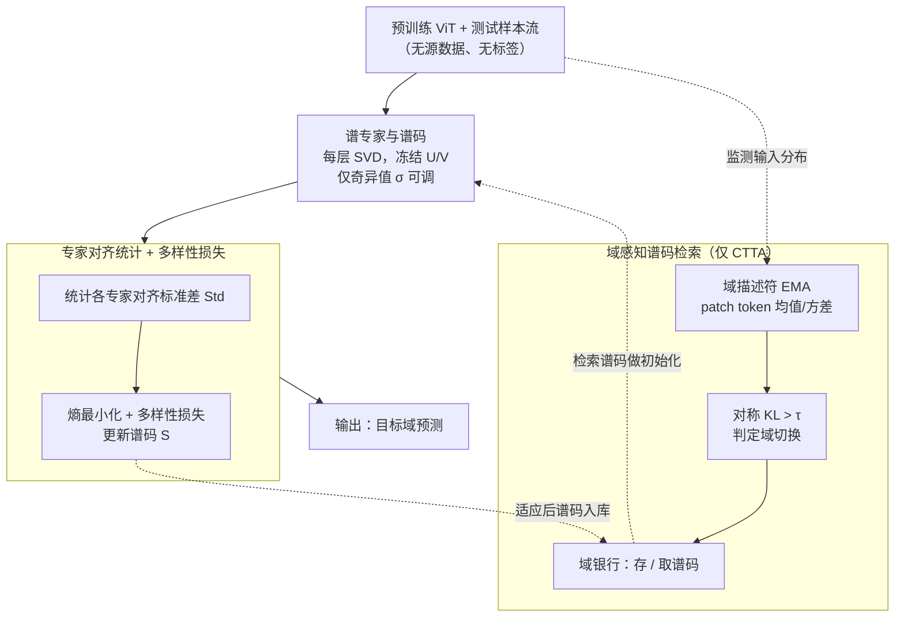

# IMSE: Intrinsic Mixture of Spectral Experts Fine-tuning for Test-Time Adaptation

**会议**: ICLR 2026  
**arXiv**: [2603.07926](https://arxiv.org/abs/2603.07926)  
**代码**: [github](https://github.com/baek85/IMSE)  
**领域**: 代码智能  
**关键词**: test-time adaptation, singular value decomposition, mixture of experts, continual adaptation, distribution shift

## 一句话总结

提出 IMSE——将预训练 ViT 线性层通过 SVD 分解为"谱专家"，仅微调奇异值实现极端参数高效的测试时适应，并通过多样性最大化损失和域感知谱码检索机制，在 TTA/CTTA/渐进 CTTA 三种场景下达到 SOTA。

## 研究背景与动机

测试时适应（TTA）旨在让源域预训练模型在线适应未知目标域，无需访问源数据。现有方法面临三个关键问题：

**预训练特征利用不充分**：大型预训练模型蕴含丰富的表征能力，如何在最少参数更新下充分利用这些表征仍未被充分探索。现有方法要么只调 BN 参数（适应能力有限），要么引入额外模块（增加推理开销）。

**熵最小化导致特征坍缩**：在无标签 TTA 场景中，熵最小化常常驱使模型利用域特定特征而非类别判别特征，反而加剧性能退化。

**连续 TTA 中域知识遗忘**：在 CTTA 设定下，模型不仅需要保持预训练知识，还需保留并复用先前遇到的域知识。现有方法缺乏高效的域知识保存与复用机制。

## 方法详解

### 整体框架

IMSE 要解决的是测试时适应（TTA）：源域预训练好的 ViT 在线适应未知目标域，没有源数据、没有标签，还要尽量少改参数。它的核心视角是把预训练 ViT 的每个线性层重新解读为一组**内在谱专家**的混合——对权重做 SVD，每个秩-1 分量就是一个专家，适应时**只微调它们的奇异值**、冻结奇异向量。围绕这个核心，论文再配两件套：一个**多样性最大化损失**，把熵最小化往特征坍缩方向拉的力顶回去；一套**域感知谱码检索**，在连续 TTA（CTTA）里把适应过的奇异值（谱码）存下来、域切换时再取回复用。单域 TTA 只用前两件，CTTA 再叠加检索机制。整体数据流如下图。

### 关键设计

**1. 谱专家与谱码：把每个线性层拆成一组正交的秩-1 专家，只动奇异值**

TTA 的痛点是预训练权重的表征能力没被充分用上——要么只调 BN、适应能力有限，要么外挂模块、增加推理开销。IMSE 换一个视角：对第 $l$ 层的线性变换做 SVD 分解 $\mathbf{W}^{(l)} = \mathbf{U}^{(l)}\mathbf{\Sigma}\mathbf{V}^{(l)\top} = \sum_{i=1}^{r^{(l)}} \sigma_i^{(l)} \mathbf{u}_i^{(l)} \mathbf{v}_i^{(l)\top}$，把每个秩-1 分量 $\mathbf{u}_i \mathbf{v}_i^\top$ 看作一个独立的**谱专家**。因为奇异向量天然正交，不同专家对同一输入的输出也互相正交（$(\mathbf{u}_i\mathbf{v}_i^\top \mathbf{x})^\top(\mathbf{u}_j\mathbf{v}_j^\top \mathbf{x}) = 0,\ i\neq j$），相当于预训练权重内部本就藏着一组功能分化、互不干扰的专家。适应新域时只微调奇异值 $\sigma_i$、冻结正交基 $\mathbf{U}$ 和 $\mathbf{V}$：正交基保住了预训练特征提取器的子空间不被破坏，而调节奇异值就等于重新分配各专家的贡献权重。所有层奇异值的集合记为**谱码** $\bm{S} = \{\bm{\sigma}^{(l)}\}_{l=1}^{L}$，它既是这套适应的全部可训练参数，也是后面 CTTA 检索复用的最小存储单元。

**2. 专家-输入对齐统计量与多样性最大化损失：用一个标准差把抽象的"特征坍缩"变成可测、可优化的量**

无标签 TTA 里熵最小化容易把模型推向域特定特征、导致类别判别力崩掉，但"坍缩"一直是个模糊的说法。IMSE 先把它变成可测的指标：定义第 $i$ 个专家对第 $n$ 个输入的归一化对齐 $a_{n,i}^{(l)} = \mathbf{v}_i^{(l)\top}\mathbf{x}_n^{(l)} / \lVert \mathbf{x}_n^{(l)} \rVert_2$（除以模长，只看方向、不看强度），再在一批 $N=B\times T$ 个 token 上统计它的标准差 $\mathrm{Std}_i^{(l)}$。如果某个专家的对齐标准差很低，说明无论输入哪个 token 它都给出近乎一样的响应——这正是它在捕获域特定的共性模式、而非类别判别特征的信号。有了这个量，多样性最大化损失就直接最大化它：

$$\mathcal{L}_{\text{dm}} = -\sum_{l\in\Lambda_{\text{dm}}}\frac{1}{r^{(l)}}\sum_{i=1}^{r^{(l)}}\mathrm{Std}_i^{(l)}$$

其中 $\Lambda_{\text{dm}}$ 只取靠近分类头的后部层（这些层的多样性更容易塌）。这样在熵最小化压低预测不确定性的同时，强制各专家保持差异化响应，把它顶回类别判别特征那一侧。

**3. 域感知谱码检索：让 CTTA 里适应过的域知识能被存下来、再被取回**

CTTA 要在连续切换的域上既不忘预训练知识、又能复用此前见过的域。IMSE 维护一个**域银行**，逐条存 $[\phi^k, \bm{S}^k]$（域描述符, 谱码）对：域描述符 $\phi = \{\text{mean}, \text{variance}\}$ 由 patch token 的通道均值/方差经 EMA 累积而成（$\phi_{(t)} = \alpha\phi_{(t-1)} + (1-\alpha)\phi_t'$），紧凑刻画当前域的统计特征。在线运行时用对称 KL 散度 $D(\phi_1,\phi_2)$ 监测描述符漂移，一旦 $D(\phi_t', \phi_{(t)})$ 超过阈值 $\tau$ 就判定域已切换——此时把当前谱码连同描述符存入银行，再从历史条目里检索最相似的域 $k^* = \arg\min_k D(\phi_t', \phi_k)$、用它的谱码初始化新域的适应。由于谱码只是一组奇异值，存储和检索的开销都极小，域切换时几乎是"换一组奇异值"就完成了热启动。

### 损失函数 / 训练策略

总损失把熵最小化和多样性最大化联合起来：$\mathcal{L}_{\text{IMSE}} = \mathcal{L}_{\text{entmin}} + \lambda_{\text{dm}}\cdot\mathcal{L}_{\text{dm}}$。其中 $\mathcal{L}_{\text{entmin}}$ 沿用 SAR 的带样本过滤的熵最小化（用指示函数屏蔽高熵不可靠样本），$\mathcal{L}_{\text{dm}}$ 见上。同时采用锐度感知最小化（SAM）增强稳定性，多样性约束只施加在靠近分类头的后部层。

## 实验关键数据

### 主实验

**ImageNet-C (50k) 单域 TTA**（ViT-Base，severity 5）：

| 预训练策略 | 方法 | 平均准确率 (%) |
|:---:|:---:|:---:|
| Supervised | DPAL | 67.0 |
| Supervised | **IMSE** | **69.0** |
| MAE | DPAL | 65.9 |
| MAE | **IMSE** | **68.3** |
| CLIP | DPAL | 62.3 |
| CLIP | **IMSE** | **65.5** |

三种预训练策略下均超越前 SOTA DPAL，MAE/CLIP 上提升 2.4/3.2 百分点。

**ImageNet-R / ImageNet-A**：

| 方法 | ImageNet-R | ImageNet-A |
|:---:|:---:|:---:|
| DPAL | 64.8 | 49.9 |
| **IMSE** | **69.8** | **54.8** |

分别提升 5.0pp 和 4.9pp。

### 消融实验

**CTTA 设定**（ImageNet-C, 15 域连续适应）：IMSE-Retrieval 比 ViDA 提升 3.4pp，可训练参数量仅为 ViDA 的 **1/385**。渐进 CTTA（135 域）提升 2.4pp。

### 关键发现

1. **参数效率极致**：仅微调奇异值即可多种预训练策略下达到 SOTA
2. **多样性损失有效抗坍缩**：加入 L_dm 后各专家使用更均衡
3. **域银行机制实用**：谱码紧凑，存储开销极小
4. **跨预训练策略通用**：Supervised/MAE/CLIP 均有效

## 亮点与洞察

- 🔍 **谱专家视角新颖**：SVD 秩-1 分量重释为"专家"，无需额外架构，利用预训练权重内在结构
- 💡 **特征坍缩的量化与解决**：首次从谱专家对齐统计量角度量化 TTA 中的特征坍缩
- 🔄 **谱码紧凑性天然适配检索**：存储与检索成本极低
- ⚡ **参数量极低**：比 ViDA 少 385 倍可训练参数

## 局限与展望

1. **SVD 分解一次性计算开销**：初始 SVD 分解有一定成本
2. **域描述符鲁棒性**：极端域漂移或小批量时可能不够鲁棒
3. **分类任务限定**：拓展到检测/分割需额外设计
4. **骨干兼容性**：主要验证 ViT，CNN 适配性待验证

## 相关工作与启发

| 方法 | 策略 | 与 IMSE 的区别 |
|:---:|:---:|:---:|
| TENT | BN affine + 熵最小化 | 仅调 BN，适应能力有限 |
| SAR | 锐度感知 + 样本过滤 | IMSE 增加谱专家和多样性损失 |
| DPAL | 域提示 + 适配器 | 引入额外模块；IMSE 无额外结构 |
| ViDA | 视觉域适配器 | IMSE 参数量为其 1/385 |
| SVFT/SVDiff | 仅调奇异值 | 聚焦 LLM/Diffusion；IMSE 首次用于 TTA |

核心启发：预训练大模型权重矩阵蕴含功能分化的"内在专家"结构，通过 SVD 即可揭示和利用。

## 评分

| 维度 | 分数 |
|:---:|:---:|
| 新颖性 | ⭐⭐⭐⭐ |
| 技术深度 | ⭐⭐⭐⭐ |
| 实验充分性 | ⭐⭐⭐⭐⭐ |
| 写作质量 | ⭐⭐⭐⭐ |
| 实用价值 | ⭐⭐⭐⭐ |
| 总评 | ⭐⭐⭐⭐ |

> 扎实的 TTA 工作，谱专家视角新颖且具启发性，实验覆盖 TTA/CTTA/渐进 CTTA 三种场景和多种预训练策略，参数效率惊人。主要遗憾是任务类型限于分类。

<!-- RELATED:START -->

## 相关论文

- [\[NeurIPS 2025\] Program Synthesis via Test-Time Transduction](../../NeurIPS2025/code_intelligence/program_synthesis_via_test-time_transduction.md)
- [\[ACL 2026\] PaT: Planning-after-Trial for Efficient Test-Time Code Generation](../../ACL2026/code_intelligence/pat_planning-after-trial_for_efficient_test-time_code_generation.md)
- [\[AAAI 2026\] Unintended Misalignment from Agentic Fine-Tuning: Risks and Mitigation](../../AAAI2026/code_intelligence/unintended_misalignment_from_agentic_fine-tuning_risks_and_m.md)
- [\[ICLR 2026\] Inference-Time Safety for Code LLMs via Retrieval-Augmented Revision](inference-time_safety_for_code_llms_via_retrieval-augmented_revision.md)
- [\[ICML 2026\] Probability-Entropy Calibration: An Elastic Indicator for Adaptive Fine-tuning](../../ICML2026/code_intelligence/probability-entropy_calibration_an_elastic_indicator_for_adaptive_fine-tuning.md)

<!-- RELATED:END -->
