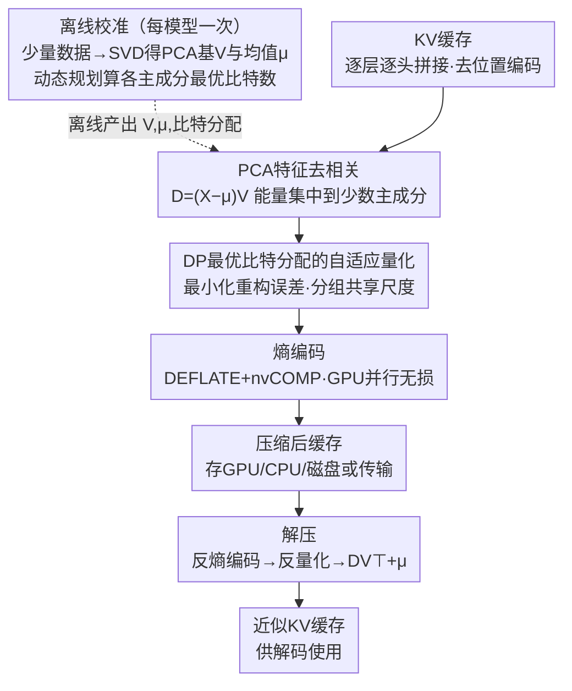

# KV Cache Transform Coding for Compact Storage in LLM Inference

**会议**: ICLR 2026  
**arXiv**: [2511.01815](https://arxiv.org/abs/2511.01815)  
**代码**: 无  
**领域**: 代码智能  
**关键词**: KV缓存压缩, 变换编码, PCA, 自适应量化, 熵编码

## 一句话总结

提出 KVTC，一种借鉴经典媒体压缩技术（PCA 特征去相关 + 自适应量化 + 熵编码）的 KV 缓存压缩方法，在 Llama 3、Mistral NeMo、R1-Qwen 2.5 等模型上实现最高 20× 压缩（特定场景下 40×+），优于 token 驱逐、量化、SVD 等基线方法。

## 研究背景与动机

大规模 LLM 推理服务面临一个核心瓶颈：**KV 缓存的内存管理**。

KV 缓存（Key-Value Cache）是 Transformer 推理的关键组件，存储了先前 token 的 Key 和 Value 向量以避免重复计算。在实际应用中，KV 缓存的管理面临多重挑战：

**内存占用大**：长上下文场景下（如 128K token），KV 缓存可消耗数十 GB 的 GPU 显存，成为推理的主要内存瓶颈

**缓存复用需求**：在对话场景和迭代代码编辑中，共享前缀（shared-prefix）的 prompt 很常见，缓存可以跨轮次复用以避免重复计算

**过时缓存处理**：不再活跃使用的缓存仍消耗宝贵的 GPU 显存，要么强制释放后重新计算，要么卸载到 CPU/磁盘

**卸载效率**：CPU/GPU 之间的数据传输带宽有限，未压缩的缓存传输开销大

现有的 KV 缓存优化方法各有局限：
- **Token 驱逐**（如 H2O、StreamingLLM）：丢弃不重要的 token，但信息丢失不可逆
- **量化方法**（如 KVQuant）：降低数值精度，但压缩比有限（通常 2-4×）
- **SVD 方法**：低秩近似 KV 矩阵，但在长序列上效果不稳定

作者的核心洞察是：**KV 缓存中存在大量统计冗余**，可以借鉴经典信号/媒体压缩中成熟的变换编码（transform coding）技术来高效压缩。这类似于 JPEG 对图像的压缩——先变换（DCT）再量化再编码。

## 方法详解

### 整体框架

KVTC 要解决的问题是：长上下文 / 多轮对话场景下，闲置但可复用的 KV 缓存占满 GPU 显存，逼得系统要么重算、要么卸载传输，怎么把它压到足够小又几乎不掉精度。作者的做法是把 JPEG 那套成熟的**变换编码**管线（变换去相关 → 量化 → 熵编码）整体搬到 KV 缓存上。

整条管线分三种工作模式：**离线校准**只在每个模型上跑一次——在少量代表性数据上对收集到的 KV 缓存做 SVD（即 PCA）算出投影基 $V$ 与均值 $\mu$，再用动态规划算出每个主成分该分几个比特，结果离线存好；**压缩**在推理的间隙（如解码后、prefill 与 decode 之间）发生，把缓存先 PCA 去相关、再按校准好的比特分配量化、最后熵编码打包存到 GPU/CPU/磁盘；**解压**反向走一遍还原出近似 KV 缓存供解码使用。全程不改模型任何权重，只在缓存的写入/读取路径上插入压缩解压。

### 关键设计

**1. PCA 特征去相关：用一套离线标定的基，把分散冗余压到少数主成分**

KV 缓存各特征维度之间高度相关，直接量化等于在一堆彼此重复的维度上各花一份比特。KVTC 对校准数据收集到的缓存做中心化后求 SVD $C-\mu = U\Sigma V^\top$（等价于 PCA），用正交基 $V$ 把缓存映射到去相关域 $D=(X-\mu)V$，解压时 $X \approx DV^\top+\mu$；能量随之集中到方差最大的少数主成分，与 JPEG 用 DCT 把图像能量搬到低频系数同构。和先前**每个 prompt 各算一次 SVD** 的低秩方法不同，KVTC 只在校准集上**算一次** $V$ 并对所有请求复用，靠三个观察让这套通用基站得住：SVD 要在足够大、有代表性的样本上算；排除最近 token 与 attention sink 能提高可压缩性；压缩前要去掉旋转位置编码（否则会破坏 key 的低秩结构）。具体做法是把 $l$ 层、$h$ 个头的缓存沿隐藏维拼成数据矩阵（key 与 value 各算各的基），而非逐头独立处理。

**2. DP 最优比特分配的自适应量化：在去相关域里做率失真最优的比特预算**

PCA 之后能量分布极不均，统一量化会在低方差成分上浪费比特、在高方差成分上丢信息。KVTC 给每个主成分坐标分配比特宽度 $q_i$，目标是在总比特预算下最小化重构误差 $\lVert DV^\top - D_{q_1,\dots,q_k}V^\top\rVert_F^2$；由于右乘正交矩阵保持 Frobenius 范数，该误差等于 $\lVert D - D_{q_1,\dots,q_k}\rVert_F^2$，于是**最优分配可以直接在去相关域里求解**。作者用一个动态规划算法求这个带约束的分配——它维护"用前 $i$ 个主成分、$b$ 比特预算下的最小重构误差"两张表，保证在约束下最优；并借鉴 Microscaling 把相邻主成分分组、组内共享 16-bit 的 shift 与 scale，DP 同时优化每组比特宽度和组大小（组大小限定在 $\{1,16,64,256,1024\}$）。学到的比特宽度随主成分序号单调递减，且**尾部大量主成分被分到 0 比特**——这正好提示可以提前砍掉这些维度，让校准更省、推理时压缩解压更快。

**3. 熵编码：用无损压缩榨干量化系数里残余的统计冗余**

量化后的符号分布并不均匀（尤其大量被分到低比特/零比特的尾部成分），还能再无损地压一道。KVTC 把量化值打包成字节数组后用 DEFLATE 算法熵编码，并借助 nvCOMP 让这一步直接在 GPU 上并行执行。这一层是无损的、增益依内容而定，是把整体压缩比从纯量化的水平进一步往上推、最终拉到 20× 的关键一环。

## 实验关键数据

### 主实验

在 Llama 3、Mistral NeMo、R1-Qwen 2.5 模型上进行评估。

| 基准测试 | 任务类型 | KVTC 压缩比 | 性能保持 |
|---------|---------|------------|---------|
| AIME25 | 数学推理 | 20× | 准确率保持 |
| GSM8K | 数学推理 | 20× | 准确率保持 |
| MATH-500 | 数学推理 | 20× | 准确率保持 |
| LiveCodeBench | 代码生成 | 20× | 准确率保持 |
| MMLU | 知识问答 | 20× | 准确率保持 |
| LongBench | 长上下文理解 | 20× | 准确率保持 |
| Qasper | 文档问答 | 20× | 准确率保持 |
| RULER | 长上下文评估 | 20× | 准确率保持 |
| 特定场景 | — | 40×+ | 依场景 |

### 与基线方法对比

| 方法 | 压缩比 | 性能保持 | 说明 |
|------|--------|---------|------|
| Token 驱逐 (H2O等) | 中等 | 信息不可逆丢失 | 丢弃 token |
| 量化 (KVQuant等) | 2-4× | 较好 | 降低精度 |
| SVD 方法 | 中等 | 不稳定 | 低秩近似 |
| **KVTC** | **20×（最高40×+）** | **准确率保持** | 变换编码 |

### 关键发现

- **压缩比优势明显**：20× 压缩比显著超过量化方法（2-4×）和 SVD 方法
- **质量保持**：在推理和长上下文准确性上，KVTC 在高压缩比下仍能保持原始模型性能
- **通用性**：在三种不同架构的模型和八种不同基准测试上一致优于基线
- **实际价值**：20× 压缩意味着原本占用 20GB 显存的 KV 缓存可压缩至 1GB，显著降低推理成本

## 亮点与洞察

- **跨领域知识迁移**：将经典信号处理/媒体压缩技术（变换编码）成功迁移到 LLM 推理领域，体现了经典理论在新场景中的生命力
- **20× 压缩的突破性**：相比先前 2-4× 的量化方法，KVTC 的压缩比提升了一个数量级
- **无需训练**：纯推理时方法，即插即用，不影响模型参数和训练流程
- **方法透明性**：每个组件（PCA、量化、熵编码）都有明确的信号处理理论支撑，可解释性强
- **实用场景**：特别适合对话和代码编辑等缓存复用场景，直接降低 LLM 服务成本

## 局限与展望

- **压缩/解压开销**：变换编码的编解码过程引入额外计算，需要在压缩比和延迟之间权衡
- **校准数据敏感性**：PCA 基的质量依赖校准数据的代表性，不同任务域可能需要不同校准
- **有损压缩**：虽然实验中性能保持良好，但在极高压缩比（40×+）下的质量退化需要关注
- **动态场景**：对于 KV 缓存频繁更新的场景（如流式推理），压缩/解压的频率和开销需要优化
- **与其他优化的兼容性**：未讨论与 Flash Attention、PagedAttention 等推理优化技术的兼容性
- **硬件适配**：熵编码等操作在 GPU 上的效率可能不如在 CPU 上，需要考虑硬件适配

## 相关工作与启发

- **H2O** (Zhang et al.)：Heavy Hitter Oracle，基于注意力分数驱逐不重要 token
- **StreamingLLM** (Xiao et al.)：保留 attention sink token + 最近窗口的驱逐策略
- **KVQuant** (Hooper et al.)：专门针对 KV 缓存的量化方法
- **JPEG/MPEG**：经典媒体压缩中的变换编码范式（DCT + 量化 + 熵编码），KVTC 的灵感来源
- **PagedAttention** (Kwon et al., vLLM)：KV 缓存的分页管理，与 KVTC 的压缩互补

**启发**：经典信号处理理论在 LLM 推理优化中仍有巨大应用空间。KVTC 的成功说明 KV 缓存中的冗余远超想象——20× 压缩几乎不影响性能。这暗示 Transformer 的注意力机制在信息利用上可能存在大量浪费，也为更激进的推理压缩方法（如 learned transform）打开了空间。

## 评分

- 新颖性: ⭐⭐⭐⭐ — 变换编码本身不新，但在 KV 缓存上的适配和 20× 压缩比是显著贡献
- 实验充分度: ⭐⭐⭐⭐⭐ — 3 模型 × 8 基准测试，与多种基线全面对比
- 写作质量: ⭐⭐⭐⭐ — 方法描述清晰，与经典压缩理论的联系阐述到位
- 价值: ⭐⭐⭐⭐⭐ — 直接解决 LLM 推理的核心瓶颈，实用价值极高

<!-- RELATED:START -->

## 相关论文

- [\[ACL 2026\] River-LLM: Large Language Model Seamless Exit Based on KV Share](../../ACL2026/code_intelligence/river-llm_large_language_model_seamless_exit_based_on_kv_share.md)
- [\[ICLR 2026\] Inference-Time Safety for Code LLMs via Retrieval-Augmented Revision](inference-time_safety_for_code_llms_via_retrieval-augmented_revision.md)
- [\[ICML 2026\] CentaurEval: Benchmarking Human-in-the-Loop Value in Agentic Coding](../../ICML2026/code_intelligence/centaureval_benchmarking_human-in-the-loop_value_in_agentic_coding.md)
- [\[ICML 2026\] NEMO: Execution-Aware Optimization Modeling via Autonomous Coding Agents](../../ICML2026/code_intelligence/nemo_execution-aware_optimization_modeling_via_autonomous_coding_agents.md)
- [\[ACL 2026\] CodeDistiller: Automatically Generating Code Libraries for Scientific Coding Agents](../../ACL2026/code_intelligence/codedistiller_automatically_generating_code_libraries_for_scientific_coding_agen.md)

<!-- RELATED:END -->
