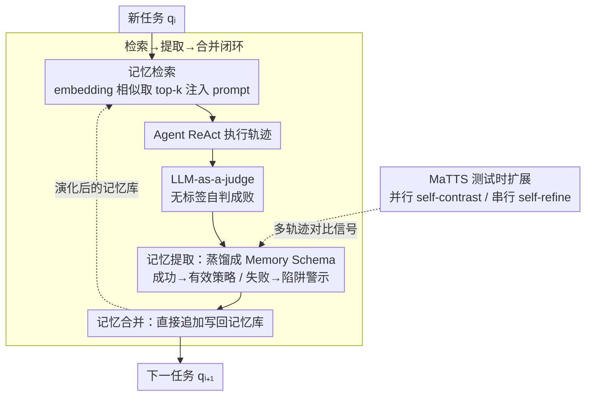

# ReasoningBank: Scaling Agent Self-Evolving with Reasoning Memory

**会议**: ICLR 2026  
**arXiv**: [2509.25140](https://arxiv.org/abs/2509.25140)  
**代码**: [google-research/reasoning-bank](https://github.com/google-research/reasoning-bank)  
**领域**: 代码智能  
**关键词**: Agent记忆, 推理策略, 测试时扩展, 自进化, 经验学习

## 一句话总结
提出 ReasoningBank 记忆框架，从 Agent 自我判断的成功和失败经验中蒸馏可泛化的推理策略存入记忆库，并提出 memory-aware test-time scaling (MaTTS) 建立记忆与测试时扩展的协同效应，在 WebArena、Mind2Web 和 SWE-Bench 上一致超越基线（最高 34.2% 相对提升），同时减少 16% 交互步数。

## 研究背景与动机
随着 LLM Agent 在持久运行的现实角色中日益普及，它们自然会遇到连续的任务流。然而一个关键限制是它们无法从累积的交互历史中学习——每次面对新任务都从零开始，被迫丢弃有价值的洞察并重复过去的错误。

现有 Agent 记忆方法有两大缺陷：

**只存储原始轨迹或成功套路**：Synapse 存储原始轨迹作为上下文记忆，AWM 从轨迹中抽取工作流程（workflow），但都无法蒸馏更高层次的可迁移推理模式

**忽视失败经验的价值**：过度强调成功经验，导致 Agent 无法从自身的失败中学到教训

核心 idea：将成功和失败经验都蒸馏为可泛化的推理策略（而非具体操作步骤），存入结构化的记忆库；结合 test-time scaling 生成丰富的对比信号，进一步提升记忆质量。

## 方法详解

### 整体框架
ReasoningBank 要解决的是 LLM Agent「每接一个新任务都从零开始、把过去的经验和教训全丢掉」的问题。它是一个**无需训练的闭环记忆系统**：Agent 拿到新任务时先从记忆库 embedding 检索出最相关的几条经验、注入 system prompt 指导决策；按 ReAct 风格跑完一条轨迹后，由 LLM-as-a-judge 在没有真实标签的情况下自判这条轨迹是成功还是失败，再把其中可复用的推理模式蒸馏成结构化记忆、直接追加写回库中。整个回路随任务流累积自我演化，越用越聪明。在这条闭环之上，ReasoningBank 进一步叠加测试时扩展（MaTTS）：让「同一任务多采几条轨迹」产生的对比信号反过来喂养出更可靠的记忆，把记忆质量本身变成一个新的 scaling 维度。

### 关键设计

**1. Memory Schema：把轨迹蒸馏成可迁移的推理策略而非原始操作**

闭环里的「记忆」到底长什么样，直接决定了它换个任务还能不能用。以往方法要么存原始轨迹（Synapse）、要么存具体工作流（AWM），粒度都太贴近某一次执行，场景一变就失效。ReasoningBank 把每条记忆设计成 Title / Description / Content 三段结构：Title 用一句话标识核心策略或推理模式，Description 给出概要，Content 承载蒸馏后的推理步骤、决策依据与操作洞察。这种结构刻意卡在两个极端之间——比原始轨迹更抽象（提炼出跨任务的共性原则），又比纯口号更具体（保留可复用的推理步骤），因而既人类可读、又能直接拼进 prompt 供模型调用。

**2. 检索→提取→合并的三步闭环：让成功和失败都变成可用经验**

这是系统运转的主干，对应整体框架里那条回路。**检索**阶段用基于 embedding 的相似度搜索从库中取出 top-$k$ 条相关记忆（默认 $k{=}1$），注入 Agent 的 system prompt 指导当前决策。**提取**阶段在任务结束后先用 LLM-as-a-judge 在无真实标签下判定轨迹成功还是失败，再据此走不同的提取策略：成功轨迹沉淀「已验证有效的策略」，失败轨迹则贡献「反事实信号与陷阱警示」，每条轨迹会抽取多个记忆项。**合并**阶段有意只做最简单的直接追加（simple addition），不做去重或聚类——目的是把「记忆内容本身的增益」和「合并策略的工程技巧」隔离开，证明提升来自经验质量而非花哨的工程。正是「显式利用失败」这一步让 ReasoningBank 学到「为什么会错」，消融显示它恰好贡献了 3 个多百分点的额外提升（46.5→49.7 SR）。

**3. MaTTS：让测试时扩展与记忆形成正反馈**

普通做法是把 test-time scaling 与记忆简单拼接——独立跑出多条轨迹再各自提取记忆，白白浪费了轨迹之间的关联信息。MaTTS 改为主动利用这种冗余探索的内在对比信号来策划更优记忆，给出两种互补模式：**parallel scaling** 对同一查询并行生成多条轨迹，通过 self-contrast 比较它们的成败、识别一致出现的推理模式、过滤掉只在个别轨迹里「蒙对」的虚假解；**sequential scaling** 则在单条轨迹内做迭代式 self-refinement，把中间的尝试、纠正和顿悟也捕获为记忆信号。两者共同的逻辑是：好记忆把扩展引向更有前景的路径，扩展带来的丰富对比又锻造出更强的记忆，于是「记忆质量」被提升为一个新的 scaling 维度——这也解释了为什么实验里只有 ReasoningBank 能从扩展中持续受益，而弱记忆在扩展下反而退化。

整套方法不涉及任何参数更新，全部基于 in-context learning + embedding 检索 + LLM judge，backbone 覆盖 Gemini-2.5-flash/pro 与 Claude-3.7-sonnet，在 BrowserGym（web browsing）和 Bash-only（SWE）环境下均以同一套流程运行。

## 实验关键数据

### 主实验 — WebArena

| 方法 | Shopping SR | Admin SR | Gitlab SR | Reddit SR | Overall SR | Steps |
|------|-----------|---------|----------|----------|------------|-------|
| No Memory (Gemini-2.5-flash) | 39.0 | 44.5 | 33.9 | 55.7 | 40.5 | 9.7 |
| Synapse | 40.6 | 45.1 | 35.6 | 59.4 | 42.1 | 9.2 |
| AWM | 44.4 | 46.7 | 37.2 | 62.3 | 44.1 | 9.0 |
| **ReasoningBank** | **49.7** | **51.1** | **40.6** | **67.0** | **48.8** | **8.3** |
| No Memory (Gemini-2.5-pro) | 45.5 | 51.1 | 35.0 | 71.7 | 46.7 | 8.8 |
| **ReasoningBank** (pro) | **51.9** | **56.6** | **44.4** | **80.2** | **53.9** | **7.4** |

### SWE-Bench-Verified

| 方法 | Resolve Rate | Steps |
|------|-------------|-------|
| No Memory (Gemini-2.5-flash) | 34.2 | 30.3 |
| ReasoningBank | **38.8** | **27.5** |
| No Memory (Gemini-2.5-pro) | 54.0 | 21.1 |
| ReasoningBank (pro) | **57.4** | **19.8** |

### MaTTS 扩展实验 (WebArena-Shopping, k=scaling factor)

| 配置 | k=1 | k=3 | k=5 |
|------|-----|-----|-----|
| MaTTS w/o memory (parallel) | 39.0 | 40.6 | 42.2 |
| MaTTS w/o aggregation (vanilla TTS) | 49.7 | 52.4 | 52.4 |
| **MaTTS (parallel)** | **49.7** | 53.5 | **55.1** |
| **MaTTS (sequential)** | 49.7 | **54.5** | 54.5 |

### 消融实验

| 配置 | 关键指标 | 说明 |
|------|---------|------|
| 仅成功轨迹 | ReasoningBank: 46.5 SR | 仅用成功经验已优于基线 |
| 成功+失败轨迹 | ReasoningBank: 49.7 SR | 失败经验带来额外 3.2 个百分点提升 |
| Synapse+失败轨迹 | 41.7 SR | Synapse 无法有效利用失败信号 |
| AWM+失败轨迹 | 42.2 SR (反而降低) | AWM 处理失败导致性能下降 |
| 检索数量 k=1/2/3/4 | 49.7/46.0/45.5/44.4 | k=1 最优，过多记忆引入噪声 |

### 关键发现
- ReasoningBank 在 **所有数据集、所有 backbone** 上一致超越基线
- 效率提升显著：成功案例平均减少 2.1 步（26.9% 相对减少），说明记忆帮助 Agent 更快找到正确路径
- 跨领域泛化（Multi subset, Mind2Web cross-domain）优势尤为突出
- MaTTS 的协同效应：只有 ReasoningBank 能从 scaling 中受益（Pass@1 从 49.7 升至 50.8），弱记忆在 scaling 下反而退化

## 亮点与洞察
- **失败经验的价值被首次充分挖掘**: 不同于以往只利用成功轨迹的方法，ReasoningBank 证明失败中的反事实信号是更强大的泛化来源
- **涌现行为 (Emergent Behaviors)**: 记忆项会自然演化——从低级执行策略 → 自适应检查 → 组合式推理，类似 RL 中的涌现学习动态
- **记忆驱动的经验扩展作为新的 scaling 维度**: 传统 scaling 只增加计算量，MaTTS 将记忆质量和 scaling 联动，开辟了 Agent 能力提升的新途径
- **设计上的简洁性**: 整个系统不需要训练，仅靠 in-context learning + embedding retrieval + LLM judge，极易部署

## 局限与展望
- 依赖 LLM-as-a-judge 提供正确性信号，judge 本身可能出错导致记忆污染
- 记忆合并策略过于简单（直接追加），大规模部署时记忆池膨胀可能降低检索效率
- 检索仅用 embedding 相似度，缺乏推理感知的检索机制
- 未探索记忆遗忘/更新策略（过时的记忆可能干扰）
- 仅在 web browsing 和 SWE 上验证，其他 Agent 场景（如具身环境）有待探索

## 相关工作与启发
- **vs Synapse**: 存储原始轨迹作为 exemplar，记忆粒度太粗、不可迁移
- **vs AWM (Agent Workflow Memory)**: 从成功轨迹提取 workflow，但 (1) 只用成功经验 (2) 跨域迁移差（Multi subset 退化到 3.4 SR）
- **vs ExpeL**: 也利用成功/失败，但记忆以 tips 形式存储，不如 ReasoningBank 的结构化推理策略
- **启发**: Agent 的记忆系统应该像人类一样——不仅记住"怎么做成功的"，更要记住"为什么失败了"以及"抽象的决策原则"

## 评分
- 新颖性: ⭐⭐⭐⭐
- 实验充分度: ⭐⭐⭐⭐⭐
- 写作质量: ⭐⭐⭐⭐⭐
- 价值: ⭐⭐⭐⭐⭐

<!-- RELATED:START -->

## 相关论文

- [\[ICLR 2026\] Improving Code Localization with Repository Memory](improving_code_localization_with_repository_memory.md)
- [\[NeurIPS 2025\] A Self-Improving Coding Agent](../../NeurIPS2025/code_intelligence/a_selfimproving_coding_agent.md)
- [\[ACL 2026\] MARS2: Scaling Multi-Agent Tree Search via Reinforcement Learning for Code Generation](../../ACL2026/code_intelligence/mars2_scaling_multi-agent_tree_search_via_reinforcement_learning_for_code_genera.md)
- [\[ICLR 2026\] The Limits of Long-Context Reasoning in Automated Bug Fixing](the_limits_of_long-context_reasoning_in_automated_bug_fixing.md)
- [\[ICLR 2026\] CARD: Towards Conditional Design of Multi-agent Topological Structures](card_towards_conditional_design_of_multi-agent_topological_structures.md)

<!-- RELATED:END -->
