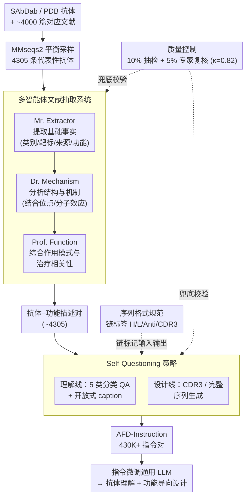

# AFD-INSTRUCTION: A Comprehensive Antibody Instruction Dataset with Functional Annotations for LLM-Based Understanding and Design

**会议**: ICLR 2026  
**arXiv**: [2602.04916](https://arxiv.org/abs/2602.04916)  
**代码**: 待公开  
**领域**: 生物信息 / LLM指令微调  
**关键词**: 抗体语言模型, 指令微调数据集, 序列-功能对齐, 抗体设计, 多智能体数据构建  

## 一句话总结
构建了首个大规模抗体功能注释指令数据集AFD-Instruction（430K+条目），通过多智能体文献抽取pipeline对齐抗体序列与自然语言功能描述，用于指令微调通用LLM使其掌握抗体理解和功能导向设计能力，在5类分类任务上平均准确率提升20+点。

## 研究背景与动机

**领域现状**：LLM已被广泛应用于蛋白质理解（如Mol-Instructions、InstructProtein），但抗体作为一类特殊且极具治疗价值的蛋白质，缺乏专门的序列-功能对齐数据集。

**现有痛点**：(a) 现有蛋白语言模型（PLM）用无监督方式在原始序列上训练，缺少功能信号；(b) OAS数据库虽有百万级抗体序列但绝大多数无功能注释；(c) 通用LLM无法理解抗体序列，PLM无法理解自然语言——两者之间存在模态鸿沟。

**核心矛盾**：抗体的核心价值在于其功能性（靶标结合、中和活性等），但可用的序列-功能配对数据极度稀缺。

**本文目标**：构建首个将抗体序列与自然语言功能描述系统对齐的大规模指令数据集，使LLM既能从序列推断功能，又能根据功能约束生成序列。

**切入角度**：从~4000篇文献中通过多智能体抽取pipeline提取抗体-功能对，再用self-questioning策略扩展为instructio-response对。

**核心 idea**：用文献级多智能体系统+自问策略，从已发表抗体研究中大规模挖掘序列-功能配对，构建覆盖理解+设计的指令数据集。

## 方法详解

### 整体框架
这篇论文要解决的是"抗体序列与自然语言功能描述无法对齐"的数据空白：通用 LLM 看不懂氨基酸序列、蛋白语言模型又听不懂自然语言。AFD-Instruction 把"从已发表文献里挖功能信号、再放大成指令"做成一条流水线，最终产出 430K+ 条覆盖"理解 + 设计"双向能力的指令对，用来微调通用 LLM。

整条 pipeline 从 SAbDab/PDB 收集抗体出发，先用 MMseqs2 按序列距离做平衡采样得到 4305 条代表性抗体；这批抗体对应的文献交给一个**多智能体抽取系统**（Mr. Extractor → Dr. Mechanism → Prof. Function 三角色串行），抠出抗体–功能描述对；再由 **Self-Questioning 策略**围绕这些配对从多视角自动派生问答，分别长出"抗体理解"（5 类分类 QA + 开放式 caption）和"抗体设计"（CDR3 / 完整序列生成）两条任务线。贯穿全程的还有两件支撑性设计：**序列格式规范**（用链标签让文本 LLM 看懂序列结构）和**质量控制**（人工抽检 + 专家复核给自动 pipeline 兜底）。

### 关键设计

**1. 多智能体文献抽取系统：把散落在文献里的功能信息可靠地抠出来**

抗体的功能信号不在序列里，而是分散在约 4000 篇论文的正文中，单个 agent 一遍读下来容易漏信息或编造细节。AFD 把抽取拆成三个有明确分工的角色串行处理同一篇文献：Mr. Extractor 先扫一遍文本，提取最基础的事实信息（抗体类别、靶标、来源、功能）；Dr. Mechanism 接手分析结构与机制层面的细节（结合位点、分子效应）；Prof. Function 最后做高层综合，给出作用模式、治疗相关性和独特之处。这条"事实提取 → 机制分析 → 功能综合"的流水线，把一个容易出错的开放式抽取任务切成三个边界清晰、各管一层的子任务，从而在保证信息层次完整的同时压低单 agent 的幻觉风险。

**2. Self-Questioning 策略：把几千条原始配对放大成几十万条指令**

文献抽取直接得到的抗体-描述对只有约 4305 条，远不够指令微调。Self-Questioning 围绕同一批配对从多个视角自动派生问答：理解方向上生成 5 类分类问题（抗体类别、疾病关联、结合位点、作用机制、功能）以及自由文本的 caption 任务；设计方向上则把功能描述加上用 `<Anti></Anti>` 标记的抗原序列作为输入，要求模型输出完整抗体序列或 CDR3 序列（用 `<CDR3></CDR3>` 标记）。整个过程用 seed prompt 引导 LLM 生成，再经自动一致性检查和去重，最终把几千条种子配对扩展到 430K+ 条覆盖"理解 + 设计"双向能力的指令对。

**3. 序列格式规范：用链标签让文本 LLM 看懂蛋白序列的结构**

抗体序列本身只是一串氨基酸字母，文本 LLM 无法自行分辨哪段是重链、哪段是抗原。AFD 为序列引入显式的链标签——重链 `<H></H>`、轻链 `<L></L>`、抗原 `<Anti></Anti>`、CDR3 `<CDR3></CDR3>`，把蛋白质的结构组织以 LLM 熟悉的标记语言形式喂进去，让模型在理解和生成时都能对齐到具体的链与区域。

**4. 质量控制：用人工抽检和专家复核给自动 pipeline 兜底**

由于核心数据来自 LLM 自动抽取和生成，AFD 用多道人工环节控制噪声：抽取结果经自动完整性检查后再做 10% 随机抽样人工验证；生成的指令对取 5% 子集交由两位独立专家审查，标注一致性达到 Cohen's κ = 0.82；遇到歧义案例则讨论一致后回头更新提取规则，让后续抽取整体收敛得更干净。

## 实验关键数据

### 主实验——分类任务
指令微调LLaMA-8B和Qwen2-7B后在5类抗体理解任务上的表现：

| 模型 | Class ACC | Disease ACC | Binding ACC | Mechanism ACC | Function ACC |
|------|----------|------------|------------|--------------|-------------|
| GPT-4o | 82.02 | 72.15 | 50.31 | 63.99 | 56.17 |
| Claude-3 | 95.40 | 70.89 | 42.65 | 43.81 | 47.84 |
| DeepSeek-V3 (671B) | 93.99 | 74.45 | 47.88 | 59.20 | 49.39 |
| InstructProtein | 52.44 | 74.66 | 47.91 | 58.36 | 48.51 |
| **QwenAB (7B, Ours)** | **98.86** | **87.83** | **87.81** | **93.60** | **85.01** |
| **LLaMAB (8B, Ours)** | **98.48** | 85.11 | 87.01 | 92.91 | 83.81 |

QwenAB平均ACC比最强基线高20.21点。注意7B微调模型全面碾压671B通用模型和闭源商业模型。

### 抗体设计实验
指令微调模型在CDR3设计和完整抗体生成上均生成了具有合理结构多样性和功能匹配度的序列（详见caption任务中BLEU/ROUGE指标的显著提升：QwenAB在Binding caption上BLEU-4=17.25 vs GPT-4o=6.74）。

### 关键发现
- 即使是最强的闭源模型（GPT-4o, Claude-3），在抗体特异性任务（如Binding、Mechanism）上也明显弱于7B微调模型——说明抗体知识无法通过通用预训练充分获取
- 现有蛋白质领域模型（Galactica、Mol-Instructions等）在抗体任务上表现也不佳，说明通用蛋白质知识不等于抗体知识
- GemmaAB-9B和DeepSeekAB-MoE-16B也表现优异，说明AFD-Instruction的效果跨模型架构可迁移

## 亮点与洞察
- **首个抗体序列-功能指令数据集**：填补了重要空白，430K+条目的规模为后续研究提供了基础设施级资源
- **多智能体文献挖掘**的pipeline可迁移到其他生物学领域——只要有文献和数据库配对关系，都可以用类似方法构建领域指令数据集
- **7B模型碾压671B**的结果再次证明：领域数据的价值远超模型规模。这对生物医学AI的实际部署有重要启示——无需最大模型，只需最好的数据

## 局限与展望
- 数据来源仅限SAbDab/PDB中有文献对应的抗体，覆盖范围受限于已发表文献
- 多智能体系统的提取准确率依赖LLM能力，可能引入事实错误
- 仅评估了文本LLM的指令微调，未探索与蛋白质结构模型（如ESMFold、AlphaFold）的融合
- 抗体设计任务缺乏湿实验验证——生成的序列是否真正具有预期功能未知
- CDR3设计仅覆盖CDR-H3，其他CDR区域和框架区的设计未涉及

## 相关工作与启发
- **vs Mol-Instructions**: 通用蛋白质指令数据集，不含抗体特异性注释；AFD在抗体任务上远超之
- **vs InstructProtein**: 用知识图谱对齐蛋白-文本，但同样缺乏抗体功能描述
- **vs ProtLLM**: 用交错蛋白-文本预训练，在抗体分类上仍不如AFD微调的通用LLM

## 评分
- 新颖性: ⭐⭐⭐⭐ 数据集构建方法（多智能体+self-questioning）有创意，但核心贡献更偏数据资源
- 实验充分度: ⭐⭐⭐⭐⭐ 对比17+基线（含5个闭源商业模型），跨5种模型架构验证，非常全面
- 写作质量: ⭐⭐⭐⭐ 结构清晰，数据构建过程描述详细
- 价值: ⭐⭐⭐⭐ 对抗体AI领域有基础设施级贡献，但缺乏湿实验验证限制了实际影响

<!-- RELATED:START -->

## 相关论文

- [\[ACL 2026\] BioTool: A Comprehensive Tool-Calling Dataset for Enhancing Biomedical Capabilities of Large Language Models](../../ACL2026/computational_biology/biotool_a_comprehensive_tool-calling_dataset_for_enhancing_biomedical_capabiliti.md)
- [\[ICML 2025\] Training Flexible Models of Genetic Variant Effects from Functional Annotations using Accelerated Linear Algebra](../../ICML2025/computational_biology/training_flexible_models_of_genetic_variant_effects_from_functional_annotations_.md)
- [\[NeurIPS 2025\] FGBench: A Dataset and Benchmark for Molecular Property Reasoning at Functional Group-Level in Large Language Models](../../NeurIPS2025/computational_biology/fgbench_a_dataset_and_benchmark_for_molecular_property_reasoning_at_functional_g.md)
- [\[ICLR 2026\] Antibody: Strengthening Defense Against Harmful Fine-Tuning for Large Language Models via Attenuating Harmful Gradient Influence](antibody_strengthening_defense_against_harmful_fine-tuning_for_large_language_mo.md)
- [\[ICML 2025\] ADIOS: Antibody Development via Opponent Shaping](../../ICML2025/computational_biology/adios_antibody_development_via_opponent_shaping.md)

<!-- RELATED:END -->
