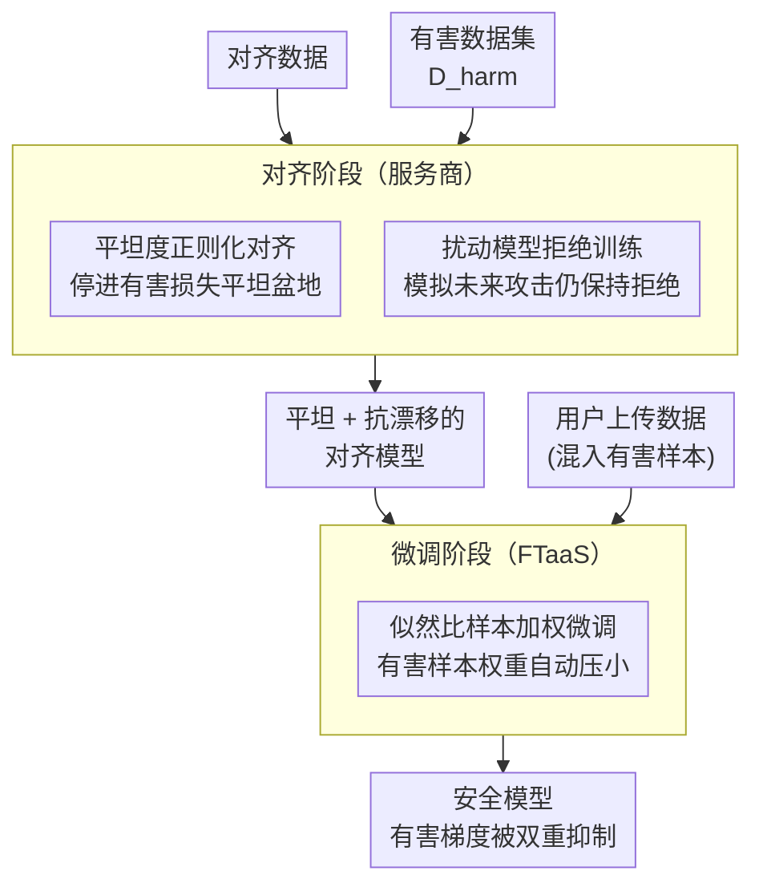

# Antibody: Strengthening Defense Against Harmful Fine-Tuning for Large Language Models via Attenuating Harmful Gradient Influence

**会议**: ICLR 2026  
**arXiv**: [2603.00498](https://arxiv.org/abs/2603.00498)  
**代码**: 待公开  
**领域**: 计算生物
**关键词**: 有害微调攻击, 安全对齐, 损失平坦度, 样本加权, FTaaS安全  

## 一句话总结
提出Antibody防御框架：在对齐阶段通过平坦度正则化使模型处于有害损失的平坦区域（梯度小→难被攻击），在微调阶段用基于模型安全知识的样本加权方案（对比目标完成 vs 拒绝的似然比）抑制有害样本的学习，平均Harmful Score从15.29%降至7.04%。

## 研究背景与动机

**领域现状**：FTaaS（如OpenAI/Mistral的微调服务）允许用户上传数据微调LLM，但用户提交的数据可能包含有害样本（有意或无意），导致安全对齐被破坏。

**现有痛点**：(a) 对齐阶段防御（如Vaccine/Booster）是静态的，无法适应不同的攻击配置（高步数、大学习率）；(b) 微调阶段防御（如Lisa/SafeInstr）要么保护不足要么损害任务性能；(c) 大多数方法在安全性和任务性能之间存在严重tradeoff。

**核心矛盾**：标准SFT不区分良性和有害样本——所有梯度都被聚合更新，即使少量有害样本的梯度也能毒化模型。

**本文目标**：设计在对齐和微调两个阶段协同工作的防御，既能彻底抑制有害梯度的影响，又不损害良性任务学习。

**切入角度**：从梯度影响的角度出发——如果有害样本的梯度在对齐后本来就很小（平坦区域），且在微调时被进一步降权，就能有效消除其影响。

**核心 idea**：对齐阶段让有害loss平坦（梯度小）+微调阶段用似然比加权（有害样本权重低）→有害梯度被双重抑制。

## 方法详解

### 整体框架
Antibody 要守住的场景是 FTaaS：模型先在服务商手里做安全对齐，再开放给用户上传数据微调，而用户数据里可能混着有害样本。它的核心思路是在**对齐**和**微调**两个阶段对"有害梯度"做双重抑制。对齐阶段优化 $\mathcal{L}_{\text{align}}(\theta) + \lambda_t \mathcal{L}_{\text{sharp}}(\theta) + \lambda_{\text{refusal}} \mathcal{L}_{\text{refusal}}(\theta_{\text{pert}})$，一边对齐、一边把模型推进有害损失的平坦盆地，并额外训练让"被未来攻击扰动过"的模型仍坚持拒绝，得到一个既平坦又抗漂移的对齐模型；交付到微调阶段后，用样本加权更新 $\theta_{t+1} \leftarrow \theta_t - \eta \sum_i w_{\theta_t}(x_i,y_i) \nabla \ell_{\theta_t}(x_i,y_i)$，让有害样本自动拿到小权重，梯度被进一步压低。两阶段串起来，有害样本既"本来梯度就小"又"被降权"，而良性任务学习不受影响。

### 关键设计

**1. 平坦度正则化对齐：让对齐后的有害损失天生就平坦**

标准安全对齐只压低当前的有害损失，却不管它周围的地形——一旦地形陡峭，攻击者用几步大学习率微调就能把有害损失迅速拉低，对齐随之崩溃。Antibody 在对齐阶段直接优化这块地形的"平坦度"，把 sharpness 定义为有害损失在 $\rho$ 邻域内能被压下去多少：$\mathcal{L}_{\text{sharp}}(\theta) = \mathcal{L}_{\text{harm}}(\theta) - \min_{\phi \in \mathcal{B}_\rho(\theta)} \mathcal{L}_{\text{harm}}(\phi)$。最小化它，就等于强迫模型停在有害损失的平坦盆地里。这一项和对齐目标一起构成双目标优化，论文用 Theorem 4.1 的 KKT 条件解出更新方向 $\delta_t^* = \nabla \mathcal{L}_{\text{align}} + \lambda_t \nabla \mathcal{L}_{\text{sharp}}$，其中权重 $\lambda_t$ 随训练自适应调整。落到平坦区域后，θ 附近的任何扰动（也就是后续微调）都没法显著降低有害损失，于是微调阶段有害样本能产生的梯度本身就很小——这是第一重抑制。

**2. 似然比样本加权微调：让模型自己的安全知识当有害样本探测器**

标准 SFT 把一个 batch 里所有样本的梯度无差别地聚合更新，哪怕只混进少量有害样本，它们的梯度也会照样毒化模型。Antibody 在微调阶段给每个样本动态赋权来卡住这条路：对样本 $(x_i, y_i)$ 计算它"完成目标"相对"被拒绝"的对数似然比 $r_\theta(x_i,y_i) = \log \frac{\pi_\theta(y_i|x_i)}{\pi_\theta(y_r|x_i)}$，再用 softmax 归一化成权重 $w_{\theta_t}(x_i,y_i)$，参数更新写成 $\theta_{t+1} \leftarrow \theta_t - \eta \sum_i w_{\theta_t}(x_i,y_i) \nabla \ell_{\theta_t}(x_i,y_i)$。妙处在于：一个对齐良好的模型面对有害 prompt 时本来就更倾向输出拒绝 $y_r$，于是有害样本的似然比偏低、softmax 后权重偏小，它们的梯度被自动压下去。这相当于直接复用对齐阶段已经嵌进模型里的安全知识当隐式探测器，既不需要额外训练分类器，也不需要事先标注哪些样本有害——这是第二重抑制。

**3. 扰动模型拒绝训练：堵住权重机制被慢慢腐蚀的后门**

第二重抑制有个隐患：微调若持续进行，参数会逐渐漂移，有害样本可能慢慢把自己的似然比顶上去，权重机制随之失效。Antibody 在对齐阶段就提前模拟这种漂移——沿有害损失的归一化梯度走一步得到扰动参数 $\theta_{\text{pert}} = \theta - \rho \frac{\nabla \mathcal{L}_{\text{harm}}}{\|\nabla \mathcal{L}_{\text{harm}}\|}$，然后额外训练这个被"未来攻击"扰动过的模型仍要对有害 prompt 给出高拒绝概率，对应正则项 $\mathcal{L}_{\text{refusal}}(\theta_{\text{pert}})$。这样即便微调把参数推离原点，拒绝倾向、进而低似然比权重也能维持住，前两重抑制不会被时间磨平。

这三重设计为什么能既挡住有害样本又不伤任务学习，论文用 eNTK 分析给了严谨解释：Proposition 4.2 和 4.3 把 mini-batch 加权更新带来的损失变化拆解开，证明当 batch 的有效梯度主要由良性样本贡献时，有害测试样本的损失保持不变（安全得以保持），良性测试样本的损失下降（任务正常学习）——加权更新天然就在两类样本上做了选择性作用。

## 实验关键数据

### 主实验（Llama-2-7B, GSM8K+20%有害样本）

| 方法 | HS↓ | FA↑ | 说明 |
|------|-----|-----|------|
| SFT | 23.94 | 10.90 | 无防御 |
| Vaccine | 23.60 | 11.70 | 对齐阶段 |
| Lisa | 5.86 | 9.23 | 微调阶段，任务性能差 |
| Booster | 9.06 | 16.27 | 对齐阶段 |
| **Antibody** | **1.24** | **15.07** | 两阶段协同 |

### 跨数据集平均

| 方法 | 平均HS↓ | 平均FA↑ |
|------|---------|--------|
| Lisa | 15.29 | 60.97 |
| Booster | 19.04 | 65.20 |
| **Antibody** | **7.04** | **竞争性** |

Antibody的HS比次优方法Lisa低8+个百分点。

### 消融实验
- 去掉平坦度正则 → HS升高（有害梯度在微调时不够小）
- 去掉样本加权 → HS升高（有害样本贡献未被抑制）
- 去掉扰动拒绝训练 → 长时间微调后权重机制退化

### 关键发现
- 平坦度正则和样本加权的组合是关键——两者单独使用效果均不如组合
- 似然比权重（Figure 2）在训练过程中自然地将有害和良性样本分离——无需显式标注
- Antibody在大数据量（Figure 1）时尤其有效——其他方法随数据增多安全性恶化，Antibody保持低HS

## 亮点与洞察
- **双重梯度抑制**的设计逻辑极其清晰：第一层（flat region）使梯度天然小 → 第二层（加权）进一步降权 → 有害影响被彻底抑制
- **利用模型自身的安全知识做隐式有害检测**（似然比）非常巧妙——不需要额外的分类器或标注，也不需要知道哪些样本有害
- eNTK的理论分析（Proposition 4.2-4.3）提供了mini-batch加权更新如何选择性影响不同样本的严谨解释
- 与Booster的联系（$\lambda_t$常数时退化为Booster）说明了方法的泛化性

## 局限与展望
- 需要对齐阶段访问有害数据集 $\mathcal{D}_{\text{harm}}$——如果有害类型变化可能需要重新对齐
- LoRA微调场景下验证，全参微调的效果未知
- 拒绝模板 $y_r$ 的选择可能影响似然比计算——不同拒绝风格可能导致不同效果
- 仅测试了20%有害比例，更高比例（50%+）下的鲁棒性待验证
- 计算开销比标准SFT高（需要额外计算似然比和内环扰动步骤）

## 相关工作与启发
- **vs Vaccine**: Vaccine用嵌入扰动增强鲁棒性，Antibody用损失平坦度——后者有更清晰的理论支撑
- **vs Booster**: Booster是Antibody的特例（$\lambda_t$固定）；Antibody的自适应$\lambda_t$和额外的加权机制提供了显著的额外提升
- **vs Lisa**: Lisa交替用安全数据和任务数据，但无法识别批次内的有害样本；Antibody的权重方案做到了sample-wise区分

## 评分
- 新颖性: ⭐⭐⭐⭐ 平坦度正则+似然比加权的组合很有工程智慧，但单项技术较标准
- 实验充分度: ⭐⭐⭐⭐⭐ 4个下游数据集×3个模型+消融+理论分析，非常全面
- 写作质量: ⭐⭐⭐⭐⭐ 理论推导严谨，Figure 2的权重分布可视化极其直观
- 价值: ⭐⭐⭐⭐⭐ 对FTaaS安全有直接的实践意义，HS从15%→7%是显著进步

<!-- RELATED:START -->

## 相关论文

- [\[ICLR 2026\] Fine-Tuning Diffusion Models via Intermediate Distribution Shaping](fine-tuning_diffusion_models_via_intermediate_distribution_shaping.md)
- [\[ICLR 2026\] Thompson Sampling via Fine-Tuning of LLMs](thompson_sampling_via_fine-tuning_of_llms.md)
- [\[ICLR 2026\] Tracing Pharmacological Knowledge in Large Language Models](tracing_pharmacological_knowledge_in_large_language_models.md)
- [\[ICML 2026\] Constrained Flow Optimization via Sequential Fine-Tuning for Molecular Design](../../ICML2026/computational_biology/constrained_flow_optimization_via_sequential_fine_tuning_for_molecular_design.md)
- [\[ACL 2026\] BioTool: A Comprehensive Tool-Calling Dataset for Enhancing Biomedical Capabilities of Large Language Models](../../ACL2026/computational_biology/biotool_a_comprehensive_tool-calling_dataset_for_enhancing_biomedical_capabiliti.md)

<!-- RELATED:END -->
