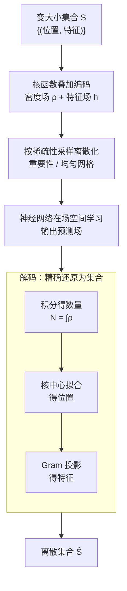

# CORDS: Continuous Representations of Discrete Structures

**会议**: ICLR 2026  
**arXiv**: [2601.21583](https://arxiv.org/abs/2601.21583)  
**代码**: 待确认  
**领域**: 目标检测 / 分子生成  
**关键词**: 集合预测, 连续场表示, 可逆映射, 变基数推理, 密度场

## 一句话总结
提出 CORDS 框架，通过将变大小离散集合（检测框、分子原子）双射映射为连续的密度场和特征场，使模型可在场空间中学习并精确解码回离散集合，避免了固定 slot 或 padding 的限制。

## 研究背景与动机

**领域现状**：许多任务需要预测未知大小的对象集合——目标检测框数未知、分子生成原子数未知、天体物理源检测事件数未知。

**现有痛点**：(a) DETR 需预分配固定 slot，超出则无法检测；(b) padding 浪费容量引入假信号；(c) 连续方法（VoxMol、CenterNet）基数只能间接推断，特征通过辅助分类器恢复。

**核心矛盾**：如何在不预先指定集合大小的情况下，统一建模对象的数量、位置和属性？

**本文目标**：建立离散集合与连续场间的**双射映射**，数量从密度场积分得到，位置从密度峰值恢复，属性从特征场投影得到。

**切入角度**：核函数叠加具有天然可逆性——每个核贡献固定积分 $\alpha$，总积分即为基数 $N$；核中心即位置；特征场与密度场对齐可精确恢复属性。

**核心 idea**：用高斯核将离散对象编码为密度场+特征场，建立双射映射，模型在连续场空间中学习，同时保证精确解码回离散集合。

## 方法详解

### 整体框架
CORDS 想解决的是一类"集合大小事先不知道"的预测任务：要么是图像里有几个目标、分子里有几个原子，要么是观测里有几个天体源。它的核心思路是不再直接预测离散集合，而是把集合搬进一个连续场的世界来回往返——给定一个变大小集合 $S = \{(\mathbf{r}_i, \mathbf{x}_i)\}_{i=1}^N$（每个对象有位置 $\mathbf{r}_i$ 和属性 $\mathbf{x}_i$），先**编码**成密度场 $\rho(\mathbf{r})$ 和特征场 $\mathbf{h}(\mathbf{r})$，再按场的稀疏程度**采样**离散化成有限点集喂给神经网络，神经网络在场空间里学习并输出预测场，最后**解码**三步把场精确还原回离散集合：积分得数量、核中心拟合得位置、Gram 矩阵投影得特征。关键在于编码和解码互为逆操作、构成精确双射，所以全过程既能让基数自由变化，又不丢失任何对象信息。

### 关键设计

**1. 编码：把离散集合摊成连续场，让基数自然显现**

变基数问题的根子在于"对象数 $N$ 未知"，CORDS 的做法是把每个对象用一个核函数铺开、再叠加，于是 $N$ 个离散点变成两条连续场：密度场 $\rho(\mathbf{r}) = \frac{1}{\alpha} \sum_{i=1}^N K(\mathbf{r}; \mathbf{r}_i)$ 编码"哪里有多少个对象"，特征场 $\mathbf{h}(\mathbf{r}) = \frac{1}{\alpha} \sum_{i=1}^N \mathbf{x}_i K(\mathbf{r}; \mathbf{r}_i)$ 编码"这些对象各自带什么属性"。这里用高斯核，关键的归一化常数 $\alpha = \int K \,d\mathbf{r}$ 让每个核对总积分恰好贡献 1，因此密度场的总质量直接等于基数——数对象不再需要预分配 slot 或辅助计数头，而是积分一下就读出来。特征场刻意与密度场共享同一组核中心和支撑，保证"某个位置有对象"和"它的属性是什么"在空间上严格对齐。

**2. 采样：按场的稀疏性选离散化方式，喂给神经网络**

连续场要交给神经网络处理，必须先离散成有限点集，而不同模态的信号分布差别很大。3D 分子里信号高度集中在少数原子附近、大片空间是空的，均匀网格会把算力浪费在空白处，所以用重要性采样——按密度把采样点集中到有信号的区域，顺带避开了固定边界框的约束；图像和时序信号分布相对均匀，则直接用均匀网格采样即可。这一步是连接"连续场"和"离散神经网络"的桥梁，采样方式选得当能在不损失信号的前提下大幅省算力。

**3. 解码：三步把场精确还原成集合，构成可逆双射**

编码若不可逆，连续表示就只是个近似。CORDS 把解码拆成三步，每步都有闭式或有理论保证的解：基数由总质量给出 $N = \int \rho \,d\mathbf{r}$；位置由核中心拟合给出，求解 $\min_{\mathbf{r}_1,...,\mathbf{r}_N} \int (\rho - \frac{1}{\alpha}\sum_i K(\mathbf{r};\mathbf{r}_i))^2 d\mathbf{r}$ 让叠加的核重建出预测密度场；属性则在位置确定后线性求解 $\mathbf{X} = \alpha G^{-1} B$，其中 $G$ 是核两两内积构成的 Gram 矩阵。当核中心间距足够大时 $G$ 正定，这个线性系统有唯一解，于是从场回到集合的整条路径无歧义——编码与解码合起来构成精确双射，这是它区别于 CenterNet 等"热力图峰值检测 + 启发式恢复"方法的核心。

### 损失函数 / 训练策略
- 目标检测：$\mathcal{L} = \mathcal{L}_{\text{MSE}} + \lambda(\hat{N} - N)^2$，MSE 约束场重建，计数项约束密度积分
- 分子生成：扩散模型在场空间生成，解码仅在评估时使用
- 天体物理 SBI：flow matching 学条件后验

## 实验关键数据

### 主实验 — 目标检测（MultiMNIST，In-dist vs OOD）

| 模型 | AP (In) | AP (OOD) | Drop% | AP50 (In) | AP50 (OOD) | Drop% |
|------|---------|---------|-------|-----------|-----------|-------|
| DETR | 81.2 | 65.4 | 19.5% | 84.0 | 71.7 | 14.6% |
| YOLO | 71.9 | 54.3 | 24.5% | 78.8 | 64.2 | 18.5% |
| **CORDS** | 76.8 | **64.2** | **16.4%** | 81.5 | **71.8** | **11.9%** |

### 分子生成（QM9，OpenBabel 评估）

| 模型 | Atom% | Mol% | Valid% | Unique% |
|------|-------|------|--------|---------|
| VoxMol | 99.2 | 89.3 | 98.7 | 92.1 |
| FuncMol | 99.0 | 89.2 | 100.0 | 92.8 |
| **CORDS** | **99.2** | **93.8** | 98.7 | **97.1** |

### 关键发现
- **OOD 基数泛化是 CORDS 最大优势**：DETR AP 降 19.5%，CORDS 仅降 16.4%
- 条件分子生成中可在训练未见的属性范围上泛化
- 天体物理 SBI 中基数后验 $p(N|\ell)$ 自然从场分布中涌现

## 亮点与洞察
- **双射映射的理论优雅性**：编码-解码精确双射，不依赖辅助分类器或峰值检测。比 CenterNet 等热力图方法更统一
- **领域无关性**：同一编码适用于 2D 图像、3D 分子、1D 时序
- **基数作为连续可微量**：$N = \int \rho \,d\mathbf{r}$ 使基数可用梯度优化

## 局限与展望
- 仅在 MultiMNIST 上验证检测，未在 COCO 等真实数据集测试
- 密度场中相近对象核重叠影响分离精度
- 分子任务需密集采样（~10³ 点/分子），大规模计算开销大
- 解码中核中心拟合需 L-BFGS，引入额外延迟

## 相关工作与启发
- **vs DETR**: DETR 固定 query slot，基数受限；CORDS 密度积分天然处理变基数
- **vs CenterNet**: CenterNet 热力图定位但不编码属性；CORDS 特征场统一定位和属性
- **vs VoxMol/FuncMol**: 基数和特征通过启发式恢复；CORDS 提供精确双射

## 评分
- 新颖性: ⭐⭐⭐⭐⭐ 离散集合→连续场的双射映射是全新统一框架
- 实验充分度: ⭐⭐⭐⭐ 覆盖检测+分子+天文SBI，但检测实验仅在合成数据上
- 写作质量: ⭐⭐⭐⭐⭐ 理论推导严谨，双射性质有完整证明
- 价值: ⭐⭐⭐⭐ 统一框架概念优雅，需在真实基准上验证

<!-- RELATED:START -->

## 相关论文

- [\[ICLR 2026\] Reverse Distillation: Consistently Scaling Protein Language Model Representations](reverse_distillation_consistently_scaling_protein_language_model_representations.md)
- [\[ICLR 2026\] Ultra-Fast Language Generation via Discrete Diffusion Divergence Instruct](ultra-fast_language_generation_via_discrete_diffusion_divergence_instruct.md)
- [\[CVPR 2026\] CryoHype: Reconstructing a Thousand Cryo-EM Structures with Transformer-Based Hypernetworks](../../CVPR2026/computational_biology/cryohype_reconstructing_a_thousand_cryo-em_structures_with_transformer-based_hyp.md)
- [\[ICCV 2025\] MolParser: End-to-end Visual Recognition of Molecule Structures in the Wild](../../ICCV2025/computational_biology/molparser_end-to-end_visual_recognition_of_molecule_structures_in_the_wild.md)
- [\[ICLR 2026\] Discrete Diffusion Trajectory Alignment via Stepwise Decomposition](discrete_diffusion_trajectory_alignment_via_stepwise_decomposition.md)

<!-- RELATED:END -->
