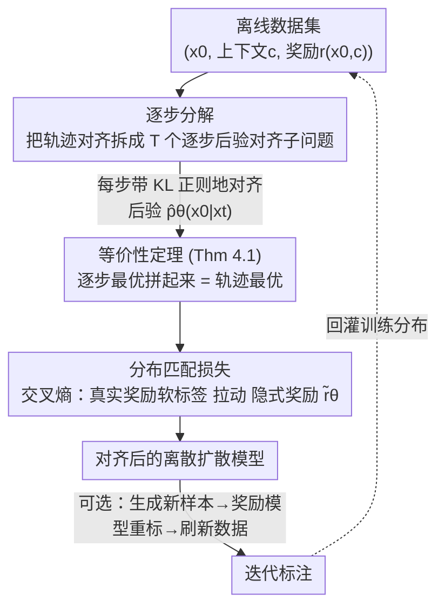

# Discrete Diffusion Trajectory Alignment via Stepwise Decomposition

**会议**: ICLR2026  
**arXiv**: [2507.04832](https://arxiv.org/abs/2507.04832)  
**代码**: [hanjq17/discrete-diffusion-sdpo](https://github.com/hanjq17/discrete-diffusion-sdpo)  
**领域**: 计算生物
**关键词**: discrete diffusion, preference optimization, RLHF, trajectory alignment, stepwise decomposition  
**作者**: Jiaqi Han, Austin Wang, Minkai Xu, Wenda Chu, Meihua Dang, Haotian Ye, Huayu Chen, Yisong Yue, Stefano Ermon (Stanford, Caltech, Tsinghua)  

## 一句话总结

提出 SDPO（Stepwise Decomposition Preference Optimization），将离散扩散模型的轨迹对齐问题分解为逐步后验对齐子问题，避免了在整条去噪链上反传梯度的困难，在 DNA 序列设计、蛋白质逆折叠和语言建模三个任务上均显著超越现有方法。

## 背景与动机

离散扩散模型（discrete diffusion models）在序列数据建模上展现了巨大潜力，覆盖 DNA 序列设计、蛋白质逆折叠乃至文本生成等多个领域。然而，如何像大语言模型的 RLHF 一样，对预训练的离散扩散模型进行奖励对齐（alignment），仍是一个未解决的核心问题。

现有方法面临的主要困难：

1. **离散性导致梯度反传困难**：离散扩散模型的采样链由序列级离散随机变量组成，奖励通常仅定义在最终干净序列 $\mathbf{x}_0$ 上，将梯度反传到整条去噪链计算代价极高且不稳定
2. **似然计算不精确**：对齐整条轨迹的联合分布 $p_\theta(\mathbf{x}_{0:T})$ 时，精确计算似然和评估奖励都不可行，导致次优性能
3. **在线 RL 采样开销大**：离散扩散的链式采样使得在线 RL 方法（如 DRAKES、diffu-GRPO）每一步训练都需要昂贵的在线采样

## 核心问题

如何设计一种高效的离线偏好优化方法，使其既能精确计算似然和奖励、又能兼容任意奖励函数，从而有效对齐预训练的离散扩散模型？

## 方法详解

### 整体框架

SDPO（Stepwise Decomposition Preference Optimization）要解决的是：怎样像大模型 RLHF 那样，把一个预训练好的离散扩散模型对齐到某个奖励上，又不被它的离散链式采样卡住。难点在于，奖励只定义在最终干净序列 $\mathbf{x}_0$ 上，而要优化的却是整条去噪轨迹 $p_\theta(\mathbf{x}_{0:T})$——直接把奖励反传回这条由序列级离散变量组成的链既昂贵又不稳定，似然还算不准。

SDPO 的破题思路是"分而治之"：不再正面优化联合分布 $p_\theta(\mathbf{x}_{0:T})$，而是把它**拆成 $T$ 个逐步对齐子问题**，让每个扩散步 $t$ 的因式化后验 $\hat{p}_\theta(\mathbf{x}_0|\mathbf{x}_t)$ 各自带 KL 正则地对齐奖励。这么拆能成立，靠的是一条等价性定理：这些子问题的最优解拼起来，恰好就是原轨迹对齐目标的最优解。有了这个保证，训练就落到对每步后验做**分布匹配的交叉熵损失**上，全程离线、不需要在线采样；最后还可选地用一轮**迭代标注**——拿当前模型生成新样本、用奖励模型重新打标、刷新数据集——把训练分布往高奖励区推。

### 关键设计

**1. 逐步分解：把轨迹级对齐降维成可精确计算的逐步后验对齐**

离散扩散的奖励只定义在干净序列 $\mathbf{x}_0$ 上，要把它反传到整条由序列级离散随机变量组成的去噪链既昂贵又不稳定，对整条轨迹的联合分布 $p_\theta(\mathbf{x}_{0:T})$ 求期望也算不准。SDPO 绕开这一点，对每个扩散步 $t$ 单独求解一个带 KL 正则的对齐子问题 $\max_{\hat{p}_\theta} \mathbb{E}_{\hat{p}_\theta(\mathbf{x}_0|\mathbf{x}_t,\mathbf{c})}[r(\mathbf{x}_0,\mathbf{c})] - \beta_t D_{\mathrm{KL}}[\hat{p}_\theta(\mathbf{x}_0|\mathbf{x}_t,\mathbf{c}) \| \hat{p}_{\mathrm{ref}}(\mathbf{x}_0|\mathbf{x}_t,\mathbf{c})]$，其中后验做了因式化近似 $\hat{p}_\theta(\mathbf{x}_0|\mathbf{x}_t,\mathbf{c})=\prod_{i=1}^L \hat{p}_\theta(\mathbf{x}_0^{(i)}|\mathbf{x}_t,\mathbf{c})$。这样一来，每步后验直接预测干净序列，似然可以高效精确地算出来，奖励也直接作用在 $\mathbf{x}_0$ 上、不再需要对中间变量做有偏估计，因此天然兼容任意奖励函数而不限于 Bradley-Terry 这类简化模型。

**2. 等价性定理：证明逐步最优拼起来就是轨迹最优**

把轨迹拆开会让人担心局部最优是否等于全局最优。Theorem 4.1 给出保证：每步子问题的最优解 $\{\hat{p}^*(\mathbf{x}_0|\mathbf{x}_t)\}_{t=1}^T$ 所诱导的联合分布 $p^*(\mathbf{x}_{0:T})$，同时也是原始轨迹对齐目标的最优解——条件是链奖励取各步奖励的加和形式 $\hat{r}(\mathbf{x}_{0:T})=\beta\sum_{t=1}^T r_t(\mathbf{x}_{t-1};\mathbf{x}_t)$。正是这条定理把"逐步优化"从一个工程近似上升为有理论保证的等价替换，让分解后的训练不损失最终对齐质量；而逐步奖励本身也提供了比轨迹级监督更细粒度的每步引导。

**3. 分布匹配损失：用交叉熵把模型后验拉向奖励加权的目标分布**

有了逐步子问题，还需要一个可直接优化的目标。SDPO 把每步后验的对齐转化为分布匹配，最终损失为交叉熵形式

$$\mathcal{L}(\theta) = -\mathbb{E}_{t,\mathbf{c},\mathbf{x}_0,q(\mathbf{x}_t|\mathbf{x}_0)} \sum_{i=1}^N \left( \frac{\exp(r(\mathbf{x}_0^{(i)},\mathbf{c}))}{\sum_j \exp(r(\mathbf{x}_0^{(j)},\mathbf{c}))} \cdot \log \frac{\exp(\tilde{r}_\theta(\mathbf{x}_0^{(i)},\mathbf{x}_t^{(i)},\mathbf{c},\beta_t))}{\sum_j \exp(\tilde{r}_\theta(\mathbf{x}_0^{(j)},\mathbf{x}_t^{(j)},\mathbf{c},\beta_t))}\right)$$

其中 softmax 后的真实奖励充当软标签，隐式奖励 $\tilde{r}_\theta$ 由模型与参考模型的 log-likelihood 之差给出，调度权重 $w(t)$（与 $\beta_t=\beta/w(t)$ 挂钩）把正则强度均摊到不同扩散步。当采样数 $N=2$ 且采用 BT 奖励时，这个损失正好退化为 DPO，因此 SDPO 可看作 DPO 在离散扩散上的一般化；而取较大的 $N$ 能降低 Monte-Carlo 估计的方差，带来更稳的对齐。

**4. 迭代标注：用奖励模型刷新训练数据持续抬高上限**

纯离线训练的质量受限于初始样本分布，容易早早饱和。当任务能调用奖励模型时，SDPO 可在训练过程中迭代地用当前模型生成新样本（DNA 实验中每轮 10,000 条）、再用奖励模型给它们打标，然后在这些更高质量的样本上接着用同一目标优化，从而把训练分布逐步推向高奖励区域。这一招让 SDPO 仅用 15k 标注样本就达到 6.2 的预测活性，而 DRAKES、diffu-GRPO 用 25k 样本也只到 5.6、4.2，在保持离线、低开销的同时持续提升性能上限。

## 实验关键数据

### DNA 序列设计

| 方法 | Pred-Activity ↑ | ATAC-Acc ↑ | 3-mer Corr ↑ | JASPAR Corr ↑ |
|------|:---:|:---:|:---:|:---:|
| DRAKES | 5.61 | 92.5% | 0.887 | 0.911 |
| diffu-GRPO | 5.86 | 33.0% | 0.783 | 0.903 |
| **SDPO** | **6.30** | **94.8%** | **0.900** | **0.936** |

- 相比最强 RL 基线 DRAKES，预测活性提升 **12.3%**
- 同时保持高 ATAC 准确率和自然序列特征

### 蛋白质逆折叠

| 方法 | Pred-ddG ↑ | %(ddG>0) ↑ | scRMSD ↓ | Success Rate ↑ |
|------|:---:|:---:|:---:|:---:|
| DRAKES | 1.095 | 86.4% | 0.918 | 78.6% |
| diffu-GRPO | 1.286 | 76.8% | 1.192 | 37.2% |
| **SDPO** | **1.400** | **87.1%** | 0.938 | 75.5% |

- Pred-ddG 大幅领先所有基线；diffu-GRPO 虽 ddG 高但 scRMSD 严重退化（奖励过优化）

### 语言建模（LLaDA-8B-Instruct）

| 方法 | AlpacaEval LC ↑ | AlpacaEval WR ↑ | GSM8K ↑ | IFEval ↑ |
|------|:---:|:---:|:---:|:---:|
| Instruct | 10.6% | 6.8% | 78.6 | 52.9 |
| D2-DPO | 12.1% | 7.5% | 78.1 | 53.8 |
| **SDPO** | **14.2%** | **8.7%** | **81.2** | **55.1** |

- GSM8K 从 78.6 提升至 81.2，超过 LLaMA-3-8B 的 RL 后训练结果

### 训练效率

每步训练平均耗时：DRAKES 6.02s，diffu-GRPO 1.51s，**SDPO 仅 0.77s**（无需在线采样）。

## 亮点

1. **理论优雅**：将轨迹对齐分解为逐步后验对齐，并严格证明二者最优解等价，理论扎实
2. **通用性强**：兼容任意奖励函数，不局限于 Bradley-Terry 等简化奖励模型；当 $N=2$ 且使用 BT 奖励时退化为 DPO 的特殊情况
3. **高效离线**：无需在线策略采样，训练速度比 DRAKES 快约 8 倍
4. **跨领域验证**：在 DNA 设计、蛋白质工程、语言建模三个差异巨大的领域均一致优于基线
5. **迭代标注**：仅需少量额外标注（相比 DRAKES 的 128k，SDPO 用 15k 就达到更高奖励）即可持续提升

## 局限与展望

1. **蛋白质任务中 Success Rate 略低于 DRAKES**（75.5% vs 78.6%），说明在 scRMSD 维度上仍有优化空间
2. **因式化后验近似**（$\hat{p}_\theta(\mathbf{x}_0|\mathbf{x}_t)=\prod_i \hat{p}_\theta(\mathbf{x}_0^{(i)}|\mathbf{x}_t)$）忽略了 token 间的依赖关系，可能在长序列上引入误差
3. **语言模型实验规模有限**：仅在 LLaDA-8B 上验证，未扩展到更大模型或更多 benchmark
4. **Monte-Carlo 估计的偏差**：$N$ 有限时分区函数的估计仍有偏，表中显示 $N$ 从 25 到 100 性能趋于饱和但未下降
5. **迭代标注需要可调用的奖励模型**，限制了在纯偏好数据场景下的应用

## 与相关工作的对比

| 维度 | DPO / D2-DPO | DRAKES | diffu-GRPO | SDPO |
|------|:---:|:---:|:---:|:---:|
| 在线/离线 | 离线 | 在线 | 在线 | 离线 |
| 奖励类型 | Bradley-Terry | 任意 | 任意 | 任意 |
| 优化粒度 | 轨迹级 | 轨迹级 | 轨迹级 | **逐步** |
| 训练效率 | 高 | 低 | 中 | **高** |
| 似然精确性 | 近似 | 近似 | 近似 | **精确** |
| 奖励过优化风险 | 低 | 中 | **高** | 低 |

- 与 D2-DPO/VRPO 相比：SDPO 不依赖 BT 模型假设，支持任意奖励且性能更强
- 与 DRAKES 相比：SDPO 离线训练，效率高 ~8x，DNA 任务上预测活性高 12.3%
- 与 diffu-GRPO 相比：SDPO 无奖励过优化问题（diffu-GRPO 蛋白质任务 Success Rate 仅 37.2%）
- 与推理时 guidance（CG/SMC/TDS）相比：SDPO 是训练时优化，采样时无额外开销

## 启发与关联

1. **逐步分解思想的迁移**：该分解策略具有普适性，可能迁移到连续扩散模型的对齐、甚至其他多步决策优化场景
2. **与 DPO 的统一视角**：SDPO 在 $N=2$ + BT 奖励下退化为 DPO，提供了 DPO 在扩散模型上的更一般化框架
3. **面向生物序列设计**：DNA/蛋白质任务上的显著提升表明该方法特别适合序列级奖励明确的生物工程应用
4. **大语言扩散模型的偏好优化**：在 LLaDA 上的验证为离散扩散语言模型的后训练提供了可行路径

## 评分

- 新颖性: ⭐⭐⭐⭐⭐ (逐步分解 + 等价性证明是全新视角)
- 实验充分度: ⭐⭐⭐⭐⭐ (三个差异较大领域 + 丰富消融)
- 写作质量: ⭐⭐⭐⭐⭐ (理论推导清晰，实验组织有条理)
- 价值: ⭐⭐⭐⭐⭐ (为离散扩散模型对齐建立了新基准)

<!-- RELATED:START -->

## 相关论文

- [\[ICLR 2026\] Diffusion Alignment as Variational Expectation-Maximization](diffusion_alignment_as_variational_expectation-maximization.md)
- [\[ICLR 2026\] Ultra-Fast Language Generation via Discrete Diffusion Divergence Instruct](ultra-fast_language_generation_via_discrete_diffusion_divergence_instruct.md)
- [\[ICLR 2026\] Unified Biomolecular Trajectory Generation via Pretrained Variational Bridge](unified_biomolecular_trajectory_generation_via_pretrained_variational_bridge.md)
- [\[NeurIPS 2025\] Constrained Discrete Diffusion](../../NeurIPS2025/computational_biology/constrained_discrete_diffusion.md)
- [\[ICML 2026\] TD3B: Transition-Directed Discrete Diffusion for Allosteric Binder Generation](../../ICML2026/computational_biology/td3b_transition-directed_discrete_diffusion_for_allosteric_binder_generation.md)

<!-- RELATED:END -->
