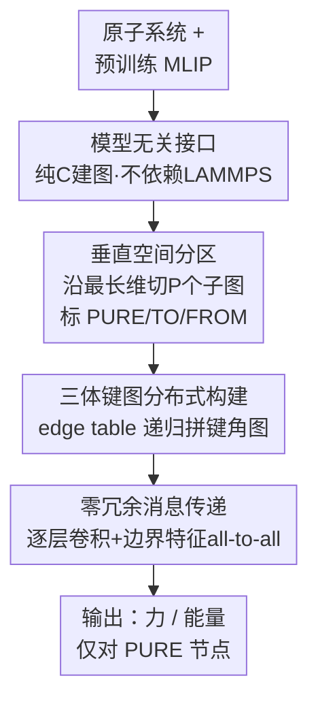

# DistMLIP: A Distributed Inference Platform for Machine Learning Interatomic Potentials

**会议**: ICLR 2026  
**arXiv**: [2506.02023](https://arxiv.org/abs/2506.02023)  
**代码**: 无（平台项目，支持多种 MLIP）  
**领域**: 计算生物
**关键词**: MLIP, distributed inference, graph neural networks, molecular dynamics, GPU parallelization

## 一句话总结

提出 DistMLIP 分布式推理平台，基于零冗余图级并行化策略（graph-level parallelization），解决现有机器学习原子间势（MLIP）缺乏多 GPU 支持的问题，在 8 GPU 上实现接近百万原子的模拟，比空间分区方法快达 8 倍且能模拟 3.4 倍更大的系统。

## 研究背景与动机

**原子模拟的规模需求**：蛋白质折叠、界面反应、纳米域形成等实际问题需要百万原子级别的介观尺度模拟，远超当前单 GPU MLIP 的能力。

**DFT 的计算瓶颈**：密度泛函理论（DFT）计算复杂度为 O(N_e³)，实际只能处理数百个原子，而经典力场虽然便宜但精度不足。

**MLIP 的崛起与局限**：基于图神经网络（GNN）的 MLIP 在保持量子化学精度的同时实现 O(N) 线性复杂度，但大多数 MLIP 仅支持单 GPU 推理，缺乏原生多 GPU 支持。

**空间分区的缺陷**：传统 LAMMPS 使用空间分区（spatial partitioning）进行并行化，需要引入大量冗余的"幽灵原子"（ghost atoms），尤其对于多层 GNN 的长程 MLIP，冗余计算量随交互半径立方增长。

**现有方案不通用**：SevenNet 支持图并行但与特定架构（Nequip）耦合且依赖 LAMMPS+TorchScript；DeepMD 和 Allegro 依赖严格局部性设计，限制了交互范围和化学多样性。

## 方法详解

### 整体框架

DistMLIP 是一个面向 MLIP 的分布式推理平台。它接管任意预训练 MLIP（无需改架构、无需重训），先用纯 C 实现的建图逻辑把原子系统转成图，再沿晶胞最长维度做"墙式"垂直切割、把整图切成若干子图分到各 GPU。每块卡只负责自己那部分原子，做逐层 GNN 图卷积，每层算完后只把边界节点/边的更新特征通过 `all-to-all` 交换出去——这与 LAMMPS 复制一圈"幽灵原子"再丢弃的做法相反，做到零冗余计算。对 CHGNet 这类靠键角的模型，它额外把三体键图（bond graph）也一并做了分布式构建，并兼容保守力与直接力两类势。整体数据流如下图：

### 关键设计

**1. 模型无关的即插即用接口：不绑定 LAMMPS 的通用平台**

整套图创建代码用纯 C 实现，不依赖 PyTorch / JAX / LAMMPS 等外部库——图在 CPU 内存里构建，GPU 只负责 GNN 前向传播，因此任何 MLIP 都能以"插件"形式接入。这正击中现有方案的死穴：大多数 MLIP 并没有成熟的 LAMMPS 接口，很多工作流（ASE、atomate2 等）也根本不走 LAMMPS，像 SevenNet 那样绑定 TorchScript+LAMMPS 就没法迁移。DistMLIP 独立于模拟引擎，已适配 MACE、CHGNet、TensorNet、eSEN 四种主流架构，新模型只需少量适配即可接入，大幅降低了多卡推理的门槛。

**2. 垂直空间分区：用最粗暴的切法换最低的分区开销**

接入之后第一步是把图切开分到各卡。DistMLIP 沿晶胞最长维度做"墙式"垂直切割，把系统切成 $G_1,\dots,G_P$ 共 $P$ 个分区。每个分区 $G_i$ 再扩展成 $G_i'$，纳入所有 1-hop 邻居，即满足存在边 $(v,u)\in E,\,u\in G_i$ 的节点 $v$，保证算一层卷积所需的入边信息都在本地。节点据此标成三类：PURE（纯本地节点，最终只对它们算力和能量）、TO（要发给相邻分区的边界节点）、FROM（要从相邻分区接收的节点），并在特征张量里用 marker 数组划出连续区间，通信时按区间整段收发、避免逐节点索引。看似粗糙的切法，好处恰恰是"便宜"——分区是每个 MD 步都要重做的操作，复杂分区算法（如 METIS）的图划分开销会被反复摊到每一步，实测反而比垂直分区慢达 8 倍。

**3. 三体键图的分布式构建：让依赖键角的模型也能多卡跑**

CHGNet 等高精度 MLIP 靠 bond graph（line graph）编码三体交互来刻画键角，而正确构建一个分区的 bond graph 需要纳入其 PURE 节点的 2-hop 邻居（比原子图多一跳）。DistMLIP 为此建立 edge table，把每个节点映射到以它为源的边集合，再递归遍历这些边拼出本分区的并行 bond graph。此前没有任何工作给出 bond graph 的分布式实现，这一步补上了让三体类 MLIP 上多 GPU 的关键缺口。

**4. 零冗余的消息传递并行：每一次计算结果都不浪费**

图建好后就进入运行时的核心。传统空间分区为了让边界原子拿到完整邻居，必须在每块卡上复制一圈"幽灵原子"并对它们做重复的前向计算，算完丢弃再算下一层；幽灵原子数量随交互半径近似立方增长，对多层、长程的 GNN-MLIP 代价极高（论文估计 64 分子水系统、6 层、6 Å 截断就要算 20834 个幽灵原子）。DistMLIP 把这套逻辑换成图并行：每块 GPU 只对自己的 PURE 节点算力和能量，每层卷积后边界节点/边的中间特征通过 `all-to-all` 发给需要的分区直接复用，不存在被丢弃的冗余计算，且保留了反向传播所需的中间量。直接收益是并行推理时间随交互范围只线性增长、而非立方增长——长程 MLIP 最吃亏的地方被补上了。

## 实验关键数据

### 主实验

**最大模拟容量（8× A100-80GB-PCIe）**：

| MLIP 模型 | 1 GPU 最大原子数 | 8 GPU 最大容量倍数 |
|-----------|----------------|------------------|
| MACE-3.8M | ~22K | ~10× (216K) |
| TensorNet-0.8M | ~22K | ~6.4× (140K) |
| CHGNet-2.7M | ~6K | ~7.8× (47K) |
| eSEN-3.2M | ~1.4K | ~50× (69K) |

**与 SevenNet 对比（匹配 800K 参数）**：

| 指标 | DistMLIP | SevenNet |
|------|----------|---------|
| 最大容量 | 高达 10× | 基线 |
| 推理速度 | 快 4× | 基线 |

### 消融实验

**交互范围对推理时间的影响（8 GPU，72K 原子 SiO₂）**：

| 交互范围增长 | DistMLIP（图并行） | 空间分区理论 |
|-------------|------------------|-----------|
| 线性关系 | ✓ 时间线性增长 | 立方增长 |

**分区算法对比**：

| 分区方法 | 相对推理时间 |
|---------|-----------|
| 垂直分区（DistMLIP） | 1× |
| METIS 等标准图分区 | 最高 8× 慢 |

**真实材料体系 MD 性能（μs/(atom×step)，8 GPU）**：

| 模型 | Li₃PO₄ | H₂O | GaN | MOF |
|------|--------|-----|-----|-----|
| MACE-3.8M | 11.0‖216K | 11.6‖210K | 9.6‖250K | 10.9‖216K |
| L-MACE(LAMMPS) | 12.3‖66K | 8.5‖83K | 2.7‖78K | 6.2‖64K |
| TensorNet | 16.3‖140K | 18.0‖83K | 15.9‖123K | 15.5‖125K |

### 关键发现

1. **线性容量扩展**：最大模拟原子数与 GPU 数量成线性增长，验证了图并行化的有效性。
2. **零冗余优势**：推理时间与交互范围仅呈线性关系，而空间分区方法呈立方关系，长程 MLIP 受益尤为显著。
3. **简单分区更快**：反直觉的发现——简单的垂直分区比复杂的图分区算法（METIS 等）快达 8 倍，因为分区本身的开销在每个 MD 步都会产生。
4. **MACE 在 DistMLIP 上的容量是 LAMMPS 空间分区的 3.4 倍**，同时 8 GPU 推理速度相当或更快。

## 亮点与洞察

1. **零冗余设计的优雅性**：与空间分区的冗余计算形成鲜明对比，图并行中每个计算结果都被有效利用，这是一个关键的工程创新。
2. **模型无关的通用设计**：一个平台支持 4 种不同架构的 MLIP，且不依赖 LAMMPS，大幅降低了使用门槛。
3. **经验性反直觉发现**：简单的垂直分区优于复杂图分区，说明在分布式推理场景中，分区算法的开销往往被忽视。
4. **三体键图的分布式实现**：首次解决了 bond graph 的多 GPU 分布问题，使 CHGNet 等依赖三体交互的模型能够高效并行化。
5. **接近百万原子的实用性**：在 8 GPU 上实现 250K 原子模拟，标志着 MLIP 在实际材料科学问题上的规模跨越。

## 局限与展望

1. **GPU 内存瓶颈**：eSEN 和 MACE 的等变特征计算在单 GPU 上进行，成为内存瓶颈，影响最大容量的线性扩展。
2. **CHGNet 的三体图扩展性**：三体图的构建复杂度为 O(N⁶)，在大系统中成为弱扩展的瓶颈。
3. **仅限推理**：当前仅支持推理，不支持分布式训练（训练和推理的图并行需求不同）。
4. **通信开销**：小系统（如 eSEN 的 1.4K 原子/GPU）时，分区宽度不够导致边界节点重叠，通信开销占比大。
5. **未来方向**：结合 MLIP 模型蒸馏减小模型参数以进一步提速；支持更多 MLIP 架构；动态负载均衡。

## 相关工作与启发

- **LAMMPS 空间分区**：传统做法，但对长程 GNN-MLIP 产生大量冗余计算。
- **SevenNet**：首个支持图并行推理的 MLIP，但架构绑定、依赖 LAMMPS。DistMLIP 在通用性和性能上全面超越。
- **DeePMD 的亿原子模拟**：通过严格短程设计在超算上实现超大规模模拟，但牺牲了长程交互能力。
- **启发**：图并行化的通信模式可推广到其他 GNN 推理场景（如大规模社交网络分析、交通预测）。基础势（foundation potentials）+ 高效推理平台的组合代表了计算材料学的新范式。

## 评分

- **新颖性**: ⭐⭐⭐⭐ 图级并行化在 MLIP 推理中的应用是新颖的系统创新，零冗余设计和 bond graph 分布式构建有技术原创性
- **实验充分度**: ⭐⭐⭐⭐ 支持 4 种 MLIP、多种材料体系，有完整的 strong/weak scaling 分析和与 LAMMPS/SevenNet 的对比
- **写作质量**: ⭐⭐⭐⭐ 系统架构描述清晰，算法伪代码完整，但内容偏工程系统论文
- **价值**: ⭐⭐⭐⭐⭐ 填补了 MLIP 多 GPU 推理的重要空白，使百万原子级 MLIP 模拟成为可能，对计算材料科学有直接推动作用

<!-- RELATED:START -->

## 相关论文

- [\[ICML 2025\] Reliable Algorithm Selection for Machine Learning-Guided Design](../../ICML2025/computational_biology/reliable_algorithm_selection_for_machine_learning-guided_design.md)
- [\[ICLR 2026\] DriftLite: Lightweight Drift Control for Inference-Time Scaling of Diffusion Models](driftlite_lightweight_drift_control_for_inference-time_scaling_of_diffusion_mode.md)
- [\[ICML 2025\] Neural Graph Matching Improves Retrieval Augmented Generation in Molecular Machine Learning](../../ICML2025/computational_biology/neural_graph_matching_improves_retrieval_augmented_generation_in_molecular_machi.md)
- [\[ICLR 2026\] Enhancing Molecular Property Predictions by Learning from Bond Modelling and Interactions](enhancing_molecular_property_predictions_by_learning_from_bond_modelling_and_int.md)
- [\[ICML 2026\] Towards A Generative Protein Evolution Machine with DPLM-Evo](../../ICML2026/computational_biology/towards_a_generative_protein_evolution_machine_with_dplm-evo.md)

<!-- RELATED:END -->
